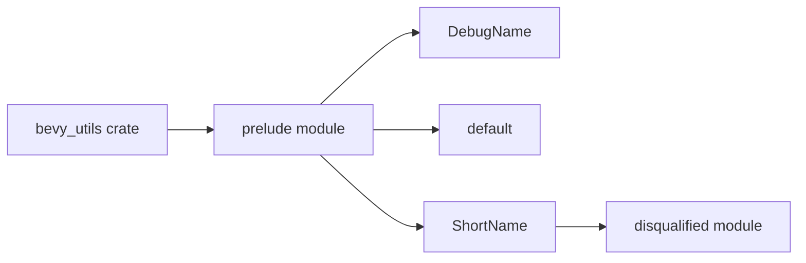

+++
title = "#21255 Re-export disqualified::ShortName from bevy_utils"
date = "2025-09-28T00:00:00"
draft = false
template = "pull_request_page.html"
in_search_index = false

[extra]
current_language = "zh-cn"
available_languages = {"en" = { name = "English", url = "/pull_request/bevy/2025-09/pr-21255-en-20250928" }, "zh-cn" = { name = "中文", url = "/pull_request/bevy/2025-09/pr-21255-zh-cn-20250928" }}
labels = ["D-Trivial", "A-Utils"]
+++

# Re-export disqualified::ShortName from bevy_utils

## Basic Information
- **Title**: Re-export disqualified::ShortName from bevy_utils
- **PR Link**: https://github.com/bevyengine/bevy/pull/21255
- **Author**: cBournhonesque
- **Status**: MERGED
- **Labels**: D-Trivial, A-Utils, S-Needs-Review
- **Created**: 2025-09-28T15:16:54Z
- **Merged**: 2025-09-28T17:37:33Z
- **Merged By**: mockersf

## Description Translation
在迁移到 0.17 版本时，我尝试切换到使用 bevy_utils 中的 `DebugName::type_name::<C>()`。

在某些情况下，我想使用在 bevy_utils 中看到的 `ShortName` 类型，但令我惊讶的是它没有被导出。

是否可以在 0.17 中包含这个类型？

## The Story of This Pull Request

这是一个典型的 API 可访问性问题。开发者 cBournhonesque 在迁移到 Bevy 0.17 版本时遇到了一个实际的使用障碍：他们需要在代码中使用 `ShortName` 类型，但这个类型虽然存在于 bevy_utils 的内部实现中，却没有通过公共 API 暴露出来。

问题的核心在于模块系统的设计选择。在 Rust 中，即使一个类型在 crate 内部定义，如果它没有被显式地重新导出（re-export），外部用户就无法直接使用它。这种情况下，开发者虽然能够在代码中看到 `ShortName` 类型的存在，但由于缺乏公共导出，编译器会阻止他们在自己的代码中引用这个类型。

从技术实现来看，`ShortName` 类型位于 `disqualified` 模块中，这是一个内部实现细节。在修改之前，bevy_utils 的 prelude 只导出了 `DebugName` 和 `default`，这意味着用户只能访问这些明确标记为公共的接口。

解决方案非常直接：在 `crates/bevy_utils/src/lib.rs` 文件的 prelude 模块中添加一行重新导出的语句。这个改动虽然只有一行代码，但却解决了实际的开发障碍。prelude 模块在 Rust 中通常用于收集和重新导出最常用的类型和 trait，这样用户可以通过单个 use 语句访问所有必要的组件。

从工程角度来看，这个改动体现了良好的 API 设计原则。当一个类型在公共 API 的方法中被使用时（比如 `DebugName::type_name` 返回 `ShortName`），将该类型也公开导出是合理的设计选择。否则，用户虽然能够调用方法获得该类型的实例，却无法在自己的函数签名或变量声明中使用这个类型。

这个 PR 被标记为 D-Trivial（琐碎）和 A-Utils（工具类），准确反映了改动的性质。它不涉及复杂的算法或架构变更，而是专注于改善开发者体验。在不到 2.5 小时的时间内就被合并，说明维护团队认可这个改动的价值。

## Visual Representation



## Key Files Changed

### `crates/bevy_utils/src/lib.rs` (+1/-0)

这个文件是 bevy_utils crate 的主要入口点。改动在 prelude 模块中添加了对 `ShortName` 类型的重新导出。

**修改前：**
```rust
pub mod prelude {
    pub use crate::debug_info::DebugName;
    pub use crate::default;
}
```

**修改后：**
```rust
pub mod prelude {
    pub use crate::debug_info::DebugName;
    pub use crate::default;
    pub use disqualified::ShortName;
}
```

这个改动使得外部用户现在可以通过 `bevy_utils::prelude::ShortName` 来访问这个类型，解决了之前无法在用户代码中引用该类型的问题。

## Further Reading

- [Rust 模块系统文档](https://doc.rust-lang.org/book/ch07-02-defining-modules-to-control-scope-and-privacy.html)
- [Bevy 引擎的模块组织模式](https://bevyengine.org/learn/book/getting-started/ecs/)
- [Rust 的 pub use 重新导出模式](https://doc.rust-lang.org/reference/items/use-declarations.html)

# Full Code Diff
diff --git a/crates/bevy_utils/src/lib.rs b/crates/bevy_utils/src/lib.rs
index 55d3e02f8ec42..0c74aa98c920f 100644
--- a/crates/bevy_utils/src/lib.rs
+++ b/crates/bevy_utils/src/lib.rs
@@ -45,6 +45,7 @@ cfg::parallel! {
 pub mod prelude {
     pub use crate::debug_info::DebugName;
     pub use crate::default;
+    pub use disqualified::ShortName;
 }
 
 mod debug_info;