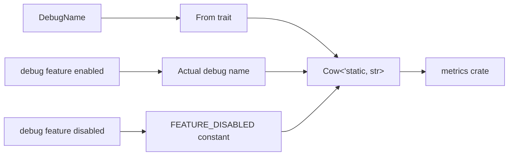

+++
title = "#21257 Add conversion from DebugName to Cow<'static, str>"
date = "2025-09-28T00:00:00"
draft = false
template = "pull_request_page.html"
in_search_index = false

[extra]
current_language = "zh-cn"
available_languages = {"en" = { name = "English", url = "/pull_request/bevy/2025-09/pr-21257-en-20250928" }, "zh-cn" = { name = "中文", url = "/pull_request/bevy/2025-09/pr-21257-zh-cn-20250928" }}
labels = ["D-Trivial", "A-Utils"]
+++

# Add conversion from DebugName to Cow<'static, str>

## Basic Information
- **Title**: Add conversion from DebugName to Cow<'static, str>
- **PR Link**: https://github.com/bevyengine/bevy/pull/21257
- **Author**: cBournhonesque
- **Status**: MERGED
- **Labels**: D-Trivial, S-Ready-For-Final-Review, A-Utils
- **Created**: 2025-09-28T15:53:30Z
- **Merged**: 2025-09-28T18:55:36Z
- **Merged By**: alice-i-cecile

## Description Translation
**目标**

目前似乎没有方法可以从 `DebugName` 获取底层的 `Cow<'static, str>`。

这对于我使用 `DebugName` 并使其与 `metrics` crate 无缝交互非常有用：https://docs.rs/metrics/latest/metrics/type.SharedString.html

这是在 Rust 中注册/记录指标的标准方式。

是否可能将其包含在 0.17 版本中？

## The Story of This Pull Request

这个 PR 解决了一个直接的互操作性问题。开发者在使用 Bevy 的 `DebugName` 类型时，需要将其转换为 `metrics` crate 期望的字符串类型。`metrics` crate 使用 `SharedString` 类型（本质上是 `Cow<'static, str>` 的包装）来记录指标，而 `DebugName` 没有提供直接获取底层字符串的方法。

`DebugName` 是 Bevy 中一个条件编译的调试工具类型。当启用 `debug` 特性时，它包含实际的调试名称；当禁用时，它是一个零大小的类型，不占用内存。这种设计优化了发布构建的性能，但缺少与外部库的直接互操作性。

开发者采用了最直接的解决方案：实现 `From<DebugName>` trait 来转换为 `Cow<'static, str>`。这个实现保持了 `DebugName` 的条件编译特性，正确处理了启用和禁用 `debug` 特性的两种情况。

在启用 `debug` 特性时，转换返回实际的调试名称；在禁用时，返回一个常量字符串 `FEATURE_DISABLED`。这种处理方式确保了类型转换的一致性，同时保持了性能优化。

这个实现使用了条件编译属性 `#[cfg(feature = "debug")]` 来确保代码只在相应特性启用时编译。代码还包含了适当的属性来抑制未使用变量的警告，这在条件编译代码中是常见的做法。

从工程角度来看，这个改动很小但很有价值。它保持了现有的性能特性，同时提供了必要的互操作性。实现遵循了 Rust 的惯用法，使用标准的 `From` trait 进行类型转换，这使得 API 自然且符合预期。

## Visual Representation



## Key Files Changed

**文件：`crates/bevy_utils/src/debug_info.rs`**

这个文件包含了 `DebugName` 类型的定义和相关实现。PR 在其中添加了 `From<DebugName>` trait 的实现。

**主要修改：**

```rust
// 新增的 From trait 实现
impl From<DebugName> for Cow<'static, str> {
    #[cfg_attr(
        not(feature = "debug"),
        expect(
            unused_variables,
            reason = "The value will be ignored if the `debug` feature is not enabled"
        )
    )]
    fn from(value: DebugName) -> Self {
        #[cfg(feature = "debug")]
        {
            value.name
        }
        #[cfg(not(feature = "debug"))]
        {
            Cow::Borrowed(FEATURE_DISABLED)
        }
    }
}
```

这个实现：
1. 使用条件编译处理 `debug` 特性的启用和禁用状态
2. 在启用 `debug` 特性时返回实际的调试名称
3. 在禁用时返回常量字符串 `FEATURE_DISABLED`
4. 包含适当的属性来抑制条件编译可能产生的警告

## Further Reading

- [Rust 的 From 和 Into traits](https://doc.rust-lang.org/std/convert/trait.From.html)
- [Bevy 的条件编译指南](https://bevyengine.org/learn/quick-start/features/)
- [metrics crate 文档](https://docs.rs/metrics/latest/metrics/)
- [Rust 的 Cow 类型](https://doc.rust-lang.org/std/borrow/enum.Cow.html)

# Full Code Diff
```diff
diff --git a/crates/bevy_utils/src/debug_info.rs b/crates/bevy_utils/src/debug_info.rs
index be1abdf5e31cc..3aad20dfc2ed5 100644
--- a/crates/bevy_utils/src/debug_info.rs
+++ b/crates/bevy_utils/src/debug_info.rs
@@ -132,6 +132,26 @@ cfg::alloc! {
             Self::owned(value)
         }
     }
+
+    impl From<DebugName> for Cow<'static, str> {
+        #[cfg_attr(
+            not(feature = "debug"),
+            expect(
+                unused_variables,
+                reason = "The value will be ignored if the `debug` feature is not enabled"
+            )
+        )]
+        fn from(value: DebugName) -> Self {
+            #[cfg(feature = "debug")]
+            {
+                value.name
+            }
+            #[cfg(not(feature = "debug"))]
+            {
+                Cow::Borrowed(FEATURE_DISABLED)
+            }
+        }
+    }
 }
 
 impl From<&'static str> for DebugName {
```