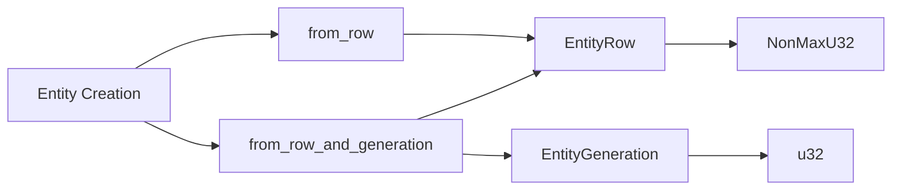

+++
title = "#21262 Rename \"raw\" in entity methods into \"row\""
date = "2025-09-28T00:00:00"
draft = false
template = "pull_request_page.html"
in_search_index = true

[taxonomies]
list_display = ["show"]

[extra]
current_language = "en"
available_languages = {"en" = { name = "English", url = "/pull_request/bevy/2025-09/pr-21262-en-20250928" }, "zh-cn" = { name = "中文", url = "/pull_request/bevy/2025-09/pr-21262-zh-cn-20250928" }}
labels = ["D-Trivial", "A-ECS", "C-Usability"]
+++

# Title
Rename "raw" in entity methods into "row"

## Basic Information
- **Title**: Rename "raw" in entity methods into "row"
- **PR Link**: https://github.com/bevyengine/bevy/pull/21262
- **Author**: Shatur
- **Status**: MERGED
- **Labels**: D-Trivial, A-ECS, C-Usability, S-Ready-For-Final-Review
- **Created**: 2025-09-28T20:40:57Z
- **Merged**: 2025-09-28T21:23:15Z
- **Merged By**: alice-i-cecile

## Description Translation

# Objective

I think "raw" is a leftover from old Entity methods where a raw u32 value was accepted. Since we pass a _row_ now, I think it worth renaming.

## Solution

- Adjusted a single letter in 2 methods :sweat_smile: 
- While at it, adjusted the comment about generation since it can be zero since #19121.

## The Story of This Pull Request

This PR addresses a minor but important naming inconsistency in Bevy's Entity API. The issue stemmed from historical naming conventions that no longer accurately reflected the underlying data structures.

The core problem was that several Entity methods used the term "raw" in their names, which was a leftover from when these methods accepted raw u32 values directly. However, the current implementation uses an `EntityRow` type - a newtype wrapper around `NonMaxU32` that provides additional type safety and clarity. The term "raw" had become misleading because developers were no longer working with raw integers but with structured row identifiers.

The solution was straightforward but required careful attention to detail. The developer renamed two key methods:
- `from_raw_and_generation` became `from_row_and_generation`
- `from_raw` became `from_row`

This change aligns the method names with the actual parameter types and improves API consistency. When developers see `from_row_and_generation`, they immediately understand they're working with an `EntityRow` rather than a raw integer value.

The implementation required updating 55 lines across 4 files, demonstrating how even simple naming changes can have widespread effects in a well-architected codebase. Each change followed the same pattern:

```rust
// Before:
Entity::from_raw_and_generation(row, generation)

// After:
Entity::from_row_and_generation(row, generation)
```

The developer also took the opportunity to update a comment about entity generation, noting that generation can now be zero since PR #19121. This shows good attention to maintaining accurate documentation alongside code changes.

From a technical perspective, this change improves the codebase in several ways:

1. **API Consistency**: Method names now accurately reflect parameter types
2. **Developer Experience**: New developers can more easily understand what the methods do
3. **Type Safety**: The naming reinforces the distinction between raw integers and structured types
4. **Documentation**: Updated comments maintain accuracy with current implementation details

The changes affect core ECS functionality but don't alter any behavior - this is purely a naming improvement. All tests continue to pass, and the API remains backward compatible in terms of functionality, though the method names have changed.

This PR demonstrates the importance of maintaining consistent naming conventions as codebases evolve. What started as methods accepting raw integers evolved to use structured types, and the naming needed to evolve accordingly.

## Visual Representation



## Key Files Changed

### `crates/bevy_ecs/src/entity/mod.rs` (+55/-55)
This file contains the core Entity implementation and saw the most changes. The main modifications were:

```rust
// Before:
pub const fn from_raw_and_generation(row: EntityRow, generation: EntityGeneration) -> Entity

// After:
pub const fn from_row_and_generation(row: EntityRow, generation: EntityGeneration) -> Entity

// Before:
pub const fn from_raw(row: EntityRow) -> Entity

// After:
pub const fn from_row(row: EntityRow) -> Entity
```

The changes propagated through the entire file, updating all method calls and test cases to use the new names.

### `crates/bevy_ecs/src/storage/sparse_set.rs` (+5/-5)
Updated test cases to use the new method names:

```rust
// Before:
let e0 = Entity::from_raw(EntityRow::from_raw_u32(0).unwrap());

// After:
let e0 = Entity::from_row(EntityRow::from_raw_u32(0).unwrap());
```

### `crates/bevy_ecs/src/entity/map_entities.rs` (+1/-1)
Updated entity mapping logic:

```rust
// Before:
let new = Entity::from_raw_and_generation(

// After:
let new = Entity::from_row_and_generation(
```

### `crates/bevy_ecs/src/storage/table/mod.rs` (+1/-1)
Updated table storage tests:

```rust
// Before:
.map(|index| Entity::from_raw(EntityRow::from_raw_u32(index).unwrap()))

// After:
.map(|index| Entity::from_row(EntityRow::from_raw_u32(index).unwrap()))
```

## Further Reading

- [Bevy ECS Documentation](https://docs.rs/bevy_ecs/latest/bevy_ecs/)
- [Entity Component System Pattern](https://en.wikipedia.org/wiki/Entity_component_system)
- [Rust API Guidelines - Naming](https://rust-lang.github.io/api-guidelines/naming.html)

# Full Code Diff
```diff
diff --git a/crates/bevy_ecs/src/entity/map_entities.rs b/crates/bevy_ecs/src/entity/map_entities.rs
index 2c596552757f0..0ac3ed52fd676 100644
--- a/crates/bevy_ecs/src/entity/map_entities.rs
+++ b/crates/bevy_ecs/src/entity/map_entities.rs
@@ -276,7 +276,7 @@ impl EntityMapper for SceneEntityMapper<'_> {
         }
 
         // this new entity reference is specifically designed to never represent any living entity
-        let new = Entity::from_raw_and_generation(
+        let new = Entity::from_row_and_generation(
             self.dead_start.row(),
             self.dead_start.generation.after_versions(self.generations),
         );
diff --git a/crates/bevy_ecs/src/entity/mod.rs b/crates/bevy_ecs/src/entity/mod.rs
index 55b8ae19434ef..3e0ee0a813492 100644
--- a/crates/bevy_ecs/src/entity/mod.rs
+++ b/crates/bevy_ecs/src/entity/mod.rs
@@ -455,9 +455,9 @@ impl Hash for Entity {
 }
 
 impl Entity {
-    /// Constructs an [`Entity`] from a raw `row` value and a non-zero `generation` value.
+    /// Creates a new instance with the given index and generation.
     #[inline(always)]
-    pub const fn from_raw_and_generation(row: EntityRow, generation: EntityGeneration) -> Entity {
+    pub const fn from_row_and_generation(row: EntityRow, generation: EntityGeneration) -> Entity {
         Self { row, generation }
     }
 
@@ -495,7 +495,7 @@ impl Entity {
     ///     }
     /// }
     /// ```
-    pub const PLACEHOLDER: Self = Self::from_raw(EntityRow::PLACEHOLDER);
+    pub const PLACEHOLDER: Self = Self::from_row(EntityRow::PLACEHOLDER);
 
     /// Creates a new entity ID with the specified `row` and a generation of 1.
     ///
@@ -510,17 +510,17 @@ impl Entity {
     /// `Entity` lines up between instances, but instead insert a secondary identifier as
     /// a component.
     #[inline(always)]
-    pub const fn from_raw(row: EntityRow) -> Entity {
-        Self::from_raw_and_generation(row, EntityGeneration::FIRST)
+    pub const fn from_row(row: EntityRow) -> Entity {
+        Self::from_row_and_generation(row, EntityGeneration::FIRST)
     }
 
-    /// This is equivalent to [`from_raw`](Self::from_raw) except that it takes a `u32` instead of an [`EntityRow`].
+    /// This is equivalent to [`from_row`](Self::from_row) except that it takes a `u32` instead of an [`EntityRow`].
     ///
     /// Returns `None` if the row is `u32::MAX`.
     #[inline(always)]
     pub const fn from_raw_u32(row: u32) -> Option<Entity> {
         match NonMaxU32::new(row) {
-            Some(row) => Some(Self::from_raw(EntityRow::new(row))),
+            Some(row) => Some(Self::from_row(EntityRow::new(row))),
             None => None,
         }
     }
@@ -657,7 +657,7 @@ impl SparseSetIndex for Entity {
 
     #[inline]
     fn get_sparse_set_index(value: usize) -> Self {
-        Entity::from_raw(EntityRow::get_sparse_set_index(value))
+        Entity::from_row(EntityRow::get_sparse_set_index(value))
     }
 }
 
@@ -680,13 +680,13 @@ impl<'a> Iterator for ReserveEntitiesIterator<'a> {
         self.freelist_indices
             .next()
             .map(|&row| {
-                Entity::from_raw_and_generation(row, self.meta[row.index() as usize].generation)
+                Entity::from_row_and_generation(row, self.meta[row.index() as usize].generation)
             })
             .or_else(|| {
                 self.new_indices.next().map(|index| {
                     // SAFETY: This came from an exclusive range so the max can't be hit.
                     let row = unsafe { EntityRow::new(NonMaxU32::new_unchecked(index)) };
-                    Entity::from_raw(row)
+                    Entity::from_row(row)
                 })
             })
     }
@@ -833,7 +833,7 @@ impl Entities {
         if n > 0 {
             // Allocate from the freelist.
             let row = self.pending[(n - 1) as usize];
-            Entity::from_raw_and_generation(row, self.meta[row.index() as usize].generation)
+            Entity::from_row_and_generation(row, self.meta[row.index() as usize].generation)
         } else {
             // Grab a new ID, outside the range of `meta.len()`. `flush()` must
             // eventually be called to make it valid.
@@ -846,7 +846,7 @@ impl Entities {
             }
             // SAFETY: We just checked the bounds
             let row = unsafe { EntityRow::new(NonMaxU32::new_unchecked(raw as u32)) };
-            Entity::from_raw(row)
+            Entity::from_row(row)
         }
     }
 
@@ -864,14 +864,14 @@ impl Entities {
         if let Some(row) = self.pending.pop() {
             let new_free_cursor = self.pending.len() as IdCursor;
             *self.free_cursor.get_mut() = new_free_cursor;
-            Entity::from_raw_and_generation(row, self.meta[row.index() as usize].generation)
+            Entity::from_row_and_generation(row, self.meta[row.index() as usize].generation)
         } else {
             let index = u32::try_from(self.meta.len())
                 .ok()
                 .and_then(NonMaxU32::new)
                 .expect("too many entities");
             self.meta.push(EntityMeta::EMPTY);
-            Entity::from_raw(EntityRow::new(index))
+            Entity::from_row(EntityRow::new(index))
         }
     }
 
@@ -1012,14 +1012,14 @@ impl Entities {
     pub fn resolve_from_id(&self, row: EntityRow) -> Option<Entity> {
         let idu = row.index() as usize;
         if let Some(&EntityMeta { generation, .. }) = self.meta.get(idu) {
-            Some(Entity::from_raw_and_generation(row, generation))
+            Some(Entity::from_row_and_generation(row, generation))
         } else {
             // `id` is outside of the meta list - check whether it is reserved but not yet flushed.
             let free_cursor = self.free_cursor.load(Ordering::Relaxed);
             // If this entity was manually created, then free_cursor might be positive
             // Returning None handles that case correctly
             let num_pending = usize::try_from(-free_cursor).ok()?;
-            (idu < self.meta.len() + num_pending).then_some(Entity::from_raw(row))
+            (idu < self.meta.len() + num_pending).then_some(Entity::from_row(row))
         }
     }
 
@@ -1058,7 +1058,7 @@ impl Entities {
                 // SAFETY: the index is less than the meta length, which can not exceeded u32::MAX
                 let row = EntityRow::new(unsafe { NonMaxU32::new_unchecked(index as u32) });
                 init(
-                    Entity::from_raw_and_generation(row, meta.generation),
+                    Entity::from_row_and_generation(row, meta.generation),
                     &mut meta.location,
                 );
                 meta.spawned_or_despawned = SpawnedOrDespawned { by, tick };
@@ -1071,7 +1071,7 @@ impl Entities {
         for row in self.pending.drain(new_free_cursor..) {
             let meta = &mut self.meta[row.index() as usize];
             init(
-                Entity::from_raw_and_generation(row, meta.generation),
+                Entity::from_row_and_generation(row, meta.generation),
                 &mut meta.location,
             );
             meta.spawned_or_despawned = SpawnedOrDespawned { by, tick };
@@ -1333,7 +1333,7 @@ mod tests {
         let r = EntityRow::from_raw_u32(0xDEADBEEF).unwrap();
         assert_eq!(EntityRow::from_bits(r.to_bits()), r);
 
-        let e = Entity::from_raw_and_generation(
+        let e = Entity::from_row_and_generation(
             EntityRow::from_raw_u32(0xDEADBEEF).unwrap(),
             EntityGeneration::from_bits(0x5AADF00D),
         );
@@ -1373,7 +1373,7 @@ mod tests {
 
     #[test]
     fn entity_const() {
-        const C1: Entity = Entity::from_raw(EntityRow::from_raw_u32(42).unwrap());
+        const C1: Entity = Entity::from_row(EntityRow::from_raw_u32(42).unwrap());
         assert_eq!(42, C1.index());
         assert_eq!(0, C1.generation().to_bits());
 
@@ -1381,7 +1381,7 @@ mod tests {
         assert_eq!(!0x0000_00cc, C2.index());
         assert_eq!(0x0000_00ff, C2.generation().to_bits());
 
-        const C3: u32 = Entity::from_raw(EntityRow::from_raw_u32(33).unwrap()).index();
+        const C3: u32 = Entity::from_row(EntityRow::from_raw_u32(33).unwrap()).index();
         assert_eq!(33, C3);
 
         const C4: u32 = Entity::from_bits(0x00dd_00ff_1111_1111)
@@ -1425,41 +1425,41 @@ mod tests {
     )]
     fn entity_comparison() {
         assert_eq!(
-            Entity::from_raw_and_generation(
+            Entity::from_row_and_generation(
                 EntityRow::from_raw_u32(123).unwrap(),
                 EntityGeneration::from_bits(456)
             ),
-            Entity::from_raw_and_generation(
+            Entity::from_row_and_generation(
                 EntityRow::from_raw_u32(123).unwrap(),
                 EntityGeneration::from_bits(456)
             )
         );
         assert_ne!(
-            Entity::from_raw_and_generation(
+            Entity::from_row_and_generation(
                 EntityRow::from_raw_u32(123).unwrap(),
                 EntityGeneration::from_bits(789)
             ),
-            Entity::from_raw_and_generation(
+            Entity::from_row_and_generation(
                 EntityRow::from_raw_u32(123).unwrap(),
                 EntityGeneration::from_bits(456)
             )
         );
         assert_ne!(
-            Entity::from_raw_and_generation(
+            Entity::from_row_and_generation(
                 EntityRow::from_raw_u32(123).unwrap(),
                 EntityGeneration::from_bits(456)
             ),
-            Entity::from_raw_and_generation(
+            Entity::from_row_and_generation(
                 EntityRow::from_raw_u32(123).unwrap(),
                 EntityGeneration::from_bits(789)
             )
         );
         assert_ne!(
-            Entity::from_raw_and_generation(
+            Entity::from_row_and_generation(
                 EntityRow::from_raw_u32(123).unwrap(),
                 EntityGeneration::from_bits(456)
             ),
-            Entity::from_raw_and_generation(
+            Entity::from_row_and_generation(
                 EntityRow::from_raw_u32(456).unwrap(),
                 EntityGeneration::from_bits(123)
             )
@@ -1468,93 +1468,93 @@ mod tests {
         // ordering is by generation then by index
 
         assert!(
-            Entity::from_raw_and_generation(
+            Entity::from_row_and_generation(
                 EntityRow::from_raw_u32(123).unwrap(),
                 EntityGeneration::from_bits(456)
-            ) >= Entity::from_raw_and_generation(
+            ) >= Entity::from_row_and_generation(
                 EntityRow::from_raw_u32(123).unwrap(),
                 EntityGeneration::from_bits(456)
             )
         );
         assert!(
-            Entity::from_raw_and_generation(
+            Entity::from_row_and_generation(
                 EntityRow::from_raw_u32(123).unwrap(),
                 EntityGeneration::from_bits(456)
-            ) <= Entity::from_raw_and_generation(
+            ) <= Entity::from_row_and_generation(
                 EntityRow::from_raw_u32(123).unwrap(),
                 EntityGeneration::from_bits(456)
             )
         );
         assert!(
-            !(Entity::from_raw_and_generation(
+            !(Entity::from_row_and_generation(
                 EntityRow::from_raw_u32(123).unwrap(),
                 EntityGeneration::from_bits(456)
-            ) < Entity::from_raw_and_generation(
+            ) < Entity::from_row_and_generation(
                 EntityRow::from_raw_u32(123).unwrap(),
                 EntityGeneration::from_bits(456)
             ))
         );
         assert!(
-            !(Entity::from_raw_and_generation(
+            !(Entity::from_row_and_generation(
                 EntityRow::from_raw_u32(123).unwrap(),
                 EntityGeneration::from_bits(456)
-            ) > Entity::from_raw_and_generation(
+            ) > Entity::from_row_and_generation(
                 EntityRow::from_raw_u32(123).unwrap(),
                 EntityGeneration::from_bits(456)
             ))
         );
 
         assert!(
-            Entity::from_raw_and_generation(
+            Entity::from_row_and_generation(
                 EntityRow::from_raw_u32(9).unwrap(),
                 EntityGeneration::from_bits(1)
-            ) < Entity::from_raw_and_generation(
+            ) < Entity::from_row_and_generation(
                 EntityRow::from_raw_u32(1).unwrap(),
                 EntityGeneration::from_bits(9)
             )
         );
         assert!(
-            Entity::from_raw_and_generation(
+            Entity::from_row_and_generation(
                 EntityRow::from_raw_u32(1).unwrap(),
                 EntityGeneration::from_bits(9)
-            ) > Entity::from_raw_and_generation(
+            ) > Entity::from_row_and_generation(
                 EntityRow::from_raw_u32(9).unwrap(),
                 EntityGeneration::from_bits(1)
             )
         );
 
         assert!(
-            Entity::from_raw_and_generation(
+            Entity::from_row_and_generation(
                 EntityRow::from_raw_u32(1).unwrap(),
                 EntityGeneration::from_bits(1)
-            ) > Entity::from_raw_and_generation(
+            ) > Entity::from_row_and_generation(
                 EntityRow::from_raw_u32(2).unwrap(),
                 EntityGeneration::from_bits(1)
             )
         );
         assert!(
-            Entity::from_raw_and_generation(
+            Entity::from_row_and_generation(
                 EntityRow::from_raw_u32(1).unwrap(),
                 EntityGeneration::from_bits(1)
-            ) >= Entity::from_raw_and_generation(
+            ) >= Entity::from_row_and_generation(
                 EntityRow::from_raw_u32(2).unwrap(),
                 EntityGeneration::from_bits(1)
             )
         );
         assert!(
-            Entity::from_raw_and_generation(
+            Entity::from_row_and_generation(
                 EntityRow::from_raw_u32(2).unwrap(),
                 EntityGeneration::from_bits(2)
-            ) < Entity::from_raw_and_generation(
+            ) < Entity::from_row_and_generation(
                 EntityRow::from_raw_u32(1).unwrap(),
                 EntityGeneration::from_bits(2)
             )
         );
         assert!(
-            Entity::from_raw_and_generation(
+            Entity::from_row_and_generation(
                 EntityRow::from_raw_u32(2).unwrap(),
                 EntityGeneration::from_bits(2)
-            ) <= Entity::from_raw_and_generation(
+            ) <= Entity::from_row_and_generation(
                 EntityRow::from_raw_u32(1).unwrap(),
                 EntityGeneration::from_bits(2)
             )
@@ -1570,11 +1570,11 @@ mod tests {
 
         let first_id = 0xC0FFEE << 8;
         let first_hash =
-            hash.hash_one(Entity::from_raw(EntityRow::from_raw_u32(first_id).unwrap()));
+            hash.hash_one(Entity::from_row(EntityRow::from_raw_u32(first_id).unwrap()));
 
         for i in 1..=255 {
             let id = first_id + i;
-            let hash = hash.hash_one(Entity::from_raw(EntityRow::from_raw_u32(id).unwrap()));
+            let hash = hash.hash_one(Entity::from_row(EntityRow::from_raw_u32(id).unwrap()));
             assert_eq!(first_hash.wrapping_sub(hash) as u32, i);
         }
     }
@@ -1587,11 +1587,11 @@ mod tests {
 
         let first_id = 0xC0FFEE;
         let first_hash =
-            hash.hash_one(Entity::from_raw(EntityRow::from_raw_u32(first_id).unwrap())) >> 57;
+            hash.hash_one(Entity::from_row(EntityRow::from_raw_u32(first_id).unwrap())) >> 57;
 
         for bit in 0..u32::BITS {
             let id = first_id ^ (1 << bit);
-            let hash = hash.hash_one(Entity::from_raw(EntityRow::from_raw_u32(id).unwrap())) >> 57;
+            let hash = hash.hash_one(Entity::from_row(EntityRow::from_raw_u32(id).unwrap())) >> 57;
             assert_ne!(hash, first_hash);
         }
     }
@@ -1616,7 +1616,7 @@ mod tests {
 
     #[test]
     fn entity_debug() {
-        let entity = Entity::from_raw(EntityRow::from_raw_u32(42).unwrap());
+        let entity = Entity::from_row(EntityRow::from_raw_u32(42).unwrap());
         let string = format!("{entity:?}");
         assert_eq!(string, "42v0");
 
@@ -1627,7 +1627,7 @@ mod tests {
 
     #[test]
     fn entity_display() {
-        let entity = Entity::from_raw(EntityRow::from_raw_u32(42).unwrap());
+        let entity = Entity::from_row(EntityRow::from_raw_u32(42).unwrap());
         let string = format!("{entity}");
         assert_eq!(string, "42v0");
 
diff --git a/crates/bevy_ecs/src/storage/sparse_set.rs b/crates/bevy_ecs/src/storage/sparse_set.rs
index ffc2aff0d6248..cda28c1597a01 100644
--- a/crates/bevy_ecs/src/storage/sparse_set.rs
+++ b/crates/bevy_ecs/src/storage/sparse_set.rs
@@ -673,11 +673,11 @@ mod tests {
     #[test]
     fn sparse_set() {
         let mut set = SparseSet::<Entity, Foo>::default();
-        let e0 = Entity::from_raw(EntityRow::from_raw_u32(0).unwrap());
-        let e1 = Entity::from_raw(EntityRow::from_raw_u32(1).unwrap());
-        let e2 = Entity::from_raw(EntityRow::from_raw_u32(2).unwrap());
-        let e3 = Entity::from_raw(EntityRow::from_raw_u32(3).unwrap());
-        let e4 = Entity::from_raw(EntityRow::from_raw_u32(4).unwrap());
+        let e0 = Entity::from_row(EntityRow::from_raw_u32(0).unwrap());
+        let e1 = Entity::from_row(EntityRow::from_raw_u32(1).unwrap());
+        let e2 = Entity::from_row(EntityRow::from_raw_u32(2).unwrap());
+        let e3 = Entity::from_row(EntityRow::from_raw_u32(3).unwrap());
+        let e4 = Entity::from_row(EntityRow::from_raw_u32(4).unwrap());
 
         set.insert(e1, Foo(1));
         set.insert(e2, Foo(2));
diff --git a/crates/bevy_ecs/src/storage/table/mod.rs b/crates/bevy_ecs/src/storage/table/mod.rs
index 5698481060b1b..90c1027233232 100644
--- a/crates/bevy_ecs/src/storage/table/mod.rs
+++ b/crates/bevy_ecs/src/storage/table/mod.rs
@@ -888,7 +888,7 @@ mod tests {
             .add_column(components.get_info(component_id).unwrap())
             .build();
         let entities = (0..200)
-            .map(|index| Entity::from_raw(EntityRow::from_raw_u32(index).unwrap()))
+            .map(|index| Entity::from_row(EntityRow::from_raw_u32(index).unwrap()))
             .collect::<Vec<_>>();
         for entity in &entities {
             // SAFETY: we allocate and immediately set data afterwards
```