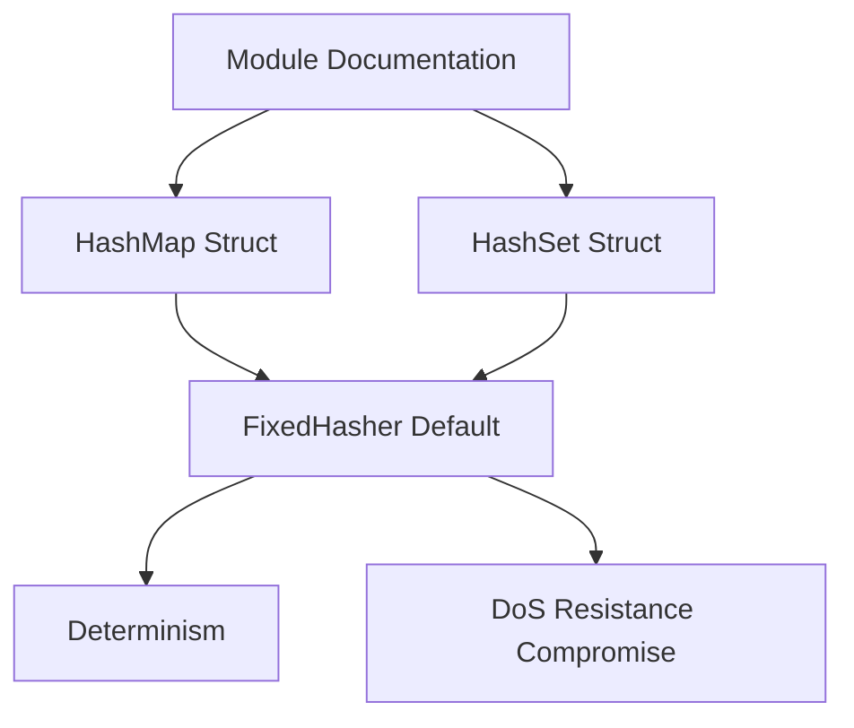

+++
title = "#21266 Add additional FixedHasher details in HashSet and HashMap docs"
date = "2025-09-29T00:00:00"
draft = false
template = "pull_request_page.html"
in_search_index = true

[taxonomies]
list_display = ["show"]

[extra]
current_language = "en"
available_languages = {"en" = { name = "English", url = "/pull_request/bevy/2025-09/pr-21266-en-20250929" }, "zh-cn" = { name = "中文", url = "/pull_request/bevy/2025-09/pr-21266-zh-cn-20250929" }}
labels = ["C-Docs", "D-Trivial", "A-Utils"]
+++

# Title
Add additional FixedHasher details in HashSet and HashMap docs

## Basic Information
- **Title**: Add additional FixedHasher details in HashSet and HashMap docs
- **PR Link**: https://github.com/bevyengine/bevy/pull/21266
- **Author**: insprac
- **Status**: MERGED
- **Labels**: C-Docs, D-Trivial, S-Ready-For-Final-Review, A-Utils
- **Created**: 2025-09-29T01:17:31Z
- **Merged**: 2025-09-29T05:42:53Z
- **Merged By**: alice-i-cecile

## Description Translation
# Objective

- Make information about why to use bevy's `HashMap` and `HashSet` types more accessible.

## Solution

- Copy part of the module docs of `hash_set` and `hash_map` into the struct docs as it is where people will be looking for this info.

## The Story of This Pull Request

This PR addresses a documentation accessibility problem in the Bevy engine's collections module. The core issue was that important information about Bevy's hash collection implementations was only available in module-level documentation, while developers were more likely to look for this information directly on the struct definitions themselves.

The problem stemmed from Bevy's design choice to use `FixedHasher` as the default hasher for its `HashMap` and `HashSet` types, which differs from the standard library's approach of using `RandomState`. This design decision has significant implications for developers, particularly around determinism and security trade-offs, but this critical context was only documented at the module level.

The solution implemented is straightforward but effective: copy the relevant documentation from the module level to the struct level. This ensures that when developers look up the `HashMap` or `HashSet` types in their IDE or documentation, they immediately see the important details about the hashing implementation without needing to navigate to the module documentation.

The implementation approach is minimal and focused. The developer added exactly the same documentation text to both `HashMap` and `HashSet` structs, maintaining consistency across both collection types. The documentation explains that unlike `hashbrown::HashMap`/`HashSet`, Bevy's implementations default to `FixedHasher` instead of `RandomState`, and provides the rationale for this choice: "This provides determinism by default with an acceptable compromise to denial of service resistance in the context of a game engine."

This documentation change is particularly valuable because it addresses a common point of confusion for developers coming from Rust's standard library. The choice of `FixedHasher` over `RandomState` represents a deliberate engineering trade-off where determinism (important for game state reproducibility and debugging) is prioritized over maximum hash collision resistance.

The impact of this change is improved developer experience and reduced confusion. Developers working with Bevy's collections will now immediately understand why the hash collections behave differently from standard Rust collections and what trade-offs are involved in this design decision.

## Visual Representation



## Key Files Changed

### `crates/bevy_platform/src/collections/hash_map.rs` (+5/-0)

This file adds documentation to the `HashMap` struct to explain the hashing implementation choice.

```rust
// File: crates/bevy_platform/src/collections/hash_map.rs
// Before:
///
/// A new-type is used instead of a type alias due to critical methods like [`new`](hb::HashMap::new)
/// being incompatible with Bevy's choice of default hasher.
#[repr(transparent)]
pub struct HashMap<K, V, S = FixedHasher>(hb::HashMap<K, V, S>);

// After:
///
/// A new-type is used instead of a type alias due to critical methods like [`new`](hb::HashMap::new)
/// being incompatible with Bevy's choice of default hasher.
///
/// Unlike [`hashbrown::HashMap`], [`HashMap`] defaults to [`FixedHasher`]
/// instead of [`RandomState`].
/// This provides determinism by default with an acceptable compromise to denial
/// of service resistance in the context of a game engine.
#[repr(transparent)]
pub struct HashMap<K, V, S = FixedHasher>(hb::HashMap<K, V, S>);
```

### `crates/bevy_platform/src/collections/hash_set.rs` (+5/-0)

This file makes the same documentation improvement for the `HashSet` struct.

```rust
// File: crates/bevy_platform/src/collections/hash_set.rs
// Before:
///
/// A new-type is used instead of a type alias due to critical methods like [`new`](hb::HashSet::new)
/// being incompatible with Bevy's choice of default hasher.
#[repr(transparent)]
pub struct HashSet<T, S = FixedHasher>(hb::HashSet<T, S>);

// After:
///
/// A new-type is used instead of a type alias due to critical methods like [`new`](hb::HashSet::new)
/// being incompatible with Bevy's choice of default hasher.
///
/// Unlike [`hashbrown::HashSet`], [`HashSet`] defaults to [`FixedHasher`]
/// instead of [`RandomState`](crate::hash::RandomState).
/// This provides determinism by default with an acceptable compromise to denial
/// of service resistance in the context of a game engine.
#[repr(transparent)]
pub struct HashSet<T, S = FixedHasher>(hb::HashSet<T, S>);
```

## Further Reading

- [Rust HashMap Documentation](https://doc.rust-lang.org/std/collections/struct.HashMap.html) - Standard library HashMap implementation
- [HashDoS Attacks](https://en.wikipedia.org/wiki/Collision_attack) - Background on denial of service attacks via hash collisions
- [Bevy Engine Documentation](https://bevyengine.org/learn/) - General Bevy engine documentation
- [Determinism in Game Engines](https://gafferongames.com/post/deterministic_lockstep/) - Importance of determinism in game development