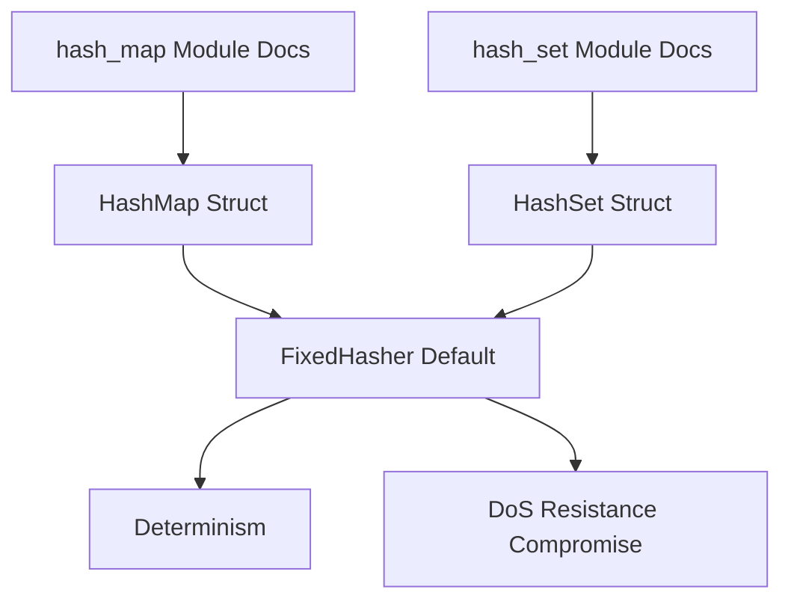

+++
title = "#21266 Add additional FixedHasher details in HashSet and HashMap docs"
date = "2025-09-29T00:00:00"
draft = false
template = "pull_request_page.html"
in_search_index = false

[extra]
current_language = "zh-cn"
available_languages = {"en" = { name = "English", url = "/pull_request/bevy/2025-09/pr-21266-en-20250929" }, "zh-cn" = { name = "中文", url = "/pull_request/bevy/2025-09/pr-21266-zh-cn-20250929" }}
labels = ["C-Docs", "D-Trivial", "A-Utils"]
+++

# Add additional FixedHasher details in HashSet and HashMap docs

## Basic Information
- **Title**: Add additional FixedHasher details in HashSet and HashMap docs
- **PR Link**: https://github.com/bevyengine/bevy/pull/21266
- **Author**: insprac
- **Status**: MERGED
- **Labels**: C-Docs, D-Trivial, S-Ready-For-Final-Review, A-Utils
- **Created**: 2025-09-29T01:17:31Z
- **Merged**: 2025-09-29T05:42:53Z
- **Merged By**: alice-i-cecile

## Description Translation
# Objective

- 让关于为何使用 Bevy 的 `HashMap` 和 `HashSet` 类型的信息更易于获取。

## Solution

- 将 `hash_set` 和 `hash_map` 模块文档的一部分复制到结构体文档中，因为这是人们会寻找这些信息的地方。

## The Story of This Pull Request

这个 PR 解决了一个常见的文档可发现性问题。在 Bevy 游戏引擎中，`HashMap` 和 `HashSet` 类型是 `hashbrown` 库中对应类型的包装器，但有一个重要的区别：它们默认使用 `FixedHasher` 而不是 `RandomState`。这个设计选择对于游戏引擎来说有重要的性能和行为影响。

问题在于，虽然模块级别的文档已经解释了这一设计决策，但开发者在查看结构体文档时可能不会立即看到这些信息。当开发者直接查看 `HashMap` 或 `HashSet` 的结构体文档时，他们可能会疑惑为什么选择这些类型而不是标准的 Rust 集合。

开发者通过一个简单而有效的解决方案：将关键的设计理由从模块文档复制到结构体文档中。这样，无论开发者是通过模块导航还是直接查看结构体，都能立即了解为什么选择这些类型以及它们的行为特点。

技术上的核心问题是文档的层次结构。在 Rust 的文档系统中，模块文档和结构体文档是分开的，开发者可能不会自然地从一个导航到另一个。通过在每个结构体的文档中直接包含关键信息，大大提高了这些重要设计决策的可发现性。

从实现角度看，这个修改展示了良好的文档实践。添加的文档明确指出了与 `hashbrown` 原型的区别，解释了使用 `FixedHasher` 的权衡：在游戏引擎的上下文中，确定性比完全的拒绝服务攻击防护更重要。这种明确的文档有助于开发者理解何时应该使用这些类型，以及它们与标准库对应类型的区别。

这个修改虽然简单，但对用户体验有显著影响。它减少了开发者在理解 Bevy 特定集合类型时需要跨越的认知障碍，使得设计决策更加透明和易于理解。

## Visual Representation



## Key Files Changed

### `crates/bevy_platform/src/collections/hash_map.rs` (+5/-0)

这个文件在 `HashMap` 结构体的文档中添加了关于默认哈希器的重要信息。

```rust
// File: crates/bevy_platform/src/collections/hash_map.rs
// Before:
///
/// A new-type is used instead of a type alias due to critical methods like [`new`](hb::HashMap::new)
/// being incompatible with Bevy's choice of default hasher.
#[repr(transparent)]
pub struct HashMap<K, V, S = FixedHasher>(hb::HashMap<K, V, S>);

// After:
///
/// A new-type is used instead of a type alias due to critical methods like [`new`](hb::HashMap::new)
/// being incompatible with Bevy's choice of default hasher.
///
/// Unlike [`hashbrown::HashMap`], [`HashMap`] defaults to [`FixedHasher`]
/// instead of [`RandomState`].
/// This provides determinism by default with an acceptable compromise to denial
/// of service resistance in the context of a game engine.
#[repr(transparent)]
pub struct HashMap<K, V, S = FixedHasher>(hb::HashMap<K, V, S>);
```

### `crates/bevy_platform/src/collections/hash_set.rs` (+5/-0)

类似地，这个文件在 `HashSet` 结构体的文档中添加了相同的信息。

```rust
// File: crates/bevy_platform/src/collections/hash_set.rs
// Before:
///
/// A new-type is used instead of a type alias due to critical methods like [`new`](hb::HashSet::new)
/// being incompatible with Bevy's choice of default hasher.
#[repr(transparent)]
pub struct HashSet<T, S = FixedHasher>(hb::HashSet<T, S>);

// After:
///
/// A new-type is used instead of a type alias due to critical methods like [`new`](hb::HashSet::new)
/// being incompatible with Bevy's choice of default hasher.
///
/// Unlike [`hashbrown::HashSet`], [`HashSet`] defaults to [`FixedHasher`]
/// instead of [`RandomState`](crate::hash::RandomState).
/// This provides determinism by default with an acceptable compromise to denial
/// of service resistance in the context of a game engine.
#[repr(transparent)]
pub struct HashSet<T, S = FixedHasher>(hb::HashSet<T, S>);
```

## Further Reading

- [Rust Documentation Guidelines](https://rust-lang.github.io/rfcs/1574-more-api-documentation-conventions.html)
- [HashDoS Attacks and Mitigation Strategies](https://en.wikipedia.org/wiki/Collision_attack)
- [Bevy Engine Documentation Practices](https://bevyengine.org/learn/book/introduction/)
- [hashbrown crate documentation](https://docs.rs/hashbrown/latest/hashbrown/)