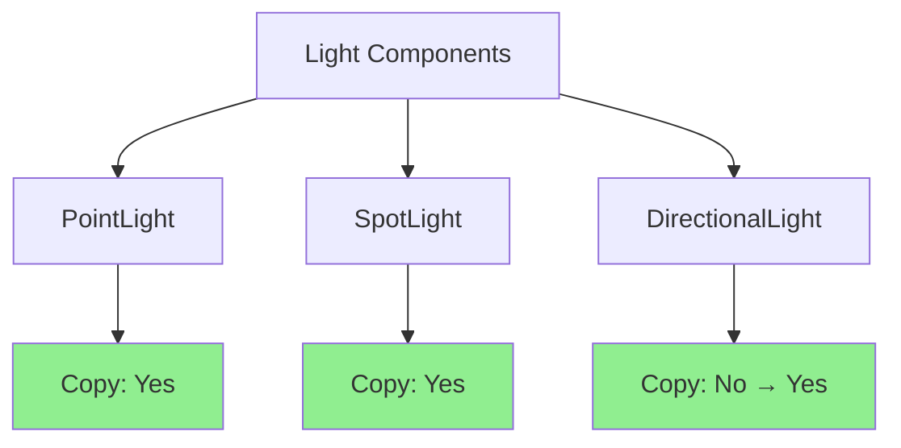

+++
title = "#21268 Make `DirectionalLight` `Copy`"
date = "2025-09-29T00:00:00"
draft = false
template = "pull_request_page.html"
in_search_index = true

[taxonomies]
list_display = ["show"]

[extra]
current_language = "en"
available_languages = {"en" = { name = "English", url = "/pull_request/bevy/2025-09/pr-21268-en-20250929" }, "zh-cn" = { name = "中文", url = "/pull_request/bevy/2025-09/pr-21268-zh-cn-20250929" }}
labels = ["D-Trivial", "A-Rendering"]
+++

# Title

## Basic Information
- **Title**: Make `DirectionalLight` `Copy`
- **PR Link**: https://github.com/bevyengine/bevy/pull/21268
- **Author**: janhohenheim
- **Status**: MERGED
- **Labels**: D-Trivial, A-Rendering, S-Ready-For-Final-Review
- **Created**: 2025-09-29T04:01:35Z
- **Merged**: 2025-09-29T05:38:07Z
- **Merged By**: alice-i-cecile

## Description Translation
# Objective

- `PointLight` and `SpotLight` are both `Copy`, but `DirectionalLight` isn't.

## Solution

- Make it `Copy`. It's also a light, and the struct is comparable in size to the others

## Testing

- CI

## Additional info

Noticed this while implementing a CPU estimate of Bevy's lighting for the visibility calculations in a stealth system

## The Story of This Pull Request

This pull request addresses a consistency issue in Bevy's lighting system API. The developer discovered this inconsistency while working on a CPU-based lighting estimation system for visibility calculations in a stealth game system. The core problem was straightforward: `DirectionalLight` was missing the `Copy` trait that other light types already had.

The issue became apparent during practical development work. When implementing lighting calculations that required copying light data for CPU-side processing, the developer noticed that `PointLight` and `SpotLight` could be copied directly, but `DirectionalLight` required explicit cloning. This created an inconsistent API experience and forced unnecessary verbosity in code that worked with multiple light types.

The solution is technically simple but important for API consistency. The `DirectionalLight` struct contains only primitive fields and other `Copy` types, making it safe to implement the `Copy` trait. The struct size is comparable to other light types that already implement `Copy`, so there are no performance concerns with making this change.

From an engineering perspective, this change follows Rust's best practices for trait implementation. When a type consists entirely of `Copy` fields and has no special ownership requirements, implementing `Copy` is appropriate. This allows for more ergonomic usage patterns, particularly in scenarios involving assignment and function parameter passing.

The implementation required only a single-line change to the type definition, adding `Copy` to the derive macro attributes. This minimal change ensures that existing code continues to work while making the API more consistent across light types. The fact that this was discovered during actual game development work demonstrates the value of real-world usage in identifying API inconsistencies.

## Visual Representation



## Key Files Changed

**File: `crates/bevy_light/src/directional_light.rs`**

This file contains the definition of the `DirectionalLight` component. The change adds the `Copy` trait to the derive macro, making the component consistent with other light types in the codebase.

```rust
// Before:
#[derive(Component, Debug, Clone, Reflect)]

// After:
#[derive(Component, Debug, Clone, Copy, Reflect)]
```

The change is minimal but significant for API consistency. By adding `Copy`, the `DirectionalLight` component now behaves like other light components when assigned to variables or passed as function parameters, eliminating the need for explicit `.clone()` calls in many scenarios.

## Further Reading

- [Rust Book: Derivable Traits](https://doc.rust-lang.org/book/appendix-03-derivable-traits.html) - Explanation of when and why to use derive macros like `Copy`
- [Rust Reference: The Copy Trait](https://doc.rust-lang.org/std/marker/trait.Copy.html) - Official documentation on the `Copy` trait and its semantics
- [Bevy Engine: Components](https://bevyengine.org/learn/book/ecs/components/) - Bevy's ECS system and how components work
- [Bevy Lighting System](https://bevyengine.org/learn/book/rendering/lights/) - Overview of Bevy's lighting system and different light types