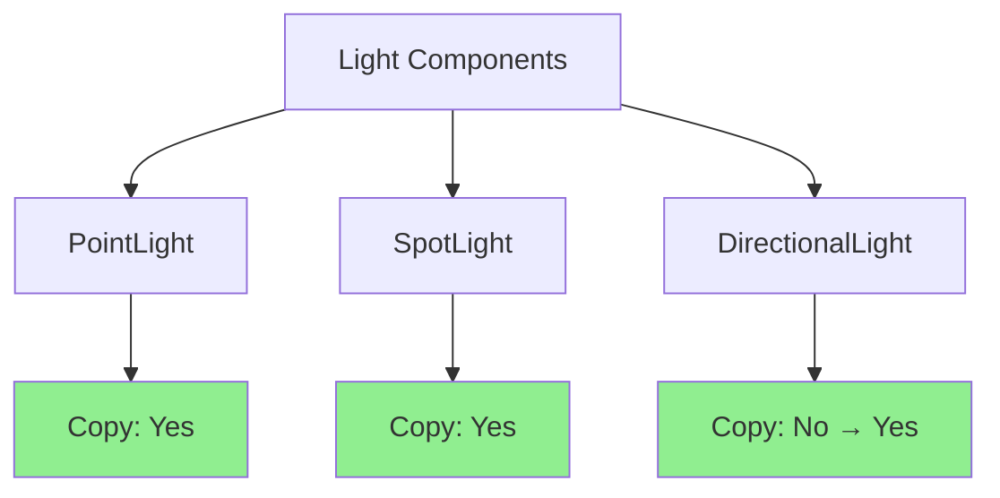

+++
title = "#21268 Make `DirectionalLight` `Copy`"
date = "2025-09-29T00:00:00"
draft = false
template = "pull_request_page.html"
in_search_index = false

[extra]
current_language = "zh-cn"
available_languages = {"en" = { name = "English", url = "/pull_request/bevy/2025-09/pr-21268-en-20250929" }, "zh-cn" = { name = "中文", url = "/pull_request/bevy/2025-09/pr-21268-zh-cn-20250929" }}
labels = ["D-Trivial", "A-Rendering"]
+++

# Make `DirectionalLight` `Copy`

## Basic Information
- **Title**: Make `DirectionalLight` `Copy`
- **PR Link**: https://github.com/bevyengine/bevy/pull/21268
- **Author**: janhohenheim
- **Status**: MERGED
- **Labels**: D-Trivial, A-Rendering, S-Ready-For-Final-Review
- **Created**: 2025-09-29T04:01:35Z
- **Merged**: 2025-09-29T05:38:07Z
- **Merged By**: alice-i-cecile

## Description Translation
# 目标

- `PointLight` 和 `SpotLight` 都是 `Copy`，但 `DirectionalLight` 不是。

## 解决方案

- 使其成为 `Copy`。它也是一个光源，并且结构体的大小与其他光源相当。

## 测试

- CI

## 额外信息

在为一个潜行系统中的可见性计算实现 Bevy 光照的 CPU 估算时注意到了这一点。

## The Story of This Pull Request

这个 PR 源于一个实际开发场景中的发现。开发者 janhohenheim 正在实现一个潜行系统中的可见性计算功能，需要对 Bevy 的光照系统进行 CPU 端的性能估算。在这个过程中，他们注意到 Bevy 的光源类型存在不一致性。

问题的核心在于类型系统的一致性。在 Bevy 的渲染系统中，有三种主要的光源类型：`PointLight`（点光源）、`SpotLight`（聚光灯）和 `DirectionalLight`（定向光）。前两种光源类型都实现了 `Copy` trait，这意味着它们可以被隐式复制，在栈上传递时不需要额外的内存分配或所有权转移。然而，`DirectionalLight` 却没有实现这个 trait。

从技术角度看，这种不一致性没有明显的原因。`DirectionalLight` 结构体的大小与其他光源类型相当，包含的字段主要是基础类型和简单结构体：

```rust
pub struct DirectionalLight {
    pub color: Color,
    pub illuminance: f32,
    pub shadows_enabled: bool,
    pub shadow_depth_bias: f32,
    pub shadow_normal_bias: f32,
}
```

这些字段都实现了 `Copy` trait，因此整个结构体满足实现 `Copy` 的条件。在 Rust 中，当一个结构体的所有字段都实现了 `Copy` 时，该结构体本身也可以安全地实现 `Copy`。

开发者选择了最直接的解决方案：在 `DirectionalLight` 的 derive 属性中添加 `Copy`。这个修改很小但很重要，因为它：

1. **保持了一致性**：现在所有三种光源类型都具有相同的行为特征
2. **提高了可用性**：开发者可以在需要复制 `DirectionalLight` 实例时使用更简洁的语法
3. **支持性能优化**：在 CPU 端的光照计算中，可以更高效地处理光源数据

这个修改特别适合 janhohenheim 正在开发的潜行系统可见性计算功能。在实现光照的 CPU 估算时，经常需要创建光源的副本进行各种计算和测试。有了 `Copy` 实现，这些操作变得更加简单和高效。

从工程实践的角度看，这个 PR 展示了良好的代码维护习惯。即使是很小的不一致性，当被发现时也应该被修复，因为这有助于保持代码库的整洁和可预测性。这种一致性对于大型项目如 Bevy 尤为重要，因为开发者需要能够依赖一致的 API 行为。

## Visual Representation



## Key Files Changed

### `crates/bevy_light/src/directional_light.rs` (+1/-1)

这个文件包含了 `DirectionalLight` 结构体的定义。修改很简单但重要：

**修改前：**
```rust
#[derive(Component, Debug, Clone, Reflect)]
#[reflect(Component, Default, Debug, Clone)]
```

**修改后：**
```rust
#[derive(Component, Debug, Clone, Copy, Reflect)]
#[reflect(Component, Default, Debug, Clone)]
```

这个修改在 `derive` 属性中添加了 `Copy` trait，使得 `DirectionalLight` 现在可以像其他光源类型一样被隐式复制。修改保持了与现有代码的完全兼容性，因为 `Copy` 是一个自动 trait，不会改变结构体的公共 API。

## Further Reading

- [Rust Book: What is Ownership?](https://doc.rust-lang.org/book/ch04-01-what-is-ownership.html) - 理解 Rust 的所有权系统
- [Rust Reference: Copy and Move Semantics](https://doc.rust-lang.org/reference/types.html#copy-types) - Copy 和 Move 语义的详细说明
- [Bevy Lighting Documentation](https://bevyengine.org/learn/quick-start/3d/lighting/) - Bevy 光照系统的官方文档
- [Rust by Example: Traits](https://doc.rust-lang.org/rust-by-example/trait.html) - Rust trait 系统的实用指南

# Full Code Diff
```diff
diff --git a/crates/bevy_light/src/directional_light.rs b/crates/bevy_light/src/directional_light.rs
index 765d80d17f0b4..c3360514779e4 100644
--- a/crates/bevy_light/src/directional_light.rs
+++ b/crates/bevy_light/src/directional_light.rs
@@ -55,7 +55,7 @@ use super::{
 /// change the [`CascadeShadowConfig`] component of the entity with the [`DirectionalLight`].
 ///
 /// To control the resolution of the shadow maps, use the [`DirectionalLightShadowMap`] resource.
-#[derive(Component, Debug, Clone, Reflect)]
+#[derive(Component, Debug, Clone, Copy, Reflect)]
 #[reflect(Component, Default, Debug, Clone)]
 #[require(
     Cascades,
```