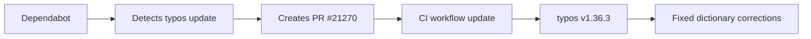

+++
title = "#21270 Bump crate-ci/typos from 1.36.2 to 1.36.3"
date = "2025-09-30T00:00:00"
draft = false
template = "pull_request_page.html"
in_search_index = true

[taxonomies]
list_display = ["show"]

[extra]
current_language = "en"
available_languages = {"en" = { name = "English", url = "/pull_request/bevy/2025-09/pr-21270-en-20250930" }, "zh-cn" = { name = "中文", url = "/pull_request/bevy/2025-09/pr-21270-zh-cn-20250930" }}
labels = ["C-Dependencies"]
+++

# Bump crate-ci/typos from 1.36.2 to 1.36.3

## Basic Information
- **Title**: Bump crate-ci/typos from 1.36.2 to 1.36.3
- **PR Link**: https://github.com/bevyengine/bevy/pull/21270
- **Author**: app/dependabot
- **Status**: MERGED
- **Labels**: C-Dependencies
- **Created**: 2025-09-29T06:36:55Z
- **Merged**: 2025-09-29T23:10:58Z
- **Merged By**: mockersf

## Description Translation
Bumps [crate-ci/typos](https://github.com/crate-ci/typos) from 1.36.2 to 1.36.3.
<details>
<summary>Release notes</summary>
<p><em>Sourced from <a href="https://github.com/crate-ci/typos/releases">crate-ci/typos's releases</a>.</em></p>
<blockquote>
<h2>v1.36.3</h2>
<h2>[1.36.3] - 2025-09-25</h2>
<h3>Fixes</h3>
<ul>
<li>Fix typo in correction to <code>analysises</code></li>
</ul>
</blockquote>
</details>
<details>
<summary>Changelog</summary>
<p><em>Sourced from <a href="https://github.com/crate-ci/typos/blob/master/CHANGELOG.md">crate-ci/typos's changelog</a>.</em></p>
<blockquote>
<h2>[1.36.3] - 2025-09-25</h2>
<h3>Fixes</h3>
<ul>
<li>Fix typo in correction to <code>analysises</code></li>
</ul>
</blockquote>
</details>
<details>
<summary>Commits</summary>
<ul>
<li><a href="https://github.com/crate-ci/typos/commit/0c17dabcee8b8f1957fa917d17393a23e02e1583"><code>0c17dab</code></a> chore: Release</li>
<li><a href="https://github.com/crate-ci/typos/commit/d4a3b7b012dee49dc53215698995dd0049d08527"><code>d4a3b7b</code></a> docs: Update changelog</li>
<li><a href="https://github.com/crate-ci/typos/commit/8feb042263e9940f81b30978f4ead9827aeabbbc"><code>8feb042</code></a> Merge pull request <a href="https://redirect.github.com/crate-ci/typos/issues/1379">#1379</a> from epage/dict</li>
<li><a href="https://github.com/crate-ci/typos/commit/6995b89f82e5b64a30bec59e37076f31d04dbab1"><code>6995b89</code></a> fix(dict): Don't correct too analysises</li>
<li><a href="https://github.com/crate-ci/typos/commit/87d09ddc3711b776c4db3103067957b6c4bd70fa"><code>87d09dd</code></a> fix(codespell): Update to 2f3751e</li>
<li><a href="https://github.com/crate-ci/typos/commit/5e1db27ee9590c41aa1f23ddc03e0ba18b866d70"><code>5e1db27</code></a> docs(readme): Specify --locked</li>
<li><a href="https://github.com/crate-ci/typos/commit/2abc5d928aaa84e3a901dda4f148299486dcd818"><code>2abc5d9</code></a> chore(deps): Update Rust Stable to v1.90 (<a href="https://redirect.github.com/crate-ci/typos/issues/1375">#1375</a>)</li>
<li>See full diff in <a href="https://github.com/crate-ci/typos/compare/v1.36.2...v1.36.3">compare view</a></li>
</ul>
</details>
<br />


[](https://docs.github.com/en/github/managing-security-vulnerabilities/about-dependabot-security-updates#about-compatibility-scores)

Dependabot will resolve any conflicts with this PR as long as you don't alter it yourself. You can also trigger a rebase manually by commenting `@dependabot rebase`.

[//]: # (dependabot-automerge-start)
[//]: # (dependabot-automerge-end)

---

<details>
<summary>Dependabot commands and options</summary>
<br />

You can trigger Dependabot actions by commenting on this PR:
- `@dependabot rebase` will rebase this PR
- `@dependabot recreate` will recreate this PR, overwriting any edits that have been made to it
- `@dependabot merge` will merge this PR after your CI passes on it
- `@dependabot squash and merge` will squash and merge this PR after your CI passes on it
- `@dependabot cancel merge` will cancel a previously requested merge and block automerging
- `@dependabot reopen` will reopen this PR if it is closed
- `@dependabot close` will close this PR and stop Dependabot recreating it. You can achieve the same result by closing it manually
- `@dependabot show <dependency name> ignore conditions` will show all of the ignore conditions of the specified dependency
- `@dependabot ignore this major version` will close this PR and stop Dependabot creating any more for this major version (unless you reopen the PR or upgrade to it yourself)
- `@dependabot ignore this minor version` will close this PR and stop Dependabot creating any more for this minor version (unless you reopen the PR or upgrade to it yourself)
- `@dependabot ignore this dependency` will close this PR and stop Dependabot creating any more for this dependency (unless you reopen the PR or upgrade to it yourself)


</details>

## The Story of This Pull Request

This pull request represents a routine but important maintenance task in the Bevy project's development workflow. The core issue being addressed is keeping the project's development tooling up to date with the latest improvements and bug fixes.

The problem was straightforward: the Bevy project uses crate-ci/typos, a GitHub Action that scans code for spelling errors, as part of its continuous integration pipeline. The project was using version 1.36.2 of this tool, and version 1.36.3 had been released with a specific fix for a dictionary correction issue. The technical constraint here is maintaining code quality through automated spell checking without introducing false positives from the tool itself.

The solution approach was equally straightforward - update the dependency version in the GitHub Actions workflow file. This is a standard practice in software development where keeping dependencies current ensures access to the latest bug fixes and improvements. The engineering decision here was to trust the semantic versioning of the typos tool, where a patch version bump (from 1.36.2 to 1.36.3) indicates backward-compatible bug fixes.

The implementation consisted of a single-line change in the CI configuration file. The specific fix in typos 1.36.3 addressed an issue where the tool was incorrectly correcting "analysises" - this demonstrates how even tools designed to catch errors can themselves contain errors that need fixing.

From a technical perspective, this update illustrates several important concepts in modern software development:

1. **Dependency management**: The use of automated tools like Dependabot to track and propose dependency updates
2. **Continuous integration hygiene**: Maintaining up-to-date tooling in CI pipelines
3. **Semantic versioning**: Understanding that patch version updates typically contain only bug fixes
4. **Quality assurance tooling**: The role of automated spell checking in maintaining code quality

The impact of this change is subtle but meaningful. By updating to the fixed version, Bevy ensures that its spell checking won't incorrectly flag or correct valid terminology. This prevents potential confusion for contributors and maintains the integrity of the codebase's documentation and comments. The high compatibility score (as shown in the dependabot badge) indicates minimal risk in making this update.

## Visual Representation



## Key Files Changed

### `.github/workflows/ci.yml`

This file contains the GitHub Actions workflow configuration for Bevy's continuous integration pipeline. The change updates the version of the crate-ci/typos action used in the spell checking job.

```yaml
# File: .github/workflows/ci.yml
# Before:
- name: Check for typos
  uses: crate-ci/typos@v1.36.2

# After:
- name: Check for typos
  uses: crate-ci/typos@v1.36.3
```

This single-line change updates the typos checker from version 1.36.2 to 1.36.3, incorporating the bug fix that prevents incorrect corrections for the word "analysises". The change is located in the spell checking job of the CI pipeline, which runs as part of the project's quality assurance process.

## Further Reading

- [GitHub Actions Documentation](https://docs.github.com/en/actions)
- [crate-ci/typos GitHub Repository](https://github.com/crate-ci/typos)
- [Dependabot Documentation](https://docs.github.com/en/code-security/dependabot)
- [Semantic Versioning Specification](https://semver.org/)

# Full Code Diff
```diff
diff --git a/.github/workflows/ci.yml b/.github/workflows/ci.yml
index 3d9bc2a99ba55..d0d0a346b5984 100644
--- a/.github/workflows/ci.yml
+++ b/.github/workflows/ci.yml
@@ -339,7 +339,7 @@ jobs:
     steps:
       - uses: actions/checkout@v5
       - name: Check for typos
-        uses: crate-ci/typos@v1.36.2
+        uses: crate-ci/typos@v1.36.3
       - name: Typos info
         if: failure()
         run: |
```