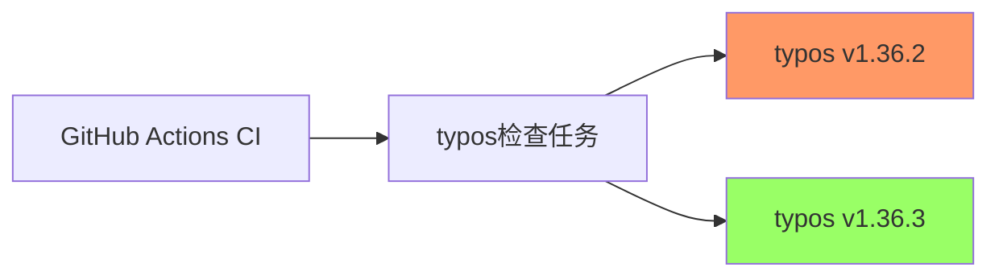

+++
title = "#21270 Bump crate-ci/typos from 1.36.2 to 1.36.3"
date = "2025-09-30T00:00:00"
draft = false
template = "pull_request_page.html"
in_search_index = false

[extra]
current_language = "zh-cn"
available_languages = {"en" = { name = "English", url = "/pull_request/bevy/2025-09/pr-21270-en-20250930" }, "zh-cn" = { name = "中文", url = "/pull_request/bevy/2025-09/pr-21270-zh-cn-20250930" }}
labels = ["C-Dependencies"]
+++

# Bump crate-ci/typos from 1.36.2 to 1.36.3

## Basic Information
- **Title**: Bump crate-ci/typos from 1.36.2 to 1.36.3
- **PR Link**: https://github.com/bevyengine/bevy/pull/21270
- **Author**: app/dependabot
- **Status**: MERGED
- **Labels**: C-Dependencies
- **Created**: 2025-09-29T06:36:55Z
- **Merged**: 2025-09-29T23:10:58Z
- **Merged By**: mockersf

## Description Translation
将 [crate-ci/typos](https://github.com/crate-ci/typos) 从 1.36.2 升级到 1.36.3。
<details>
<summary>发布说明</summary>
<p><em>来源自 <a href="https://github.com/crate-ci/typos/releases">crate-ci/typos 的发布</a>。</em></p>
<blockquote>
<h2>v1.36.3</h2>
<h2>[1.36.3] - 2025-09-25</h2>
<h3>修复</h3>
<ul>
<li>修复了在更正 <code>analysises</code> 时的拼写错误</li>
</ul>
</blockquote>
</details>
<details>
<summary>更新日志</summary>
<p><em>来源自 <a href="https://github.com/crate-ci/typos/blob/master/CHANGELOG.md">crate-ci/typos 的更新日志</a>。</em></p>
<blockquote>
<h2>[1.36.3] - 2025-09-25</h2>
<h3>修复</h3>
<ul>
<li>修复了在更正 <code>analysises</code> 时的拼写错误</li>
</ul>
</blockquote>
</details>
<details>
<summary>提交</summary>
<ul>
<li><a href="https://github.com/crate-ci/typos/commit/0c17dabcee8b8f1957fa917d17393a23e02e1583"><code>0c17dab</code></a> chore: 发布</li>
<li><a href="https://github.com/crate-ci/typos/commit/d4a3b7b012dee49dc53215698995dd0049d08527"><code>d4a3b7b</code></a> docs: 更新更新日志</li>
<li><a href="https://github.com/crate-ci/typos/commit/8feb042263e9940f81b30978f4ead9827aeabbbc"><code>8feb042</code></a> Merge pull request <a href="https://redirect.github.com/crate-ci/typos/issues/1379">#1379</a> from epage/dict</li>
<li><a href="https://github.com/crate-ci/typos/commit/6995b89f82e5b64a30bec59e37076f31d04dbab1"><code>6995b89</code></a> fix(dict): 不要过度更正 analysises</li>
<li><a href="https://github.com/crate-ci/typos/commit/87d09ddc3711b776c4db3103067957b6c4bd70fa"><code>87d09dd</code></a> fix(codespell): 更新到 2f3751e</li>
<li><a href="https://github.com/crate-ci/typos/commit/5e1db27ee9590c41aa1f23ddc03e0ba18b866d70"><code>5e1db27</code></a> docs(readme): 指定 --locked</li>
<li><a href="https://github.com/crate-ci/typos/commit/2abc5d928aaa84e3a901dda4f148299486dcd818"><code>2abc5d9</code></a> chore(deps): 将 Rust Stable 更新到 v1.90 (<a href="https://redirect.github.com/crate-ci/typos/issues/1375">#1375</a>)</li>
<li>查看完整差异 <a href="https://github.com/crate-ci/typos/compare/v1.36.2...v1.36.3">比较视图</a></li>
</ul>
</details>
<br />


[](https://docs.github.com/en/github/managing-security-vulnerabilities/about-dependabot-security-updates#about-compatibility-scores)

只要您不自行修改，Dependabot 将解决与此 PR 的任何冲突。您也可以通过评论 `@dependabot rebase` 手动触发变基。

[//]: # (dependabot-automerge-start)
[//]: # (dependabot-automerge-end)

---

<details>
<summary>Dependabot 命令和选项</summary>
<br />

您可以通过在此 PR 上评论来触发 Dependabot 操作：
- `@dependabot rebase` 将变基此 PR
- `@dependabot recreate` 将重新创建此 PR，覆盖对其进行的任何编辑
- `@dependabot merge` 将在 CI 通过后合并此 PR
- `@dependabot squash and merge` 将在 CI 通过后压缩并合并此 PR
- `@dependabot cancel merge` 将取消先前请求的合并并阻止自动合并
- `@dependabot reopen` 将重新打开此 PR（如果已关闭）
- `@dependabot close` 将关闭此 PR 并停止 Dependabot 重新创建它。您可以通过手动关闭它来实现相同的结果
- `@dependabot show <dependency name> ignore conditions` 将显示指定依赖项的所有忽略条件
- `@dependabot ignore this major version` 将关闭此 PR 并停止 Dependabot 为此主要版本创建更多 PR（除非您重新打开 PR 或自行升级到该版本）
- `@dependabot ignore this minor version` 将关闭此 PR 并停止 Dependabot 为此次要版本创建更多 PR（除非您重新打开 PR 或自行升级到该版本）
- `@dependabot ignore this dependency` 将关闭此 PR 并停止 Dependabot 为此依赖项创建更多 PR（除非您重新打开 PR 或自行升级到该依赖项）


</details>

## The Story of This Pull Request

这个PR是一个典型的依赖项更新，由Dependabot自动创建和维护。作为Bevy引擎持续集成流程的一部分，项目使用了crate-ci/typos工具来检查代码中的拼写错误，确保文档和代码注释的质量。

**问题背景**

在软件开发项目中，拼写错误虽然不影响代码功能，但会影响代码的可读性和专业性。crate-ci/typos是一个专门用于检测代码库中拼写错误的工具，集成在GitHub Actions工作流中，可以在每次提交时自动检查拼写问题。

**更新动机**

typos 1.36.3版本修复了一个特定的问题：在更正"analysises"这个词时的拼写错误修复。虽然这个修复看起来很小，但对于依赖自动化工具检测拼写错误的项目来说，保持工具的最新版本很重要，这样可以确保检测结果的准确性。

**技术实现**

这个PR的修改非常简单直接，只涉及一个文件的单行更改。在Bevy的CI工作流配置文件中，将typos工具的版本从1.36.2更新到1.36.3。这种类型的依赖更新是维护工作的常规部分，确保项目使用的外部工具具有最新的错误修复和改进。

**工程考量**

依赖项管理是现代软件开发中的重要实践。通过使用Dependabot这样的自动化工具，团队可以：
- 及时获取依赖项的安全更新
- 受益于性能改进和错误修复
- 减少技术债务的积累

虽然这个更新本身很小，但它体现了良好的工程实践：保持依赖项的最新状态，即使对于构建工具也是如此。

**影响评估**

这次更新对Bevy项目的影响很小但积极：
- 改进了拼写检查的准确性
- 没有引入破坏性变更
- 保持了CI流程的稳定性

这种小版本的依赖更新通常风险很低，特别是对于像拼写检查这样的辅助工具。

## Visual Representation



## Key Files Changed

### `.github/workflows/ci.yml` (+1/-1)

这个文件包含了Bevy项目的GitHub Actions持续集成配置。修改将typos工具的版本从1.36.2更新到1.36.3。

**修改详情：**

```yaml
# 文件: .github/workflows/ci.yml
# 修改前:
      - name: Check for typos
        uses: crate-ci/typos@v1.36.2

# 修改后:
      - name: Check for typos
        uses: crate-ci/typos@v1.36.3
```

这个修改位于CI工作流的"Check for typos"步骤中，该步骤在代码提交时自动运行，检查代码库中的拼写错误。版本更新确保了拼写检查工具使用最新的字典和修正规则。

## Further Reading

- [crate-ci/typos GitHub仓库](https://github.com/crate-ci/typos) - 了解typos工具的更多功能和使用方法
- [GitHub Actions文档](https://docs.github.com/en/actions) - 学习如何配置和使用GitHub Actions
- [Dependabot文档](https://docs.github.com/en/code-security/dependabot) - 了解如何设置和管理依赖项自动更新
- [语义化版本控制](https://semver.org/) - 理解版本号的含义和依赖更新的影响评估

# Full Code Diff
diff --git a/.github/workflows/ci.yml b/.github/workflows/ci.yml
index 3d9bc2a99ba55..d0d0a346b5984 100644
--- a/.github/workflows/ci.yml
+++ b/.github/workflows/ci.yml
@@ -339,7 +339,7 @@ jobs:
     steps:
       - uses: actions/checkout@v5
       - name: Check for typos
-        uses: crate-ci/typos@v1.36.2
+        uses: crate-ci/typos@v1.36.3
       - name: Typos info
         if: failure()
         run: |