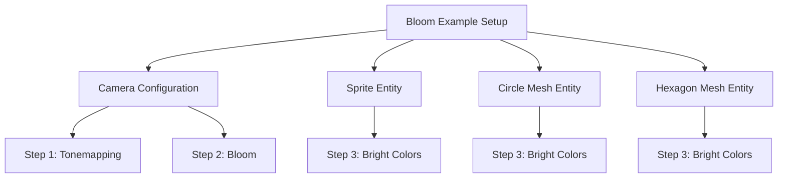

+++
title = "#21276 Fix the index values in the comments"
date = "2025-09-30T00:00:00"
draft = false
template = "pull_request_page.html"
in_search_index = true

[taxonomies]
list_display = ["show"]

[extra]
current_language = "en"
available_languages = {"en" = { name = "English", url = "/pull_request/bevy/2025-09/pr-21276-en-20250930" }, "zh-cn" = { name = "中文", url = "/pull_request/bevy/2025-09/pr-21276-zh-cn-20250930" }}
labels = ["D-Trivial", "A-Rendering", "C-Examples"]
+++

# Fix the index values in the comments

## Basic Information
- **Title**: Fix the index values in the comments
- **PR Link**: https://github.com/bevyengine/bevy/pull/21276
- **Author**: baozaolaoba-top
- **Status**: MERGED
- **Labels**: D-Trivial, A-Rendering, C-Examples, S-Ready-For-Final-Review
- **Created**: 2025-09-29T15:58:30Z
- **Merged**: 2025-09-30T05:31:04Z
- **Merged By**: alice-i-cecile

## Description Translation
Fix the index values in the comments.

## The Story of This Pull Request

This pull request addresses a straightforward but important issue in the Bevy game engine's documentation - inconsistent numbering in code comments within the bloom effect example. The problem was discovered in the `bloom_2d.rs` example file, where numbered comments that explain the bloom effect implementation steps were misnumbered.

The issue began with a simple oversight in comment maintenance. When developers add explanatory comments to examples, they often number key steps to help users understand the implementation sequence. However, as code evolves and comments are added or modified, these numbering sequences can become inconsistent, creating confusion for developers trying to follow the example.

In this specific case, the comments were intended to walk through the key steps for implementing bloom:
1. Using a tonemapper that desaturates to white
2. Enabling bloom for the camera  
3. Using bright colors in a dark environment to see the effect

However, the numbering had started at 2 and 3 for the first two steps, then jumped to 4 for the third step. Additionally, the same step 4 was repeated across multiple entities (sprite, circle mesh, and hexagon mesh) when they should all reference the same step 3.

The solution was straightforward - renumber the comments to maintain a consistent sequential numbering scheme. This type of fix, while small, is important for maintaining code quality and developer experience. Well-documented examples with clear, logical numbering help new users understand complex graphics concepts like bloom effects more quickly.

From an engineering perspective, this change demonstrates the importance of paying attention to documentation details. Even minor inconsistencies in examples can create friction for developers learning a codebase. The fix required minimal code changes but improves the clarity and professionalism of the example.

## Visual Representation



## Key Files Changed

### `examples/2d/bloom_2d.rs` (+5/-5)

This file contains the 2D bloom effect example. The changes fix inconsistent numbering in the explanatory comments that describe the key steps for implementing bloom.

**Key Changes:**

```rust
// Before:
Tonemapping::TonyMcMapface, // 2. Using a tonemapper that desaturates to white is recommended
Bloom::default(),           // 3. Enable bloom for the camera

// After:
Tonemapping::TonyMcMapface, // 1. Using a tonemapper that desaturates to white is recommended
Bloom::default(),           // 2. Enable bloom for the camera
```

```rust
// Before:
color: Color::srgb(5.0, 5.0, 5.0), // 4. Put something bright in a dark environment to see the effect

// After:
color: Color::srgb(5.0, 5.0, 5.0), // 3. Put something bright in a dark environment to see the effect
```

```rust
// Before:
// 4. Put something bright in a dark environment to see the effect

// After:
// 3. Put something bright in a dark environment to see the effect
```

The changes ensure that all numbered comments follow a consistent sequential pattern, making the example easier to follow for developers learning how to implement bloom effects in Bevy.

## Further Reading

- [Bevy Bloom Documentation](https://docs.rs/bevy/latest/bevy/core_pipeline/bloom/struct.Bloom.html)
- [Bevy Tonemapping Documentation](https://docs.rs/bevy/latest/bevy/core_pipeline/tonemapping/enum.Tonemapping.html)
- [Graphics Programming: Bloom Effects](https://learnopengl.com/Advanced-Lighting/Bloom)

# Full Code Diff
diff --git a/examples/2d/bloom_2d.rs b/examples/2d/bloom_2d.rs
index fd1bc0154765a..c06952bfa4009 100644
--- a/examples/2d/bloom_2d.rs
+++ b/examples/2d/bloom_2d.rs
@@ -26,15 +26,15 @@ fn setup(
             clear_color: ClearColorConfig::Custom(Color::BLACK),
             ..default()
         },
-        Tonemapping::TonyMcMapface, // 2. Using a tonemapper that desaturates to white is recommended
-        Bloom::default(),           // 3. Enable bloom for the camera
+        Tonemapping::TonyMcMapface, // 1. Using a tonemapper that desaturates to white is recommended
+        Bloom::default(),           // 2. Enable bloom for the camera
         DebandDither::Enabled,      // Optional: bloom causes gradients which cause banding
     ));
 
     // Sprite
     commands.spawn(Sprite {
         image: asset_server.load("branding/bevy_bird_dark.png"),
-        color: Color::srgb(5.0, 5.0, 5.0), // 4. Put something bright in a dark environment to see the effect
+        color: Color::srgb(5.0, 5.0, 5.0), // 3. Put something bright in a dark environment to see the effect
         custom_size: Some(Vec2::splat(160.0)),
         ..default()
     });
@@ -42,7 +42,7 @@ fn setup(
     // Circle mesh
     commands.spawn((
         Mesh2d(meshes.add(Circle::new(100.))),
-        // 4. Put something bright in a dark environment to see the effect
+        // 3. Put something bright in a dark environment to see the effect
         MeshMaterial2d(materials.add(Color::srgb(7.5, 0.0, 7.5))),
         Transform::from_translation(Vec3::new(-200., 0., 0.)),
     ));
@@ -50,7 +50,7 @@ fn setup(
     // Hexagon mesh
     commands.spawn((
         Mesh2d(meshes.add(RegularPolygon::new(100., 6))),
-        // 4. Put something bright in a dark environment to see the effect
+        // 3. Put something bright in a dark environment to see the effect
         MeshMaterial2d(materials.add(Color::srgb(6.25, 9.4, 9.1))),
         Transform::from_translation(Vec3::new(200., 0., 0.)),
     ));