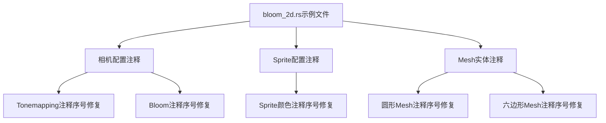

+++
title = "#21276 Fix the index values in the comments"
date = "2025-09-30T00:00:00"
draft = false
template = "pull_request_page.html"
in_search_index = false

[extra]
current_language = "zh-cn"
available_languages = {"en" = { name = "English", url = "/pull_request/bevy/2025-09/pr-21276-en-20250930" }, "zh-cn" = { name = "中文", url = "/pull_request/bevy/2025-09/pr-21276-zh-cn-20250930" }}
labels = ["D-Trivial", "A-Rendering", "C-Examples"]
+++

# Fix the index values in the comments

## Basic Information
- **Title**: Fix the index values in the comments
- **PR Link**: https://github.com/bevyengine/bevy/pull/21276
- **Author**: baozaolaoba-top
- **Status**: MERGED
- **Labels**: D-Trivial, A-Rendering, C-Examples, S-Ready-For-Final-Review
- **Created**: 2025-09-29T15:58:30Z
- **Merged**: 2025-09-30T05:31:04Z
- **Merged By**: alice-i-cecile

## Description Translation
修复注释中的索引值。

## The Story of This Pull Request

这个PR解决了一个在Bevy引擎2D bloom示例中的文档注释问题。问题的本质很简单：示例代码中的注释序号不连续，这可能会给开发者阅读和理解代码带来困扰。

在原始的`bloom_2d.rs`示例文件中，开发者设置了几个关键步骤来配置bloom效果，每个步骤都有编号注释来说明其作用。然而，这些编号存在不一致的问题：

```rust
// 原始代码中的注释序号
Tonemapping::TonyMcMapface, // 2. Using a tonemapper that desaturates to white is recommended
Bloom::default(),           // 3. Enable bloom for the camera
// ...
color: Color::srgb(5.0, 5.0, 5.0), // 4. Put something bright in a dark environment to see the effect
```

这里可以看到注释序号从2直接跳到3，然后又跳到4，缺少了序号1。这种不连续性会让阅读代码的开发者感到困惑，特别是对于新手来说，可能会误以为遗漏了某个步骤。

问题的解决方案很直接：重新调整注释序号使其连续。修改后的代码将序号调整为1、2、3的连续序列：

```rust
// 修复后的注释序号
Tonemapping::TonyMcMapface, // 1. Using a tonemapper that desaturates to white is recommended
Bloom::default(),           // 2. Enable bloom for the camera
// ...
color: Color::srgb(5.0, 5.0, 5.0), // 3. Put something bright in a dark environment to see the effect
```

这个修改影响了多个地方：
- 相机配置中的两个注释（Tonemapping和Bloom）
- Sprite的颜色设置注释
- 两个mesh实体（圆形和六边形）的颜色设置注释

从技术角度来看，这个PR虽然修改很小，但体现了良好的代码维护实践。示例代码的清晰性对于开源项目尤为重要，因为它们是新开发者学习如何使用引擎功能的主要参考。不正确的注释序号虽然不会影响代码执行，但会影响代码的可读性和学习体验。

这个修改也展示了开源项目中常见的文档维护工作。即使是最小的文档问题，只要被发现并修复，就能提升整个项目的代码质量。对于像Bevy这样的游戏引擎项目，示例代码的质量直接影响开发者的上手体验，因此保持示例代码的清晰和准确是很重要的。

## Visual Representation



## Key Files Changed

### `examples/2d/bloom_2d.rs` (+5/-5)

这个文件包含了Bevy引擎中2D bloom效果的示例代码。修改的主要内容是修复注释中的序号，使其保持连续。

**关键修改：**

```rust
// 修改前：
Tonemapping::TonyMcMapface, // 2. Using a tonemapper that desaturates to white is recommended
Bloom::default(),           // 3. Enable bloom for the camera
// ...
color: Color::srgb(5.0, 5.0, 5.0), // 4. Put something bright in a dark environment to see the effect
// ...
// 4. Put something bright in a dark environment to see the effect
// ...
// 4. Put something bright in a dark environment to see the effect

// 修改后：
Tonemapping::TonyMcMapface, // 1. Using a tonemapper that desaturates to white is recommended
Bloom::default(),           // 2. Enable bloom for the camera
// ...
color: Color::srgb(5.0, 5.0, 5.0), // 3. Put something bright in a dark environment to see the effect
// ...
// 3. Put something bright in a dark environment to see the effect
// ...
// 3. Put something bright in a dark environment to see the effect
```

这些修改确保了示例代码中的注释序号从1开始连续递增，提高了代码的可读性和学习体验。

## Further Reading

- [Bevy引擎官方文档](https://bevyengine.org/learn/)
- [Bevy示例代码库](https://github.com/bevyengine/bevy/tree/main/examples)
- [Bloom效果技术说明](https://bevyengine.org/learn/book/next/pbr/bloom/)
- [代码注释最佳实践](https://github.com/bevyengine/bevy/blob/main/CODE_STYLE.md#documentation)

# Full Code Diff
diff --git a/examples/2d/bloom_2d.rs b/examples/2d/bloom_2d.rs
index fd1bc0154765a..c06952bfa4009 100644
--- a/examples/2d/bloom_2d.rs
+++ b/examples/2d/bloom_2d.rs
@@ -26,15 +26,15 @@ fn setup(
             clear_color: ClearColorConfig::Custom(Color::BLACK),
             ..default()
         },
-        Tonemapping::TonyMcMapface, // 2. Using a tonemapper that desaturates to white is recommended
-        Bloom::default(),           // 3. Enable bloom for the camera
+        Tonemapping::TonyMcMapface, // 1. Using a tonemapper that desaturates to white is recommended
+        Bloom::default(),           // 2. Enable bloom for the camera
         DebandDither::Enabled,      // Optional: bloom causes gradients which cause banding
     ));
 
     // Sprite
     commands.spawn(Sprite {
         image: asset_server.load("branding/bevy_bird_dark.png"),
-        color: Color::srgb(5.0, 5.0, 5.0), // 4. Put something bright in a dark environment to see the effect
+        color: Color::srgb(5.0, 5.0, 5.0), // 3. Put something bright in a dark environment to see the effect
         custom_size: Some(Vec2::splat(160.0)),
         ..default()
     });
@@ -42,7 +42,7 @@ fn setup(
     // Circle mesh
     commands.spawn((
         Mesh2d(meshes.add(Circle::new(100.))),
-        // 4. Put something bright in a dark environment to see the effect
+        // 3. Put something bright in a dark environment to see the effect
         MeshMaterial2d(materials.add(Color::srgb(7.5, 0.0, 7.5))),
         Transform::from_translation(Vec3::new(-200., 0., 0.)),
     ));
@@ -50,7 +50,7 @@ fn setup(
     // Hexagon mesh
     commands.spawn((
         Mesh2d(meshes.add(RegularPolygon::new(100., 6))),
-        // 4. Put something bright in a dark environment to see the effect
+        // 3. Put something bright in a dark environment to see the effect
         MeshMaterial2d(materials.add(Color::srgb(6.25, 9.4, 9.1))),
         Transform::from_translation(Vec3::new(200., 0., 0.)),
     ));