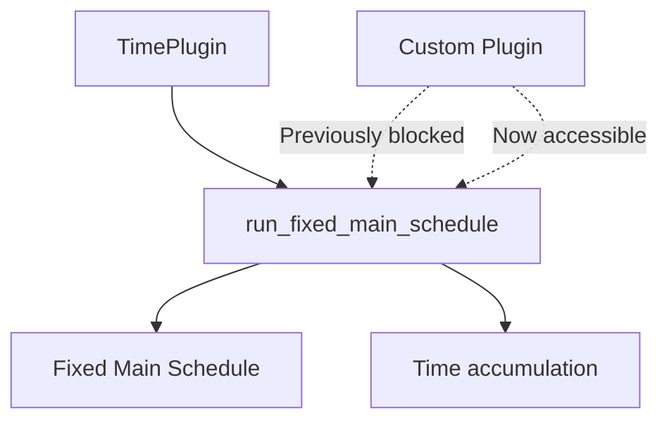

+++
title = "#21277 Make run_fixed_main_schedule public"
date = "2025-09-29T00:00:00"
draft = false
template = "pull_request_page.html"
in_search_index = true

[taxonomies]
list_display = ["show"]

[extra]
current_language = "en"
available_languages = {"en" = { name = "English", url = "/pull_request/bevy/2025-09/pr-21277-en-20250929" }, "zh-cn" = { name = "中文", url = "/pull_request/bevy/2025-09/pr-21277-zh-cn-20250929" }}
labels = ["D-Trivial", "C-Usability", "A-Time"]
+++

# Title
Make run_fixed_main_schedule public

## Basic Information
- **Title**: Make run_fixed_main_schedule public
- **PR Link**: https://github.com/bevyengine/bevy/pull/21277
- **Author**: dubrowgn
- **Status**: MERGED
- **Labels**: D-Trivial, C-Usability, S-Ready-For-Final-Review, A-Time
- **Created**: 2025-09-29T15:59:24Z
- **Merged**: 2025-09-29T16:46:42Z
- **Merged By**: alice-i-cecile

## Description Translation
Those wanting to customize `TimePlugin` cannot do so because `run_fixed_main_schedule` is not public, so make it public.

## Testing

1. Copy/paste `TimePlugin` to consumer application
2. build now succeeds where previously it failed

## The Story of This Pull Request

This PR addresses a straightforward but impactful visibility issue in Bevy's time system. The problem centered around the `run_fixed_main_schedule` function, which was marked as `pub(super)` - meaning it was only accessible within its parent module. This created a practical limitation for developers who needed to customize Bevy's `TimePlugin`.

The core issue was architectural: when developers wanted to modify how the fixed timestep system worked, they couldn't simply extend or customize the existing `TimePlugin` because they couldn't call the `run_fixed_main_schedule` function from their own code. This forced them into workarounds like copying the entire plugin implementation, which is error-prone and creates maintenance overhead.

The solution is minimal and surgical - changing the visibility modifier from `pub(super)` to `pub`. This single-character change transforms the function from an internal implementation detail to a public API that developers can use when building custom time management systems.

From a technical perspective, `run_fixed_main_schedule` serves a critical role in Bevy's fixed timestep system. It handles the accumulation of virtual time deltas and runs the fixed main schedule repeatedly until the accumulated time is consumed. This function is essential for physics simulations, networking, and other systems that require consistent, predictable update intervals regardless of frame rate fluctuations.

The implementation change is technically sound because:
- It doesn't alter the function's behavior, only its accessibility
- The function was already well-tested and stable within Bevy's core
- It follows Rust's principle of making APIs extensible when there's a legitimate use case

The impact of this change is significant for developers building complex applications with Bevy. They can now create custom time management systems that integrate properly with Bevy's scheduling infrastructure without resorting to code duplication. This aligns with Bevy's modular architecture and empowers developers to build sophisticated timing systems for specialized use cases like replay systems, deterministic simulations, or custom game loop implementations.

## Visual Representation



## Key Files Changed

**File: `crates/bevy_time/src/fixed.rs`**

This file contains the core implementation of Bevy's fixed timestep system. The change modifies the visibility of a key system function.

```rust
// Before:
pub(super) fn run_fixed_main_schedule(world: &mut World) {
    let delta = world.resource::<Time<Virtual>>().delta();
    world.resource_mut::<Time<Fixed>>().accumulate(delta);

// After:
pub fn run_fixed_main_schedule(world: &mut World) {
    let delta = world.resource::<Time<Virtual>>().delta();
    world.resource_mut::<Time<Fixed>>().accumulate(delta);
```

The change is minimal but significant - the `pub(super)` visibility modifier is replaced with `pub`, making the function accessible outside its module while preserving all existing functionality. This allows developers to call this function when implementing custom time management systems.

## Further Reading

- [Bevy Time Documentation](https://docs.rs/bevy_time/latest/bevy_time/) - Official documentation for Bevy's time systems
- [Rust Visibility and Privacy](https://doc.rust-lang.org/book/ch07-02-defining-modules-to-control-scope-and-privacy.html) - Understanding Rust's module system and visibility modifiers
- [Bevy Fixed Timestep Guide](https://bevy-cheatbook.github.io/programming/fixed-timestep.html) - Explanation of fixed timestep systems in Bevy
- [Bevy Plugin System](https://bevy-cheatbook.github.io/programming/plugins.html) - How to create and customize Bevy plugins

# Full Code Diff
```diff
diff --git a/crates/bevy_time/src/fixed.rs b/crates/bevy_time/src/fixed.rs
index 66d2585e82cd9..f1c67ea4a0ca9 100644
--- a/crates/bevy_time/src/fixed.rs
+++ b/crates/bevy_time/src/fixed.rs
@@ -236,7 +236,7 @@ impl Default for Fixed {
 /// [`Time<Virtual>`](Virtual) and [`Time::overstep`].
 /// You can order your systems relative to this by using
 /// [`RunFixedMainLoopSystems`](bevy_app::prelude::RunFixedMainLoopSystems).
-pub(super) fn run_fixed_main_schedule(world: &mut World) {
+pub fn run_fixed_main_schedule(world: &mut World) {
     let delta = world.resource::<Time<Virtual>>().delta();
     world.resource_mut::<Time<Fixed>>().accumulate(delta);
 
```