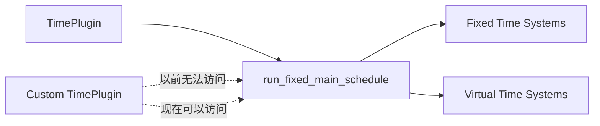

+++
title = "#21277 Make run_fixed_main_schedule public"
date = "2025-09-29T00:00:00"
draft = false
template = "pull_request_page.html"
in_search_index = false

[extra]
current_language = "zh-cn"
available_languages = {"en" = { name = "English", url = "/pull_request/bevy/2025-09/pr-21277-en-20250929" }, "zh-cn" = { name = "中文", url = "/pull_request/bevy/2025-09/pr-21277-zh-cn-20250929" }}
labels = ["D-Trivial", "C-Usability", "A-Time"]
+++

# Title

## Basic Information
- **Title**: Make run_fixed_main_schedule public
- **PR Link**: https://github.com/bevyengine/bevy/pull/21277
- **Author**: dubrowgn
- **Status**: MERGED
- **Labels**: D-Trivial, C-Usability, S-Ready-For-Final-Review, A-Time
- **Created**: 2025-09-29T15:59:24Z
- **Merged**: 2025-09-29T16:46:42Z
- **Merged By**: alice-i-cecile

## Description Translation
那些想要自定义 `TimePlugin` 的开发者无法实现，因为 `run_fixed_main_schedule` 不是公开的，所以将其设为公开。

## 测试

1. 将 `TimePlugin` 复制/粘贴到消费者应用程序中
2. 构建现在成功，而之前会失败

## The Story of This Pull Request

这个PR的核心问题是一个简单的访问控制限制。开发者dubrowgn在尝试自定义Bevy引擎的`TimePlugin`时遇到了障碍，具体来说是无法访问`run_fixed_main_schedule`函数，因为该函数被标记为`pub(super)`，这意味着它只能在当前crate的父模块及其子模块中访问。

从技术角度来看，这是一个典型的API可扩展性问题。当框架或库的核心组件被设计为不可定制时，开发者要么放弃定制需求，要么复制整个实现。dubrowgn选择了后者，但发现即使复制了`TimePlugin`，由于`run_fixed_main_schedule`函数的可见性限制，构建仍然失败。

解决方案非常直接：将函数的可见性从`pub(super)`改为`pub`。这个修改虽然只有一行代码的变化，但解决了开发者定制时间系统的根本障碍。从工程角度看，这是一个低风险、高价值的修改，因为它：
- 不改变任何现有功能逻辑
- 不引入新的依赖或复杂性
- 只是扩展了API的访问权限

在Bevy的架构中，`run_fixed_main_schedule`函数负责运行固定的主调度循环，处理与固定时间步长相关的系统执行。通过将其公开，引擎现在为高级用户提供了更大的灵活性，允许他们构建自定义的时间管理解决方案，同时仍然重用Bevy的核心基础设施。

这个修改体现了良好的API设计原则：在保持核心功能稳定的同时，为高级用例提供扩展点。从合并速度来看（从创建到合并不到一小时），维护团队也认可这是一个合理且安全的改进。

## Visual Representation



## Key Files Changed

**File: `crates/bevy_time/src/fixed.rs` (+1/-1)**

这个文件包含了固定时间步长系统的核心实现。唯一的修改是改变了`run_fixed_main_schedule`函数的可见性修饰符。

```rust
// Before:
pub(super) fn run_fixed_main_schedule(world: &mut World) {
    let delta = world.resource::<Time<Virtual>>().delta();
    world.resource_mut::<Time<Fixed>>().accumulate(delta);

// After:
pub fn run_fixed_main_schedule(world: &mut World) {
    let delta = world.resource::<Time<Virtual>>().delta();
    world.resource_mut::<Time<Fixed>>().accumulate(delta);
```

这个修改允许外部crate访问`run_fixed_main_schedule`函数，使得开发者能够：
1. 创建自定义的`TimePlugin`实现
2. 重用Bevy的固定时间步长调度逻辑
3. 构建更复杂的时间管理系统

## Further Reading

- [Bevy Time System Documentation](https://docs.rs/bevy_time/latest/bevy_time/) - Bevy时间系统的官方文档
- [Rust Visibility and Privacy](https://doc.rust-lang.org/reference/visibility-and-privacy.html) - Rust可见性和隐私规则的详细说明
- [Bevy Plugin System Guide](https://bevy-cheatbook.github.io/programming/plugins.html) - Bevy插件系统的使用指南

# Full Code Diff
diff --git a/crates/bevy_time/src/fixed.rs b/crates/bevy_time/src/fixed.rs
index 66d2585e82cd9..f1c67ea4a0ca9 100644
--- a/crates/bevy_time/src/fixed.rs
+++ b/crates/bevy_time/src/fixed.rs
@@ -236,7 +236,7 @@ impl Default for Fixed {
 /// [`Time<Virtual>`](Virtual) and [`Time::overstep`].
 /// You can order your systems relative to this by using
 /// [`RunFixedMainLoopSystems`](bevy_app::prelude::RunFixedMainLoopSystems).
-pub(super) fn run_fixed_main_schedule(world: &mut World) {
+pub fn run_fixed_main_schedule(world: &mut World) {
     let delta = world.resource::<Time<Virtual>>().delta();
     world.resource_mut::<Time<Fixed>>().accumulate(delta);