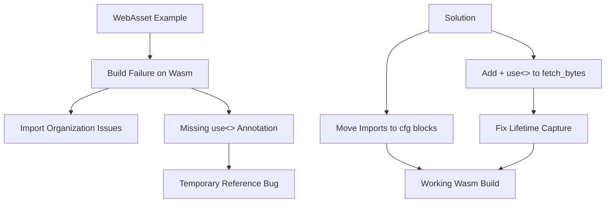

+++
title = "#21283 Fix https / http asset loader on WASM"
date = "2025-09-29T00:00:00"
draft = false
template = "pull_request_page.html"
in_search_index = true

[taxonomies]
list_display = ["show"]

[extra]
current_language = "en"
available_languages = {"en" = { name = "English", url = "/pull_request/bevy/2025-09/pr-21283-en-20250929" }, "zh-cn" = { name = "中文", url = "/pull_request/bevy/2025-09/pr-21283-zh-cn-20250929" }}
labels = ["C-Bug", "C-Examples", "A-Assets", "D-Straightforward"]
+++

# Title

## Basic Information
- **Title**: Fix https / http asset loader on WASM
- **PR Link**: https://github.com/bevyengine/bevy/pull/21283
- **Author**: alice-i-cecile
- **Status**: MERGED
- **Labels**: C-Bug, C-Examples, A-Assets, D-Straightforward, S-Needs-Review
- **Created**: 2025-09-29T20:45:54Z
- **Merged**: 2025-09-29T21:53:12Z
- **Merged By**: mockersf

## Description Translation

# Objective

Our `web_asset` example does not build on Wasm. Ironic.

As reported in #21280, there are a few problems:

1. Imports are broken: one hard error and a few warnings.
2. `HttpWasmAssetReader` needs a `+ use<'>` to conform to the Rust 2024 edition (unreported, but discovered)
3. We're returning a reference to a temporary value, which is ultimately caused by 2

## Solution

1. Move the imports into the correct feature-gated block.
2. Slap some `+ use<'>` on the function definition like the compiler told me to. This fixes the "returning a reference to a temporary value" problem, as we're no longer implicitly capturing.

Fixes #21280.

Special thanks to @kristoff3r for pointing out my mistake!

## Testing

I've tested this PR using `bevy run --features https --example web_asset web` via the bevy_cli. Because of changes to `getrandom`, this was non-trivial to build for web manually.

## The Story of This Pull Request

This PR addresses a critical build failure in Bevy's WebAssembly (Wasm) asset loading system. The core issue was straightforward but had multiple facets: the `web_asset` example, which demonstrates HTTP asset loading in web environments, ironically couldn't build for Wasm targets.

The problem manifested in three specific ways. First, import organization was incorrect, causing compilation errors and warnings due to unused imports in Wasm contexts. Second, the `HttpWasmAssetReader::fetch_bytes` method needed explicit lifetime capture annotations to comply with Rust 2024 edition requirements. Third, this missing annotation was causing a more subtle issue where the function was returning references to temporary values.

The solution involved two targeted fixes. For the import issues, the imports were moved into the appropriate conditional compilation blocks. The `ToOwned` import and `blocking::unblock` were only needed for non-Wasm targets, so they were relocated from the module's top-level imports into the `#[cfg(not(target_arch = "wasm32"))]` block where they're actually used.

The more interesting technical change was in the `fetch_bytes` method signature. The original implementation used `Result<impl Reader, AssetReaderError>` but needed to be updated to `Result<impl Reader + use<>, AssetReaderError>`. This `+ use<>` syntax is a Rust 2024 edition feature that enables explicit lifetime capture in `impl Trait` return types. Without this annotation, the compiler was implicitly capturing lifetimes in a way that led to returning references to temporary values, which is undefined behavior.

The technical insight here is that Rust's async functions that return `impl Trait` need to specify how they capture lifetimes from the function body. The `use<>` annotation tells the compiler that the returned type may capture any lifetime from the function, preventing the implicit capture behavior that was causing the temporary reference issue. This is particularly important in async contexts where the returned future might need to capture references to function parameters or local variables.

The impact of these changes is immediate and practical: the `web_asset` example now builds successfully for Wasm targets, enabling developers to use HTTP/HTTPS asset loading in web deployments. The fixes are minimal and surgical, addressing the root causes without introducing unnecessary complexity or breaking changes.

## Visual Representation



## Key Files Changed

### `crates/bevy_asset/src/io/wasm.rs` (+3/-1)

This file contains the core HTTP asset reading implementation for Wasm targets. The key change was adding the `+ use<>` annotation to fix lifetime capture in async functions.

```rust
// Before:
pub(crate) async fn fetch_bytes(&self, path: PathBuf) -> Result<impl Reader, AssetReaderError> {

// After:
pub(crate) async fn fetch_bytes(
    &self,
    path: PathBuf,
) -> Result<impl Reader + use<>, AssetReaderError> {
```

The `+ use<>` annotation enables explicit lifetime capture, preventing the function from returning references to temporary values.

### `crates/bevy_asset/src/io/web.rs` (+3/-3)

This file handles web-specific asset loading. The changes focused on proper import organization through conditional compilation.

```rust
// Before (top-level imports):
use alloc::{borrow::ToOwned, boxed::Box};
use blocking::unblock;

// After (moved to conditional block):
#[cfg(not(target_arch = "wasm32"))]
async fn get(path: PathBuf) -> Result<Box<dyn Reader>, AssetReaderError> {
    use alloc::{borrow::ToOwned, boxed::Box, vec::Vec};
    use blocking::unblock;
    // ... implementation
}
```

The imports were moved into the `#[cfg(not(target_arch = "wasm32"))]` block because they're only used in non-Wasm contexts, eliminating unused import warnings and errors when building for Wasm targets.

## Further Reading

- [Rust 2024 Edition: `use<>` in return position](https://blog.rust-lang.org/2023/12/28/impl-trait-in-type-alias.html)
- [Bevy Asset System Documentation](https://bevyengine.org/learn/quick-start/assets/)
- [WebAssembly in Bevy](https://bevyengine.org/learn/quick-start/platforms/wasm/)
- [Rust Conditional Compilation](https://doc.rust-lang.org/reference/conditional-compilation.html)

# Full Code Diff
diff --git a/crates/bevy_asset/src/io/wasm.rs b/crates/bevy_asset/src/io/wasm.rs
index 0dd0ca8e0899d..cd8f66bdf415e 100644
--- a/crates/bevy_asset/src/io/wasm.rs
+++ b/crates/bevy_asset/src/io/wasm.rs
@@ -53,7 +53,10 @@ fn js_value_to_err(context: &str) -> impl FnOnce(JsValue) -> std::io::Error + '_
 
 impl HttpWasmAssetReader {
     // Also used by [`WebAssetReader`](crate::web::WebAssetReader)
-    pub(crate) async fn fetch_bytes(&self, path: PathBuf) -> Result<impl Reader, AssetReaderError> {
+    pub(crate) async fn fetch_bytes(
+        &self,
+        path: PathBuf,
+    ) -> Result<impl Reader + use<>, AssetReaderError> {
         // The JS global scope includes a self-reference via a specializing name, which can be used to determine the type of global context available.
         let global: Global = js_sys::global().unchecked_into();
         let promise = if !global.window().is_undefined() {
diff --git a/crates/bevy_asset/src/io/web.rs b/crates/bevy_asset/src/io/web.rs
index 50a261c8ce959..1b079d229a50f 100644
--- a/crates/bevy_asset/src/io/web.rs
+++ b/crates/bevy_asset/src/io/web.rs
@@ -1,10 +1,9 @@
 use crate::io::{AssetReader, AssetReaderError, Reader};
 use crate::io::{AssetSource, PathStream};
 use crate::{AssetApp, AssetPlugin};
-use alloc::{borrow::ToOwned, boxed::Box};
+use alloc::boxed::Box;
 use bevy_app::{App, Plugin};
 use bevy_tasks::ConditionalSendFuture;
-use blocking::unblock;
 use std::path::{Path, PathBuf};
 use tracing::warn;
 
@@ -124,8 +123,9 @@ async fn get<'a>(path: PathBuf) -> Result<Box<dyn Reader>, AssetReaderError> {
 #[cfg(not(target_arch = "wasm32"))]
 async fn get(path: PathBuf) -> Result<Box<dyn Reader>, AssetReaderError> {
     use crate::io::VecReader;
-    use alloc::{boxed::Box, vec::Vec};
+    use alloc::{borrow::ToOwned, boxed::Box, vec::Vec};
     use bevy_platform::sync::LazyLock;
+    use blocking::unblock;
     use std::io::{self, BufReader, Read};
 
     let str_path = path.to_str().ok_or_else(|| {