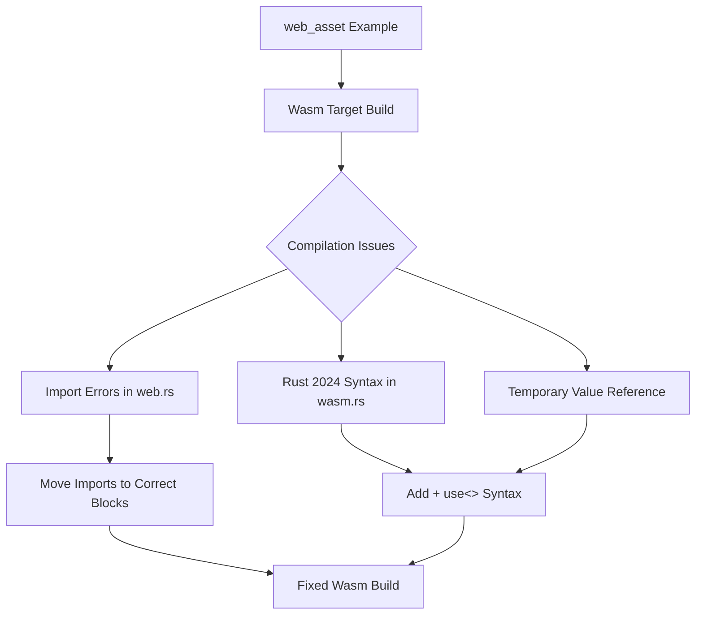

+++
title = "#21283 Fix https / http asset loader on WASM"
date = "2025-09-29T00:00:00"
draft = false
template = "pull_request_page.html"
in_search_index = false

[extra]
current_language = "zh-cn"
available_languages = {"en" = { name = "English", url = "/pull_request/bevy/2025-09/pr-21283-en-20250929" }, "zh-cn" = { name = "中文", url = "/pull_request/bevy/2025-09/pr-21283-zh-cn-20250929" }}
labels = ["C-Bug", "C-Examples", "A-Assets", "D-Straightforward"]
+++

# Title

## Basic Information
- **Title**: Fix https / http asset loader on WASM
- **PR Link**: https://github.com/bevyengine/bevy/pull/21283
- **Author**: alice-i-cecile
- **Status**: MERGED
- **Labels**: C-Bug, C-Examples, A-Assets, D-Straightforward, S-Needs-Review
- **Created**: 2025-09-29T20:45:54Z
- **Merged**: 2025-09-29T21:53:12Z
- **Merged By**: mockersf

## Description Translation
# Objective

我们的 `web_asset` 示例在 Wasm 上无法构建。这很讽刺。

如 #21280 中报告，存在几个问题：

1. 导入被破坏：一个硬错误和几个警告。
2. `HttpWasmAssetReader` 需要一个 `+ use<'>` 来符合 Rust 2024 版本（未报告，但被发现）
3. 我们正在返回对临时值的引用，这最终是由问题 2 引起的

## Solution

1. 将导入移动到正确的 feature-gated 块中。
2. 按照编译器的指示在函数定义上添加 `+ use<'>`。这修复了"返回对临时值的引用"的问题，因为我们不再隐式捕获。

修复 #21280。

特别感谢 @kristoff3r 指出我的错误！

## Testing

我使用 `bevy run --features https --example web_asset web` 通过 bevy_cli 测试了这个 PR。由于 `getrandom` 的更改，手动为 web 构建这个功能并不简单。

## The Story of This Pull Request

这个 PR 始于一个看似矛盾的问题：Bevy 引擎的 `web_asset` 示例在 WebAssembly (Wasm) 目标上无法构建。这是一个典型的开发环境配置问题，需要同时处理 Rust 2024 版本的语法要求和跨平台编译条件。

**问题根源分析**

问题主要集中在两个文件中的三个具体问题上：

1. **导入错误**：在 `web.rs` 中，某些导入语句位于错误的条件编译块中，导致在 Wasm 目标构建时出现未使用导入警告和可能的硬错误。

2. **Rust 2024 版本兼容性**：`wasm.rs` 中的 `fetch_bytes` 函数需要显式声明生命周期捕获，这是 Rust 2024 版本的新要求。

3. **临时值引用**：由于问题 2 未正确处理，函数返回了对临时值的引用，这是一个严重的编译时错误。

**解决方案实施**

对于第一个问题，代码重构涉及将特定的导入语句移动到正确的条件编译块中：

```rust
// File: crates/bevy_asset/src/io/web.rs
// Before:
use alloc::{borrow::ToOwned, boxed::Box};
use blocking::unblock;

// After:
use alloc::boxed::Box;
// ToOwned 和 unblock 被移动到 #[cfg(not(target_arch = "wasm32"))] 块内
```

这种重构确保了只有在非 Wasm 目标上才导入这些依赖，避免了在 Wasm 构建中出现未使用导入警告。

第二个问题的解决方案更加技术性，涉及 Rust 2024 版本的显式生命周期捕获语法：

```rust
// File: crates/bevy_asset/src/io/wasm.rs
// Before:
pub(crate) async fn fetch_bytes(&self, path: PathBuf) -> Result<impl Reader, AssetReaderError> {

// After:
pub(crate) async fn fetch_bytes(
    &self,
    path: PathBuf,
) -> Result<impl Reader + use<>, AssetReaderError> {
```

这里的 `+ use<>` 语法是 Rust 2024 版本的新特性，它显式声明了异步函数应该捕获哪些生命周期。没有这个声明，编译器会报错关于返回对临时值的引用，因为 Rust 无法正确推断生命周期关系。

**技术架构影响**

这些修改虽然看起来很小，但对 Bevy 的跨平台资产加载系统至关重要。`HttpWasmAssetReader` 是 Bevy 在 Web 环境中处理 HTTP/HTTPS 资产加载的核心组件，而 `WebAssetReader` 依赖于相同的 `fetch_bytes` 方法。

修改后的代码确保了：
- 在 Wasm 目标上能够正确编译
- 符合最新的 Rust 版本规范
- 保持跨平台资产加载功能的一致性

**测试挑战**

值得注意的是，测试这个修复并不简单。由于 `getrandom` crate 的变化，手动为 Web 目标构建变得复杂。作者使用了 `bevy_cli` 工具来验证修复，这体现了在现代 Rust 生态系统中测试跨平台功能的实际挑战。

## Visual Representation



## Key Files Changed

### `crates/bevy_asset/src/io/wasm.rs` (+3/-1)
这个文件修复了 Rust 2024 版本的兼容性问题。

```rust
// 修改前:
pub(crate) async fn fetch_bytes(&self, path: PathBuf) -> Result<impl Reader, AssetReaderError> {

// 修改后:
pub(crate) async fn fetch_bytes(
    &self,
    path: PathBuf,
) -> Result<impl Reader + use<>, AssetReaderError> {
```

关键变化是添加了 `+ use<>` 语法，这解决了临时值引用问题并符合 Rust 2024 版本要求。

### `crates/bevy_asset/src/io/web.rs` (+3/-3)
这个文件重构了导入语句的组织结构。

```rust
// 修改前:
use alloc::{borrow::ToOwned, boxed::Box};
use crate::io::{AssetReader, AssetReaderError, Reader};
use blocking::unblock;

// 修改后:
use alloc::boxed::Box;
use crate::io::{AssetReader, AssetReaderError, Reader};
// ToOwned 和 unblock 被移到条件编译块内
```

```rust
// 在 #[cfg(not(target_arch = "wasm32"))] 块内新增:
use alloc::{borrow::ToOwned, vec::Vec};
use blocking::unblock;
```

这些修改确保了只有在非 Wasm 目标上才导入特定的依赖，消除了编译警告和错误。

## Further Reading

- [Rust 2024 Edition Guide](https://doc.rust-lang.org/edition-guide/rust-2024/index.html) - 了解 Rust 2024 版本的新特性
- [Bevy Assets System Documentation](https://bevyengine.org/learn/books/assets/) - Bevy 资产系统的工作原理
- [WebAssembly and Rust](https://rustwasm.github.io/docs/book/) - Rust 在 WebAssembly 上的开发指南
- [Async Rust Lifetimes](https://rust-lang.github.io/async-book/) - 异步 Rust 中的生命周期管理