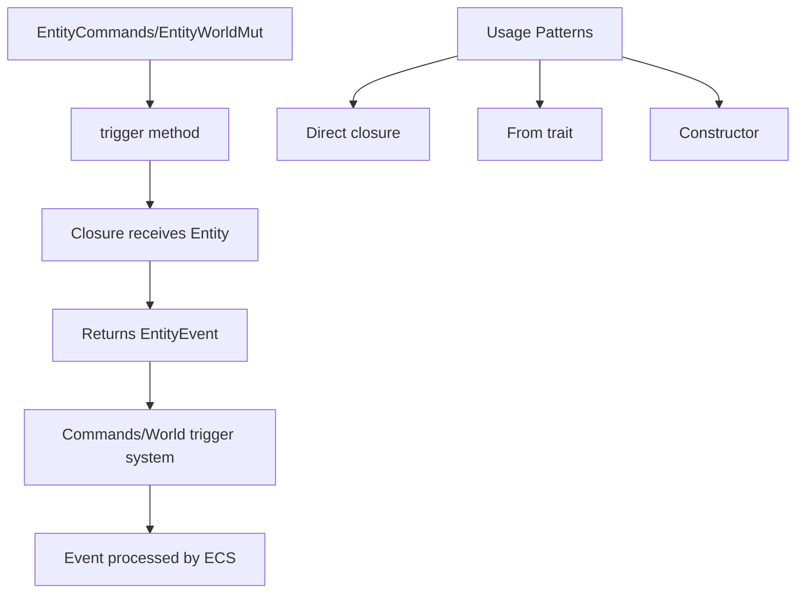

+++
title = "#21284 Add closure-based EntityEvent triggers"
date = "2025-09-30T00:00:00"
draft = false
template = "pull_request_page.html"
in_search_index = true

[taxonomies]
list_display = ["show"]

[extra]
current_language = "en"
available_languages = {"en" = { name = "English", url = "/pull_request/bevy/2025-09/pr-21284-en-20250930" }, "zh-cn" = { name = "中文", url = "/pull_request/bevy/2025-09/pr-21284-zh-cn-20250930" }}
labels = ["A-ECS", "C-Usability"]
+++

# Title
Add closure-based EntityEvent triggers

## Basic Information
- **Title**: Add closure-based EntityEvent triggers
- **PR Link**: https://github.com/bevyengine/bevy/pull/21284
- **Author**: cart
- **Status**: MERGED
- **Labels**: A-ECS, C-Usability, S-Ready-For-Final-Review
- **Created**: 2025-09-29T22:38:38Z
- **Merged**: 2025-09-30T03:31:00Z
- **Merged By**: cart

## Description Translation
# Objective

Some developers would prefer being able to trigger EntityEvents in the old "chained" way.

## Solution

Add support for the following:

```rust
commands.entity(e1).trigger(|entity| Explode { entity })
// alternatively if From<Entity> is implemented
commands.entity(e1).trigger(Explode::from)
// alternatively if it is Explode(Entity)
commands.entity(e1).trigger(Explode)
```

## The Story of This Pull Request

This PR addresses a usability regression in Bevy's EntityEvent system. Previously, developers could trigger events using a chained method call pattern on entity commands, but this functionality was deprecated and removed in favor of a different approach. The community feedback indicated that the old chained pattern was preferred by some developers for its ergonomics and readability.

The core problem was that after the deprecation, triggering an EntityEvent required breaking the method chain and using a separate command. For example, instead of `commands.entity(e1).trigger(event)`, developers had to write:

```rust
let entity = commands.spawn_empty().id();
commands.trigger(Explode { entity });
```

This broke the fluent interface pattern that many developers found intuitive when working with entity commands.

The solution implemented here reintroduces the chained trigger method but with a more flexible closure-based approach. Instead of taking an EntityEvent directly, the new `trigger` method accepts a closure that receives the current entity and returns an EntityEvent. This design provides three flexible usage patterns:

1. **Closure-based**: `commands.entity(e1).trigger(|entity| Explode { entity })`
2. **From trait**: `commands.entity(e1).trigger(Explode::from)` (when `From<Entity>` is implemented)
3. **Constructor**: `commands.entity(e1).trigger(Explode)` (for tuple structs)

The implementation required changes in two key areas of the ECS system. In `EntityCommands`, the previously deprecated trigger method was repurposed with the new closure-based signature. The method now takes a function that maps the current entity to an event, then passes that event to the underlying command buffer.

In `EntityWorldMut`, a similar change was made but with additional consideration for the world scope and trigger context. The implementation uses `world_scope` to ensure proper world access and includes caller location tracking for better error reporting.

The technical approach maintains type safety through generics and trait bounds. The method requires that `E` implements `EntityEvent` and that the trigger type has a default implementation. This ensures compile-time safety while providing the flexibility developers need.

From an architectural perspective, this change enhances the developer experience without compromising the underlying ECS performance or safety. The closure-based approach allows the system to capture the entity context at the call site while maintaining the same execution characteristics as the direct event triggering.

## Visual Representation



## Key Files Changed

### `crates/bevy_ecs/src/system/commands/mod.rs` (+40/-8)

This file contains the main implementation for the closure-based trigger in entity commands. The deprecated trigger method was replaced with a new implementation that accepts a closure.

**Key changes:**
```rust
// Before (deprecated):
#[deprecated(since = "0.17.0", note = "Use Commands::trigger with an EntityEvent instead.")]
pub fn trigger<'t, E: EntityEvent<Trigger<'t>: Default>>(
    &mut self,
    event: impl EntityEvent<Trigger<'t>: Default>,
) -> &mut Self {
    log::warn!("EntityCommands::trigger is deprecated...");
    self.commands.trigger(event);
    self
}

// After:
pub fn trigger<'t, E: EntityEvent<Trigger<'t>: Default>>(
    &mut self,
    event_fn: impl FnOnce(Entity) -> E,
) -> &mut Self {
    let event = (event_fn)(self.entity);
    self.commands.trigger(event);
    self
}
```

The method now includes comprehensive documentation with examples showing the three usage patterns.

### `crates/bevy_ecs/src/world/entity_ref.rs` (+15/-8)

This file implements the same pattern for `EntityWorldMut`, which provides direct world access rather than command-based access.

**Key changes:**
```rust
// Before (deprecated):
#[deprecated(since = "0.17.0", note = "Use World::trigger with an EntityEvent instead.")]
pub fn trigger<'t>(&mut self, event: impl EntityEvent<Trigger<'t>: Default>) -> &mut Self {
    log::warn!("EntityWorldMut::trigger is deprecated...");
    self.world_scope(|world| {
        world.trigger(event);
    });
    self
}

// After:
pub fn trigger<'t, E: EntityEvent<Trigger<'t>: Default>>(
    &mut self,
    event_fn: impl FnOnce(Entity) -> E,
) -> &mut Self {
    let mut event = (event_fn)(self.entity);
    let caller = MaybeLocation::caller();
    self.world_scope(|world| {
        world.trigger_ref_with_caller(
            &mut event,
            &mut <E::Trigger<'_> as Default>::default(),
            caller,
        );
    });
    self
}
```

The EntityWorldMut implementation is more complex because it needs to handle world scoping and includes additional context for error reporting.

## Further Reading

- [Bevy Entity Events Documentation](https://bevyengine.org/learn/quick-start/ecs/entity-events/)
- [Rust Closures and Fn Traits](https://doc.rust-lang.org/book/ch13-01-closures.html)
- [Method Chaining Patterns in Rust](https://doc.rust-lang.org/1.0.0/style/ownership/builders.html)

# Full Code Diff
```diff
diff --git a/crates/bevy_ecs/src/system/commands/mod.rs b/crates/bevy_ecs/src/system/commands/mod.rs
index 8b9b8197154af..35afc7a96a3ac 100644
--- a/crates/bevy_ecs/src/system/commands/mod.rs
+++ b/crates/bevy_ecs/src/system/commands/mod.rs
@@ -2259,17 +2259,49 @@ impl<'a> EntityCommands<'a> {
         self.queue(entity_command::move_components::<B>(target))
     }
 
-    /// Deprecated. Use [`Commands::trigger`] instead.
+    /// Passes the current entity into the given function, and triggers the [`EntityEvent`] returned by that function.
+    ///
+    /// # Example
+    ///
+    /// A surprising number of functions meet the trait bounds for `event_fn`:
+    ///
+    /// ```rust
+    /// # use bevy_ecs::prelude::*;
+    ///
+    /// #[derive(EntityEvent)]
+    /// struct Explode(Entity);
+    ///
+    /// impl From<Entity> for Explode {
+    ///    fn from(entity: Entity) -> Self {
+    ///       Explode(entity)
+    ///    }
+    /// }
+    ///
+    ///
+    /// fn trigger_via_constructor(mut commands: Commands) {
+    ///     // The fact that `Epxlode` is a single-field tuple struct
+    ///     // ensures that `Explode(entity)` is a function that generates
+    ///     // an EntityEvent, meeting the trait bounds for `event_fn`.
+    ///     commands.spawn_empty().trigger(Explode);
+    ///
+    /// }
+    ///
+    ///
+    /// fn trigger_via_from_trait(mut commands: Commands) {
+    ///     // This variant also works for events like `struct Explode { entity: Entity }`
+    ///     commands.spawn_empty().trigger(Explode::from);
+    /// }
+    ///
+    /// fn trigger_via_closure(mut commands: Commands) {
+    ///     commands.spawn_empty().trigger(|entity| Explode(entity));
+    /// }
+    /// ```
     #[track_caller]
-    #[deprecated(
-        since = "0.17.0",
-        note = "Use Commands::trigger with an EntityEvent instead."
-    )]
-    pub fn trigger<'t, E: EntityEvent>(
+    pub fn trigger<'t, E: EntityEvent<Trigger<'t>: Default>>(
         &mut self,
-        event: impl EntityEvent<Trigger<'t>: Default>,
+        event_fn: impl FnOnce(Entity) -> E,
     ) -> &mut Self {
-        log::warn!("EntityCommands::trigger is deprecated and no longer triggers the event for the current EntityCommands entity. Use Commands::trigger instead with an EntityEvent.");
+        let event = (event_fn)(self.entity);
         self.commands.trigger(event);
         self
     }
diff --git a/crates/bevy_ecs/src/world/entity_ref.rs b/crates/bevy_ecs/src/world/entity_ref.rs
index f19a587d07d9b..2c1f6118ba48e 100644
--- a/crates/bevy_ecs/src/world/entity_ref.rs
+++ b/crates/bevy_ecs/src/world/entity_ref.rs
@@ -3165,16 +3165,23 @@ impl<'w> EntityWorldMut<'w> {
         })
     }
 
-    /// Deprecated. Use [`World::trigger`] instead.
+    /// Passes the current entity into the given function, and triggers the [`EntityEvent`] returned by that function.
+    /// See [`EntityCommands::trigger`] for usage examples
+    ///
+    /// [`EntityCommands::trigger`]: crate::system::EntityCommands::trigger
     #[track_caller]
-    #[deprecated(
-        since = "0.17.0",
-        note = "Use World::trigger with an EntityEvent instead."
-    )]
-    pub fn trigger<'t>(&mut self, event: impl EntityEvent<Trigger<'t>: Default>) -> &mut Self {
-        log::warn!("EntityWorldMut::trigger is deprecated and no longer triggers the event for the current EntityWorldMut entity. Use World::trigger instead with an EntityEvent.");
+    pub fn trigger<'t, E: EntityEvent<Trigger<'t>: Default>>(
+        &mut self,
+        event_fn: impl FnOnce(Entity) -> E,
+    ) -> &mut Self {
+        let mut event = (event_fn)(self.entity);
+        let caller = MaybeLocation::caller();
         self.world_scope(|world| {
-            world.trigger(event);
+            world.trigger_ref_with_caller(
+                &mut event,
+                &mut <E::Trigger<'_> as Default>::default(),
+                caller,
+            );
         });
         self
     }
```