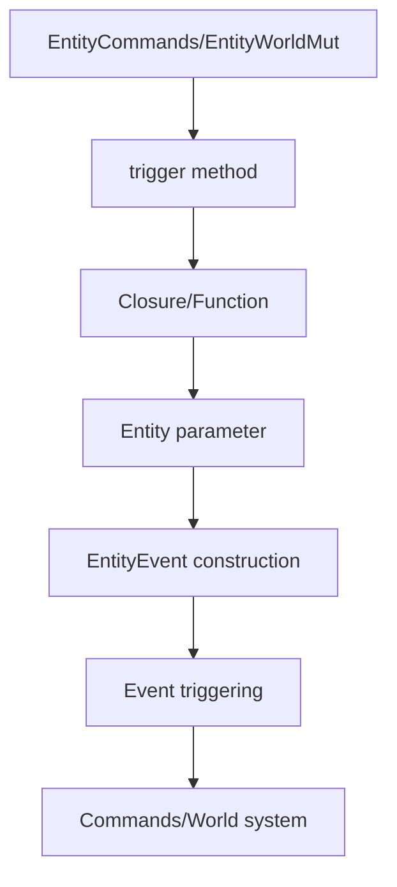

+++
title = "#21284 Add closure-based EntityEvent triggers"
date = "2025-09-30T00:00:00"
draft = false
template = "pull_request_page.html"
in_search_index = false

[extra]
current_language = "zh-cn"
available_languages = {"en" = { name = "English", url = "/pull_request/bevy/2025-09/pr-21284-en-20250930" }, "zh-cn" = { name = "中文", url = "/pull_request/bevy/2025-09/pr-21284-zh-cn-20250930" }}
labels = ["A-ECS", "C-Usability"]
+++

# Add closure-based EntityEvent triggers

## Basic Information
- **Title**: Add closure-based EntityEvent triggers
- **PR Link**: https://github.com/bevyengine/bevy/pull/21284
- **Author**: cart
- **Status**: MERGED
- **Labels**: A-ECS, C-Usability, S-Ready-For-Final-Review
- **Created**: 2025-09-29T22:38:38Z
- **Merged**: 2025-09-30T03:31:00Z
- **Merged By**: cart

## Description Translation
# Objective

一些开发者更倾向于使用旧的"链式"方式来触发 EntityEvents。

## Solution

添加对以下用法的支持：

```rust
commands.entity(e1).trigger(|entity| Explode { entity })
// 或者如果实现了 From<Entity>
commands.entity(e1).trigger(Explode::from)
// 或者如果是 Explode(Entity)
commands.entity(e1).trigger(Explode)
```

## The Story of This Pull Request

这个PR解决了一个API设计问题：开发者希望在EntityCommands和EntityWorldMut中能够更方便地触发EntityEvents。之前的方法已经被废弃，需要寻找新的解决方案。

问题的核心在于，开发者希望能够自然地使用当前实体来构造事件，而不需要显式地传递实体ID。旧的API被废弃后，开发者需要手动构造事件，这增加了代码的复杂性和冗余。

解决方案是重新设计`trigger`方法，使其接受一个闭包函数。这个闭包接收当前实体作为参数，并返回一个EntityEvent。这样设计有几个关键优势：

1. **类型安全**：通过泛型约束确保返回类型是有效的EntityEvent
2. **灵活性**：支持多种构造方式（闭包、From trait、构造函数）
3. **向后兼容**：重新利用了之前被废弃的方法签名

在EntityCommands的实现中，可以看到新的方法签名：

```rust
pub fn trigger<'t, E: EntityEvent<Trigger<'t>: Default>>(
    &mut self,
    event_fn: impl FnOnce(Entity) -> E,
) -> &mut Self {
    let event = (event_fn)(self.entity);
    self.commands.trigger(event);
    self
}
```

这里的关键设计决策是使用`FnOnce(Entity) -> E`作为参数类型，这允许开发者传递任何能够从Entity生成EntityEvent的函数或闭包。方法内部首先调用闭包生成事件，然后通过commands系统触发该事件。

EntityWorldMut中的实现类似，但需要处理world scope的问题：

```rust
pub fn trigger<'t, E: EntityEvent<Trigger<'t>: Default>>(
    &mut self,
    event_fn: impl FnOnce(Entity) -> E,
) -> &mut Self {
    let mut event = (event_fn)(self.entity);
    let caller = MaybeLocation::caller();
    self.world_scope(|world| {
        world.trigger_ref_with_caller(
            &mut event,
            &mut <E::Trigger<'_> as Default>::default(),
            caller,
        );
    });
    self
}
```

这个实现展示了Bevy ECS系统的几个重要特性：
- `world_scope`用于在当前实体的上下文中执行操作
- `trigger_ref_with_caller`提供了带调用者信息的触发机制
- 泛型约束`E: EntityEvent<Trigger<'t>: Default>`确保事件类型具有默认的触发器

从工程角度看，这个解决方案体现了几个重要的设计模式：
1. **策略模式**：通过闭包参数允许不同的构造策略
2. **泛型编程**：利用Rust的泛型系统保证类型安全
3. **流畅接口**：返回`&mut Self`支持方法链式调用

这个改变对代码库的影响是积极的：它恢复了开发者熟悉的编程模式，同时保持了类型安全和性能。新的API更加符合人体工程学，减少了样板代码，提高了开发效率。

## Visual Representation



## Key Files Changed

### `crates/bevy_ecs/src/system/commands/mod.rs` (+40/-8)

这个文件修改了EntityCommands的trigger方法，从废弃状态重新设计为接受闭包的新实现。

**关键修改：**
```rust
// 之前（已废弃）：
#[deprecated(since = "0.17.0", note = "Use Commands::trigger with an EntityEvent instead.")]
pub fn trigger<'t, E: EntityEvent>(
    &mut self,
    event: impl EntityEvent<Trigger<'t>: Default>,
) -> &mut Self {
    log::warn!("EntityCommands::trigger is deprecated...");
    self.commands.trigger(event);
    self
}

// 之后：
pub fn trigger<'t, E: EntityEvent<Trigger<'t>: Default>>(
    &mut self,
    event_fn: impl FnOnce(Entity) -> E,
) -> &mut Self {
    let event = (event_fn)(self.entity);
    self.commands.trigger(event);
    self
}
```

### `crates/bevy_ecs/src/world/entity_ref.rs` (+15/-8)

这个文件修改了EntityWorldMut的trigger方法，采用了类似的设计模式。

**关键修改：**
```rust
// 之前（已废弃）：
#[deprecated(since = "0.17.0", note = "Use World::trigger with an EntityEvent instead.")]
pub fn trigger<'t>(&mut self, event: impl EntityEvent<Trigger<'t>: Default>) -> &mut Self {
    log::warn!("EntityWorldMut::trigger is deprecated...");
    self.world_scope(|world| {
        world.trigger(event);
    });
    self
}

// 之后：
pub fn trigger<'t, E: EntityEvent<Trigger<'t>: Default>>(
    &mut self,
    event_fn: impl FnOnce(Entity) -> E,
) -> &mut Self {
    let mut event = (event_fn)(self.entity);
    let caller = MaybeLocation::caller();
    self.world_scope(|world| {
        world.trigger_ref_with_caller(
            &mut event,
            &mut <E::Trigger<'_> as Default>::default(),
            caller,
        );
    });
    self
}
```

## Further Reading

- [Bevy ECS Guide](https://bevyengine.org/learn/quick-start/ecs/)
- [Rust Closure Documentation](https://doc.rust-lang.org/book/ch13-01-closures.html)
- [Entity Events in Bevy](https://bevyengine.org/news/bevy-0-17/#entity-events)