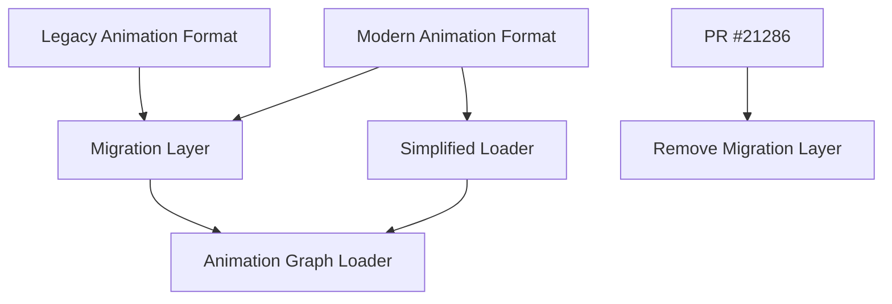

+++
title = "#21286 Delete animation graph migration code."
date = "2025-09-30T00:00:00"
draft = false
template = "pull_request_page.html"
in_search_index = true

[taxonomies]
list_display = ["show"]

[extra]
current_language = "en"
available_languages = {"en" = { name = "English", url = "/pull_request/bevy/2025-09/pr-21286-en-20250930" }, "zh-cn" = { name = "中文", url = "/pull_request/bevy/2025-09/pr-21286-zh-cn-20250930" }}
labels = ["D-Trivial", "C-Code-Quality", "A-Animation"]
+++

# Title
Delete animation graph migration code

## Basic Information
- **Title**: Delete animation graph migration code.
- **PR Link**: https://github.com/bevyengine/bevy/pull/21286
- **Author**: andriyDev
- **Status**: MERGED
- **Labels**: D-Trivial, C-Code-Quality, A-Animation, S-Needs-Review
- **Created**: 2025-09-29T23:28:51Z
- **Merged**: 2025-09-30T01:17:03Z
- **Merged By**: james7132

## Description Translation
# Objective

- Finish the migration from #19615.

## Solution

- Delete all the serialization shenanigans that allowed loading both old and new animation graphs.

## Testing

- Ran the `animation_graph` example and it works without changing anything.

## The Story of This Pull Request

This PR represents a clean-up operation in the Bevy animation system, specifically targeting migration code that had served its purpose and was ready for removal. The changes follow a common pattern in software development where temporary compatibility layers are introduced during major refactors, then removed once the migration period has ended.

The core issue was that PR #19615 had introduced a new serialization format for animation graphs, but needed to maintain backward compatibility with the old format during the transition period. This required maintaining dual code paths - one for the modern format and one for the legacy format. The migration code acted as a bridge, allowing systems to load both old and new animation graph formats while users updated their assets.

The implementation used a clever serde pattern with untagged enums to handle the dual format loading:

```rust
#[derive(Serialize, Deserialize)]
#[serde(untagged)]
pub enum MigrationSerializedAnimationClip {
    Modern(AssetPath<'static>),
    Legacy(SerializedAnimationClip),
}
```

This approach allowed the system to attempt deserialization using the modern format first, then fall back to the legacy format if that failed. However, this came with technical debt - the code was more complex, included warning mechanisms for deprecated usage, and required maintaining types that were no longer part of the core design.

The removal process was straightforward but significant. The developer eliminated the entire migration infrastructure, including:
- The `MigrationSerializedAnimationClip` enum that handled dual-format deserialization
- The legacy `SerializedAnimationClip` type that supported asset ID-based references
- The warning system that alerted users about legacy format usage
- The complex match logic in the asset loader that handled both formats

The asset loading logic was simplified from a multi-branch approach to a direct path-based loading:

```rust
// Before: Complex migration logic
SerializedAnimationNodeType::Clip(ref clip) => match clip {
    MigrationSerializedAnimationClip::Modern(path) => {
        AnimationNodeType::Clip(load_context.load(path.clone()))
    }
    MigrationSerializedAnimationClip::Legacy(SerializedAnimationClip::AssetPath(path)) => {
        // Warning logic and fallback loading
        AnimationNodeType::Clip(load_context.load(path.clone()))
    }
    // ... more legacy cases
}

// After: Direct loading
SerializedAnimationNodeType::Clip(ref path) => {
    AnimationNodeType::Clip(load_context.load(path.clone()))
}
```

This simplification reduces the codebase by approximately 55 lines while making the animation graph loading more maintainable and less error-prone. The change demonstrates a common pattern in software engineering where temporary migration code is intentionally designed to be removable once its purpose is served.

From an architectural perspective, this change solidifies the animation system's commitment to asset path-based references over asset ID-based references, which aligns with Bevy's overall asset management strategy. Asset paths provide more stable references that survive asset reimports and ID changes.

The testing approach was pragmatic - running the existing `animation_graph` example verified that the core functionality remained intact without the migration layer. This demonstrates confidence that the migration period had successfully completed and all relevant assets had been updated to the new format.

## Visual Representation



## Key Files Changed

### `crates/bevy_animation/src/graph.rs` (+5/-60)

This file contained the core migration logic that was removed. The changes focused on eliminating the temporary compatibility layer between old and new animation graph formats.

**Key modifications:**

1. **Removed migration enum types:**
```rust
// Before - Removed types:
pub enum MigrationSerializedAnimationClip {
    Modern(AssetPath<'static>),
    Legacy(SerializedAnimationClip),
}

pub enum SerializedAnimationClip {
    AssetPath(AssetPath<'static>),
    AssetId(AssetId<AnimationClip>),
}
```

2. **Simplified serialized node type:**
```rust
// Before:
pub enum SerializedAnimationNodeType {
    Clip(MigrationSerializedAnimationClip),
    // ...
}

// After:
pub enum SerializedAnimationNodeType {
    Clip(AssetPath<'static>),
    // ...
}
```

3. **Streamlined asset loading logic:**
```rust
// Before - Complex migration handling:
match serialized_node.node_type {
    SerializedAnimationNodeType::Clip(ref clip) => match clip {
        MigrationSerializedAnimationClip::Modern(path) => {
            AnimationNodeType::Clip(load_context.load(path.clone()))
        }
        MigrationSerializedAnimationClip::Legacy(SerializedAnimationClip::AssetPath(path)) => {
            // Warning logic and fallback
            AnimationNodeType::Clip(load_context.load(path.clone()))
        }
        // More legacy cases...
    },
    // ...
}

// After - Direct loading:
match serialized_node.node_type {
    SerializedAnimationNodeType::Clip(ref path) => {
        AnimationNodeType::Clip(load_context.load(path.clone()))
    }
    // ...
}
```

These changes directly support the PR's objective by removing the migration infrastructure while maintaining the core animation graph functionality.

## Further Reading

- [PR #19615](https://github.com/bevyengine/bevy/pull/19615) - The original migration PR that introduced the now-removed compatibility layer
- [Bevy Animation System Documentation](https://bevyengine.org/learn/books/0.13/animation/) - Official documentation on Bevy's animation system
- [Serde Untagged Enums](https://serde.rs/enum-representations.html#untagged) - Documentation on the serde pattern used in the migration code
- [Asset System Migration Patterns](https://bevyengine.org/learn/migration-guides/0.12-0.13/) - Examples of similar migration patterns in Bevy's history

# Full Code Diff
```diff
diff --git a/crates/bevy_animation/src/graph.rs b/crates/bevy_animation/src/graph.rs
index 159e689ccf26c..e101e11209a2b 100644
--- a/crates/bevy_animation/src/graph.rs
+++ b/crates/bevy_animation/src/graph.rs
@@ -29,7 +29,6 @@ use ron::de::SpannedError;
 use serde::{Deserialize, Serialize};
 use smallvec::SmallVec;
 use thiserror::Error;
-use tracing::warn;
 
 use crate::{AnimationClip, AnimationTargetId};
 
@@ -408,42 +407,13 @@ pub struct SerializedAnimationGraphNode {
 #[derive(Serialize, Deserialize)]
 pub enum SerializedAnimationNodeType {
     /// Corresponds to [`AnimationNodeType::Clip`].
-    Clip(MigrationSerializedAnimationClip),
+    Clip(AssetPath<'static>),
     /// Corresponds to [`AnimationNodeType::Blend`].
     Blend,
     /// Corresponds to [`AnimationNodeType::Add`].
     Add,
 }
 
-/// A type to facilitate migration from the legacy format of [`SerializedAnimationGraph`] to the
-/// new format.
-///
-/// By using untagged serde deserialization, we can try to deserialize the modern form, then
-/// fallback to the legacy form. Users must migrate to the modern form by Bevy 0.18.
-// TODO: Delete this after Bevy 0.17.
-#[derive(Serialize, Deserialize)]
-#[serde(untagged)]
-pub enum MigrationSerializedAnimationClip {
-    /// This is the new type of this field.
-    Modern(AssetPath<'static>),
-    /// This is the legacy type of this field. Users must migrate away from this.
-    #[serde(skip_serializing)]
-    Legacy(SerializedAnimationClip),
-}
-
-/// The legacy form of serialized animation clips. This allows raw asset IDs to be deserialized.
-// TODO: Delete this after Bevy 0.17.
-#[derive(Deserialize)]
-pub enum SerializedAnimationClip {
-    /// Records an asset path.
-    AssetPath(AssetPath<'static>),
-    /// The fallback that records an asset ID.
-    ///
-    /// Because asset IDs can change, this should not be relied upon. Prefer to
-    /// use asset paths where possible.
-    AssetId(AssetId<AnimationClip>),
-}
-
 /// The type of an animation mask bitfield.
 ///
 /// Bit N corresponds to mask group N.
@@ -801,35 +771,12 @@ impl AssetLoader for AnimationGraphAssetLoader {
             serialized_animation_graph.graph.edge_count(),
         );
 
-        let mut already_warned = false;
         for serialized_node in serialized_animation_graph.graph.node_weights() {
             animation_graph.add_node(AnimationGraphNode {
                 node_type: match serialized_node.node_type {
-                    SerializedAnimationNodeType::Clip(ref clip) => match clip {
-                        MigrationSerializedAnimationClip::Modern(path) => {
-                            AnimationNodeType::Clip(load_context.load(path.clone()))
-                        }
-                        MigrationSerializedAnimationClip::Legacy(
-                            SerializedAnimationClip::AssetPath(path),
-                        ) => {
-                            if !already_warned {
-                                let path = load_context.asset_path();
-                                warn!(
-                                    "Loaded an AnimationGraph asset at \"{path}\" which contains a \
-                                    legacy-style SerializedAnimationClip. Please re-save the asset \
-                                    using AnimationGraph::save to automatically migrate to the new \
-                                    format"
-                                );
-                                already_warned = true;
-                            }
-                            AnimationNodeType::Clip(load_context.load(path.clone()))
-                        }
-                        MigrationSerializedAnimationClip::Legacy(
-                            SerializedAnimationClip::AssetId(_),
-                        ) => {
-                            return Err(AnimationGraphLoadError::GraphContainsLegacyAssetId);
-                        }
-                    },
+                    SerializedAnimationNodeType::Clip(ref path) => {
+                        AnimationNodeType::Clip(load_context.load(path.clone()))
+                    }
                     SerializedAnimationNodeType::Blend => AnimationNodeType::Blend,
                     SerializedAnimationNodeType::Add => AnimationNodeType::Add,
                 },
@@ -870,9 +817,7 @@ impl TryFrom<AnimationGraph> for SerializedAnimationGraph {
                 mask: node.mask,
                 node_type: match node.node_type {
                     AnimationNodeType::Clip(ref clip) => match clip.path() {
-                        Some(path) => SerializedAnimationNodeType::Clip(
-                            MigrationSerializedAnimationClip::Modern(path.clone()),
-                        ),
+                        Some(path) => SerializedAnimationNodeType::Clip(path.clone()),
                         None => return Err(NonPathHandleError),
                     },
                     AnimationNodeType::Blend => SerializedAnimationNodeType::Blend,
```