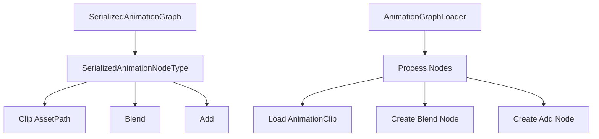

+++
title = "#21286 Delete animation graph migration code."
date = "2025-09-30T00:00:00"
draft = false
template = "pull_request_page.html"
in_search_index = false

[extra]
current_language = "zh-cn"
available_languages = {"en" = { name = "English", url = "/pull_request/bevy/2025-09/pr-21286-en-20250930" }, "zh-cn" = { name = "中文", url = "/pull_request/bevy/2025-09/pr-21286-zh-cn-20250930" }}
labels = ["D-Trivial", "C-Code-Quality", "A-Animation"]
+++

# Title
删除动画图迁移代码

## Basic Information
- **Title**: Delete animation graph migration code.
- **PR Link**: https://github.com/bevyengine/bevy/pull/21286
- **Author**: andriyDev
- **Status**: MERGED
- **Labels**: D-Trivial, C-Code-Quality, A-Animation, S-Needs-Review
- **Created**: 2025-09-29T23:28:51Z
- **Merged**: 2025-09-30T01:17:03Z
- **Merged By**: james7132

## Description Translation
# Objective

- 完成 #19615 的迁移工作。

## Solution

- 删除所有允许同时加载新旧动画图的序列化相关代码。

## Testing

- 运行了 `animation_graph` 示例，无需任何更改即可正常工作。

## The Story of This Pull Request

这个PR的核心任务是清理动画系统中的一个技术债务 - 移除之前版本遗留的向后兼容代码。在软件工程中，当API或数据格式发生重大变更时，通常需要在一段时间内同时支持新旧两种格式，给用户足够的时间迁移。这个PR标志着Bevy动画系统从旧格式向新格式的过渡期已经结束。

问题的根源在于PR #19615引入的动画图序列化格式变更。在那个PR中，动画clip的引用方式从直接使用Asset ID改为使用Asset Path。为了确保向后兼容，当时保留了同时处理新旧两种格式的能力。现在，经过一个完整的发布周期（从Bevy 0.17开始），是时候移除这些临时性代码了。

解决方案直接明了：删除所有与迁移相关的代码结构。这包括：

1. `MigrationSerializedAnimationClip`枚举 - 这个设计模式在迁移期间很常见，它允许通过serde的untagged反序列化机制自动识别新旧格式
2. `SerializedAnimationClip`枚举 - 旧格式支持直接使用Asset ID或Asset Path
3. 相关的警告逻辑 - 之前当检测到旧格式时会输出警告日志

在实现层面，主要的变化集中在`graph.rs`文件中。最显著的是在`AssetLoader`实现中，原来复杂的模式匹配逻辑被简化了：

```rust
// 之前需要处理两种格式：
match serialized_node.node_type {
    SerializedAnimationNodeType::Clip(ref clip) => match clip {
        MigrationSerializedAnimationClip::Modern(path) => {
            AnimationNodeType::Clip(load_context.load(path.clone()))
        }
        MigrationSerializedAnimationClip::Legacy(
            SerializedAnimationClip::AssetPath(path),
        ) => {
            // 输出警告并处理旧格式
        }
        MigrationSerializedAnimationClip::Legacy(
            SerializedAnimationClip::AssetId(_),
        ) => {
            return Err(AnimationGraphLoadError::GraphContainsLegacyAssetId);
        }
    },
    // ...
}

// 现在简化为：
match serialized_node.node_type {
    SerializedAnimationNodeType::Clip(ref path) => {
        AnimationNodeType::Clip(load_context.load(path.clone()))
    }
    // ...
}
```

同样，在序列化方向（`TryFrom<AnimationGraph>`实现）也做了相应的简化，不再需要包装在迁移枚举中。

从技术角度看，这种清理工作有几个重要价值：
- **减少代码复杂度**：移除了60行代码，只增加了5行，净减少55行
- **消除运行时开销**：不再需要检查格式版本和输出警告
- **提高可维护性**：代码逻辑更加清晰直接
- **遵循语义版本控制**：在合适的时机清理过时功能

测试策略也很务实 - 运行现有的`animation_graph`示例验证功能正常，这表明这种清理不会破坏现有功能，只是移除了不再需要的兼容层。

## Visual Representation



## Key Files Changed

### `crates/bevy_animation/src/graph.rs` (+5/-60)

这个文件包含了所有的核心变更，主要涉及移除迁移相关的数据结构和处理逻辑。

**主要变更：**

1. **移除迁移枚举类型**：
```rust
// 删除的代码：
pub enum MigrationSerializedAnimationClip {
    Modern(AssetPath<'static>),
    Legacy(SerializedAnimationClip),
}

pub enum SerializedAnimationClip {
    AssetPath(AssetPath<'static>),
    AssetId(AssetId<AnimationClip>),
}
```

2. **简化节点类型定义**：
```rust
// 之前：
pub enum SerializedAnimationNodeType {
    Clip(MigrationSerializedAnimationClip),
    // ...
}

// 之后：
pub enum SerializedAnimationNodeType {
    Clip(AssetPath<'static>),
    // ...
}
```

3. **简化资源加载逻辑**：
```rust
// 之前复杂的多层级匹配：
match serialized_node.node_type {
    SerializedAnimationNodeType::Clip(ref clip) => match clip {
        MigrationSerializedAnimationClip::Modern(path) => { /* ... */ }
        MigrationSerializedAnimationClip::Legacy(SerializedAnimationClip::AssetPath(path)) => { /* ... */ }
        MigrationSerializedAnimationClip::Legacy(SerializedAnimationClip::AssetId(_)) => { /* ... */ }
    },
    // ...
}

// 简化为：
match serialized_node.node_type {
    SerializedAnimationNodeType::Clip(ref path) => {
        AnimationNodeType::Clip(load_context.load(path.clone()))
    }
    // ...
}
```

这些变更直接支持PR的目标 - 完成动画图格式的迁移，移除临时性的兼容代码，使代码库更加简洁和可维护。

## Further Reading

- [PR #19615](https://github.com/bevyengine/bevy/pull/19615) - 原始的动画图格式迁移PR
- [Serde Untagged Enums](https://serde.rs/enum-representations.html#untagged) - 用于迁移的反序列化技术文档
- [Bevy Asset System](https://bevyengine.org/learn/quick-start/assets/) - Bevy资源系统的工作原理
- [Semantic Versioning](https://semver.org/) - 语义版本控制的最佳实践

# Full Code Diff
```diff
diff --git a/crates/bevy_animation/src/graph.rs b/crates/bevy_animation/src/graph.rs
index 159e689ccf26c..e101e11209a2b 100644
--- a/crates/bevy_animation/src/graph.rs
+++ b/crates/bevy_animation/src/graph.rs
@@ -29,7 +29,6 @@ use ron::de::SpannedError;
 use serde::{Deserialize, Serialize};
 use smallvec::SmallVec;
 use thiserror::Error;
-use tracing::warn;
 
 use crate::{AnimationClip, AnimationTargetId};
 
@@ -408,42 +407,13 @@ pub struct SerializedAnimationGraphNode {
 #[derive(Serialize, Deserialize)]
 pub enum SerializedAnimationNodeType {
     /// Corresponds to [`AnimationNodeType::Clip`].
-    Clip(MigrationSerializedAnimationClip),
+    Clip(AssetPath<'static>),
     /// Corresponds to [`AnimationNodeType::Blend`].
     Blend,
     /// Corresponds to [`AnimationNodeType::Add`].
     Add,
 }
 
-/// A type to facilitate migration from the legacy format of [`SerializedAnimationGraph`] to the
-/// new format.
-///
-/// By using untagged serde deserialization, we can try to deserialize the modern form, then
-/// fallback to the legacy form. Users must migrate to the modern form by Bevy 0.18.
-// TODO: Delete this after Bevy 0.17.
-#[derive(Serialize, Deserialize)]
-#[serde(untagged)]
-pub enum MigrationSerializedAnimationClip {
-    /// This is the new type of this field.
-    Modern(AssetPath<'static>),
-    /// This is the legacy type of this field. Users must migrate away from this.
-    #[serde(skip_serializing)]
-    Legacy(SerializedAnimationClip),
-}
-
-/// The legacy form of serialized animation clips. This allows raw asset IDs to be deserialized.
-// TODO: Delete this after Bevy 0.17.
-#[derive(Deserialize)]
-pub enum SerializedAnimationClip {
-    /// Records an asset path.
-    AssetPath(AssetPath<'static>),
-    /// The fallback that records an asset ID.
-    ///
-    /// Because asset IDs can change, this should not be relied upon. Prefer to
-    /// use asset paths where possible.
-    AssetId(AssetId<AnimationClip>),
-}
-
 /// The type of an animation mask bitfield.
 ///
 /// Bit N corresponds to mask group N.
@@ -801,35 +771,12 @@ impl AssetLoader for AnimationGraphAssetLoader {
             serialized_animation_graph.graph.edge_count(),
         );
 
-        let mut already_warned = false;
         for serialized_node in serialized_animation_graph.graph.node_weights() {
             animation_graph.add_node(AnimationGraphNode {
                 node_type: match serialized_node.node_type {
-                    SerializedAnimationNodeType::Clip(ref clip) => match clip {
-                        MigrationSerializedAnimationClip::Modern(path) => {
-                            AnimationNodeType::Clip(load_context.load(path.clone()))
-                        }
-                        MigrationSerializedAnimationClip::Legacy(
-                            SerializedAnimationClip::AssetPath(path),
-                        ) => {
-                            if !already_warned {
-                                let path = load_context.asset_path();
-                                warn!(
-                                    "Loaded an AnimationGraph asset at \"{path}\" which contains a \
-                                    legacy-style SerializedAnimationClip. Please re-save the asset \
-                                    using AnimationGraph::save to automatically migrate to the new \
-                                    format"
-                                );
-                                already_warned = true;
-                            }
-                            AnimationNodeType::Clip(load_context.load(path.clone()))
-                        }
-                        MigrationSerializedAnimationClip::Legacy(
-                            SerializedAnimationClip::AssetId(_),
-                        ) => {
-                            return Err(AnimationGraphLoadError::GraphContainsLegacyAssetId);
-                        }
-                    },
+                    SerializedAnimationNodeType::Clip(ref path) => {
+                        AnimationNodeType::Clip(load_context.load(path.clone()))
+                    }
                     SerializedAnimationNodeType::Blend => AnimationNodeType::Blend,
                     SerializedAnimationNodeType::Add => AnimationNodeType::Add,
                 },
@@ -870,9 +817,7 @@ impl TryFrom<AnimationGraph> for SerializedAnimationGraph {
                 mask: node.mask,
                 node_type: match node.node_type {
                     AnimationNodeType::Clip(ref clip) => match clip.path() {
-                        Some(path) => SerializedAnimationNodeType::Clip(
-                            MigrationSerializedAnimationClip::Modern(path.clone()),
-                        ),
+                        Some(path) => SerializedAnimationNodeType::Clip(path.clone()),
                         None => return Err(NonPathHandleError),
                     },
                     AnimationNodeType::Blend => SerializedAnimationNodeType::Blend,
```