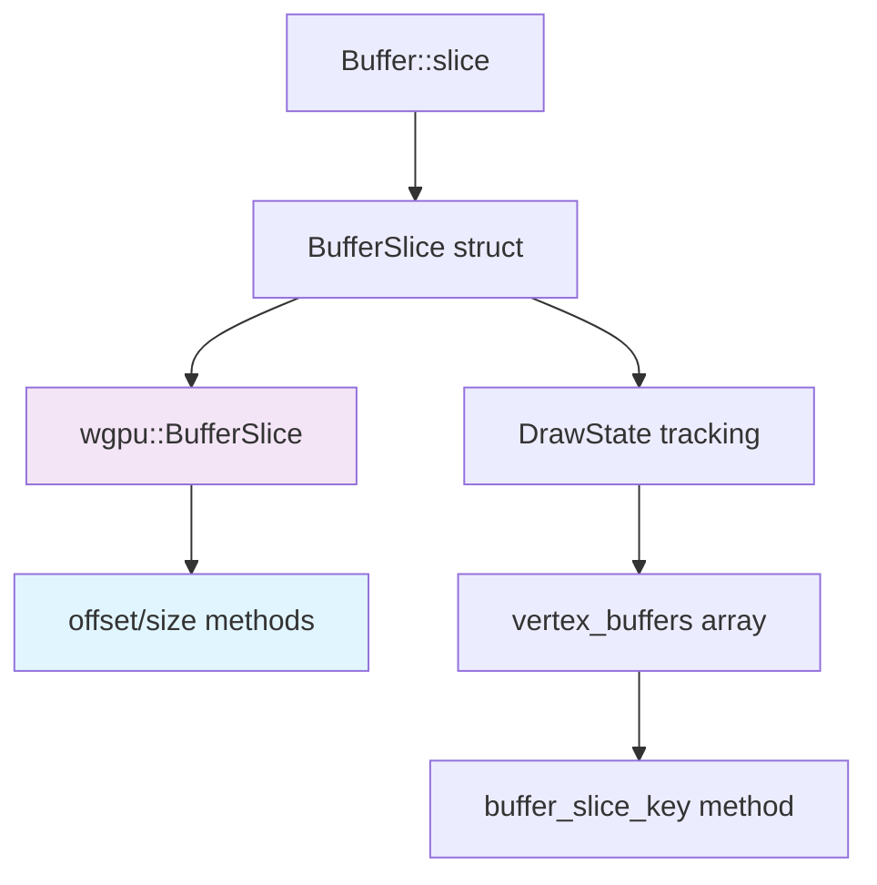

+++
title = "#21289 BufferSlice cleanup"
date = "2025-09-30T00:00:00"
draft = false
template = "pull_request_page.html"
in_search_index = true

[taxonomies]
list_display = ["show"]

[extra]
current_language = "en"
available_languages = {"en" = { name = "English", url = "/pull_request/bevy/2025-09/pr-21289-en-20250930" }, "zh-cn" = { name = "中文", url = "/pull_request/bevy/2025-09/pr-21289-zh-cn-20250930" }}
labels = ["D-Trivial", "A-Rendering", "C-Code-Quality"]
+++

# Title
BufferSlice cleanup

## Basic Information
- **Title**: BufferSlice cleanup
- **PR Link**: https://github.com/bevyengine/bevy/pull/21289
- **Author**: akimakinai
- **Status**: MERGED
- **Labels**: D-Trivial, A-Rendering, C-Code-Quality
- **Created**: 2025-09-30T00:14:45Z
- **Merged**: 2025-09-30T01:17:03Z
- **Merged By**: james7132

## Description Translation
# Objective

- Cleanup code by utilizing `wgpu::BufferSlice::offset`/`size` (added in wgpu 25).

This is technically a breaking change. `bevy::BufferSlice::offset`/`size` no longer exists, and `.size()` now returns `wgpu::BufferSize = NonZeroU64` instead of `wgpu::BufferAddress = u64`.

Originally in PR https://github.com/bevyengine/bevy/pull/20468. I thought this is conflated and should be separated

## The Story of This Pull Request

This PR addresses a technical debt issue in Bevy's rendering system by leveraging new functionality introduced in wgpu 25. The core problem was that Bevy's `BufferSlice` wrapper was manually tracking offset and size information that had become available directly from the underlying wgpu API.

The implementation started with the `BufferSlice` struct in `buffer.rs`. Previously, this struct maintained three fields: `id`, `offset`, and `size`. The `Buffer::slice` method manually computed these values using complex range-bound logic:

```rust
// Before: Manual offset and size calculation
let offset = match bounds.start_bound() {
    Bound::Included(&bound) => bound,
    Bound::Excluded(&bound) => bound + 1,
    Bound::Unbounded => 0,
};
let size = match bounds.end_bound() {
    Bound::Included(&bound) => bound + 1,
    Bound::Excluded(&bound) => bound,
    Bound::Unbounded => self.value.size(),
} - offset;
```

With wgpu 25, the `wgpu::BufferSlice` type now provides `offset()` and `size()` methods directly, making this manual calculation redundant. The solution was straightforward: remove the duplicate storage and delegate to the underlying wgpu implementation.

The updated `Buffer::slice` method became much simpler:

```rust
// After: Direct delegation to wgpu
BufferSlice {
    id: self.id,
    value: self.value.slice(bounds),
}
```

This change had implications for the draw state management system. The `DrawState` struct was storing vertex buffer information as tuples of `(BufferId, u64, u64)` for offset and size. Since `wgpu::BufferSlice::size()` now returns `wgpu::BufferSize` (a `NonZeroU64`) instead of `wgpu::BufferAddress` (a `u64`), the type signatures needed updating:

```rust
// Before:
vertex_buffers: Vec<Option<(BufferId, u64, u64)>>

// After:  
vertex_buffers: Vec<Option<(BufferId, wgpu::BufferAddress, wgpu::BufferSize)>>
```

The `buffer_slice_key` method was updated accordingly to return the correct tuple type, now fetching offset and size directly from the wgpu buffer slice rather than from Bevy's wrapper fields.

This change represents a classic dependency upgrade pattern: when upstream libraries add functionality that replaces custom implementations, it's beneficial to migrate to the standardized approach. The cleanup reduces code complexity, eliminates potential synchronization issues between duplicate state, and aligns Bevy more closely with the underlying graphics API.

While technically a breaking change due to the type signature modifications, the impact is limited to internal rendering systems and doesn't affect typical game development usage patterns. The author correctly identified this as a separable change from the larger wgpu 25 migration work.

## Visual Representation



## Key Files Changed

### `crates/bevy_render/src/render_resource/buffer.rs` (+1/-26)

This file contained the core changes to eliminate duplicate offset/size tracking:

```rust
// Before:
pub struct BufferSlice<'a> {
    id: BufferId,
    offset: wgpu::BufferAddress,
    value: wgpu::BufferSlice<'a>,
    size: wgpu::BufferAddress,
}

impl<'a> BufferSlice<'a> {
    pub fn offset(&self) -> wgpu::BufferAddress { self.offset }
    pub fn size(&self) -> wgpu::BufferAddress { self.size }
}

// After:
pub struct BufferSlice<'a> {
    id: BufferId,
    value: wgpu::BufferSlice<'a>,
}

impl<'a> BufferSlice<'a> {
    // offset() and size() methods removed - use value.offset() and value.size()
}
```

The `Buffer::slice` method was simplified by removing manual range bound calculations and relying entirely on wgpu's implementation.

### `crates/bevy_render/src/render_phase/draw_state.rs` (+5/-2)

This file required type signature updates to match the new wgpu types:

```rust
// Before:
vertex_buffers: Vec<Option<(BufferId, u64, u64)>>
fn buffer_slice_key(&self, buffer_slice: &BufferSlice) -> (BufferId, u64, u64)

// After:
vertex_buffers: Vec<Option<(BufferId, wgpu::BufferAddress, wgpu::BufferSize)>>
fn buffer_slice_key(&self, buffer_slice: &BufferSlice) -> (BufferId, wgpu::BufferAddress, wgpu::BufferSize)
```

The changes here are purely type-level - the actual data flow and logic remain the same, but now use the types provided directly by wgpu.

## Further Reading

- [wgpu BufferSlice documentation](https://docs.rs/wgpu/latest/wgpu/struct.BufferSlice.html)
- [NonZeroU64 in Rust standard library](https://doc.rust-lang.org/std/num/struct.NonZeroU64.html)
- [Bevy Rendering Architecture](https://bevyengine.org/learn/quick-start/rendering/)