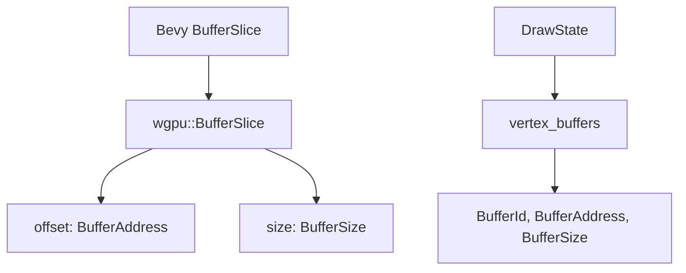

+++
title = "#21289 BufferSlice cleanup"
date = "2025-09-30T00:00:00"
draft = false
template = "pull_request_page.html"
in_search_index = false

[extra]
current_language = "zh-cn"
available_languages = {"en" = { name = "English", url = "/pull_request/bevy/2025-09/pr-21289-en-20250930" }, "zh-cn" = { name = "中文", url = "/pull_request/bevy/2025-09/pr-21289-zh-cn-20250930" }}
labels = ["D-Trivial", "A-Rendering", "C-Code-Quality"]
+++

# BufferSlice cleanup

## Basic Information
- **Title**: BufferSlice cleanup
- **PR Link**: https://github.com/bevyengine/bevy/pull/21289
- **Author**: akimakinai
- **Status**: MERGED
- **Labels**: D-Trivial, A-Rendering, C-Code-Quality
- **Created**: 2025-09-30T00:14:45Z
- **Merged**: 2025-09-30T01:17:03Z
- **Merged By**: james7132

## Description Translation
目标

- 通过利用 `wgpu::BufferSlice::offset`/`size`（在 wgpu 25 中添加）来清理代码。

从技术上讲，这是一个破坏性变更。`bevy::BufferSlice::offset`/`size` 不再存在，并且 `.size()` 现在返回 `wgpu::BufferSize = NonZeroU64` 而不是 `wgpu::BufferAddress = u64`。

最初在 PR https://github.com/bevyengine/bevy/pull/20468 中。我认为这混杂了其他变更，应该分离出来。

## The Story of This Pull Request

这个 PR 的核心故事是关于利用现代 wgpu API 来简化 Bevy 渲染系统中的缓冲区切片管理。随着 wgpu 25 版本的发布，wgpu 库在 `BufferSlice` 类型中新增了 `offset` 和 `size` 方法，这为 Bevy 提供了一个机会来清理之前手动维护的缓冲区切片元数据。

在之前的实现中，Bevy 的 `BufferSlice` 结构体需要手动计算和存储切片的偏移量和大小。这是因为旧版本的 wgpu 没有在 `wgpu::BufferSlice` 中暴露这些属性。开发团队不得不通过复杂的边界计算来维护这些信息：

```rust
// 之前的实现需要手动计算
let offset = match bounds.start_bound() {
    Bound::Included(&bound) => bound,
    Bound::Excluded(&bound) => bound + 1,
    Bound::Unbounded => 0,
};
let size = match bounds.end_bound() {
    Bound::Included(&bound) => bound + 1,
    Bound::Excluded(&bound) => bound,
    Bound::Unbounded => self.value.size(),
} - offset;
```

这种实现不仅增加了代码复杂度，还引入了潜在的维护负担。随着 wgpu 25 的发布，现在可以直接从底层的 `wgpu::BufferSlice` 获取这些信息，使得 Bevy 中的包装器变得多余。

PR 作者 akimakinai 识别出这个机会，并决定将这部分清理工作从较大的 PR #20468 中分离出来，专注于这个特定的改进。这种分离体现了良好的工程实践 - 保持变更的专注性和原子性。

技术实现上，这个 PR 主要做了两件事：首先，它移除了 `BufferSlice` 中手动维护的 `offset` 和 `size` 字段；其次，它更新了相关的类型签名以直接使用 wgpu 的类型。这是一个破坏性变更，因为 `BufferSlice::size()` 现在返回 `wgpu::BufferSize`（`NonZeroU64`）而不是之前的 `u64`。

在 `draw_state.rs` 中，相应的类型也需要更新以保持一致性。`vertex_buffers` 字段现在直接使用 `wgpu::BufferAddress` 和 `wgpu::BufferSize` 类型，这消除了类型转换的需要，并使代码更加类型安全。

这种简化带来的主要好处是减少了代码重复和维护负担。现在，Bevy 直接依赖 wgpu 提供的功能，而不是维护自己的实现。这不仅减少了代码量，还提高了与底层图形 API 的一致性。

## Visual Representation



## Key Files Changed

### `crates/bevy_render/src/render_resource/buffer.rs` (+1/-26)

这个文件包含了主要的简化工作。之前需要手动计算和存储的偏移量和大小信息现在被完全移除。

**关键变更：**
```rust
// 之前：
pub fn slice(&self, bounds: impl RangeBounds<wgpu::BufferAddress>) -> BufferSlice<'_> {
    // need to compute and store this manually because wgpu doesn't export offset and size on wgpu::BufferSlice
    let offset = match bounds.start_bound() {
        Bound::Included(&bound) => bound,
        Bound::Excluded(&bound) => bound + 1,
        Bound::Unbounded => 0,
    };
    let size = match bounds.end_bound() {
        Bound::Included(&bound) => bound + 1,
        Bound::Excluded(&bound) => bound,
        Bound::Unbounded => self.value.size(),
    } - offset;
    BufferSlice {
        id: self.id,
        offset,
        size,
        value: self.value.slice(bounds),
    }
}

// 之后：
pub fn slice(&self, bounds: impl RangeBounds<wgpu::BufferAddress>) -> BufferSlice<'_> {
    BufferSlice {
        id: self.id,
        value: self.value.slice(bounds),
    }
}
```

同时移除了 `BufferSlice` 结构体中的冗余字段和对应的访问器方法：
```rust
// 移除了这些字段：
offset: wgpu::BufferAddress,
size: wgpu::BufferAddress,

// 移除了这些方法：
pub fn offset(&self) -> wgpu::BufferAddress
pub fn size(&self) -> wgpu::BufferAddress
```

### `crates/bevy_render/src/render_phase/draw_state.rs` (+5/-2)

这个文件需要更新以使用新的类型签名，保持与 `buffer.rs` 变更的一致性。

**关键变更：**
```rust
// 之前：
vertex_buffers: Vec<Option<(BufferId, u64, u64)>>,

// 之后：
vertex_buffers: Vec<Option<(BufferId, wgpu::BufferAddress, wgpu::BufferSize)>>,
```

```rust
// 之前：
fn buffer_slice_key(&self, buffer_slice: &BufferSlice) -> (BufferId, u64, u64)

// 之后：
fn buffer_slice_key(
    &self,
    buffer_slice: &BufferSlice,
) -> (BufferId, wgpu::BufferAddress, wgpu::BufferSize)
```

## Further Reading

- [wgpu BufferSlice documentation](https://docs.rs/wgpu/latest/wgpu/struct.BufferSlice.html) - 了解 wgpu BufferSlice 的完整 API
- [NonZeroU64 in Rust](https://doc.rust-lang.org/std/num/struct.NonZeroU64.html) - 理解 NonZeroU64 类型及其优势
- [Bevy Rendering Architecture](https://bevy-cheatbook.github.io/programming/rendering.html) - Bevy 渲染系统架构概览