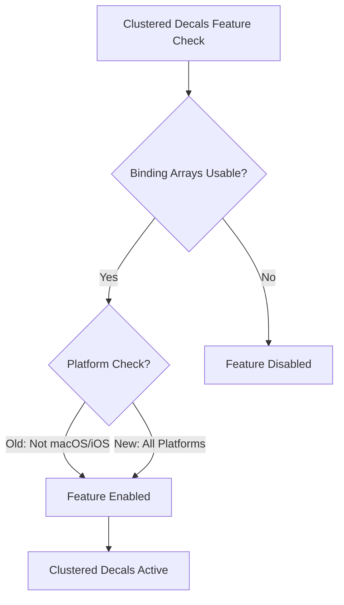

+++
title = "#21297 disable macos/ios check for clustered decals"
date = "2025-09-30T00:00:00"
draft = false
template = "pull_request_page.html"
in_search_index = true

[taxonomies]
list_display = ["show"]

[extra]
current_language = "en"
available_languages = {"en" = { name = "English", url = "/pull_request/bevy/2025-09/pr-21297-en-20250930" }, "zh-cn" = { name = "中文", url = "/pull_request/bevy/2025-09/pr-21297-zh-cn-20250930" }}
+++

# Title

## Basic Information
- **Title**: disable macos/ios check for clustered decals
- **PR Link**: https://github.com/bevyengine/bevy/pull/21297
- **Author**: robtfm
- **Status**: MERGED
- **Labels**: None
- **Created**: 2025-09-30T15:06:22Z
- **Merged**: 2025-09-30T22:49:26Z
- **Merged By**: mockersf

## Description Translation
# Objective

disable macos/ios check for clustered decals

## Solution

disable macos/ios check for clustered decals

## The Story of This Pull Request

This PR addresses a platform-specific limitation in Bevy's rendering system. The core issue was that clustered decals, a rendering feature for applying decals to 3D surfaces, were being disabled on macOS and iOS platforms due to a conditional check in the feature detection system.

The problem originated from a technical limitation where clustered decals required specific GPU features that weren't consistently available across all platforms. The original implementation included a platform check that explicitly excluded macOS and iOS:

```rust
binding_arrays_are_usable(render_device, render_adapter)
    && cfg!(not(any(target_os = "macos", target_os = "ios")))
    && cfg!(feature = "pbr_clustered_decals")
```

This conditional logic meant that even when the underlying hardware and drivers on Apple platforms supported the required features, the feature would remain disabled due to the hardcoded platform exclusion.

The solution approach was straightforward: remove the platform-specific restriction while keeping the other validation checks intact. This change allows the rendering system to properly evaluate hardware capabilities on Apple platforms rather than making assumptions based solely on the operating system.

The implementation consisted of a single-line change that removed the platform check while preserving the essential validation for binding arrays and feature flags. This maintains the safety of only enabling the feature when the actual hardware supports it, while expanding availability to properly supported Apple devices.

From a technical perspective, this change demonstrates an important principle in cross-platform graphics programming: feature detection should be based on actual hardware capabilities rather than platform assumptions. The remaining `binding_arrays_are_usable` function performs runtime checks to ensure the required GPU features are present, making the platform check redundant and potentially overly restrictive.

The impact of this change is that macOS and iOS users with compatible hardware can now benefit from clustered decals rendering. This improves feature parity across platforms and ensures that Apple users with capable hardware aren't unnecessarily limited by platform-based restrictions.

## Visual Representation



## Key Files Changed

### `crates/bevy_pbr/src/decal/clustered.rs` (+0/-1)

This file contains the feature detection logic for clustered decals. The change removed the platform-specific exclusion for macOS and iOS.

**Key Modification:**
```rust
// Before:
pub fn clustered_decals_are_usable(
    render_device: &RenderDevice,
    render_adapter: &RenderAdapter,
) -> bool {
    // See issue #17553.
    // Re-enable this when `wgpu` has first-class bindless.
    binding_arrays_are_usable(render_device, render_adapter)
        && cfg!(not(any(target_os = "macos", target_os = "ios")))
        && cfg!(feature = "pbr_clustered_decals")
}

// After:
pub fn clustered_decals_are_usable(
    render_device: &RenderDevice,
    render_adapter: &RenderAdapter,
) -> bool {
    // See issue #17553.
    // Re-enable this when `wgpu` has first-class bindless.
    binding_arrays_are_usable(render_device, render_adapter)
        && cfg!(feature = "pbr_clustered_decals")
}
```

The change removes the platform restriction while keeping the hardware capability check (`binding_arrays_are_usable`) and feature flag check intact. This allows the feature to be enabled on Apple platforms when the underlying hardware supports the required features.

## Further Reading

- [Bevy Rendering Documentation](https://bevyengine.org/learn/book/getting-started/rendering/)
- [WebGPU Binding Model](https://gpuweb.github.io/gpuweb/#bindings)
- [Cross-platform Graphics Programming](https://github.com/gfx-rs/wgpu) - The graphics backend used by Bevy
- [Feature Detection vs Platform Detection](https://en.wikipedia.org/wiki/Feature_detection) - The principle of detecting capabilities rather than assuming based on platform

# Full Code Diff
```diff
diff --git a/crates/bevy_pbr/src/decal/clustered.rs b/crates/bevy_pbr/src/decal/clustered.rs
index 857969510bd05..7aeed1518ed77 100644
--- a/crates/bevy_pbr/src/decal/clustered.rs
+++ b/crates/bevy_pbr/src/decal/clustered.rs
@@ -437,6 +437,5 @@ pub fn clustered_decals_are_usable(
     // See issue #17553.
     // Re-enable this when `wgpu` has first-class bindless.
     binding_arrays_are_usable(render_device, render_adapter)
-        && cfg!(not(any(target_os = "macos", target_os = "ios")))
         && cfg!(feature = "pbr_clustered_decals")
 }
```