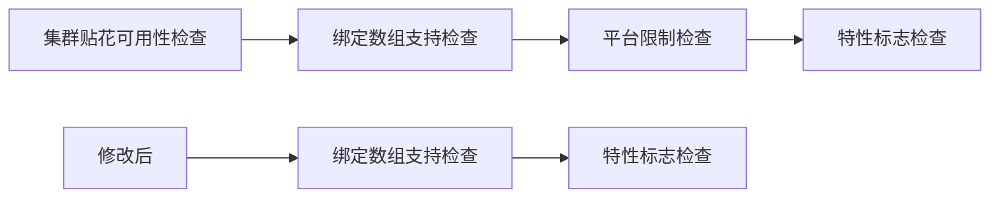

+++
title = "#21297 disable macos/ios check for clustered decals"
date = "2025-09-30T00:00:00"
draft = false
template = "pull_request_page.html"
in_search_index = false

[extra]
current_language = "zh-cn"
available_languages = {"en" = { name = "English", url = "/pull_request/bevy/2025-09/pr-21297-en-20250930" }, "zh-cn" = { name = "中文", url = "/pull_request/bevy/2025-09/pr-21297-zh-cn-20250930" }}
+++

# disable macos/ios check for clustered decals

## Basic Information
- **Title**: disable macos/ios check for clustered decals
- **PR Link**: https://github.com/bevyengine/bevy/pull/21297
- **Author**: robtfm
- **Status**: MERGED
- **Labels**: None
- **Created**: 2025-09-30T15:06:22Z
- **Merged**: 2025-09-30T22:49:26Z
- **Merged By**: mockersf

## Description Translation
目标

禁用 macOS/iOS 对集群贴花的检查

解决方案

禁用 macOS/iOS 对集群贴花的检查

## The Story of This Pull Request

这个PR解决了一个平台限制问题。在Bevy的渲染系统中，集群贴花（clustered decals）功能之前在某些平台上被限制使用，特别是macOS和iOS系统。这种限制源于底层图形API的兼容性问题。

集群贴花是一种高效的渲染技术，它通过将场景划分为多个簇（cluster）来优化贴花的渲染。然而，在实现过程中，开发团队遇到了平台特定的限制。在macOS和iOS上，由于Metal图形API的限制以及绑定数组（binding arrays）的支持问题，集群贴花功能被临时禁用。

这个PR的核心修改非常简单：移除了对macOS和iOS平台的检查条件。具体来说，在`clustered_decals_are_usable`函数中，原本有一个条件`cfg!(not(any(target_os = "macos", target_os = "ios")))`，这个条件确保了在这些平台上集群贴花功能不会被启用。

移除这个限制意味着：
1. 底层图形API的问题可能已经得到解决
2. 或者团队找到了替代方案来绕过之前的限制
3. 或者经过测试发现这些平台现在能够正常支持该功能

从技术实现角度看，这个修改使得集群贴花功能现在可以在所有支持绑定数组和启用了`pbr_clustered_decals`特性的平台上使用，不再单独排除macOS和iOS。

这个修改的影响是直接的：macOS和iOS用户现在可以受益于集群贴花带来的渲染性能优化。对于移动设备尤其重要，因为贴花效果在移动游戏中被广泛使用，而性能优化在移动平台上尤为关键。

## Visual Representation



## Key Files Changed

### `crates/bevy_pbr/src/decal/clustered.rs` (+0/-1)

这个文件包含了集群贴花功能的核心实现。修改移除了对macOS和iOS平台的特定限制。

**修改前：**
```rust
pub fn clustered_decals_are_usable(
    render_device: &RenderDevice,
    render_adapter: &RenderAdapter,
) -> bool {
    // See issue #17553.
    // Re-enable this when `wgpu` has first-class bindless.
    binding_arrays_are_usable(render_device, render_adapter)
        && cfg!(not(any(target_os = "macos", target_os = "ios")))
        && cfg!(feature = "pbr_clustered_decals")
}
```

**修改后：**
```rust
pub fn clustered_decals_are_usable(
    render_device: &RenderDevice,
    render_adapter: &RenderAdapter,
) -> bool {
    // See issue #17553.
    // Re-enable this when `wgpu` has first-class bindless.
    binding_arrays_are_usable(render_device, render_adapter)
        && cfg!(feature = "pbr_clustered_decals")
}
```

关键变化：
- 移除了`&& cfg!(not(any(target_os = "macos", target_os = "ios")))`条件
- 保持了绑定数组支持和特性标志的检查
- 代码注释中提到的issue #17553和bindless支持问题仍然保留，说明底层技术挑战可能仍然存在，但平台限制已经被解除

## Further Reading

- [Bevy渲染系统文档](https://bevyengine.org/learn/book/rendering/)
- [WebGPU绑定数组规范](https://gpuweb.github.io/gpuweb/#bind-array)
- [Metal图形API限制](https://developer.apple.com/metal/)
- [集群渲染技术介绍](https://learnopengl.com/Guest-Articles/2021/Scene/Cluster)