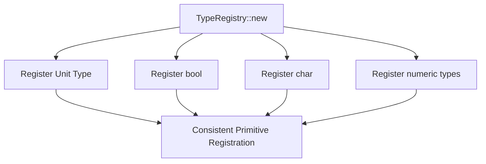

+++
title = "#21298 Register unit type alongside the other primitives"
date = "2025-09-30T00:00:00"
draft = false
template = "pull_request_page.html"
in_search_index = true

[taxonomies]
list_display = ["show"]

[extra]
current_language = "en"
available_languages = {"en" = { name = "English", url = "/pull_request/bevy/2025-09/pr-21298-en-20250930" }, "zh-cn" = { name = "中文", url = "/pull_request/bevy/2025-09/pr-21298-zh-cn-20250930" }}
labels = ["C-Bug", "A-Reflection"]
+++

# Title
Register unit type alongside the other primitives

## Basic Information
- **Title**: Register unit type alongside the other primitives
- **PR Link**: https://github.com/bevyengine/bevy/pull/21298
- **Author**: MichalGniadek
- **Status**: MERGED
- **Labels**: C-Bug, S-Ready-For-Final-Review, A-Reflection
- **Created**: 2025-09-30T15:50:53Z
- **Merged**: 2025-09-30T22:06:56Z
- **Merged By**: james7132

## Description Translation
# Objective

Primitive types are automatically registered when a `TypeRegistry` is created, except for unit type `()`.

## Solution

Register `()` alongside other primitives.

## Testing

Run tests in `bevy_reflect`, tested with my code that `()` is being registered.

## The Story of This Pull Request

This PR addresses a consistency issue in Bevy's reflection system where the unit type `()` was being treated differently from other primitive types. The problem emerged when developers working with Bevy's reflection capabilities discovered that while all other primitive types were automatically registered in the `TypeRegistry`, the unit type was conspicuously absent.

The unit type `()` is a fundamental type in Rust that represents a value with no meaningful data - essentially a zero-sized type used when a function returns nothing or when a value is needed but no data is required. In reflection systems, even zero-sized types need registration because they may appear in type signatures, generic parameters, or as field types in structs.

The implementation approach was straightforward and consistent with existing patterns. The developer identified that the `TypeRegistry::new()` method already contained registrations for all other primitive types including `bool`, `char`, and various numeric types. The solution was simply to add the missing registration for `()` alongside these existing registrations.

This change ensures that the unit type can be properly reflected and manipulated through Bevy's reflection APIs, maintaining consistency with how other primitive types are handled. Without this registration, code that attempted to reflect on types containing unit types would encounter missing type information, potentially causing runtime errors or incorrect behavior in reflection-based systems.

The fix is minimal and low-risk because it follows the exact same pattern already established for other primitive types. The unit type registration uses the same `registry.register::<()>` call that's used for all other types in the registry initialization.

## Visual Representation



## Key Files Changed

**File: `crates/bevy_reflect/src/type_registry.rs`**

This file contains the core implementation of Bevy's type registry system. The change adds one line to ensure the unit type `()` is registered alongside other primitive types when a new `TypeRegistry` is created.

```rust
// File: crates/bevy_reflect/src/type_registry.rs
// Before:
pub fn new() -> Self {
    let mut registry = Self::empty();
    registry.register::<bool>();
    registry.register::<char>();
    registry.register::<u8>();
    // ... other primitive registrations
}

// After:
pub fn new() -> Self {
    let mut registry = Self::empty();
    registry.register::<()>();  // Added this line
    registry.register::<bool>();
    registry.register::<char>();
    registry.register::<u8>();
    // ... other primitive registrations
}
```

The change is minimal but important for consistency. The `registry.register::<()>` call follows the exact same pattern as the existing primitive type registrations, ensuring that the unit type is available for reflection operations just like other fundamental types.

## Further Reading

- [Rust Unit Type Documentation](https://doc.rust-lang.org/std/primitive.unit.html)
- [Bevy Reflection Documentation](https://docs.rs/bevy_reflect/latest/bevy_reflect/)
- [Type Registration in Bevy](https://bevy-cheatbook.github.io/programming/reflection.html#type-registry)

# Full Code Diff
```diff
diff --git a/crates/bevy_reflect/src/type_registry.rs b/crates/bevy_reflect/src/type_registry.rs
index d6248db82c8b9..5c79a7bd77840 100644
--- a/crates/bevy_reflect/src/type_registry.rs
+++ b/crates/bevy_reflect/src/type_registry.rs
@@ -100,6 +100,7 @@ impl TypeRegistry {
     /// Create a type registry with default registrations for primitive types.
     pub fn new() -> Self {
         let mut registry = Self::empty();
+        registry.register::<()>();
         registry.register::<bool>();
         registry.register::<char>();
         registry.register::<u8>();
```