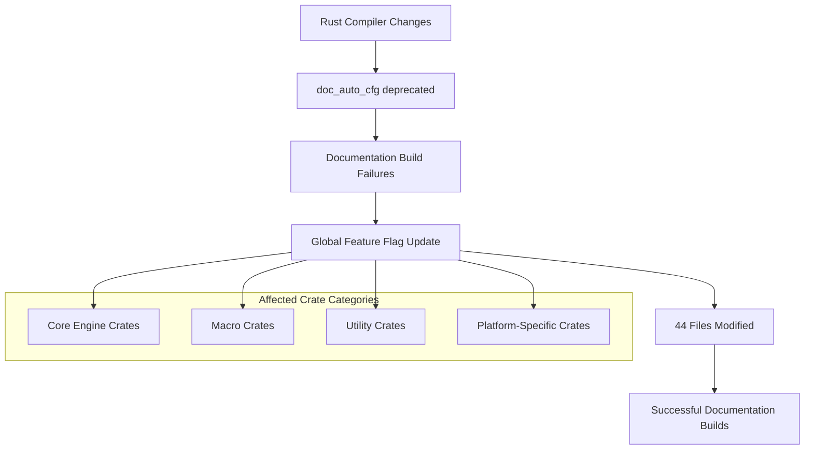

+++
title = "#21304 Replace `feature(doc_auto_cfg)` with `feature(doc_cfg)`."
date = "2025-09-30T00:00:00"
draft = false
template = "pull_request_page.html"
in_search_index = true

[taxonomies]
list_display = ["show"]

[extra]
current_language = "en"
available_languages = {"en" = { name = "English", url = "/pull_request/bevy/2025-09/pr-21304-en-20250930" }, "zh-cn" = { name = "中文", url = "/pull_request/bevy/2025-09/pr-21304-zh-cn-20250930" }}
labels = ["C-Docs", "A-Build-System"]
+++

# Title
Replace `feature(doc_auto_cfg)` with `feature(doc_cfg)`

## Basic Information
- **Title**: Replace `feature(doc_auto_cfg)` with `feature(doc_cfg)`.
- **PR Link**: https://github.com/bevyengine/bevy/pull/21304
- **Author**: kpreid
- **Status**: MERGED
- **Labels**: C-Docs, A-Build-System
- **Created**: 2025-09-30T20:54:59Z
- **Merged**: 2025-09-30T21:48:15Z
- **Merged By**: mockersf

## Description Translation

## Objective

Fixes #21303 (but does not add any testing that similar issues will not recur).

## Solution

Globally replace `feature(doc_auto_cfg)` with `feature(doc_cfg)`.

## Testing

Tested that `RUSTDOCFLAGS=--cfg=docsrs cargo +nightly doc -p bevy_platform` succeeds. This is not a test of all documentation builds, but I do not know of a way to do that until bevy's dependencies catch up.

## The Story of This Pull Request

This PR addresses a documentation build issue in the Bevy game engine by systematically updating Rust feature flags across the entire codebase. The problem stemmed from changes in Rust's documentation generation system that made the previously used `doc_auto_cfg` feature obsolete.

The core issue was that Bevy's documentation builds were failing because the codebase was using `feature(doc_auto_cfg)`, which had been replaced by `feature(doc_cfg)` in the Rust compiler. This feature controls how conditional compilation attributes (like `#[cfg(target_os = "windows")]`) are displayed in generated documentation. When the old feature flag was used, it caused build failures because the feature was no longer available in the Rust toolchain.

The solution approach was straightforward but required comprehensive changes across the entire codebase. The developer implemented a global find-and-replace operation that changed:

```rust
#![cfg_attr(docsrs, feature(doc_auto_cfg))]
```

to:

```rust
#![cfg_attr(docsrs, feature(doc_cfg))]
```

This change affects 44 files across the Bevy codebase, including core crates like `bevy_ecs`, `bevy_render`, and `bevy_asset`, as well as various macro crates and utility modules. The consistency of the change pattern indicates this was a systematic update rather than a piecemeal fix.

From a technical perspective, this change demonstrates the importance of keeping up with Rust ecosystem evolution. The `doc_auto_cfg` feature was part of Rust's unstable API for automatic documentation of conditional compilation, but it was replaced by the more refined `doc_cfg` feature. This transition reflects Rust's ongoing improvements to documentation tooling.

The implementation required no complex logic changes - it was purely a matter of updating feature flags. However, the scale of the change (44 files) highlights how even simple updates can have widespread impact in a large, modular codebase like Bevy. Each crate in Bevy maintains its own documentation configuration, which is why the change needed to be applied universally.

The developer's testing approach was pragmatic given the constraints. They verified that `RUSTDOCFLAGS=--cfg=docsrs cargo +nightly doc -p bevy_platform` succeeded, which tests the documentation build process with the appropriate configuration flags. This approach acknowledges that comprehensive testing of all documentation builds would require updates to Bevy's dependencies first.

The impact of this change is primarily on the development workflow and documentation generation process. It ensures that Bevy's documentation can be built successfully with current Rust toolchains, which is essential for both developers working on the engine and users trying to understand Bevy's APIs through its documentation.

## Visual Representation



## Key Files Changed

The PR modified 44 files across the Bevy codebase. Here are some representative examples:

**Core Engine Crate: bevy_ecs**
```rust
// File: crates/bevy_ecs/macros/src/lib.rs
// Before:
#![cfg_attr(docsrs, feature(doc_auto_cfg))]

// After:
#![cfg_attr(docsrs, feature(doc_cfg))]
```

**Rendering Crate: bevy_render**
```rust
// File: crates/bevy_render/macros/src/lib.rs
// Before:
#![cfg_attr(docsrs, feature(doc_auto_cfg))]

// After:
#![cfg_attr(docsrs, feature(doc_cfg))]
```

**Asset System: bevy_asset**
```rust
// File: crates/bevy_asset/src/lib.rs
// Before:
#![cfg_attr(docsrs, feature(doc_auto_cfg))]

// After:
#![cfg_attr(docsrs, feature(doc_cfg))]
```

**Utility Crate: bevy_utils**
```rust
// File: crates/bevy_utils/src/lib.rs
// Before:
#![cfg_attr(docsrs, feature(doc_auto_cfg))]

// After:
#![cfg_attr(docsrs, feature(doc_cfg))]
```

Each change follows the same pattern, replacing the deprecated `doc_auto_cfg` feature with `doc_cfg` while maintaining the same conditional compilation structure using `cfg_attr(docsrs, ...)`.

## Further Reading

- [Rust Documentation: The `doc_cfg` feature](https://doc.rust-lang.org/unstable-book/language-features/doc-cfg.html)
- [Rust RFC: Automatic `cfg` documentation](https://github.com/rust-lang/rfcs/blob/master/text/1868-external-doc-attr.md)
- [Bevy Engine Documentation](https://bevyengine.org/learn/)
- [Rust Conditional Compilation](https://doc.rust-lang.org/reference/conditional-compilation.html)