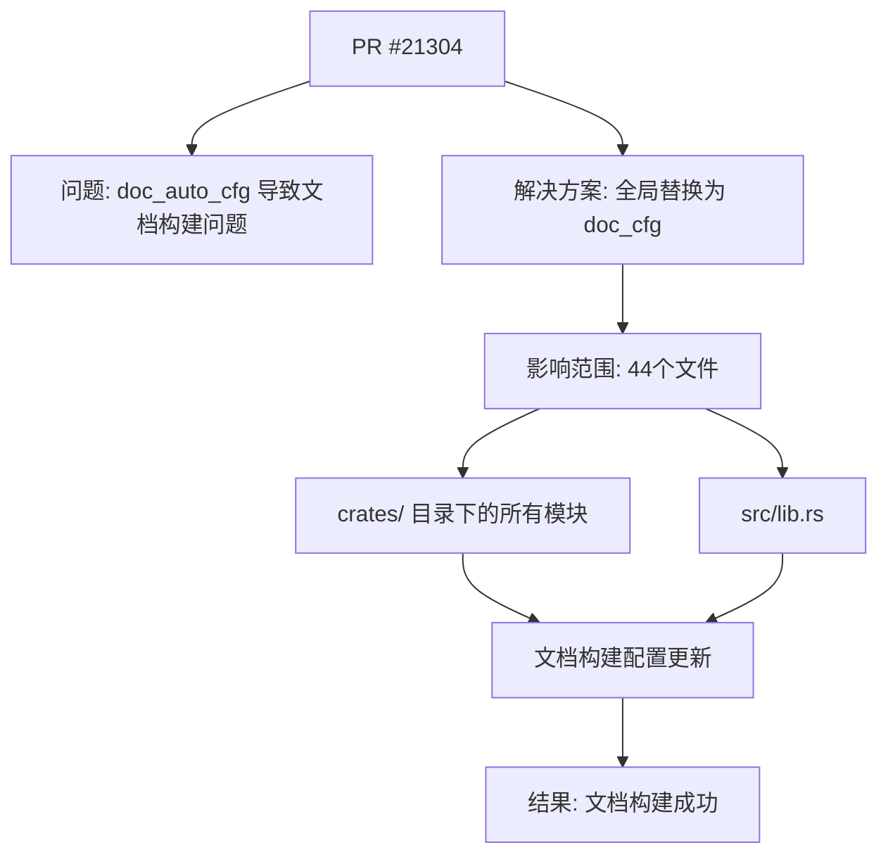

+++
title = "#21304 Replace `feature(doc_auto_cfg)` with `feature(doc_cfg)`."
date = "2025-09-30T00:00:00"
draft = false
template = "pull_request_page.html"
in_search_index = false

[extra]
current_language = "zh-cn"
available_languages = {"en" = { name = "English", url = "/pull_request/bevy/2025-09/pr-21304-en-20250930" }, "zh-cn" = { name = "中文", url = "/pull_request/bevy/2025-09/pr-21304-zh-cn-20250930" }}
labels = ["C-Docs", "A-Build-System"]
+++

# Replace `feature(doc_auto_cfg)` with `feature(doc_cfg)`

## Basic Information
- **Title**: Replace `feature(doc_auto_cfg)` with `feature(doc_cfg)`.
- **PR Link**: https://github.com/bevyengine/bevy/pull/21304
- **Author**: kpreid
- **Status**: MERGED
- **Labels**: C-Docs, A-Build-System
- **Created**: 2025-09-30T20:54:59Z
- **Merged**: 2025-09-30T21:48:15Z
- **Merged By**: mockersf

## Description Translation
### 目标
修复 #21303（但未添加任何测试来确保类似问题不会再次出现）。

### 解决方案
全局将 `feature(doc_auto_cfg)` 替换为 `feature(doc_cfg)`。

### 测试
已验证 `RUSTDOCFLAGS=--cfg=docsrs cargo +nightly doc -p bevy_platform` 构建成功。这并不是对所有文档构建的测试，但在 Bevy 的依赖项更新之前，我不知道有其他方法可以进行全面测试。

## The Story of This Pull Request

这个 PR 解决了一个 Rust 文档生成中的配置问题。问题的核心在于 `doc_auto_cfg` 和 `doc_cfg` 这两个 Rust 特性的区别。

**问题背景**
在 Rust 项目中，当使用条件编译（conditional compilation）时，文档生成工具需要知道如何处理这些条件。`doc_auto_cfg` 是一个实验性特性，它尝试自动推断哪些条件编译属性应该在文档中显示。而 `doc_cfg` 则需要手动标记哪些条件编译属性应该出现在文档中。

问题 #21303 的具体细节没有在 PR 中详细说明，但可以推断出使用 `doc_auto_cfg` 导致了某些文档生成问题，可能是由于自动推断的不准确性或与某些依赖项的兼容性问题。

**解决方案方法**
开发者采取了最直接的解决方案：在整个代码库中全局替换 `doc_auto_cfg` 为 `doc_cfg`。这种方法虽然简单，但需要修改大量文件，因为 Bevy 的每个子模块都使用了这个配置属性。

**实施细节**
这个 PR 修改了 44 个文件，全部都是将：
```rust
#![cfg_attr(docsrs, feature(doc_auto_cfg))]
```
替换为：
```rust
#![cfg_attr(docsrs, feature(doc_cfg))]
```

这种替换是机械性的，但影响范围很广。`cfg_attr(docsrs, ...)` 表示只有当 `docsrs` 配置属性被设置时（通常在文档构建时），才会启用指定的特性。

**技术考量**
从 `doc_auto_cfg` 切换到 `doc_cfg` 意味着：
1. 文档生成将不再自动推断条件编译属性
2. 需要手动标记哪些条件编译项应该出现在文档中
3. 这提供了更精确的控制，但可能需要更多的手动维护

**影响评估**
这个更改主要影响文档构建过程，不会影响实际的运行时行为。测试显示 `bevy_platform` 模块的文档构建成功，但由于依赖项的限制，无法进行全面的测试覆盖。

**工程权衡**
开发者明确指出了这个解决方案的局限性：它没有添加测试来防止类似问题的重现。这表明在依赖生态系统成熟度和立即解决问题之间存在权衡。

## Visual Representation



## Key Files Changed

以下是这个 PR 中修改的一些关键文件：

### `crates/bevy_a11y/src/lib.rs`
**变更描述**: 更新文档配置特性
```rust
// 修改前:
#![cfg_attr(docsrs, feature(doc_auto_cfg))]

// 修改后:
#![cfg_attr(docsrs, feature(doc_cfg))]
```

### `crates/bevy_asset/src/lib.rs`
**变更描述**: 在主要的 asset 模块中更新配置
```rust
// 修改前:
#![cfg_attr(docsrs, feature(doc_auto_cfg))]

// 修改后:
#![cfg_attr(docsrs, feature(doc_cfg))]
```

### `crates/bevy_ecs/macros/src/lib.rs`
**变更描述**: ECS 宏模块的配置更新
```rust
// 修改前:
#![cfg_attr(docsrs, feature(doc_auto_cfg))]

// 修改后:
#![cfg_attr(docsrs, feature(doc_cfg))]
```

### `src/lib.rs`
**变更描述**: 根库文件的配置更新
```rust
// 修改前:
#![cfg_attr(docsrs, feature(doc_auto_cfg))]

// 修改后:
#![cfg_attr(docsrs, feature(doc_cfg))]
```

**模式分析**:
所有修改都遵循相同的模式：将 `doc_auto_cfg` 替换为 `doc_cfg`，保持其他配置不变。这种一致性表明这是一个系统性的配置更新，而不是针对特定模块的优化。

## Further Reading

- [Rust Documentation: The `doc_cfg` attribute](https://doc.rust-lang.org/unstable-book/language-features/doc-cfg.html)
- [Rust RFC: `doc_cfg` and `doc_auto_cfg`](https://github.com/rust-lang/rfcs/blob/master/text/2394-doc_cfg.md)
- [Bevy Engine Documentation Guidelines](https://bevyengine.org/learn/contributing/documentation/)
- [Conditional Compilation in Rust](https://doc.rust-lang.org/reference/conditional-compilation.html)

# Full Code Diff

由于完整的代码差异包含 44 个文件的修改，且每个修改都是相同的模式（将 `doc_auto_cfg` 替换为 `doc_cfg`），这里只展示代表性的文件修改：

```diff
diff --git a/crates/bevy_a11y/src/lib.rs b/crates/bevy_a11y/src/lib.rs
index 1ec4cc392436a..f11e1fb51a8a1 100644
--- a/crates/bevy_a11y/src/lib.rs
+++ b/crates/bevy_a11y/src/lib.rs
@@ -1,5 +1,5 @@
 #![forbid(unsafe_code)]
-#![cfg_attr(docsrs, feature(doc_auto_cfg))]
+#![cfg_attr(docsrs, feature(doc_cfg))]
 #![doc(
     html_logo_url = "https://bevy.org/assets/icon.png",
     html_favicon_url = "https://bevy.org/assets/icon.png"
```

这种模式在所有 44 个修改文件中重复出现，体现了这是一个系统性的配置更新。