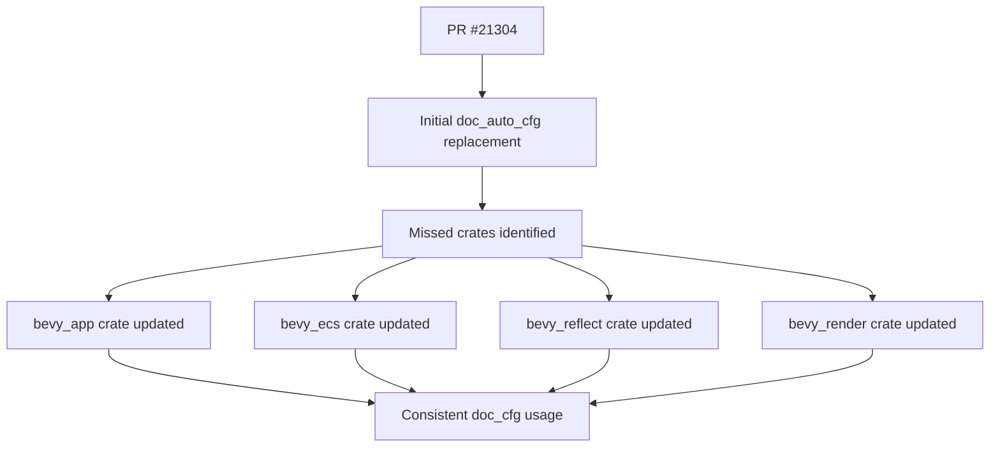

+++
title = "#21306 Replace `feature(doc_auto_cfg)` with `feature(doc_cfg)`, part 2"
date = "2025-09-30T00:00:00"
draft = false
template = "pull_request_page.html"
in_search_index = true

[taxonomies]
list_display = ["show"]

[extra]
current_language = "en"
available_languages = {"en" = { name = "English", url = "/pull_request/bevy/2025-09/pr-21306-en-20250930" }, "zh-cn" = { name = "中文", url = "/pull_request/bevy/2025-09/pr-21306-zh-cn-20250930" }}
labels = ["C-Docs", "A-Build-System"]
+++

# Title

## Basic Information
- **Title**: Replace `feature(doc_auto_cfg)` with `feature(doc_cfg)`, part 2
- **PR Link**: https://github.com/bevyengine/bevy/pull/21306
- **Author**: mockersf
- **Status**: MERGED
- **Labels**: C-Docs, A-Build-System
- **Created**: 2025-09-30T21:56:46Z
- **Merged**: 2025-09-30T22:41:34Z
- **Merged By**: james7132

## Description Translation
This is a follow-up to PR #21304 that addresses a few remaining instances where the `feature(doc_auto_cfg)` attribute needed to be replaced with `feature(doc_cfg)`. The solution simply changes these remaining occurrences.

## The Story of This Pull Request

This PR represents a straightforward cleanup task that continues work started in a previous pull request (#21304). The core issue involved updating Rust feature flags used for documentation generation across the Bevy codebase.

The problem stemmed from changes in Rust's documentation generation system. The `doc_auto_cfg` feature, which automatically generated documentation for conditional compilation features, was being replaced by the more stable `doc_cfg` feature. While PR #21304 addressed most instances of this transition, several key crates were missed during the initial implementation.

The solution approach was methodical and targeted. The developer identified the four remaining crates that still used the old feature flag and systematically updated each one. This required understanding how Rust's conditional compilation attributes work, particularly the `cfg_attr` macro that conditionally enables features based on documentation build contexts.

The implementation is minimal but important for maintaining consistency across the codebase. Each change follows the same pattern:

```rust
// Before:
#![cfg_attr(any(docsrs, docsrs_dep), feature(doc_auto_cfg, rustdoc_internals))]

// After:  
#![cfg_attr(any(docsrs, docsrs_dep), feature(doc_cfg, rustdoc_internals))]
```

From a technical perspective, this change affects how Rustdoc generates documentation for conditional compilation features. The `doc_cfg` feature provides more explicit control over how feature-gated APIs are documented, replacing the automatic behavior of `doc_auto_cfg`. This is particularly important for a large project like Bevy that has many feature-gated components.

The impact of these changes is primarily on the documentation build process. By standardizing on `doc_cfg`, the project ensures consistent documentation generation across all crates and maintains compatibility with evolving Rust documentation tools. This cleanup also prevents potential build issues that could arise from mixing different documentation feature flags.

## Visual Representation



## Key Files Changed

**crates/bevy_app/src/lib.rs** (+1/-1)
- This file contains core application framework code
- Changed the documentation feature flag from `doc_auto_cfg` to `doc_cfg`

```rust
// Before:
#![cfg_attr(any(docsrs, docsrs_dep), feature(doc_auto_cfg, rustdoc_internals))]

// After:
#![cfg_attr(any(docsrs, docsrs_dep), feature(doc_cfg, rustdoc_internals))]
```

**crates/bevy_ecs/src/lib.rs** (+1/-1)
- This file contains the Entity Component System core
- Updated the same documentation feature flag

```rust
// Before:
#![cfg_attr(any(docsrs, docsrs_dep), feature(doc_auto_cfg, rustdoc_internals))]

// After:
#![cfg_attr(any(docsrs, docsrs_dep), feature(doc_cfg, rustdoc_internals))]
```

**crates/bevy_reflect/src/lib.rs** (+1/-1)
- This file handles reflection system capabilities
- Applied the same documentation feature update

```rust
// Before:
#![cfg_attr(any(docsrs, docsrs_dep), feature(doc_auto_cfg, rustdoc_internals))]

// After:
#![cfg_attr(any(docsrs, docsrs_dep), feature(doc_cfg, rustdoc_internals))]
```

**crates/bevy_render/src/lib.rs** (+1/-1)
- This file contains rendering system infrastructure
- Completed the documentation feature flag standardization

```rust
// Before:
#![cfg_attr(any(docsrs, docsrs_dep), feature(doc_auto_cfg, rustdoc_internals))]

// After:
#![cfg_attr(any(docsrs, docsrs_dep), feature(doc_cfg, rustdoc_internals))]
```

## Further Reading

- [Rust RFC: `doc_cfg` and `doc_auto_cfg`](https://rust-lang.github.io/rfcs/2974-conditional-doc.html)
- [Rustdoc documentation on conditional compilation](https://doc.rust-lang.org/rustdoc/write-documentation/documentation-tests.html#conditional-compilation)
- [Bevy Engine documentation guidelines](https://github.com/bevyengine/bevy/blob/main/docs/plugins_guidelines.md#documentation)

# Full Code Diff
diff --git a/crates/bevy_app/src/lib.rs b/crates/bevy_app/src/lib.rs
index 188ba957f68b0..c626c6c73e838 100644
--- a/crates/bevy_app/src/lib.rs
+++ b/crates/bevy_app/src/lib.rs
@@ -5,7 +5,7 @@
         reason = "rustdoc_internals is needed for fake_variadic"
     )
 )]
-#![cfg_attr(any(docsrs, docsrs_dep), feature(doc_auto_cfg, rustdoc_internals))]
+#![cfg_attr(any(docsrs, docsrs_dep), feature(doc_cfg, rustdoc_internals))]
 #![forbid(unsafe_code)]
 #![doc(
     html_logo_url = "https://bevy.org/assets/icon.png",
diff --git a/crates/bevy_ecs/src/lib.rs b/crates/bevy_ecs/src/lib.rs
index d34932cb06751..2e9174bf2404c 100644
--- a/crates/bevy_ecs/src/lib.rs
+++ b/crates/bevy_ecs/src/lib.rs
@@ -10,7 +10,7 @@
         reason = "rustdoc_internals is needed for fake_variadic"
     )
 )]
-#![cfg_attr(any(docsrs, docsrs_dep), feature(doc_auto_cfg, rustdoc_internals))]
+#![cfg_attr(any(docsrs, docsrs_dep), feature(doc_cfg, rustdoc_internals))]
 #![expect(unsafe_code, reason = "Unsafe code is used to improve performance.")]
 #![doc(
     html_logo_url = "https://bevy.org/assets/icon.png",
diff --git a/crates/bevy_reflect/src/lib.rs b/crates/bevy_reflect/src/lib.rs
index 359b8aaad3b03..9649d23470b61 100644
--- a/crates/bevy_reflect/src/lib.rs
+++ b/crates/bevy_reflect/src/lib.rs
@@ -5,7 +5,7 @@
         reason = "rustdoc_internals is needed for fake_variadic"
     )
 )]
-#![cfg_attr(any(docsrs, docsrs_dep), feature(doc_auto_cfg, rustdoc_internals))]
+#![cfg_attr(any(docsrs, docsrs_dep), feature(doc_cfg, rustdoc_internals))]
 #![doc(
     html_logo_url = "https://bevy.org/assets/icon.png",
     html_favicon_url = "https://bevy.org/assets/icon.png"
diff --git a/crates/bevy_render/src/lib.rs b/crates/bevy_render/src/lib.rs
index 8fb4ff8c0a527..b3620c7e079fa 100644
--- a/crates/bevy_render/src/lib.rs
+++ b/crates/bevy_render/src/lib.rs
@@ -20,7 +20,7 @@
         reason = "rustdoc_internals is needed for fake_variadic"
     )
 )]
-#![cfg_attr(any(docsrs, docsrs_dep), feature(doc_auto_cfg, rustdoc_internals))]
+#![cfg_attr(any(docsrs, docsrs_dep), feature(doc_cfg, rustdoc_internals))]
 #![doc(
     html_logo_url = "https://bevy.org/assets/icon.png",
     html_favicon_url = "https://bevy.org/assets/icon.png"