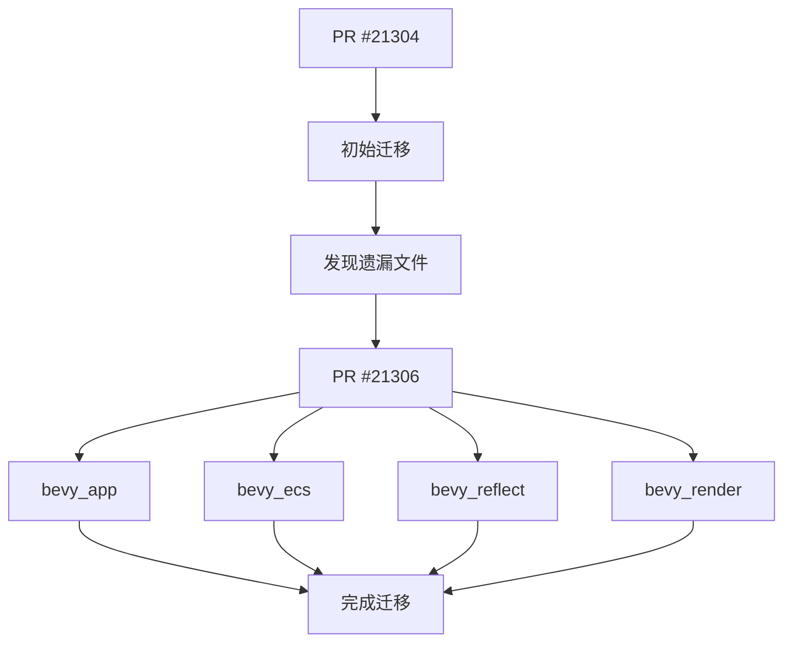

+++
title = "#21306 Replace `feature(doc_auto_cfg)` with `feature(doc_cfg)`, part 2"
date = "2025-09-30T00:00:00"
draft = false
template = "pull_request_page.html"
in_search_index = false

[extra]
current_language = "zh-cn"
available_languages = {"en" = { name = "English", url = "/pull_request/bevy/2025-09/pr-21306-en-20250930" }, "zh-cn" = { name = "中文", url = "/pull_request/bevy/2025-09/pr-21306-zh-cn-20250930" }}
+++

# Replace `feature(doc_auto_cfg)` with `feature(doc_cfg)`, part 2

## 基本信息
- **标题**: Replace `feature(doc_auto_cfg)` with `feature(doc_cfg)`, part 2
- **PR链接**: https://github.com/bevyengine/bevy/pull/21306
- **作者**: mockersf
- **状态**: 已合并
- **标签**: C-Docs, A-Build-System
- **创建时间**: 2025-09-30T21:56:46Z
- **合并时间**: 2025-09-30T22:41:34Z
- **合并者**: james7132

## 描述翻译

### 目标
- 在 #21304 中遗漏了一些

### 解决方案
- 修改它们

## 这个Pull Request的故事

这是一个简单的后续修复PR，是 #21304 的延续。这个PR的核心任务是完成之前未完成的Rust特性（feature）迁移工作。

### 问题和背景

在之前的PR #21304中，开发团队决定将代码库中使用的Rust文档生成特性从`doc_auto_cfg`迁移到`doc_cfg`。这两个特性都与Rust的条件编译文档生成相关：

- `doc_auto_cfg`：自动为条件编译的项生成文档
- `doc_cfg`：手动标记哪些条件编译项应该出现在文档中

由于某些原因，在第一次迁移时遗漏了四个关键的crate文件。这种遗漏会导致构建系统的不一致性，特别是在文档生成方面，可能会影响这些核心模块的文档质量。

### 解决方案方法

这个PR采用了最直接的方法：找到所有遗漏的文件，进行相同的特性替换。由于这只是一个简单的机械性替换，没有考虑复杂的替代方案。这种方法的优势在于保持代码库的一致性，确保所有模块都使用相同的文档生成配置。

### 实现细节

实现非常简单，只涉及四个核心模块的lib.rs文件中的单行修改。每个修改都是将：

```rust
#![cfg_attr(any(docsrs, docsrs_dep), feature(doc_auto_cfg, rustdoc_internals))]
```

替换为：

```rust
#![cfg_attr(any(docsrs, docsrs_dep), feature(doc_cfg, rustdoc_internals))]
```

这种修改使用了Rust的`cfg_attr`条件编译属性，确保这些特性只在文档构建时启用，而不会影响正常的编译过程。

### 技术洞察

这个修改体现了几个重要的工程实践：

1. **批量操作的一致性**：当进行大规模代码库修改时，确保所有相关文件都被正确更新
2. **条件编译的使用**：通过`cfg_attr(any(docsrs, docsrs_dep))`，这些特性只在文档构建时启用，避免了生产构建的污染
3. **渐进式迁移**：通过分批次（part 1和part 2）的方式进行迁移，降低了风险

### 影响

这个PR虽然看起来简单，但对项目的文档系统有实际影响：

- 确保所有核心模块使用一致的文档生成配置
- 避免了由于特性不一致导致的潜在构建问题
- 为后续的文档改进工作奠定了基础

从工程角度看，这种"清理"工作对于维护大型代码库的健康状态至关重要。

## 可视化表示



## 关键文件变更

### `crates/bevy_app/src/lib.rs`
**变更描述**: 更新文档生成特性配置
```rust
// 变更前:
#![cfg_attr(any(docsrs, docsrs_dep), feature(doc_auto_cfg, rustdoc_internals))]

// 变更后:
#![cfg_attr(any(docsrs, docsrs_dep), feature(doc_cfg, rustdoc_internals))]
```

### `crates/bevy_ecs/src/lib.rs`
**变更描述**: 更新ECS模块的文档特性
```rust
// 变更前:
#![cfg_attr(any(docsrs, docsrs_dep), feature(doc_auto_cfg, rustdoc_internals))]

// 变更后:
#![cfg_attr(any(docsrs, docsrs_dep), feature(doc_cfg, rustdoc_internals))]
```

### `crates/bevy_reflect/src/lib.rs`
**变更描述**: 更新反射系统的文档配置
```rust
// 变更前:
#![cfg_attr(any(docsrs, docsrs_dep), feature(doc_auto_cfg, rustdoc_internals))]

// 变更后:
#![cfg_attr(any(docsrs, docsrs_dep), feature(doc_cfg, rustdoc_internals))]
```

### `crates/bevy_render/src/lib.rs`
**变更描述**: 更新渲染模块的文档特性
```rust
// 变更前:
#![cfg_attr(any(docsrs, docsrs_dep), feature(doc_auto_cfg, rustdoc_internals))]

// 变更后:
#![cfg_attr(any(docsrs, docsrs_dep), feature(doc_cfg, rustdoc_internals))]
```

## 完整代码差异

```diff
diff --git a/crates/bevy_app/src/lib.rs b/crates/bevy_app/src/lib.rs
index 188ba957f68b0..c626c6c73e838 100644
--- a/crates/bevy_app/src/lib.rs
+++ b/crates/bevy_app/src/lib.rs
@@ -5,7 +5,7 @@
         reason = "rustdoc_internals is needed for fake_variadic"
     )
 )]
-#![cfg_attr(any(docsrs, docsrs_dep), feature(doc_auto_cfg, rustdoc_internals))]
+#![cfg_attr(any(docsrs, docsrs_dep), feature(doc_cfg, rustdoc_internals))]
 #![forbid(unsafe_code)]
 #![doc(
     html_logo_url = "https://bevy.org/assets/icon.png",
diff --git a/crates/bevy_ecs/src/lib.rs b/crates/bevy_ecs/src/lib.rs
index d34932cb06751..2e9174bf2404c 100644
--- a/crates/bevy_ecs/src/lib.rs
+++ b/crates/bevy_ecs/src/lib.rs
@@ -10,7 +10,7 @@
         reason = "rustdoc_internals is needed for fake_variadic"
     )
 )]
-#![cfg_attr(any(docsrs, docsrs_dep), feature(doc_auto_cfg, rustdoc_internals))]
+#![cfg_attr(any(docsrs, docsrs_dep), feature(doc_cfg, rustdoc_internals))]
 #![expect(unsafe_code, reason = "Unsafe code is used to improve performance.")]
 #![doc(
     html_logo_url = "https://bevy.org/assets/icon.png",
diff --git a/crates/bevy_reflect/src/lib.rs b/crates/bevy_reflect/src/lib.rs
index 359b8aaad3b03..9649d23470b61 100644
--- a/crates/bevy_reflect/src/lib.rs
+++ b/crates/bevy_reflect/src/lib.rs
@@ -5,7 +5,7 @@
         reason = "rustdoc_internals is needed for fake_variadic"
     )
 )]
-#![cfg_attr(any(docsrs, docsrs_dep), feature(doc_auto_cfg, rustdoc_internals))]
+#![cfg_attr(any(docsrs, docsrs_dep), feature(doc_cfg, rustdoc_internals))]
 #![doc(
     html_logo_url = "https://bevy.org/assets/icon.png",
     html_favicon_url = "https://bevy.org/assets/icon.png"
diff --git a/crates/bevy_render/src/lib.rs b/crates/bevy_render/src/lib.rs
index 8fb4ff8c0a527..b3620c7e079fa 100644
--- a/crates/bevy_render/src/lib.rs
+++ b/crates/bevy_render/src/lib.rs
@@ -20,7 +20,7 @@
         reason = "rustdoc_internals is needed for fake_variadic"
     )
 )]
-#![cfg_attr(any(docsrs, docsrs_dep), feature(doc_auto_cfg, rustdoc_internals))]
+#![cfg_attr(any(docsrs, docsrs_dep), feature(doc_cfg, rustdoc_internals))]
 #
- [Rust特性：doc_cfg](https://doc.rust-lang.org/unstable-book/language-features/doc-cfg.html)
- [Bevy引擎文档系统](https://bevyengine.org/learn/book/introduction/)
- [Rust条件编译最佳实践](https://doc.rust-lang.org/cargo/reference/features.html)