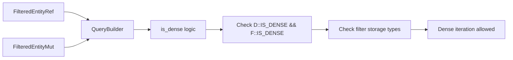

+++
title = "#16396 Allow dense iteration for FilteredEntity(Ref|Mut) in more cases."
date = "2025-10-30T00:00:00"
draft = false
template = "pull_request_page.html"
in_search_index = true

[taxonomies]
list_display = ["show"]

[extra]
current_language = "en"
available_languages = {"en" = { name = "English", url = "/pull_request/bevy/2025-10/pr-16396-en-20251030" }, "zh-cn" = { name = "中文", url = "/pull_request/bevy/2025-10/pr-16396-zh-cn-20251030" }}
labels = ["A-ECS", "C-Performance", "D-Complex", "D-Unsafe"]
+++

# Allow dense iteration for FilteredEntity(Ref|Mut) in more cases.

## Basic Information
- **Title**: Allow dense iteration for FilteredEntity(Ref|Mut) in more cases.
- **PR Link**: https://github.com/bevyengine/bevy/pull/16396
- **Author**: chescock
- **Status**: MERGED
- **Labels**: A-ECS, C-Performance, S-Ready-For-Final-Review, D-Complex, X-Uncontroversial, D-Unsafe
- **Created**: 2024-11-15T18:30:49Z
- **Merged**: 2025-10-30T03:19:01Z
- **Merged By**: alice-i-cecile

## Description Translation

# Objective

Improve the performance of some dynamic queries with `FilteredEntity(Ref|Mut)` by allowing dense iteration in more cases, and remove a call to the sort-of deprecated `Access::component_reads_and_writes()` method.  

`QueryBuilder` currently requires sparse iteration if any sparse set components may be read.  We do need sparse iteration if sparse set components are used in the filters, but `FilteredEntityRef` can still perform dense iteration when reading optional components or when reading all components.  

Note that the optional case is different from `Option`, which performs sparse iteration when the inner query is sparse so that it can cache whether the inner query matches for an entire archetype.  

## Solution

Change `FilteredEntity(Ref|Mut)` to have `IS_DENSE = true`.  It used to require sparse iteration in order to filter the `Access` for each archetype, but #15207 changed it to copy the entire access.  

Change `QueryBuilder::is_dense()` to check `D::IS_DENSE && F::IS_DENSE` instead of looking at the component reads and writes.  
`QueryBuilder::is_dense()` still checks the *filters*, so `builder.data::<&Sparse>()` will still cause sparse iteration, but `builder.data::<Option<&Sparse>>()` no longer will.  

I believe this is sound, even in the presence of query transmutes.  The only `WorldQuery` implementations that rely on a sparse query being sparse for soundness are `&`, `&mut`, `Ref`, and `Mut`, but they can only be transmuted to if the component is in the `required` set.  If a dynamic query has the component in the `required` set, then it appears in the filters and the query will use sparse iteration.  

Note that `Option` and `Has` will misbehave and report `None` and `false` for all entities if they do a dense query while wrapping a sparse component, but they won't cause UB.  And it's already possible to hit that case by transmuting from `Query<EntityMut>` to `Query<Option<&Sparse>>`. 

## The Story of This Pull Request

This PR addresses a performance optimization in Bevy's ECS system by enabling dense iteration for `FilteredEntityRef` and `FilteredEntityMut` queries in more scenarios. The core issue was that these query types were unnecessarily falling back to sparse iteration, which is slower, even when the query structure would allow for the more efficient dense iteration.

The problem stemmed from how `QueryBuilder` determined iteration strategy. Previously, it would check if any sparse set components might be read and pessimistically default to sparse iteration. However, after PR #15207 changed how `FilteredEntity(Ref|Mut)` handles access filtering, the original justification for requiring sparse iteration no longer applied. The system was being overly conservative.

The solution involved two key changes. First, the `IS_DENSE` constants for `FilteredEntityRef` and `FilteredEntityMut` were changed from `false` to `true`, indicating these query types can support dense iteration. Second, the logic in `QueryBuilder::is_dense()` was refactored to rely on the `IS_DENSE` flags of the query data and filter types, rather than examining component accesses directly.

This change enables an important performance optimization: queries with optional sparse components can now use dense iteration. For example, `builder.data::<Option<&Sparse>>()` will now use dense iteration, while `builder.data::<&Sparse>()` (which requires the sparse component) will still correctly use sparse iteration.

The implementation maintains safety through careful design. Only query types that absolutely require sparse iteration for correctness (like `&`, `&mut`, `Ref`, and `Mut` with sparse components) will force sparse iteration by adding components to the required set. The system ensures that if a query has sparse components in its required set, it will always use sparse iteration.

One known limitation is that `Option<&Sparse>` and `Has<Sparse>` queries may behave incorrectly when using dense iteration, reporting `None` and `false` for all entities. However, this doesn't cause undefined behavior and was already possible through query transmutation. The PR includes tests to document this behavior.

## Visual Representation



## Key Files Changed

### `crates/bevy_ecs/src/query/fetch.rs`
This file contains the core `WorldQuery` implementations. The key change was updating the `IS_DENSE` constants for the filtered entity types.

```rust
// Before:
const IS_DENSE: bool = false;

// After:
const IS_DENSE: bool = true;
```

This change tells the query system that `FilteredEntityRef` and `FilteredEntityMut` can support dense iteration, which is the foundation for the performance improvements.

### `crates/bevy_ecs/src/query/builder.rs`
The main logic change happened in the `is_dense()` method, which now uses a more straightforward approach based on type flags rather than component access analysis.

```rust
// Before:
let Ok(component_accesses) = self.access.access().try_iter_component_access() else {
    // Access is unbounded, pessimistically assume it's sparse.
    return false;
};

component_accesses
    .map(|access| *access.index())
    .all(is_dense)
    && !self.access.access().has_read_all_components()
    && self.access.with_filters().all(is_dense)
    && self.access.without_filters().all(is_dense)

// After:
D::IS_DENSE
    && F::IS_DENSE
    && self.access.with_filters().all(is_dense)
    && self.access.without_filters().all(is_dense)
```

The new implementation is cleaner and removes the dependency on the deprecated `Access::component_reads_and_writes()` method.

### `crates/bevy_ecs/src/query/state.rs`
This file handles query state management, particularly for query transmutation. The changes ensure that when queries are transmuted, the dense/sparse classification is preserved correctly.

```rust
// Key addition - preserving is_dense during transmutation:
let is_dense = self.is_dense;
```

The extensive comments explain the safety reasoning, particularly how the `FilteredAccess::required` set ensures that queries requiring sparse iteration remain sparse even after transmutation.

## Further Reading

- [Bevy ECS Documentation](https://bevyengine.org/learn/quick-start/ecs/) - Official Bevy ECS documentation
- [PR #15207](https://github.com/bevyengine/bevy/pull/15207) - Previous PR that changed how FilteredEntity access works
- [Issue #16397](https://github.com/bevyengine/bevy/issues/16397) - Related issue documenting the Option/Has limitation with dense iteration