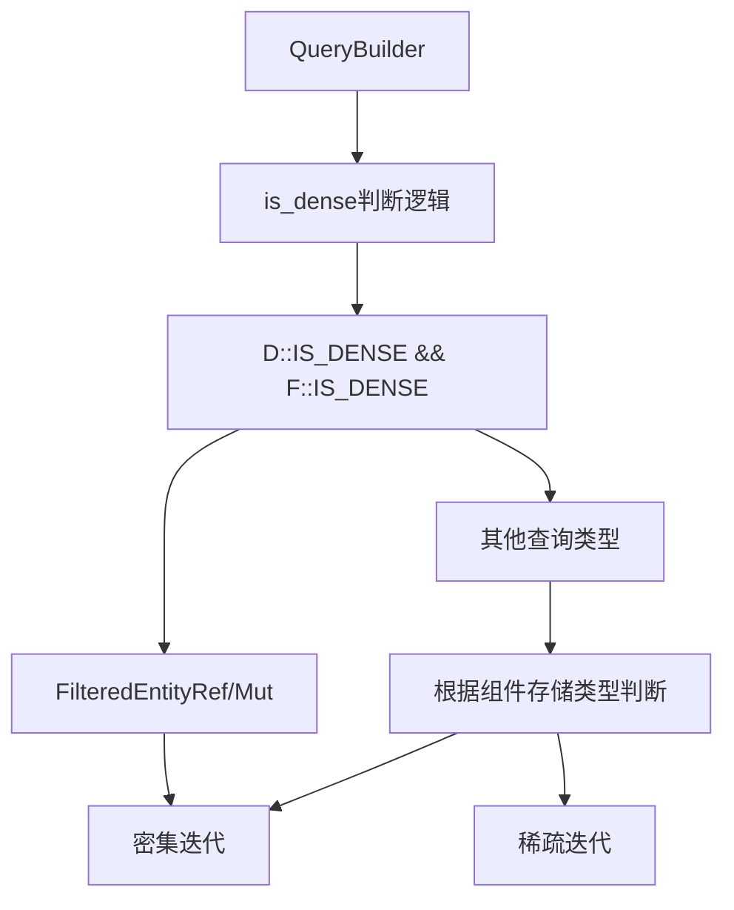

+++
title = "#16396 Allow dense iteration for FilteredEntity(Ref|Mut) in more cases."
date = "2025-10-30T00:00:00"
draft = false
template = "pull_request_page.html"
in_search_index = false

[extra]
current_language = "zh-cn"
available_languages = {"en" = { name = "English", url = "/pull_request/bevy/2025-10/pr-16396-en-20251030" }, "zh-cn" = { name = "中文", url = "/pull_request/bevy/2025-10/pr-16396-zh-cn-20251030" }}
labels = ["A-ECS", "C-Performance", "D-Complex", "D-Unsafe"]
+++

# Allow dense iteration for FilteredEntity(Ref|Mut) in more cases.

## Basic Information
- **Title**: Allow dense iteration for FilteredEntity(Ref|Mut) in more cases.
- **PR Link**: https://github.com/bevyengine/bevy/pull/16396
- **Author**: chescock
- **Status**: MERGED
- **Labels**: A-ECS, C-Performance, S-Ready-For-Final-Review, D-Complex, X-Uncontroversial, D-Unsafe
- **Created**: 2024-11-15T18:30:49Z
- **Merged**: 2025-10-30T03:19:01Z
- **Merged By**: alice-i-cecile

## Description Translation
**目标**

通过允许在更多情况下使用密集迭代来提高某些使用 `FilteredEntity(Ref|Mut)` 的动态查询的性能，并移除对已弃用的 `Access::component_reads_and_writes()` 方法的调用。

`QueryBuilder` 目前在任何稀疏集组件可能被读取时需要稀疏迭代。如果稀疏集组件在过滤器中被使用，我们确实需要稀疏迭代，但 `FilteredEntityRef` 在读取可选组件或读取所有组件时仍然可以执行密集迭代。

请注意，可选情况与 `Option` 不同，当内部查询是稀疏时，`Option` 执行稀疏迭代，以便它可以缓存整个原型中内部查询是否匹配。

**解决方案**

将 `FilteredEntity(Ref|Mut)` 的 `IS_DENSE` 改为 `true`。它过去需要稀疏迭代来过滤每个原型的 `Access`，但 #15207 将其更改为复制整个访问。

将 `QueryBuilder::is_dense()` 改为检查 `D::IS_DENSE && F::IS_DENSE`，而不是查看组件的读取和写入。
`QueryBuilder::is_dense()` 仍然检查*过滤器*，所以 `builder.data::<&Sparse>()` 仍然会导致稀疏迭代，但 `builder.data::<Option<&Sparse>>()` 不再会。

我相信这是安全的，即使在查询转换存在的情况下。唯一依赖稀疏查询必须是稀疏的才能保证安全性的 `WorldQuery` 实现是 `&`、`&mut`、`Ref` 和 `Mut`，但它们只能在组件位于 `required` 集合中时被转换。如果动态查询在 `required` 集合中有组件，那么它出现在过滤器中，查询将使用稀疏迭代。

请注意，`Option` 和 `Has` 在包装稀疏组件时执行密集查询会行为不当，对所有实体报告 `None` 和 `false`，但它们不会导致 UB。而且通过从 `Query<EntityMut>` 转换为 `Query<Option<&Sparse>>` 已经可以遇到这种情况。

## The Story of This Pull Request

这个 PR 解决了 Bevy ECS 中一个关于查询性能优化的问题。核心问题在于 `FilteredEntityRef` 和 `FilteredEntityMut` 查询类型在某些情况下不必要地使用了稀疏迭代，导致性能损失。

**问题根源**

在 Bevy 的 ECS 系统中，查询可以分为密集迭代和稀疏迭代两种模式。密集迭代通常更高效，因为它可以连续遍历内存中的组件数据。然而，当查询涉及稀疏集存储的组件时，必须使用稀疏迭代。

问题的关键在于 `QueryBuilder::is_dense()` 方法的判断逻辑。在修改前，该方法通过检查组件访问来确定是否使用密集迭代，这导致 `FilteredEntityRef` 和 `FilteredEntityMut` 总是使用稀疏迭代，即使在某些情况下密集迭代是可行的。

**技术突破点**

PR #15207 是一个关键的背景变更，它将 `FilteredEntity(Ref|Mut)` 从为每个原型过滤访问改为复制整个访问。这意味着这些查询类型不再需要稀疏迭代来执行访问过滤，为性能优化创造了条件。

**解决方案实现**

开发者采取了两个主要的技术改动：

1. 将 `FilteredEntityRef` 和 `FilteredEntityMut` 的 `IS_DENSE` 常量从 `false` 改为 `true`
2. 重写 `QueryBuilder::is_dense()` 方法，使用更精确的判断逻辑

新的判断逻辑基于查询数据和过滤器的 `IS_DENSE` 标志，而不是遍历组件访问。这允许在以下情况下使用密集迭代：
- 查询数据 (`D`) 和过滤器 (`F`) 都允许密集迭代
- 所有 `with` 和 `without` 过滤器都是密集的

**安全性和边界情况**

这个修改在安全性方面经过了仔细考虑。只有 `&`、`&mut`、`Ref` 和 `Mut` 这些查询类型依赖于稀疏查询必须是稀疏的来保证安全性，但它们只能在组件位于 `required` 集合中时被转换。如果动态查询在 `required` 集合中有组件，它会在过滤器中出现，查询将自动使用稀疏迭代。

一个已知的边界情况是 `Option<&Sparse>` 和 `Has<Sparse>` 在密集迭代时会错误地报告所有实体都不具有稀疏组件，但这不会导致未定义行为，只是一个功能性的 bug。

**性能影响**

这个修改显著提高了使用 `FilteredEntity(Ref|Mut)` 且不涉及稀疏集组件过滤的查询性能。现在这些查询可以使用更高效的密集迭代，而不是强制使用稀疏迭代。

## Visual Representation



## Key Files Changed

### `crates/bevy_ecs/src/query/fetch.rs` (+2/-2)

这个文件修改了 `FilteredEntityRef` 和 `FilteredEntityMut` 的 `IS_DENSE` 常量：

```rust
// 修改前:
const IS_DENSE: bool = false;

// 修改后:
const IS_DENSE: bool = true;
```

这个简单的修改是性能优化的核心，它允许这些查询类型在适当情况下使用密集迭代。

### `crates/bevy_ecs/src/query/builder.rs` (+39/-9)

这个文件重写了 `QueryBuilder::is_dense()` 方法的逻辑：

```rust
// 修改前:
let Ok(component_accesses) = self.access.access().try_iter_component_access() else {
    // Access is unbounded, pessimistically assume it's sparse.
    return false;
};

component_accesses
    .map(|access| *access.index())
    .all(is_dense)
    && !self.access.access().has_read_all_components()

// 修改后:
// Use dense iteration if possible, but fall back to sparse if we need to.
// Both `D` and `F` must allow dense iteration, just as for queries without dynamic filters.
// All `with` and `without` filters must be dense to ensure that we match all archetypes in a table.
// We also need to ensure that any sparse set components in `access.required` cause sparse iteration,
// but anything that adds a `required` component also adds a `with` filter.
//
// Note that `EntityRef` and `EntityMut` types, including `FilteredEntityRef` and `FilteredEntityMut`, have `D::IS_DENSE = true`.
// Calling `builder.data::<&Sparse>()` will add a filter and force sparse iteration,
// but calling `builder.data::<Option<&Sparse>>()` will still allow them to use dense iteration!
D::IS_DENSE
    && F::IS_DENSE
    && self.access.with_filters().all(is_dense)
    && self.access.without_filters().all(is_dense)
```

新的实现更加清晰和高效，直接检查查询类型和过滤器的密集性标志。

### `crates/bevy_ecs/src/query/state.rs` (+48/-2)

这个文件修改了查询状态转换时的密集性处理：

```rust
// 修改前:
let is_dense = self.is_dense;

// 修改后:
// For transmuted queries, the dense-ness of the query is equal to the dense-ness of the original query.
//
// We ensure soundness using `FilteredAccess::required`.
//
// Any `WorldQuery` implementations that rely on a query being sparse for soundness,
// including `&`, `&mut`, `Ref`, and `Mut`, will add a sparse set component to the `required` set.
// (`Option<&Sparse>` and `Has<Sparse>` will incorrectly report a component as never being present
// when doing dense iteration, but are not unsound.  See https://github.com/bevyengine/bevy/issues/16397)
//
// And any query with a sparse set component in the `required` set must have `is_dense = false`.
// For static queries, the `WorldQuery` implementations ensure this.
// For dynamic queries, anything that adds a `required` component also adds a `with` filter.
//
// The `component_access.is_subset()` check ensures that if the new query has a sparse set component in the `required` set,
// then the original query must also have had that component in the `required` set.
// Therefore, if the `WorldQuery` implementations rely on a query being sparse for soundness,
// then there was a sparse set component in the `required` set, and the query has `is_dense = false`.
let is_dense = self.is_dense;
```

这个修改确保了查询转换时的安全性，通过详细的注释解释了为什么保持原始查询的密集性是安全的。

## Further Reading

- [Bevy ECS Query Documentation](https://docs.rs/bevy_ecs/latest/bevy_ecs/query/index.html)
- [PR #15207: Improve dynamic query access control](https://github.com/bevyengine/bevy/pull/15207)
- [Issue #16397: Dense query behavior with Option and Has](https://github.com/bevyengine/bevy/issues/16397)
- [Bevy ECS Performance Guide](https://bevyengine.org/learn/quick-start/ecs/performance/)