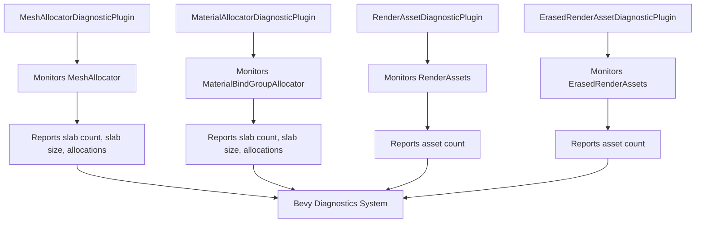

+++
title = "#19311 Render assets diagnostics"
date = "2025-10-15T00:00:00"
draft = false
template = "pull_request_page.html"
in_search_index = true

[taxonomies]
list_display = ["show"]

[extra]
current_language = "en"
available_languages = {"en" = { name = "English", url = "/pull_request/bevy/2025-10/pr-19311-en-20251015" }, "zh-cn" = { name = "中文", url = "/pull_request/bevy/2025-10/pr-19311-zh-cn-20251015" }}
labels = ["A-Rendering", "C-Testing", "A-Diagnostics", "D-Modest"]
+++

# Title
Render assets diagnostics

## Basic Information
- **Title**: Render assets diagnostics
- **PR Link**: https://github.com/bevyengine/bevy/pull/19311
- **Author**: hukasu
- **Status**: MERGED
- **Labels**: A-Rendering, S-Ready-For-Final-Review, C-Testing, A-Diagnostics, M-Needs-Release-Note, X-Uncontroversial, D-Modest
- **Created**: 2025-05-20T16:00:45Z
- **Merged**: 2025-10-14T20:13:31Z
- **Merged By**: alice-i-cecile

## Description Translation
# Objective

There have been problems with `MeshAllocator` and `MaterialBindGroupAllocator` losing track of asset changes, then it would be nice to have an automated way of checking if the number of allocations is growing uncontrollably.

## Solution

Create diagnostics that collect measurements of allocations from `MeshAllocator` and `MaterialBindGroupAllocator`, and number of render assets present

## Showcase

```rust
app.add_plugins(DefaultPlugins)
    .add_plugins((
        MeshAllocatorDiagnosticPlugin,
        MaterialAllocatorDiagnosticPlugin::<StandardMaterial>::default(),
        RenderAssetDiagnosticPlugin::<RenderMesh>::new(" render meshes"),
        RenderAssetDiagnosticPlugin::<GpuImage>::new(" gpu images"),
        // ImageMaterial is the name of the manual material used on the `manual_material` example
        ErasedRenderAssetDiagnosticPlugin::<ImageMaterial>::new(" image materials"),
    ));
```

If you also have `LogDiagnosticsPlugin`, the output looks something like this:

```
INFO bevy_diagnostic: mesh_allocator_allocations                                             :    4.000000 meshes (avg 4.000000 meshes)
INFO bevy_diagnostic: mesh_allocator_slabs                                                   :    4.000000 slabs (avg 4.000000 slabs)
INFO bevy_diagnostic: mesh_allocator_slabs_size                                              : 4194360.000000 bytes (avg 4194360.000000 bytes)
INFO bevy_diagnostic: material_allocator_allocations/bevy_pbr::pbr_material::StandardMaterial:   14.000000 materials (avg 14.000000 materials)
INFO bevy_diagnostic: material_allocator_slabs/bevy_pbr::pbr_material::StandardMaterial      :    1.000000 slabs (avg 1.000000 slabs)
INFO bevy_diagnostic: material_allocator_slabs_size/bevy_pbr::pbr_material::StandardMaterial :  576.000000 bytes (avg 576.000000 bytes)
INFO bevy_diagnostic: render_asset/bevy_render::mesh::RenderMesh                             :    5.000000 render meshes (avg 5.000000 render meshes)
INFO bevy_diagnostic: render_asset/bevy_render::texture::gpu_image::GpuImage                 :   10.000000 gpu images (avg 10.000000 gpu images)
INFO bevy_diagnostic: erased_render_asset/manual_material::ImageMaterial                     :    2.000000 image materials (avg 2.000000 image materials)
```

## The Story of This Pull Request

This PR addresses a practical monitoring problem in Bevy's rendering system. The core issue was that `MeshAllocator` and `MaterialBindGroupAllocator` could lose track of asset changes, making it difficult to detect when allocations were growing uncontrollably. Without proper visibility into these internal allocation patterns, developers had no automated way to identify memory leaks or performance degradation in their rendering systems.

The solution implemented follows Bevy's established diagnostic pattern while adding specific monitoring capabilities for render assets. The approach creates four new diagnostic plugins that work together to provide comprehensive monitoring:

1. `MeshAllocatorDiagnosticPlugin` - monitors mesh allocation patterns
2. `MaterialAllocatorDiagnosticPlugin` - monitors material allocation patterns  
3. `RenderAssetDiagnosticPlugin` - tracks render asset counts
4. `ErasedRenderAssetDiagnosticPlugin` - tracks erased render asset counts

The implementation required adding measurement capabilities to the existing allocators. For the `MeshAllocator`, this involved adding methods to query slab count, total slab size, and allocation count:

```rust
// In crates/bevy_render/src/mesh/allocator.rs
pub fn slab_count(&self) -> usize {
    self.slabs.len()
}

pub fn slabs_size(&self) -> u64 {
    self.slabs.iter().map(|slab| slab.1.buffer_size()).sum()
}

pub fn allocations(&self) -> usize {
    self.mesh_id_to_index_slab.len()
}
```

Similarly, for `MaterialBindGroupAllocator`, equivalent methods were added to measure bindless material allocations:

```rust
// In crates/bevy_pbr/src/material_bind_groups.rs
pub fn slab_count(&self) -> usize {
    match self {
        Self::Bindless(bless) => bless.slabs.len(),
        Self::NonBindless(_) => 0,
    }
}

pub fn slabs_size(&self) -> usize {
    match self {
        Self::Bindless(bless) => bless
            .slabs
            .iter()
            .flat_map(|slab| {
                slab.data_buffers
                    .iter()
                    .map(|(_, buffer)| buffer.buffer.len())
            })
            .sum(),
        Self::NonBindless(_) => 0,
    }
}

pub fn allocations(&self) -> u64 {
    match self {
        Self::Bindless(bless) => bless
            .slabs
            .iter()
            .map(|slab| u64::from(slab.allocated_resource_count))
            .sum(),
        Self::NonBindless(_) => 0,
    }
}
```

The diagnostic plugins follow a consistent pattern: they register diagnostics, create measurement resources with atomic counters, and set up systems to extract measurements from the render world and report them through Bevy's diagnostics system. The use of atomic types (`AtomicUsize`, `AtomicU64`) ensures thread-safe updates between the extract and main app systems.

Each plugin implementation follows the same architectural approach:

```rust
// Example from MaterialAllocatorDiagnosticPlugin
impl<M: Material> Plugin for MaterialAllocatorDiagnosticPlugin<M> {
    fn build(&self, app: &mut bevy_app::App) {
        app.register_diagnostic(
            Diagnostic::new(Self::slabs_diagnostic_path()).with_suffix(" slabs"),
        )
        .register_diagnostic(
            Diagnostic::new(Self::slabs_size_diagnostic_path()).with_suffix(" bytes"),
        )
        .register_diagnostic(
            Diagnostic::new(Self::allocations_diagnostic_path()).with_suffix(self.suffix),
        )
        .init_resource::<MaterialAllocatorMeasurements<M>>()
        .add_systems(PreUpdate, add_material_allocator_measurement::<M>);

        if let Some(render_app) = app.get_sub_app_mut(RenderApp) {
            render_app.add_systems(ExtractSchedule, measure_allocator::<M>);
        }
    }
}
```

The key technical insight here is the separation between measurement collection (in the render app's extract schedule) and diagnostic reporting (in the main app's pre-update). This ensures that measurements are captured at the right point in the frame and reported efficiently.

The impact of these changes is significant for developers working with complex rendering systems. They now have automated visibility into:
- Memory usage patterns of mesh and material allocators
- Growth trends in render asset counts
- Potential memory leaks in the rendering pipeline

The implementation is non-breaking and follows Bevy's established patterns, making it easy for developers to opt into this monitoring when needed.

## Visual Representation



## Key Files Changed

### `crates/bevy_pbr/src/diagnostic.rs` (+124/-0)
This new file implements the material allocator diagnostics plugin. It provides monitoring for material bind group allocators, tracking slab usage and allocation patterns for specific material types.

Key code:
```rust
pub struct MaterialAllocatorDiagnosticPlugin<M: Material> {
    suffix: &'static str,
    _phantom: PhantomData<M>,
}

impl<M: Material> Plugin for MaterialAllocatorDiagnosticPlugin<M> {
    fn build(&self, app: &mut bevy_app::App) {
        app.register_diagnostic(
            Diagnostic::new(Self::slabs_diagnostic_path()).with_suffix(" slabs"),
        )
        // ... additional diagnostics registration
        .init_resource::<MaterialAllocatorMeasurements<M>>()
        .add_systems(PreUpdate, add_material_allocator_measurement::<M>);

        if let Some(render_app) = app.get_sub_app_mut(RenderApp) {
            render_app.add_systems(ExtractSchedule, measure_allocator::<M>);
        }
    }
}
```

### `crates/bevy_render/src/diagnostic/mesh_allocator_diagnostic_plugin.rs` (+91/-0)
This new file implements diagnostics for the mesh allocator, tracking memory usage and allocation patterns for mesh data.

Key code:
```rust
pub struct MeshAllocatorDiagnosticPlugin;

impl Plugin for MeshAllocatorDiagnosticPlugin {
    fn build(&self, app: &mut bevy_app::App) {
        app.register_diagnostic(
            Diagnostic::new(MESH_ALLOCATOR_SLABS.clone()).with_suffix(" slabs"),
        )
        // ... additional diagnostics
        .init_resource::<MeshAllocatorMeasurements>()
        .add_systems(PreUpdate, add_mesh_allocator_measurement);

        if let Some(render_app) = app.get_sub_app_mut(RenderApp) {
            render_app.add_systems(ExtractSchedule, measure_allocator);
        }
    }
}
```

### `crates/bevy_render/src/diagnostic/erased_render_asset_diagnostic_plugin.rs` (+81/-0)
This new file provides diagnostics for erased render assets, which are render assets that have been type-erased for dynamic handling.

Key code:
```rust
pub struct ErasedRenderAssetDiagnosticPlugin<A: ErasedRenderAsset> {
    suffix: &'static str,
    _phantom: PhantomData<A>,
}

impl<A: ErasedRenderAsset> Plugin for ErasedRenderAssetDiagnosticPlugin<A> {
    fn build(&self, app: &mut bevy_app::App) {
        app.register_diagnostic(
            Diagnostic::new(Self::render_asset_diagnostic_path()).with_suffix(self.suffix),
        )
        .init_resource::<ErasedRenderAssetMeasurements<A>>()
        .add_systems(PreUpdate, add_erased_render_asset_measurement::<A>);

        if let Some(render_app) = app.get_sub_app_mut(RenderApp) {
            render_app.add_systems(ExtractSchedule, measure_erased_render_asset::<A>);
        }
    }
}
```

### `crates/bevy_render/src/diagnostic/render_asset_diagnostic_plugin.rs` (+77/-0)
This new file implements diagnostics for regular render assets, tracking the count of specific render asset types.

Key code:
```rust
pub struct RenderAssetDiagnosticPlugin<A: RenderAsset> {
    suffix: &'static str,
    _phantom: PhantomData<A>,
}

impl<A: RenderAsset> Plugin for RenderAssetDiagnosticPlugin<A> {
    fn build(&self, app: &mut bevy_app::App) {
        app.register_diagnostic(
            Diagnostic::new(Self::render_asset_diagnostic_path()).with_suffix(self.suffix),
        )
        .init_resource::<RenderAssetMeasurements<A>>()
        .add_systems(PreUpdate, add_render_asset_measurement::<A>);

        if let Some(render_app) = app.get_sub_app_mut(RenderApp) {
            render_app.add_systems(ExtractSchedule, measure_render_asset::<A>);
        }
    }
}
```

### `release-content/release-notes/render-assets-diagnostics.md` (+48/-0)
This new file contains comprehensive release notes explaining the new diagnostic capabilities and providing usage examples.

## Further Reading

- [Bevy Diagnostics System Documentation](https://docs.rs/bevy_diagnostic/latest/bevy_diagnostic/)
- [Bevy Render Assets Documentation](https://docs.rs/bevy_render/latest/bevy_render/render_asset/index.html)
- [Bevy ECS System Scheduling](https://bevyengine.org/learn/quick-start/ecs-intro/#system-scheduling)
- [Atomic Operations in Rust](https://doc.rust-lang.org/std/sync/atomic/)

# Full Code Diff
*(Provided in the original request)*