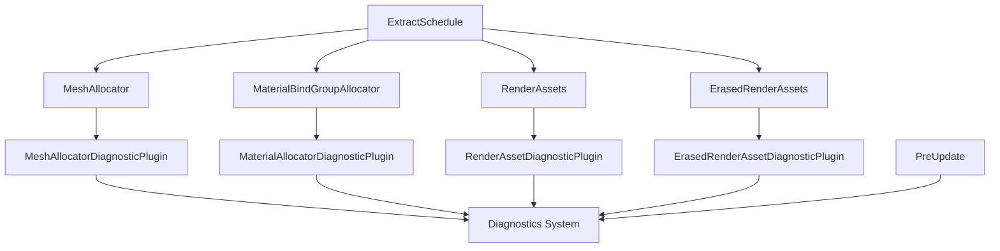

+++
title = "#19311 Render assets diagnostics"
date = "2025-10-15T00:00:00"
draft = false
template = "pull_request_page.html"
in_search_index = false

[extra]
current_language = "zh-cn"
available_languages = {"en" = { name = "English", url = "/pull_request/bevy/2025-10/pr-19311-en-20251015" }, "zh-cn" = { name = "中文", url = "/pull_request/bevy/2025-10/pr-19311-zh-cn-20251015" }}
+++

# Render assets diagnostics

## 基本信息
- **标题**: Render assets diagnostics
- **PR链接**: https://github.com/bevyengine/bevy/pull/19311
- **作者**: hukasu
- **状态**: 已合并
- **标签**: A-Rendering, S-Ready-For-Final-Review, C-Testing, A-Diagnostics, M-Needs-Release-Note, X-Uncontroversial, D-Modest
- **创建时间**: 2025-05-20T16:00:45Z
- **合并时间**: 2025-10-14T20:13:31Z
- **合并者**: alice-i-cecile

## 描述翻译

# 目标

`MeshAllocator` 和 `MaterialBindGroupAllocator` 在跟踪资产变化时存在问题，因此需要一个自动化的方法来检查分配数量是否失控增长。

## 解决方案

创建诊断工具，收集来自 `MeshAllocator` 和 `MaterialBindGroupAllocator` 的分配测量值，以及当前渲染资产的数量。

## 展示

```rust
app.add_plugins(DefaultPlugins)
    .add_plugins((
        MeshAllocatorDiagnosticPlugin,
        MaterialAllocatorDiagnosticPlugin::<StandardMaterial>::default(),
        RenderAssetDiagnosticPlugin::<RenderMesh>::new(" render meshes"),
        RenderAssetDiagnosticPlugin::<GpuImage>::new(" gpu images"),
        // ImageMaterial 是 `manual_material` 示例中使用的 manual material 的名称
        ErasedRenderAssetDiagnosticPlugin::<ImageMaterial>::new(" image materials"),
    ));
```

如果你还有 `LogDiagnosticsPlugin`，输出看起来会像这样：

```
INFO bevy_diagnostic: mesh_allocator_allocations                                             :    4.000000 meshes (avg 4.000000 meshes)
INFO bevy_diagnostic: mesh_allocator_slabs                                                   :    4.000000 slabs (avg 4.000000 slabs)
INFO bevy_diagnostic: mesh_allocator_slabs_size                                              : 4194360.000000 bytes (avg 4194360.000000 bytes)
INFO bevy_diagnostic: material_allocator_allocations/bevy_pbr::pbr_material::StandardMaterial:   14.000000 materials (avg 14.000000 materials)
INFO bevy_diagnostic: material_allocator_slabs/bevy_pbr::pbr_material::StandardMaterial      :    1.000000 slabs (avg 1.000000 slabs)
INFO bevy_diagnostic: material_allocator_slabs_size/bevy_pbr::pbr_material::StandardMaterial :  576.000000 bytes (avg 576.000000 bytes)
INFO bevy_diagnostic: render_asset/bevy_render::mesh::RenderMesh                             :    5.000000 render meshes (avg 5.000000 render meshes)
INFO bevy_diagnostic: render_asset/bevy_render::texture::gpu_image::GpuImage                 :   10.000000 gpu images (avg 10.000000 gpu images)
INFO bevy_diagnostic: erased_render_asset/manual_material::ImageMaterial                     :    2.000000 image materials (avg 2.000000 image materials)
```

## 这个PR的故事

### 问题背景和动机

在Bevy渲染系统中，`MeshAllocator`和`MaterialBindGroupAllocator`负责管理GPU内存中的网格和材质数据分配。这些分配器使用slab分配策略来高效管理内存，但在实际使用中，开发者发现很难监控这些分配器的状态，特别是在资产频繁变化时可能出现的内存泄漏或失控增长问题。

核心问题在于缺乏可视化的监控手段。当分配器失去对资产变化的跟踪时，开发人员无法及时发现内存使用异常，这可能导致性能下降甚至内存耗尽。现有的诊断系统虽然能监控其他系统指标，但缺少对渲染资产分配状态的专门监控。

### 解决方案架构

开发者hukasu设计了一套模块化的诊断插件系统，通过四个专门的诊断插件来监控不同类型的渲染资产：

1. `MeshAllocatorDiagnosticPlugin` - 监控网格分配器状态
2. `MaterialAllocatorDiagnosticPlugin` - 监控材质分配器状态  
3. `RenderAssetDiagnosticPlugin` - 监控普通渲染资产数量
4. `ErasedRenderAssetDiagnosticPlugin` - 监控擦除类型渲染资产数量

这些插件遵循Bevy的插件架构模式，每个插件都实现了`Plugin`trait，可以轻松集成到现有的应用系统中。设计上采用了类型参数化来支持不同的材质和资产类型，保持了系统的扩展性。

### 实现细节和技术考量

实现的关键在于如何在不影响渲染性能的情况下收集诊断数据。解决方案采用了双阶段数据收集模式：

在`ExtractSchedule`阶段，系统从实际的分配器和资产存储中收集原始数据：

```rust
// 在ExtractSchedule中测量分配器状态
fn measure_allocator(
    measurements: Extract<Res<MeshAllocatorMeasurements>>,
    allocator: Res<MeshAllocator>,
) {
    measurements
        .slabs
        .store(allocator.slab_count(), Ordering::Relaxed);
    measurements
        .slabs_size
        .store(allocator.slabs_size(), Ordering::Relaxed);
    measurements
        .allocations
        .store(allocator.allocations(), Ordering::Relaxed);
}
```

然后在`PreUpdate`阶段，这些数据被添加到诊断系统中：

```rust
// 在PreUpdate阶段添加测量值到诊断系统
fn add_mesh_allocator_measurement(
    mut diagnostics: Diagnostics,
    measurements: Res<MeshAllocatorMeasurements>,
) {
    diagnostics.add_measurement(&MESH_ALLOCATOR_SLABS, || {
        measurements.slabs.load(Ordering::Relaxed) as f64
    });
    // ... 其他指标
}
```

这种分离确保了诊断数据的收集不会阻塞渲染管线，同时保持了数据的实时性。

为了支持这些诊断功能，需要在现有的分配器中添加监控方法。在`MaterialBindGroupAllocator`中：

```rust
/// 获取bindless材质的slab分配数量，如果是[`Self::NonBindless`]则返回0
pub fn slab_count(&self) -> usize {
    match self {
        Self::Bindless(bless) => bless.slabs.len(),
        Self::NonBindless(_) => 0,
    }
}
```

类似的，在`MeshAllocator`中也添加了对应的监控方法：

```rust
/// 获取分配的slab数量
pub fn slab_count(&self) -> usize {
    self.slabs.len()
}

/// 获取所有分配的slab的总大小
pub fn slabs_size(&self) -> u64 {
    self.slabs.iter().map(|slab| slab.1.buffer_size()).sum()
}
```

### 线程安全和性能优化

考虑到多线程环境，实现中使用了原子操作来确保数据的一致性：

```rust
#[derive(Debug, Resource)]
struct MeshAllocatorMeasurements {
    slabs: AtomicUsize,
    slabs_size: AtomicU64,
    allocations: AtomicUsize,
}
```

使用`Ordering::Relaxed`内存序，因为这里不需要严格的同步语义，只需要保证数据的最终一致性即可。

### 配置灵活性

每个诊断插件都提供了灵活的配置选项，比如允许自定义诊断信息的后缀：

```rust
pub struct RenderAssetDiagnosticPlugin<A: RenderAsset> {
    suffix: &'static str,
    _phantom: PhantomData<A>,
}

impl<A: RenderAsset> RenderAssetDiagnosticPlugin<A> {
    pub fn new(suffix: &'static str) -> Self {
        Self {
            suffix,
            _phantom: PhantomData,
        }
    }
}
```

### 实际影响

这个PR为Bevy渲染系统提供了重要的可观测性工具。开发人员现在可以：

- 实时监控网格和材质的内存使用情况
- 及时发现内存泄漏和异常增长
- 优化资产加载和卸载策略
- 更好地理解渲染系统的内存行为

诊断输出的格式设计得清晰易读，与现有的`LogDiagnosticsPlugin`无缝集成，使得在生产环境和开发环境中都能方便地使用这些监控数据。

## 可视化表示



## 关键文件更改

### `crates/bevy_pbr/src/diagnostic.rs` (+124/-0)
新增材质分配器诊断插件实现，提供了对`MaterialBindGroupAllocator`的监控能力。

关键代码：
```rust
pub struct MaterialAllocatorDiagnosticPlugin<M: Material> {
    suffix: &'static str,
    _phantom: PhantomData<M>,
}

impl<M: Material> Plugin for MaterialAllocatorDiagnosticPlugin<M> {
    fn build(&self, app: &mut bevy_app::App) {
        app.register_diagnostic(
            Diagnostic::new(Self::slabs_diagnostic_path()).with_suffix(" slabs"),
        )
        // ... 注册其他诊断
        .init_resource::<MaterialAllocatorMeasurements<M>>()
        .add_systems(PreUpdate, add_material_allocator_measurement::<M>);

        if let Some(render_app) = app.get_sub_app_mut(RenderApp) {
            render_app.add_systems(ExtractSchedule, measure_allocator::<M>);
        }
    }
}
```

### `crates/bevy_render/src/diagnostic/mesh_allocator_diagnostic_plugin.rs` (+91/-0)
新增网格分配器诊断插件，监控`MeshAllocator`的状态。

关键代码：
```rust
pub struct MeshAllocatorDiagnosticPlugin;

impl Plugin for MeshAllocatorDiagnosticPlugin {
    fn build(&self, app: &mut bevy_app::App) {
        app.register_diagnostic(
            Diagnostic::new(MESH_ALLOCATOR_SLABS.clone()).with_suffix(" slabs"),
        )
        // ... 注册其他诊断
        .init_resource::<MeshAllocatorMeasurements>()
        .add_systems(PreUpdate, add_mesh_allocator_measurement);

        if let Some(render_app) = app.get_sub_app_mut(RenderApp) {
            render_app.add_systems(ExtractSchedule, measure_allocator);
        }
    }
}
```

### `crates/bevy_render/src/diagnostic/erased_render_asset_diagnostic_plugin.rs` (+81/-0)
新增擦除渲染资产诊断插件，用于监控共享相同擦除资产类型的渲染资产。

关键代码：
```rust
pub struct ErasedRenderAssetDiagnosticPlugin<A: ErasedRenderAsset> {
    suffix: &'static str,
    _phantom: PhantomData<A>,
}

impl<A: ErasedRenderAsset> Plugin for ErasedRenderAssetDiagnosticPlugin<A> {
    fn build(&self, app: &mut bevy_app::App) {
        app.register_diagnostic(
            Diagnostic::new(Self::render_asset_diagnostic_path()).with_suffix(self.suffix),
        )
        .init_resource::<ErasedRenderAssetMeasurements<A>>()
        .add_systems(PreUpdate, add_erased_render_asset_measurement::<A>);

        if let Some(render_app) = app.get_sub_app_mut(RenderApp) {
            render_app.add_systems(ExtractSchedule, measure_erased_render_asset::<A>);
        }
    }
}
```

### `crates/bevy_render/src/diagnostic/render_asset_diagnostic_plugin.rs` (+77/-0)
新增普通渲染资产诊断插件，监控特定类型渲染资产的数量。

关键代码：
```rust
pub struct RenderAssetDiagnosticPlugin<A: RenderAsset> {
    suffix: &'static str,
    _phantom: PhantomData<A>,
}

impl<A: RenderAsset> Plugin for RenderAssetDiagnosticPlugin<A> {
    fn build(&self, app: &mut bevy_app::App) {
        app.register_diagnostic(
            Diagnostic::new(Self::render_asset_diagnostic_path()).with_suffix(self.suffix),
        )
        .init_resource::<RenderAssetMeasurements<A>>()
        .add_systems(PreUpdate, add_render_asset_measurement::<A>);

        if let Some(render_app) = app.get_sub_app_mut(RenderApp) {
            render_app.add_systems(ExtractSchedule, measure_render_asset::<A>);
        }
    }
}
```

### `release-content/release-notes/render-assets-diagnostics.md` (+48/-0)
新增发布说明文档，详细说明了新功能的使用方法和输出示例。

## 进一步阅读

- [Bevy Diagnostics System Documentation](https://docs.rs/bevy_diagnostic/latest/bevy_diagnostic/) - Bevy诊断系统官方文档
- [Render Assets in Bevy](https://bevyengine.org/learn/quick-start/resources/) - Bevy渲染资产管理概念
- [Atomic Operations in Rust](https://doc.rust-lang.org/std/sync/atomic/) - Rust原子操作标准库文档
- [Plugin Architecture in Bevy](https://bevyengine.org/learn/quick-start/plugins/) - Bevy插件系统架构