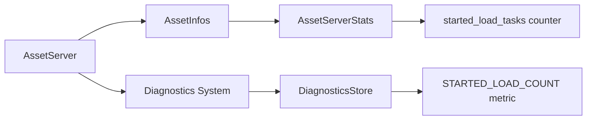

+++
title = "#20650 Add a way for the `AssetServer` to report how many asset loads started."
date = "2025-10-16T00:00:00"
draft = false
template = "pull_request_page.html"
in_search_index = true

[taxonomies]
list_display = ["show"]

[extra]
current_language = "en"
available_languages = {"en" = { name = "English", url = "/pull_request/bevy/2025-10/pr-20650-en-20251016" }, "zh-cn" = { name = "中文", url = "/pull_request/bevy/2025-10/pr-20650-zh-cn-20251016" }}
labels = ["A-Assets", "C-Usability", "C-Testing", "D-Straightforward"]
+++

# Title

## Basic Information
- **Title**: Add a way for the `AssetServer` to report how many asset loads started.
- **PR Link**: https://github.com/bevyengine/bevy/pull/20650
- **Author**: andriyDev
- **Status**: MERGED
- **Labels**: A-Assets, C-Usability, S-Ready-For-Final-Review, C-Testing, D-Straightforward
- **Created**: 2025-08-19T04:01:59Z
- **Merged**: 2025-10-16T18:52:08Z
- **Merged By**: alice-i-cecile

## Description Translation

# Objective

- `bevy_asset` needs better testing.
- It is useful to know how many load tasks the asset server launched. For example, #12756 is difficult to test because we are literally looking for whether another load **doesn't** happen.

## Solution

- Add an `AssetServerStats` struct.
- Increment the number of loads whenever we start a load.

## Testing

- Updated several tests to also assert about the number of expected loads.
- The testing here is not exhaustive, but should cover the common cases.
- I will be looking into more testing in the future.

## The Story of This Pull Request

This PR addresses a testing limitation in Bevy's asset system. The core problem was that while the asset system provides ways to track when assets are loaded or failed, there was no straightforward way to verify that a load operation was actually initiated. This made certain types of tests difficult - particularly negative tests where you need to ensure that an asset load does NOT occur under specific conditions.

The solution implemented here follows a straightforward pattern: add instrumentation to track when asset load tasks start. The developer created a new `AssetServerStats` struct to hold this metric and increment a counter at every point in the codebase where asset loading begins.

Looking at the implementation, the approach is comprehensive but surgical. The changes touch multiple loading pathways to ensure all types of asset loads are tracked:

1. Standard asset loading via `AssetServer::load()`
2. Untyped asset loading 
3. Folder loading
4. Asset reloading
5. Nested asset loading through loader builders

The implementation integrates with Bevy's existing diagnostic system, making the load count available through the standard diagnostics interface. This means the metric can be accessed through the `DiagnosticsStore` resource and is automatically available to diagnostic tools and UI.

One interesting aspect of the implementation is how it handles the diagnostic publishing. The system uses a run condition to only publish when the `DiagnosticsStore` resource exists, with a TODO comment noting they plan to use a more idiomatic approach once a related Bevy issue is resolved.

The testing updates demonstrate the practical value of this feature. Multiple existing tests were enhanced to verify the expected number of load operations, providing concrete examples of how this instrumentation can be used to validate asset loading behavior. The tests cover various scenarios including dependency chains, duplicate loading prevention, and folder loading.

From an architectural perspective, this change follows good practices by:
- Keeping the statistics collection internal to the asset system
- Using atomic increments where appropriate
- Maintaining separation of concerns by having a dedicated system for publishing diagnostics
- Not breaking existing APIs

The implementation is minimal and focused, adding only what's necessary to solve the stated problem without over-engineering.

## Visual Representation



## Key Files Changed

### `crates/bevy_asset/src/server/info.rs`
Added the core statistics tracking structure:

```rust
/// Tracks statistics of the asset server.
#[derive(Default, Clone, PartialEq, Eq)]
pub(crate) struct AssetServerStats {
    /// The number of load tasks that have been started.
    pub(crate) started_load_tasks: usize,
}
```

This struct is then added to the `AssetInfos` struct as a new field:
```rust
pub(crate) struct AssetInfos {
    // ... existing fields ...
    /// The stats that have collected during usage of the asset server.
    pub(crate) stats: AssetServerStats,
}
```

### `crates/bevy_asset/src/server/mod.rs`
Multiple loading methods were updated to increment the load counter:

```rust
// In load_untyped_internal method
infos.stats.started_load_tasks += 1;

// In load_untyped_async method  
self.write_infos().stats.started_load_tasks += 1;

// In load_untyped_with_meta_transform_internal method
infos.stats.started_load_tasks += 1;

// In reload_asset method (for each reload)
server.write_infos().stats.started_load_tasks += 1;

// In load_folder method
self.write_infos().stats.started_load_tasks += 1;
```

Added diagnostic constant and publishing system:
```rust
impl AssetServer {
    /// The number of loads that have been started by the server.
    pub const STARTED_LOAD_COUNT: DiagnosticPath = DiagnosticPath::const_new("started_load_count");
}

/// A system publishing asset server statistics to [`bevy_diagnostic`].
pub fn publish_asset_server_diagnostics(
    asset_server: Res<AssetServer>,
    mut diagnostics: Diagnostics,
) {
    let infos = asset_server.read_infos();
    diagnostics.add_measurement(&AssetServer::STARTED_LOAD_COUNT, || {
        infos.stats.started_load_tasks as _
    });
}
```

### `crates/bevy_asset/src/loader_builders.rs`
Updated nested loader to track load starts:

```rust
self.load_context
    .asset_server
    .write_infos()
    .stats
    .started_load_tasks += 1;
```

### `crates/bevy_asset/src/lib.rs`
Integrated the diagnostic system and updated tests:

```rust
// Added to AssetPlugin build method
.add_systems(
    PreUpdate,
    (
        handle_internal_asset_events.ambiguous_with_all(),
        // TODO: Remove the run condition and use `If` once
        // https://github.com/bevyengine/bevy/issues/21549 is resolved.
        publish_asset_server_diagnostics.run_if(resource_exists::<DiagnosticsStore>),
    )
        .chain(),
)
.register_diagnostic(Diagnostic::new(AssetServer::STARTED_LOAD_COUNT));
```

### `crates/bevy_asset/Cargo.toml`
Added dependency on bevy_diagnostic:
```toml
bevy_diagnostic = { path = "../bevy_diagnostic", version = "0.18.0-dev", default-features = false }
```

## Further Reading

- [Bevy Assets Documentation](https://bevyengine.org/learn/quick-start/resources/assets/)
- [Bevy Diagnostics System](https://docs.rs/bevy_diagnostic/latest/bevy_diagnostic/)
- [PR #12756](https://github.com/bevyengine/bevy/pull/12756) - Referenced as an example where this functionality would be useful
- [Bevy Testing Guide](https://bevyengine.org/learn/book/next-steps/testing/)