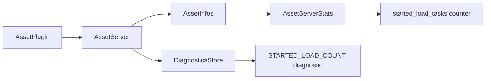

+++
title = "#20650 Add a way for the `AssetServer` to report how many asset loads started."
date = "2025-10-16T00:00:00"
draft = false
template = "pull_request_page.html"
in_search_index = false

[extra]
current_language = "zh-cn"
available_languages = {"en" = { name = "English", url = "/pull_request/bevy/2025-10/pr-20650-en-20251016" }, "zh-cn" = { name = "中文", url = "/pull_request/bevy/2025-10/pr-20650-zh-cn-20251016" }}
labels = ["A-Assets", "C-Usability", "C-Testing", "D-Straightforward"]
+++

# Add a way for the `AssetServer` to report how many asset loads started.

## Basic Information
- **Title**: Add a way for the `AssetServer` to report how many asset loads started.
- **PR Link**: https://github.com/bevyengine/bevy/pull/20650
- **Author**: andriyDev
- **Status**: MERGED
- **Labels**: A-Assets, C-Usability, S-Ready-For-Final-Review, C-Testing, D-Straightforward
- **Created**: 2025-08-19T04:01:59Z
- **Merged**: 2025-10-16T18:52:08Z
- **Merged By**: alice-i-cecile

## Description Translation
# 目标

- `bevy_asset` 需要更好的测试。
- 了解资产服务器启动了多少个加载任务很有用。例如，#12756 很难测试，因为我们实际上是在寻找另一个加载**没有**发生的情况。

## 解决方案

- 添加一个 `AssetServerStats` 结构体。
- 每当开始加载时递增加载数量。

## 测试

- 更新了几个测试，同时断言预期的加载数量。
- 这里的测试并不详尽，但应该覆盖了常见情况。
- 我将在未来研究更多测试。

## The Story of This Pull Request

这个PR起源于对bevy资产系统测试能力的实际需求。开发者发现，在某些情况下，测试资产加载行为变得很困难，特别是需要验证某个加载操作**没有**发生时。现有的测试框架缺乏对资产加载任务启动次数的追踪能力，这使得测试某些边界条件变得复杂。

核心问题在于：如何可靠地追踪资产服务器启动的加载任务数量？这对于验证去重逻辑、依赖管理以及各种加载优化策略至关重要。

解决方案采用了直接而实用的方法：在资产服务器中添加统计计数器。实现的关键是在所有启动资产加载的地方递增计数器，包括：
- 普通资产加载
- 依赖项加载
- 重新加载操作
- 文件夹加载

技术实现上，开发者创建了`AssetServerStats`结构体来封装统计数据，并在资产服务器的关键路径上插入计数器递增逻辑。为了便于测试访问这些数据，还集成了bevy的诊断系统，通过`DiagnosticsStore`暴露加载计数。

这个实现的一个关键设计决策是使用诊断系统而不是直接暴露内部状态。这样做的好处是：
- 遵循了bevy现有的监控模式
- 提供了标准化的数据访问接口
- 避免了直接暴露内部实现细节

在测试方面，PR更新了多个现有测试用例来验证加载计数器的行为。这些测试覆盖了常见场景，包括：
- 基本资产加载
- 依赖项加载
- 重复加载去重
- 文件夹加载

特别值得注意的是对并发场景的处理。在多线程环境下，文件夹加载的测试允许1-2个加载任务的竞争条件，这反映了实际使用中的复杂性。

## Visual Representation



## Key Files Changed

### `crates/bevy_asset/src/server/info.rs` (+9/-0)
添加了统计结构体定义：
```rust
/// Tracks statistics of the asset server.
#[derive(Default, Clone, PartialEq, Eq)]
pub(crate) struct AssetServerStats {
    /// The number of load tasks that have been started.
    pub(crate) started_load_tasks: usize,
}
```

### `crates/bevy_asset/src/server/mod.rs` (+38/-7)
在资产服务器中添加统计追踪和诊断发布：
```rust
impl AssetServer {
    /// The number of loads that have been started by the server.
    pub const STARTED_LOAD_COUNT: DiagnosticPath = DiagnosticPath::const_new("started_load_count");

    // 在多个加载方法中添加计数器递增：
    pub(crate) fn load_untyped_internal<G: Send + Sync + 'static>(
        &self,
        handle: UntypedHandle,
        path: AssetPath<'static>,
        mut infos: RwLockWriteGuard<AssetInfos>,
        guard: G,
    ) {
        infos.stats.started_load_tasks += 1;
        // ... 原有逻辑
    }

    pub async fn load_untyped_async<'a>(
        &self,
        path: impl Into<AssetPath<'a>>,
    ) -> Result<UntypedHandle, AssetLoadError> {
        self.write_infos().stats.started_load_tasks += 1;
        // ... 原有逻辑
    }
}

/// 添加诊断发布系统
pub fn publish_asset_server_diagnostics(
    asset_server: Res<AssetServer>,
    mut diagnostics: Diagnostics,
) {
    let infos = asset_server.read_infos();
    diagnostics.add_measurement(&AssetServer::STARTED_LOAD_COUNT, || {
        infos.stats.started_load_tasks as _
    });
}
```

### `crates/bevy_asset/src/loader_builders.rs` (+5/-0)
在直接加载器中添加计数器支持：
```rust
// 在NestedLoader的load_direct方法中
self.load_context
    .asset_server
    .write_infos()
    .stats
    .started_load_tasks += 1;
```

### `crates/bevy_asset/src/lib.rs` (+76/-3)
集成诊断系统和更新测试：
```rust
// 在AssetPlugin中注册诊断和系统
.register_diagnostic(Diagnostic::new(AssetServer::STARTED_LOAD_COUNT))
.add_systems(
    PreUpdate,
    (
        handle_internal_asset_events.ambiguous_with_all(),
        publish_asset_server_diagnostics.run_if(resource_exists::<DiagnosticsStore>),
    )
        .chain(),
)

// 在测试中添加辅助函数和断言
fn get_started_load_count(world: &World) -> usize {
    world
        .resource::<DiagnosticsStore>()
        .get_measurement(&AssetServer::STARTED_LOAD_COUNT)
        .map(|measurement| measurement.value as _)
        .unwrap_or_default()
}
```

### `crates/bevy_asset/Cargo.toml` (+1/-0)
添加诊断系统依赖：
```toml
bevy_diagnostic = { path = "../bevy_diagnostic", version = "0.18.0-dev", default-features = false }
```

## Further Reading

- [Bevy Assets Documentation](https://docs.rs/bevy_asset/latest/bevy_asset/) - 了解bevy资产系统的基本概念
- [Bevy Diagnostics System](https://docs.rs/bevy_diagnostic/latest/bevy_diagnostic/) - 诊断系统的使用指南
- [PR #12756](https://github.com/bevyengine/bevy/pull/12756) - 这个PR试图解决但难以测试的问题
- [Atomic Operations in Rust](https://doc.rust-lang.org/std/sync/atomic/) - 理解并发计数器的实现考虑