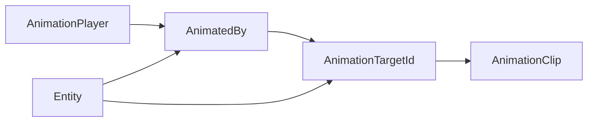

+++
title = "#20774 Split `AnimationTarget` into two components"
date = "2025-10-01T00:00:00"
draft = false
template = "pull_request_page.html"
in_search_index = true

[taxonomies]
list_display = ["show"]

[extra]
current_language = "en"
available_languages = {"en" = { name = "English", url = "/pull_request/bevy/2025-10/pr-20774-en-20251001" }, "zh-cn" = { name = "中文", url = "/pull_request/bevy/2025-10/pr-20774-zh-cn-20251001" }}
labels = ["C-Feature", "A-Animation", "D-Complex", "X-Contentious"]
+++

# Title

## Basic Information
- **Title**: Split `AnimationTarget` into two components
- **PR Link**: https://github.com/bevyengine/bevy/pull/20774
- **Author**: greeble-dev
- **Status**: MERGED
- **Labels**: C-Feature, S-Ready-For-Final-Review, A-Animation, M-Needs-Migration-Guide, D-Complex, X-Contentious
- **Created**: 2025-08-27T08:33:19Z
- **Merged**: 2025-10-01T19:54:59Z
- **Merged By**: alice-i-cecile

## Description Translation
The original description is in English, so it is included exactly as-is:

## Objective

Add flexibility by refactoring `AnimationTarget` into two separate components. This will smooth the path for future animation features.

## Background

`bevy_animation` animates entities by assigning them `AnimationTarget` components:

```rust
struct AnimationTarget {
    player: Entity,
    id: AnimationTargetId,
}
```

- `player: Entity` links to an entity that contains an `AnimationPlayer` component. An `AnimationPlayer` plays `AnimationClip` assets.
- `id: AnimationTargetId` identifies which tracks in an `AnimationClip` apply to the target entity.

When loading a glTF these components are automatically created. They can also be created manually.

## Problem

The two parts of `AnimationTarget` often go together but sometimes would be better separated:

1. I might want to calculate the `AnimationTargetId` first, but not link it up to an `AnimationPlayer` until later (see #18262 for an example).
2. I might want to use `AnimationTargetId` but not use `AnimationPlayer` - maybe I've got a different component that plays `AnimationClip`s.

In theory `player` could be left as `Entity::PLACEHOLDER`, but that's messy and will trigger a warning in `animate_targets`.

## Solution

This PR splits `AnimationTarget` into two components:

1. `AnimationTargetId` is just the original struct with a component derive.
2. `AnimationPlayerTarget` is a new unit struct `(Entity)`.

I'm not convinced `AnimationPlayerTarget` is a good name, but it does fit the usual source/target naming for entity relationships. `AnimationPlayerRef` was another candidate.

`AnimationPlayerTarget` could be a relationship target, but there would be a performance cost from making `AnimationPlayer` a relationship source. Maybe it's still a good idea, but that's probably best left to another PR.

### Performance

Profiled on `many_foxes` - difference was negligible.

### Testing

Examples `animated_mesh`, `animated_transform`, `animated_ui`, `animation_masks`, `eased_motion`, `scene_viewer`.

## Future

If this PR lands then I'll probably file a follow up that adds more flexibility to the the glTF loader creation of `AnimationTargetId` and `AnimationPlayer`. This will help #18262 and enable some other features.

## The Story of This Pull Request

This PR addresses a fundamental architectural limitation in Bevy's animation system. The original `AnimationTarget` component bundled two distinct concerns: target identification and player linkage. While this worked for basic cases, it created friction for more advanced animation workflows.

The core problem was that `AnimationTarget` combined two separate responsibilities:
1. **Target Identification**: The `AnimationTargetId` field identified which animation curves from an `AnimationClip` should apply to this entity
2. **Player Linkage**: The `player` field specified which `AnimationPlayer` entity should drive the animation

In practice, these two concerns often need to be managed independently. Developers might want to assign target IDs during asset loading but defer player assignment until runtime. Alternatively, they might want to use custom animation systems that don't rely on `AnimationPlayer` at all.

The solution involved a clean separation of concerns. The team split `AnimationTarget` into two dedicated components:
- `AnimationTargetId`: Now a standalone component that identifies which animation curves apply
- `AnimatedBy`: A new component that links to the controlling `AnimationPlayer`

This change required updating the core animation system to query for both components. The `animate_targets` system now looks for entities that have both an `AnimationTargetId` (identifying which curves to apply) and an `AnimatedBy` component (specifying which player drives the animation).

The implementation maintained backward compatibility through careful migration of all examples and internal systems. The glTF loader, which automatically creates animation targets during asset import, was updated to insert both components instead of the single `AnimationTarget`.

Performance testing showed negligible impact, which was expected since the change primarily affected component composition rather than algorithmic complexity. The team tested multiple animation examples to ensure the refactor didn't break existing functionality.

This refactor opens up several future possibilities:
- Deferred player assignment for dynamic animation systems
- Custom animation players that don't use the standard `AnimationPlayer` component
- More flexible animation retargeting workflows
- Better support for runtime bone addition/removal

The migration guide provides clear instructions for updating existing code, replacing single `AnimationTarget` components with tuples containing both new components.

## Visual Representation



## Key Files Changed

### `crates/bevy_animation/src/lib.rs` (+46/-55)

This is the core animation system where the component split was implemented. The changes include:

1. **Component Definition**: `AnimationTarget` was removed and replaced with two separate components
2. **System Updates**: The `animate_targets` system was updated to query for both components
3. **Type Aliases**: Updated `AnimationEntityMut` to exclude the new components

```rust
// Before:
#[derive(Clone, Copy, Component, Reflect)]
pub struct AnimationTarget {
    pub id: AnimationTargetId,
    pub player: Entity,
}

// After:
#[derive(Clone, Copy, Component, Reflect, Debug)]
pub struct AnimatedBy(#[entities] pub Entity);

// AnimationTargetId is now a component:
#[derive(Clone, Copy, PartialEq, Eq, PartialOrd, Ord, Reflect, Debug, Serialize, Deserialize, Component)]
pub struct AnimationTargetId(pub Uuid);
```

The system query was updated from:
```rust
mut targets: Query<(Entity, &AnimationTarget, AnimationEntityMut)>
```
to:
```rust
mut targets: Query<(Entity, &AnimationTargetId, &AnimatedBy, AnimationEntityMut)>
```

### `release-content/migration-guides/animation-target-refactor.md` (+23/-0)

This new file provides migration instructions for users upgrading their code:

```markdown
The `AnimationTarget` component has been split into two separate components.
`AnimationTarget::id` is now an `AnimationTargetId` component, and
`AnimationTarget::player` is now an `AnimatedBy` component.

Before:
```rust
entity.insert(AnimationTarget { id: AnimationTargetId(id), player: player_entity });
```

After:
```rust
entity.insert((AnimationTargetId(id), AnimatedBy(player_entity)));
```
```

### `crates/bevy_gltf/src/loader/mod.rs` (+5/-5)

The glTF loader was updated to create both components instead of the single `AnimationTarget`:

```rust
// Before:
node.insert(AnimationTarget {
    id: AnimationTargetId::from_names(animation_context.path.iter()),
    player: animation_context.root,
});

// After:
node.insert((
    AnimationTargetId::from_names(animation_context.path.iter()),
    AnimatedBy(animation_context.root),
));
```

### Example Files

Multiple example files were updated to use the new component structure:

**`examples/animation/animated_transform.rs`**:
```rust
// Before:
AnimationTarget {
    id: planet_animation_target_id,
    player: planet_entity,
}

// After:
(
    planet_animation_target_id,
    AnimatedBy(planet_entity),
)
```

**`examples/animation/animation_masks.rs`**:
Updated the system that removes animation components to handle both new components separately.

## Further Reading

- [Bevy Animation System Documentation](https://docs.rs/bevy_animation/latest/bevy_animation/)
- [Entity-Component System Patterns](https://en.wikipedia.org/wiki/Entity_component_system)
- [Composition over Inheritance](https://en.wikipedia.org/wiki/Composition_over_inheritance)
- [UUID Standard](https://en.wikipedia.org/wiki/Universally_unique_identifier)