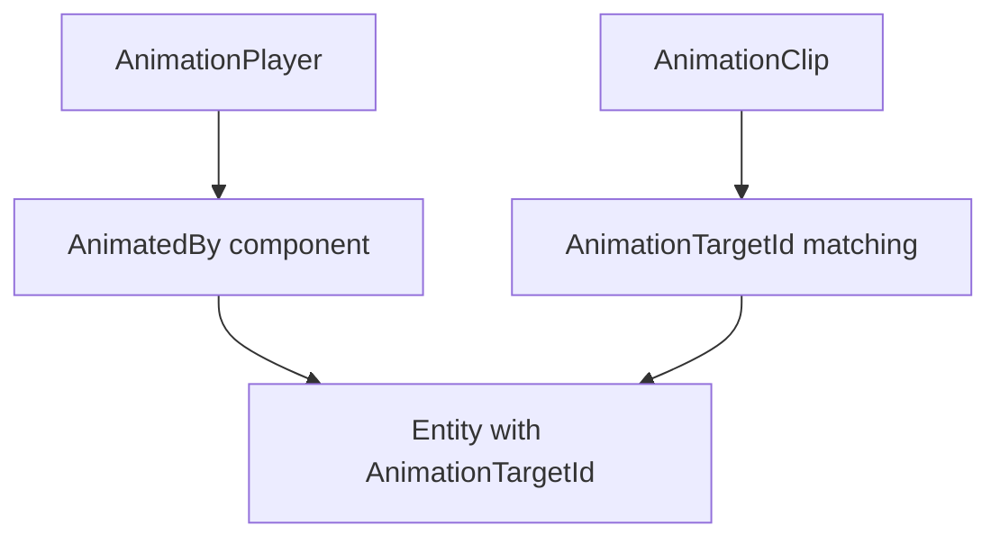

+++
title = "#20774 Split `AnimationTarget` into two components"
date = "2025-10-01T00:00:00"
draft = false
template = "pull_request_page.html"
in_search_index = false

[extra]
current_language = "zh-cn"
available_languages = {"en" = { name = "English", url = "/pull_request/bevy/2025-10/pr-20774-en-20251001" }, "zh-cn" = { name = "中文", url = "/pull_request/bevy/2025-10/pr-20774-zh-cn-20251001" }}
labels = ["C-Feature", "A-Animation", "D-Complex", "X-Contentious"]
+++

# Split `AnimationTarget` into two components

## Basic Information
- **Title**: Split `AnimationTarget` into two components
- **PR Link**: https://github.com/bevyengine/bevy/pull/20774
- **Author**: greeble-dev
- **Status**: MERGED
- **Labels**: C-Feature, S-Ready-For-Final-Review, A-Animation, M-Needs-Migration-Guide, D-Complex, X-Contentious
- **Created**: 2025-08-27T08:33:19Z
- **Merged**: 2025-10-01T19:54:59Z
- **Merged By**: alice-i-cecile

## Description Translation
### 目标
通过将 `AnimationTarget` 重构为两个独立的组件来增加灵活性。这将为未来的动画特性铺平道路。

### 背景
`bevy_animation` 通过为实体分配 `AnimationTarget` 组件来对它们进行动画处理：

```rust
struct AnimationTarget {
    player: Entity,
    id: AnimationTargetId,
}
```

- `player: Entity` 链接到一个包含 `AnimationPlayer` 组件的实体。`AnimationPlayer` 播放 `AnimationClip` 资产。
- `id: AnimationTargetId` 标识 `AnimationClip` 中的哪些轨道应用于目标实体。

加载glTF时，这些组件会自动创建。也可以手动创建。

### 问题
`AnimationTarget` 的两个部分经常一起使用，但有时最好分开：

1. 我可能想先计算 `AnimationTargetId`，但稍后再将其链接到 `AnimationPlayer`（参见 #18262 的例子）。
2. 我可能想使用 `AnimationTargetId` 但不使用 `AnimationPlayer`——也许我有另一个播放 `AnimationClip` 的组件。

理论上，可以将 `player` 留作 `Entity::PLACEHOLDER`，但这样很混乱，并且会在 `animate_targets` 中触发警告。

### 解决方案
此PR将 `AnimationTarget` 拆分为两个组件：

1. `AnimationTargetId` 只是原来的结构体，但加上了组件派生。
2. `AnimationPlayerTarget` 是一个新的单元结构体 `(Entity)`。

我不确定 `AnimationPlayerTarget` 是一个好名字，但它确实符合实体关系的通常源/目标命名。`AnimationPlayerRef` 是另一个候选。

`AnimationPlayerTarget` 可以是一个关系目标，但让 `AnimationPlayer` 成为关系源会有性能成本。也许这仍然是一个好主意，但最好留给另一个PR。

### 性能
在 `many_foxes` 上分析——差异可以忽略不计。

### 测试
示例 `animated_mesh`, `animated_transform`, `animated_ui`, `animation_masks`, `eased_motion`, `scene_viewer`。

### 未来
如果这个PR落地，我可能会提交一个后续PR，增加glTF加载器创建 `AnimationTargetId` 和 `AnimationPlayer` 的灵活性。这将帮助 #18262 并启用一些其他特性。

## The Story of This Pull Request

这个PR解决了一个在Bevy动画系统中存在的架构限制问题。原有的`AnimationTarget`组件将两个不同的概念耦合在一起：动画目标的标识符和该目标与动画播放器的关联关系。这种耦合在某些使用场景下造成了不必要的复杂性。

问题的核心在于，开发人员有时需要在不同的时间点处理这两个概念。例如，在实体初始化过程中，可能先知道某个实体应该具有特定的动画目标ID（基于其骨骼名称或路径），但此时还不知道应该将其关联到哪个动画播放器。或者，开发人员可能想要使用自定义的动画播放系统，但仍想利用Bevy现有的动画目标标识机制。

原有的实现将这两个概念硬编码在一个组件中：

```rust
pub struct AnimationTarget {
    pub id: AnimationTargetId,
    pub player: Entity,
}
```

这种设计导致了一些实际的问题。如果开发人员想要先设置动画目标ID但延迟设置播放器，他们必须使用占位符实体ID，这会在系统运行时产生警告，并且代码逻辑不够清晰。

解决方案是将这个单一的组件拆分为两个独立的组件。新的设计将`AnimationTargetId`提升为一个独立的组件，同时引入新的`AnimatedBy`组件来表示与动画播放器的关联：

```rust
#[derive(Clone, Copy, Component, Reflect, Debug)]
#[reflect(Component, Clone)]
pub struct AnimatedBy(#[entities] pub Entity);
```

这种分离带来了几个重要的优势。首先，它允许更灵活的实体配置顺序——现在可以先设置动画目标ID，然后在适当的时候再添加`AnimatedBy`组件。其次，它支持使用不同的动画播放系统，因为其他系统可以只依赖`AnimationTargetId`而不需要完整的`AnimationTarget`。

在实现层面，这个PR需要进行广泛的代码更新。核心的动画系统`animate_targets`现在需要查询两个独立的组件：

```rust
// 之前：
mut targets: Query<(Entity, &AnimationTarget, AnimationEntityMut)>

// 之后：  
mut targets: Query<(Entity, &AnimationTargetId, &AnimatedBy, AnimationEntityMut)>
```

这种变化在系统内部的处理逻辑也需要相应调整：

```rust
// 之前需要解构 AnimationTarget：
let &AnimationTarget { id: target_id, player: player_id } = target;

// 现在直接访问分离的组件：
for_each(|(entity, &target_id, &AnimatedBy(player_id), entity_mut)| {
```

这个重构还对多个示例进行了更新，展示了新的API使用方法。例如在`animated_transform.rs`中：

```rust
// 之前：
AnimationTarget { id: planet_animation_target_id, player: planet_entity }

// 之后：
(planet_animation_target_id, AnimatedBy(planet_entity))
```

性能方面，作者在`many_foxes`场景中进行了测试，发现性能差异可以忽略不计，这表明这种架构改进没有带来显著的运行时开销。

这个重构为未来的功能开发奠定了基础。正如作者提到的，这将有助于实现#18262中描述的功能，并可能支持更灵活的动画系统配置。组件分离的设计也使得系统更容易扩展和维护，因为每个组件现在都有单一的明确职责。

## Visual Representation



## Key Files Changed

### `crates/bevy_animation/src/lib.rs` (+46/-55)
这是核心的动画系统文件，包含了主要的组件定义和系统逻辑重构。

**主要变更：**
- 将`AnimationTarget`拆分为`AnimationTargetId`和`AnimatedBy`两个组件
- 更新了`animate_targets`系统以处理新的组件结构
- 改进了文档说明新的组件关系

```rust
// 之前：
#[derive(Clone, Copy, Component, Reflect)]
pub struct AnimationTarget {
    pub id: AnimationTargetId,
    pub player: Entity,
}

// 之后：
#[derive(Clone, Copy, Component, Reflect, Debug)]
pub struct AnimatedBy(#[entities] pub Entity);

// AnimationTargetId 现在是一个组件：
#[derive(Clone, Copy, PartialEq, Eq, PartialOrd, Ord, Reflect, Debug, Serialize, Deserialize, Component)]
pub struct AnimationTargetId(pub Uuid);
```

### `release-content/migration-guides/animation-target-refactor.md` (+23/-0)
新增的迁移指南，帮助用户从旧的API迁移到新的组件结构。

```markdown
Before:
entity.insert(AnimationTarget { id: AnimationTargetId(id), player: player_entity });

After:
entity.insert((AnimationTargetId(id), AnimatedBy(player_entity)));
```

### `crates/bevy_gltf/src/loader/mod.rs` (+5/-5)
更新了glTF加载器以使用新的组件结构。

```rust
// 之前：
node.insert(AnimationTarget {
    id: AnimationTargetId::from_names(animation_context.path.iter()),
    player: animation_context.root,
});

// 之后：
node.insert((
    AnimationTargetId::from_names(animation_context.path.iter()),
    AnimatedBy(animation_context.root),
));
```

### 示例文件更新
多个动画示例文件被更新以使用新的API，包括：
- `examples/animation/animated_transform.rs` (+7/-13)
- `examples/animation/animation_masks.rs` (+7/-4)
- 其他相关示例文件

这些更新展示了如何在实际代码中使用分离后的组件，并验证了新的API设计。

## Further Reading

- [Bevy Animation System Documentation](https://docs.rs/bevy_animation/latest/bevy_animation/)
- [Entity Component System (ECS) Pattern](https://en.wikipedia.org/wiki/Entity_component_system)
- [UUID Standard for Animation Target Identification](https://en.wikipedia.org/wiki/Universally_unique_identifier)
- PR #18262 - 相关的未来功能开发