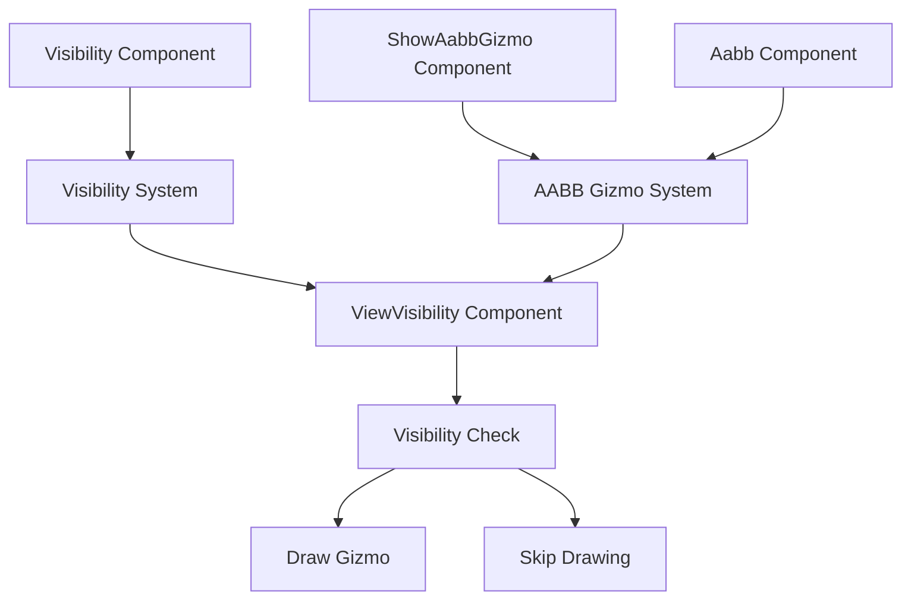

+++
title = "#20813 Draw aabb gizmos only for visible entities"
date = "2025-10-05T00:00:00"
draft = false
template = "pull_request_page.html"
in_search_index = true

[taxonomies]
list_display = ["show"]

[extra]
current_language = "en"
available_languages = {"en" = { name = "English", url = "/pull_request/bevy/2025-10/pr-20813-en-20251005" }, "zh-cn" = { name = "中文", url = "/pull_request/bevy/2025-10/pr-20813-zh-cn-20251005" }}
labels = ["C-Bug", "A-Rendering", "A-Gizmos", "D-Straightforward"]
+++

# Draw aabb gizmos only for visible entities

## Basic Information
- **Title**: Draw aabb gizmos only for visible entities
- **PR Link**: https://github.com/bevyengine/bevy/pull/20813
- **Author**: dloukadakis
- **Status**: MERGED
- **Labels**: C-Bug, A-Rendering, S-Ready-For-Final-Review, A-Gizmos, D-Straightforward
- **Created**: 2025-09-01T01:57:40Z
- **Merged**: 2025-10-05T17:54:36Z
- **Merged By**: alice-i-cecile

## Description Translation
- **Fix ViewVisibility not getting set**
- **Draw aabb gizmos only for visible entities**

# Objective

Fixes #14462

## Solution

Avoid drawing aabb gizmos for entities that are not visible.

## Testing

- Did you test these changes? If so, how?
```rust
fn setup(mut gizmo_config_store: ResMut<GizmoConfigStore>, mut commands: Commands) {
    commands.spawn(Camera2d);

    gizmo_config_store
        .config_mut::<AabbGizmoConfigGroup>()
        .1
        .draw_all = true;

    commands.spawn((
        Transform::IDENTITY,
        Aabb::from_min_max(Vec3::new(-20.0, -20.0, 0.0), Vec3::new(-10.0, -10.0, 0.0)),
        Visibility::Hidden,
    ));

    commands.spawn((
        Transform::IDENTITY,
        Aabb::from_min_max(Vec3::new(10.0, 10.0, 0.0), Vec3::new(20.0, 20.0, 0.0)),
        Visibility::Visible,
    ));
}
```

```rust
fn setup(mut commands: Commands) {
    commands.spawn(Camera2d);

    commands.spawn((
        Transform::IDENTITY,
        Aabb::from_min_max(Vec3::new(-20.0, -20.0, 0.0), Vec3::new(-10.0, -10.0, 0.0)),
        Visibility::Hidden,
        ShowAabbGizmo::default(),
    ));

    commands.spawn((
        Transform::IDENTITY,
        Aabb::from_min_max(Vec3::new(10.0, 10.0, 0.0), Vec3::new(20.0, 20.0, 0.0)),
        Visibility::Visible,
        ShowAabbGizmo::default(),
    ));
}
```

## The Story of This Pull Request

This PR addresses a specific rendering issue where AABB (Axis-Aligned Bounding Box) gizmos were being drawn for entities that should have been invisible. The problem stemmed from two interconnected issues in Bevy's visibility and rendering systems.

The core issue was in the `check_visibility` system in the camera module. Previously, this system required entities to have a `VisibilityClass` component to properly set their `ViewVisibility`. However, AABB gizmos could be enabled through configuration without requiring renderable components, which meant entities with only AABBs and no renderable components would never get their `ViewVisibility` properly set.

In `bevy_camera/src/visibility/mod.rs`, the key change was making the `VisibilityClass` query optional:

```rust
// Before:
&VisibilityClass,

// After:
Option<&VisibilityClass>,
```

This change allowed the system to handle entities that don't have a `VisibilityClass` component but still need visibility determination. The comment explains this workaround clearly: "The visibility class may be None here because AABB gizmos can be enabled via config without a renderable component being added to the entity. This workaround allows view visibility to be set for entities without a renderable component but that still need to render gizmos."

The second part of the fix was in the AABB gizmo drawing systems. Both `draw_aabbs` and `draw_all_aabbs` systems were modified to query for `ViewVisibility` and skip drawing for invisible entities:

```rust
// Before:
query: Query<(Entity, &Aabb, &GlobalTransform, &ShowAabbGizmo)>,

// After:
query: Query<(
    Entity,
    &Aabb,
    &GlobalTransform,
    Option<&ViewVisibility>,
    &ShowAabbGizmo,
)>,
```

The systems now include a visibility check:

```rust
if !is_visible(view_visibility) {
    continue;
}
```

Where `is_visible` is a new helper function:

```rust
fn is_visible(view_visibility: Option<&ViewVisibility>) -> bool {
    view_visibility.is_some_and(|v| v.get())
}
```

This approach ensures that AABB gizmos respect the entity's visibility state, whether it's controlled through the `Visibility` component or other visibility systems.

The testing examples provided in the PR description demonstrate the fix working correctly - hidden entities no longer display their AABB gizmos, while visible entities continue to show them as expected.

The system ordering was also updated to run after `MarkNewlyHiddenEntitiesInvisible` instead of `CalculateBounds`, ensuring that visibility calculations are complete before AABB gizmos are drawn.

## Visual Representation



## Key Files Changed

### `crates/bevy_camera/src/visibility/mod.rs` (+10/-5)

This file contains the core visibility system that determines which entities are visible to cameras. The change makes the `VisibilityClass` query optional, allowing entities without renderable components (like those with only AABBs) to still have their visibility properly calculated.

**Key changes:**
```rust
// Before:
Entity,
&InheritedVisibility,
&mut ViewVisibility,
&VisibilityClass,
Option<&RenderLayers>,
Option<&Aabb>,
&GlobalTransform,

// After:
Entity,
&InheritedVisibility,
&mut ViewVisibility,
Option<&VisibilityClass>,
Option<&RenderLayers>,
Option<&Aabb>,
&GlobalTransform,
```

### `crates/bevy_gizmos/src/aabb.rs` (+27/-6)

This file handles the drawing of AABB (Axis-Aligned Bounding Box) gizmos for debugging purposes. The changes add visibility checks to ensure gizmos are only drawn for visible entities.

**Key changes:**
```rust
// New helper function:
fn is_visible(view_visibility: Option<&ViewVisibility>) -> bool {
    view_visibility.is_some_and(|v| v.get())
}

// Updated system with visibility check:
for (entity, &aabb, &transform, view_visibility, gizmo) in &query {
    if !is_visible(view_visibility) {
        continue;
    }
    // ... drawing logic
}
```

## Further Reading

- [Bevy Visibility Documentation](https://docs.rs/bevy/latest/bevy/render/view/visibility/index.html)
- [Bevy Gizmos Documentation](https://docs.rs/bevy/latest/bevy/gizmos/index.html)
- [Entity Component System (ECS) Pattern](https://en.wikipedia.org/wiki/Entity_component_system)
- [Axis-Aligned Bounding Boxes (AABB)](https://en.wikipedia.org/wiki/Minimum_bounding_box#Axis-aligned_minimum_bounding_box)

# Full Code Diff
```diff
diff --git a/crates/bevy_camera/src/visibility/mod.rs b/crates/bevy_camera/src/visibility/mod.rs
index 8ac0ea4fe565d..2a5fdcb0c3e0b 100644
--- a/crates/bevy_camera/src/visibility/mod.rs
+++ b/crates/bevy_camera/src/visibility/mod.rs
@@ -528,7 +528,7 @@ pub fn check_visibility(
         Entity,
         &InheritedVisibility,
         &mut ViewVisibility,
-        &VisibilityClass,
+        Option<&VisibilityClass>,
         Option<&RenderLayers>,
         Option<&Aabb>,
         &GlobalTransform,
@@ -611,10 +611,15 @@ pub fn check_visibility(
                     view_visibility.set();
                 }
 
-                // Add the entity to the queue for all visibility classes the
-                // entity is in.
-                for visibility_class_id in visibility_class.iter() {
-                    queue.entry(*visibility_class_id).or_default().push(entity);
+                // The visibility class may be None here because AABB gizmos can be enabled via
+                // config without a renderable component being added to the entity. This workaround
+                // allows view visibility to be set for entities without a renderable component but
+                // that still need to render gizmos.
+                if let Some(visibility_class) = visibility_class {
+                    // Add the entity to the queue for all visibility classes the entity is in.
+                    for visibility_class_id in visibility_class.iter() {
+                        queue.entry(*visibility_class_id).or_default().push(entity);
+                    }
                 }
             },
         );
diff --git a/crates/bevy_gizmos/src/aabb.rs b/crates/bevy_gizmos/src/aabb.rs
index 64e66f57e3188..cd4341b6d1251 100644
--- a/crates/bevy_gizmos/src/aabb.rs
+++ b/crates/bevy_gizmos/src/aabb.rs
@@ -1,7 +1,7 @@
 //! A module adding debug visualization of [`Aabb`]s.
 
 use bevy_app::{Plugin, PostUpdate};
-use bevy_camera::primitives::Aabb;
+use bevy_camera::{primitives::Aabb, visibility::ViewVisibility};
 use bevy_color::{Color, Oklcha};
 use bevy_ecs::{
     component::Component,
@@ -36,7 +36,7 @@ impl Plugin for AabbGizmoPlugin {
                     config.config::<AabbGizmoConfigGroup>().1.draw_all
                 }),
             )
-                .after(bevy_camera::visibility::VisibilitySystems::CalculateBounds)
+                .after(bevy_camera::visibility::VisibilitySystems::MarkNewlyHiddenEntitiesInvisible)
                 .after(TransformSystems::Propagate),
         );
     }
@@ -70,10 +70,20 @@ pub struct ShowAabbGizmo {
 }
 
 fn draw_aabbs(
-    query: Query<(Entity, &Aabb, &GlobalTransform, &ShowAabbGizmo)>,
+    query: Query<(
+        Entity,
+        &Aabb,
+        &GlobalTransform,
+        Option<&ViewVisibility>,
+        &ShowAabbGizmo,
+    )>,
     mut gizmos: Gizmos<AabbGizmoConfigGroup>,
 ) {
-    for (entity, &aabb, &transform, gizmo) in &query {
+    for (entity, &aabb, &transform, view_visibility, gizmo) in &query {
+        if !is_visible(view_visibility) {
+            continue;
+        }
+
         let color = gizmo
             .color
             .or(gizmos.config_ext.default_color)
@@ -83,10 +93,17 @@ fn draw_aabbs(
 }
 
 fn draw_all_aabbs(
-    query: Query<(Entity, &Aabb, &GlobalTransform), Without<ShowAabbGizmo>>,
+    query: Query<
+        (Entity, &Aabb, &GlobalTransform, Option<&ViewVisibility>),
+        Without<ShowAabbGizmo>,
+    >,
     mut gizmos: Gizmos<AabbGizmoConfigGroup>,
 ) {
-    for (entity, &aabb, &transform) in &query {
+    for (entity, &aabb, &transform, view_visibility) in &query {
+        if !is_visible(view_visibility) {
+            continue;
+        }
+
         let color = gizmos
             .config_ext
             .default_color
@@ -95,6 +112,10 @@ fn draw_all_aabbs(
     }
 }
 
+fn is_visible(view_visibility: Option<&ViewVisibility>) -> bool {
+    view_visibility.is_some_and(|v| v.get())
+}
+
 fn color_from_entity(entity: Entity) -> Color {
     Oklcha::sequential_dispersed(entity.index()).into()
 }
```