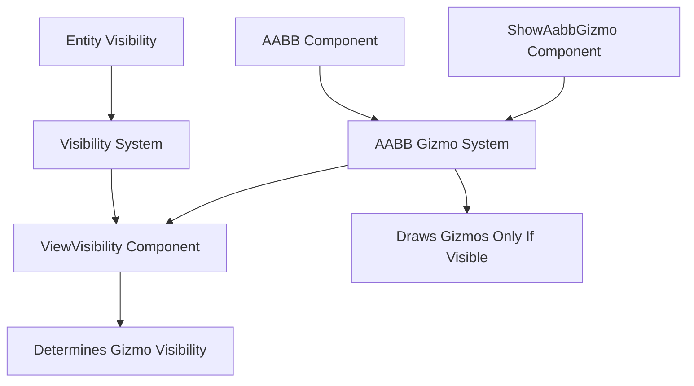

+++
title = "#20813 Draw aabb gizmos only for visible entities"
date = "2025-10-05T00:00:00"
draft = false
template = "pull_request_page.html"
in_search_index = false

[extra]
current_language = "zh-cn"
available_languages = {"en" = { name = "English", url = "/pull_request/bevy/2025-10/pr-20813-en-20251005" }, "zh-cn" = { name = "中文", url = "/pull_request/bevy/2025-10/pr-20813-zh-cn-20251005" }}
labels = ["C-Bug", "A-Rendering", "A-Gizmos", "D-Straightforward"]
+++

# Draw aabb gizmos only for visible entities

## Basic Information
- **Title**: Draw aabb gizmos only for visible entities  
- **PR Link**: https://github.com/bevyengine/bevy/pull/20813
- **Author**: dloukadakis
- **Status**: MERGED
- **Labels**: C-Bug, A-Rendering, S-Ready-For-Final-Review, A-Gizmos, D-Straightforward
- **Created**: 2025-09-01T01:57:40Z
- **Merged**: 2025-10-05T17:54:36Z
- **Merged By**: alice-i-cecile

## Description Translation
- **修复 ViewVisibility 未正确设置的问题**
- **仅对可见实体绘制 AABB 辅助线**

# 目标

修复 #14462

## 解决方案

避免为不可见实体绘制 AABB 辅助线。

## 测试

- 你测试过这些更改吗？如果是，如何测试的？
```rust
fn setup(mut gizmo_config_store: ResMut<GizmoConfigStore>, mut commands: Commands) {
    commands.spawn(Camera2d);

    gizmo_config_store
        .config_mut::<AabbGizmoConfigGroup>()
        .1
        .draw_all = true;

    commands.spawn((
        Transform::IDENTITY,
        Aabb::from_min_max(Vec3::new(-20.0, -20.0, 0.0), Vec3::new(-10.0, -10.0, 0.0)),
        Visibility::Hidden,
    ));

    commands.spawn((
        Transform::IDENTITY,
        Aabb::from_min_max(Vec3::new(10.0, 10.0, 0.0), Vec3::new(20.0, 20.0, 0.0)),
        Visibility::Visible,
    ));
}
```

```rust
fn setup(mut commands: Commands) {
    commands.spawn(Camera2d);

    commands.spawn((
        Transform::IDENTITY,
        Aabb::from_min_max(Vec3::new(-20.0, -20.0, 0.0), Vec3::new(-10.0, -10.0, 0.0)),
        Visibility::Hidden,
        ShowAabbGizmo::default(),
    ));

    commands.spawn((
        Transform::IDENTITY,
        Aabb::from_min_max(Vec3::new(10.0, 10.0, 0.0), Vec3::new(20.0, 20.0, 0.0)),
        Visibility::Visible,
        ShowAabbGizmo::default(),
    ));
}
```

## The Story of This Pull Request

这个 PR 解决了一个在 Bevy 引擎中关于 AABB（轴对齐包围盒）辅助线渲染的可见性问题。问题的核心在于，即使实体被标记为不可见，系统仍然会为其绘制 AABB 辅助线，这与用户的期望行为不符。

**问题根源**

在原始的实现中，AABB 辅助线绘制系统没有检查实体的可见性状态。系统会为所有拥有 AABB 组件的实体绘制辅助线，无论它们的 `Visibility` 组件设置如何。这导致了两个具体问题：

1. 当通过 `ShowAabbGizmo` 组件显式启用辅助线时，不可见实体仍然会显示辅助线
2. 当通过全局配置 `draw_all = true` 启用所有 AABB 辅助线时，同样会忽略可见性设置

**解决方案的实现**

修复方案涉及两个核心组件的修改：可见性计算系统和 AABB 辅助线绘制系统。

在 `bevy_camera/src/visibility/mod.rs` 中，修改了 `check_visibility` 系统的查询条件，将 `VisibilityClass` 从必需组件改为可选组件：

```rust
// 修改前:
&VisibilityClass,

// 修改后:
Option<&VisibilityClass>,
```

这个改变很重要，因为 AABB 辅助线可以通过配置启用，而不需要实体具有可渲染组件。原来的实现假设所有实体都有 `VisibilityClass` 组件，这对于只有 AABB 辅助线而没有其他渲染组件的实体是不成立的。

在 `bevy_gizmos/src/aabb.rs` 中，两个绘制系统都被更新以检查可见性：

```rust
// 在 draw_aabbs 系统中添加了可见性检查
for (entity, &aabb, &transform, view_visibility, gizmo) in &query {
    if !is_visible(view_visibility) {
        continue;
    }
    // 绘制逻辑...
}

// 在 draw_all_aabbs 系统中也添加了相同的检查
for (entity, &aabb, &transform, view_visibility) in &query {
    if !is_visible(view_visibility) {
        continue;
    }
    // 绘制逻辑...
}
```

新增的辅助函数 `is_visible` 提供了清晰的可见性检查逻辑：

```rust
fn is_visible(view_visibility: Option<&ViewVisibility>) -> bool {
    view_visibility.is_some_and(|v| v.get())
}
```

**系统调度调整**

为了确保可见性计算在 AABB 辅助线绘制之前完成，系统调度顺序也被调整：

```rust
// 修改前:
.after(bevy_camera::visibility::VisibilitySystems::CalculateBounds)

// 修改后:  
.after(bevy_camera::visibility::VisibilitySystems::MarkNewlyHiddenEntitiesInvisible)
```

这个调整确保 `ViewVisibility` 组件在绘制系统运行时已经更新到最新状态。

**技术洞察**

这个修复展示了 Bevy ECS 系统中组件查询的灵活性。通过将 `VisibilityClass` 改为可选查询，系统能够处理更广泛的实体类型，包括那些只有辅助线而没有传统渲染组件的实体。

同时，这个 PR 也体现了良好的系统边界设计 - 可见性计算和辅助线绘制是两个独立的关注点，通过共享的 `ViewVisibility` 组件进行通信，保持了系统的模块化。

## Visual Representation



## Key Files Changed

### `crates/bevy_camera/src/visibility/mod.rs` (+10/-5)

这个文件修改了可见性检查系统，使其能够正确处理没有 `VisibilityClass` 组件的实体。

**关键修改：**
```rust
// 修改前查询条件：
&VisibilityClass,

// 修改后查询条件：
Option<&VisibilityClass>,
```

```rust
// 修改前的处理逻辑：
for visibility_class_id in visibility_class.iter() {
    queue.entry(*visibility_class_id).or_default().push(entity);
}

// 修改后的处理逻辑：
if let Some(visibility_class) = visibility_class {
    for visibility_class_id in visibility_class.iter() {
        queue.entry(*visibility_class_id).or_default().push(entity);
    }
}
```

这个改变允许系统为没有渲染组件但需要显示辅助线的实体正确设置 `ViewVisibility`。

### `crates/bevy_gizmos/src/aabb.rs` (+27/-6)

这个文件修改了 AABB 辅助线绘制系统，添加了可见性检查。

**关键修改：**
```rust
// 在查询中添加了 ViewVisibility
fn draw_aabbs(
    query: Query<(
        Entity,
        &Aabb,
        &GlobalTransform,
        Option<&ViewVisibility>,  // 新增
        &ShowAabbGizmo,
    )>,
    mut gizmos: Gizmos<AabbGizmoConfigGroup>,
) {
    for (entity, &aabb, &transform, view_visibility, gizmo) in &query {
        if !is_visible(view_visibility) {  // 新增可见性检查
            continue;
        }
        // 原有的绘制逻辑...
    }
}
```

```rust
// 新增的可见性检查辅助函数
fn is_visible(view_visibility: Option<&ViewVisibility>) -> bool {
    view_visibility.is_some_and(|v| v.get())
}
```

这些修改确保系统只在实体可见时绘制 AABB 辅助线。

## Further Reading

- [Bevy Gizmos Documentation](https://docs.rs/bevy_gizmos/latest/bevy_gizmos/) - Bevy 辅助线系统的官方文档
- [Entity Component System (ECS) Pattern](https://bevy-cheatbook.github.io/programming/ecs-intro.html) - Bevy ECS 系统介绍
- [Visibility and Rendering in Bevy](https://bevy-cheatbook.github.io/features/visibility.html) - Bevy 可见性系统的工作原理