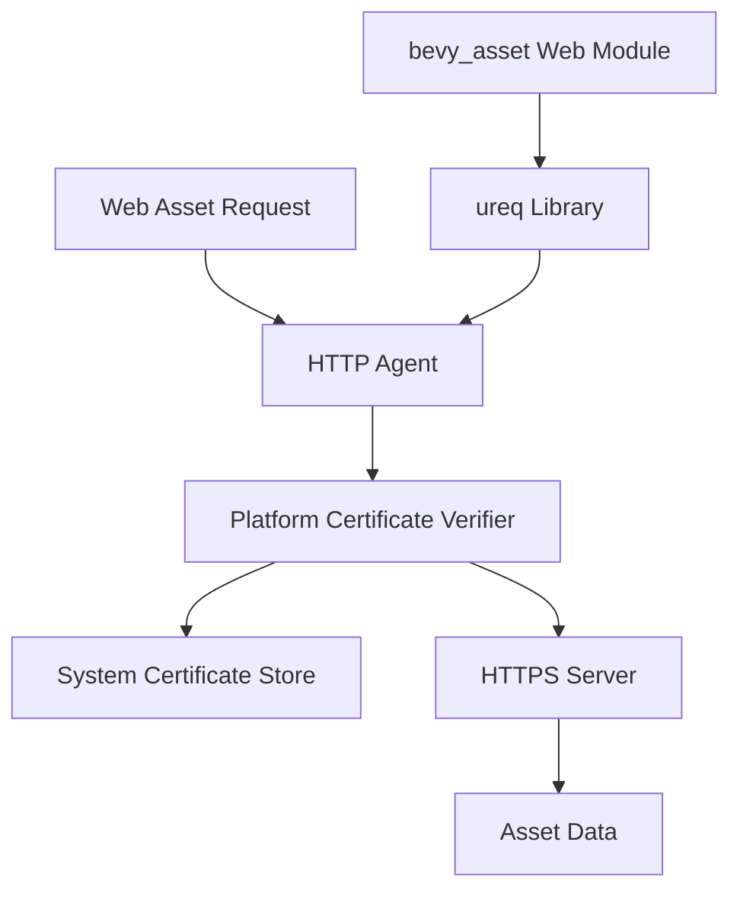

+++
title = "#20825 Configure ureq to use platform-verifier for web assets"
date = "2025-10-25T00:00:00"
draft = false
template = "pull_request_page.html"
in_search_index = true

[taxonomies]
list_display = ["show"]

[extra]
current_language = "en"
available_languages = {"en" = { name = "English", url = "/pull_request/bevy/2025-10/pr-20825-en-20251025" }, "zh-cn" = { name = "中文", url = "/pull_request/bevy/2025-10/pr-20825-zh-cn-20251025" }}
labels = ["C-Bug", "A-Assets"]
+++

# Configure ureq to use platform-verifier for web assets

## Basic Information
- **Title**: Configure ureq to use platform-verifier for web assets
- **PR Link**: https://github.com/bevyengine/bevy/pull/20825
- **Author**: jf908
- **Status**: MERGED
- **Labels**: C-Bug, A-Assets, S-Ready-For-Final-Review
- **Created**: 2025-09-02T11:08:09Z
- **Merged**: 2025-10-25T08:14:56Z
- **Merged By**: mockersf

## Description Translation
# Objective

- Fixes #20803
- See issue for motivations on this change

## Solution

- Use ureq's `platform-verifier` feature and enable it in the agent config.

I've gone the simple route and made this non-configurable, for now at least.

The downside of this change is that you can longer use webpki-roots but if bevy only supports one certificate verification method then I think platform-verifier is the more sensible option.

## Testing

- Tested the web_asset example on Windows and macOS

## The Story of This Pull Request

This PR addresses a certificate verification issue that was preventing Bevy from loading web assets over HTTPS in certain environments. The problem stemmed from how the ureq HTTP client was configured to validate SSL certificates when fetching assets from web servers.

The core issue was that Bevy's web asset loader used ureq with its default certificate verification setup, which relies on `webpki-roots` - a set of root certificates bundled with the application. This approach has limitations because it doesn't automatically pick up system-wide certificate updates or include custom certificates that users might have installed on their systems.

The solution implemented here takes a more robust approach by switching to ureq's `platform-verifier` feature. This feature delegates certificate validation to the operating system's native certificate store, which provides several advantages:

1. **Automatic updates**: System certificate updates are automatically applied without requiring Bevy updates
2. **Custom certificates**: Any custom certificates installed in the system store are automatically recognized
3. **Platform consistency**: Certificate validation behaves consistently with other applications on the same system

The implementation required changes in two key areas. First, the Cargo.toml dependency configuration needed to enable the new feature. Second, the HTTP agent configuration in the web asset loader needed to be updated to use the platform verifier.

One important engineering consideration was the trade-off between configurability and simplicity. The author explicitly chose to make this non-configurable for now, recognizing that having a single, well-tested certificate verification method is preferable to maintaining multiple configurations. This decision reduces complexity and ensures consistent behavior across all Bevy applications.

The changes were tested on both Windows and macOS to verify that the platform verifier works correctly across different operating systems. This cross-platform testing was crucial since the platform verifier relies on OS-specific certificate stores.

## Visual Representation



## Key Files Changed

### `crates/bevy_asset/Cargo.toml`
This file was modified to add the `platform-verifier` feature to ureq when the `https` feature is enabled.

```toml
# Before:
https = ["blocking", "ureq", "ureq/rustls"]

# After:  
https = ["blocking", "ureq", "ureq/rustls", "ureq/platform-verifier"]
```

This change ensures that when Bevy is compiled with HTTPS support, it includes ureq's platform certificate verification capabilities.

### `crates/bevy_asset/src/io/web.rs`
The main implementation change was in the HTTP agent configuration, where the TLS configuration was updated to use the platform certificate verifier.

```rust
// Before:
static AGENT: LazyLock<Agent> = LazyLock::new(|| Agent::config_builder().build().new_agent());

// After:
static AGENT: LazyLock<Agent> = LazyLock::new(|| {
    Agent::config_builder()
        .tls_config(
            TlsConfig::builder()
                .root_certs(RootCerts::PlatformVerifier)
                .build(),
        )
        .build()
        .new_agent()
});
```

The key addition is the `.tls_config()` call that explicitly configures ureq to use `RootCerts::PlatformVerifier` instead of the default certificate store. This change ensures that all HTTPS requests made by the web asset loader will validate certificates against the system's certificate store.

## Further Reading

- [ureq TLS Configuration Documentation](https://docs.rs/ureq/latest/ureq/struct.TlsConfig.html)
- [Rust TLS Certificate Verification Patterns](https://docs.rs/rustls/latest/rustls/struct.ClientConfig.html)
- [Bevy Asset System Documentation](https://bevyengine.org/learn/books/assets/)
- [Platform Certificate Stores Overview](https://en.wikipedia.org/wiki/Certificate_store)

# Full Code Diff
```diff
diff --git a/crates/bevy_asset/Cargo.toml b/crates/bevy_asset/Cargo.toml
index b4797dd4c8a7d..7c3c25cf29b68 100644
--- a/crates/bevy_asset/Cargo.toml
+++ b/crates/bevy_asset/Cargo.toml
@@ -15,7 +15,7 @@ file_watcher = ["notify-debouncer-full", "watch", "multi_threaded"]
 embedded_watcher = ["file_watcher"]
 multi_threaded = ["bevy_tasks/multi_threaded"]
 http = ["blocking", "ureq"]
-https = ["blocking", "ureq", "ureq/rustls"]
+https = ["blocking", "ureq", "ureq/rustls", "ureq/platform-verifier"]
 web_asset_cache = []
 asset_processor = []
 watch = []
diff --git a/crates/bevy_asset/src/io/web.rs b/crates/bevy_asset/src/io/web.rs
index 20aaafd20e8c7..15a684dadbc6a 100644
--- a/crates/bevy_asset/src/io/web.rs
+++ b/crates/bevy_asset/src/io/web.rs
@@ -138,9 +138,19 @@ async fn get(path: PathBuf) -> Result<Box<dyn Reader>, AssetReaderError> {
     if let Some(data) = web_asset_cache::try_load_from_cache(str_path).await? {
         return Ok(Box::new(VecReader::new(data)));
     }
+    use ureq::tls::{RootCerts, TlsConfig};
     use ureq::Agent;
 
-    static AGENT: LazyLock<Agent> = LazyLock::new(|| Agent::config_builder().build().new_agent());
+    static AGENT: LazyLock<Agent> = LazyLock::new(|| {
+        Agent::config_builder()
+            .tls_config(
+                TlsConfig::builder()
+                    .root_certs(RootCerts::PlatformVerifier)
+                    .build(),
+            )
+            .build()
+            .new_agent()
+    });
 
     let uri = str_path.to_owned();
     // Use [`unblock`] to run the http request on a separately spawned thread as to not block bevy's
```