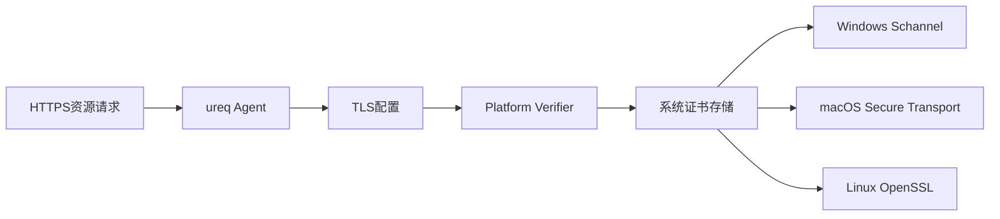

+++
title = "#20825 Configure ureq to use platform-verifier for web assets"
date = "2025-10-25T00:00:00"
draft = false
template = "pull_request_page.html"
in_search_index = false

[extra]
current_language = "zh-cn"
available_languages = {"en" = { name = "English", url = "/pull_request/bevy/2025-10/pr-20825-en-20251025" }, "zh-cn" = { name = "中文", url = "/pull_request/bevy/2025-10/pr-20825-zh-cn-20251025" }}
labels = ["C-Bug", "A-Assets"]
+++

# Configure ureq to use platform-verifier for web assets

## Basic Information
- **Title**: Configure ureq to use platform-verifier for web assets
- **PR Link**: https://github.com/bevyengine/bevy/pull/20825
- **Author**: jf908
- **Status**: MERGED
- **Labels**: C-Bug, A-Assets, S-Ready-For-Final-Review
- **Created**: 2025-09-02T11:08:09Z
- **Merged**: 2025-10-25T08:14:56Z
- **Merged By**: mockersf

## Description Translation
**目标**

- 修复 #20803
- 查看issue了解此更改的动机

**解决方案**

- 使用ureq的`platform-verifier`特性并在agent配置中启用它。

我选择了简单的方式，目前至少使其不可配置。

这个更改的缺点是您不能再使用webpki-roots，但如果bevy只支持一种证书验证方法，那么我认为platform-verifier是更合理的选择。

**测试**

- 在Windows和macOS上测试了web_asset示例

## The Story of This Pull Request

这个PR解决了一个在特定平台上HTTPS资源加载失败的问题。问题的核心在于TLS证书验证机制的选择，这直接影响Bevy引擎在web环境中加载资源的可靠性。

**问题根源：证书验证的不一致性**

问题#20803报告了在某些平台上，特别是Windows和macOS，当尝试通过HTTPS加载资源时会出现证书验证失败。根本原因是ureq默认使用的`webpki-roots`证书验证机制与某些平台的证书存储不兼容。`webpki-roots`是一个基于Mozilla根证书列表的静态验证器，而某些企业环境或特定平台配置可能依赖系统证书存储中的证书。

**技术决策：选择平台验证器**

开发者选择了ureq的`platform-verifier`特性作为解决方案。这个特性让ureq使用操作系统的原生证书验证机制 - 在Windows上使用Schannel，在macOS上使用Secure Transport，在Linux上使用OpenSSL。这种方法有几个技术优势：

1. **更好的平台兼容性**：直接使用系统证书存储，确保与平台安全策略一致
2. **自动证书更新**：系统证书更新会自动生效，无需重新编译应用
3. **企业环境支持**：支持企业CA证书和内部PKI基础设施

**实现策略：最小化变更**

实现采用了保守但有效的方法。开发者没有引入复杂的配置选项，而是直接启用平台验证器。这种设计选择减少了代码复杂性和维护负担，同时解决了核心问题。

关键的技术实现集中在两个文件中：

在`Cargo.toml`中，添加了`platform-verifier`特性依赖：
```toml
https = ["blocking", "ureq", "ureq/rustls", "ureq/platform-verifier"]
```

在`web.rs`中，修改了HTTP agent的TLS配置：
```rust
static AGENT: LazyLock<Agent> = LazyLock::new(|| {
    Agent::config_builder()
        .tls_config(
            TlsConfig::builder()
                .root_certs(RootCerts::PlatformVerifier)
                .build(),
        )
        .build()
        .new_agent()
});
```

这个实现使用了ureq的`TlsConfig` builder模式，明确指定使用平台证书验证器而不是默认的webpki-roots。

**工程权衡**

这个解决方案做出了明确的技术权衡：放弃了webpki-roots的跨平台一致性，换取了更好的平台集成和现实环境兼容性。对于游戏引擎这样的应用场景，能够可靠地加载web资源比证书验证机制的理论一致性更为重要。

**测试验证**

开发者进行了实际的平台测试，在Windows和macOS上验证了web_asset示例的正常工作。这种实证测试方法确保了解决方案在实际环境中的有效性，而不仅仅是理论上的修复。

这个PR展示了解决平台特定问题时的一个重要原则：有时候最简单的解决方案 - 使用平台原生机制 - 是最有效的。通过最小化的代码变更，解决了影响用户体验的实际问题，同时保持了代码的可维护性。

## Visual Representation



## Key Files Changed

### 1. `crates/bevy_asset/Cargo.toml`
**修改描述**：添加了ureq的platform-verifier特性依赖，启用平台原生的TLS证书验证。

**代码片段**：
```toml
# 修改前：
https = ["blocking", "ureq", "ureq/rustls"]

# 修改后：
https = ["blocking", "ureq", "ureq/rustls", "ureq/platform-verifier"]
```

### 2. `crates/bevy_asset/src/io/web.rs`
**修改描述**：配置ureq Agent使用平台证书验证器而不是默认的webpki-roots。

**代码片段**：
```rust
// 修改前：
static AGENT: LazyLock<Agent> = LazyLock::new(|| Agent::config_builder().build().new_agent());

// 修改后：
static AGENT: LazyLock<Agent> = LazyLock::new(|| {
    Agent::config_builder()
        .tls_config(
            TlsConfig::builder()
                .root_certs(RootCerts::PlatformVerifier)
                .build(),
        )
        .build()
        .new_agent()
});
```

## Further Reading

- [ureq TLS Configuration Documentation](https://docs.rs/ureq/latest/ureq/struct.AgentBuilder.html#method.tls_config)
- [Rustls Platform Verifier Crate](https://crates.io/crates/rustls-platform-verifier)
- [Web PKI vs Platform Certificate Verification](https://github.com/rustls/rustls-platform-verifier)
- [Bevy Asset System Documentation](https://bevyengine.org/learn/book/assets/)

# Full Code Diff
diff --git a/crates/bevy_asset/Cargo.toml b/crates/bevy_asset/Cargo.toml
index b4797dd4e..7c3c25cf2 100644
--- a/crates/bevy_asset/Cargo.toml
+++ b/crates/bevy_asset/Cargo.toml
@@ -15,7 +15,7 @@ file_watcher = ["notify-debouncer-full", "watch", "multi_threaded"]
 embedded_watcher = ["file_watcher"]
 multi_threaded = ["bevy_tasks/multi_threaded"]
 http = ["blocking", "ureq"]
-https = ["blocking", "ureq", "ureq/rustls"]
+https = ["blocking", "ureq", "ureq/rustls", "ureq/platform-verifier"]
 web_asset_cache = []
 asset_processor = []
 watch = []
diff --git a/crates/bevy_asset/src/io/web.rs b/crates/bevy_asset/src/io/web.rs
index 20aaafd20..15a684dad 100644
--- a/crates/bevy_asset/src/io/web.rs
+++ b/crates/bevy_asset/src/io/web.rs
@@ -138,9 +138,19 @@ async fn get(path: PathBuf) -> Result<Box<dyn Reader>, AssetReaderError> {
     if let Some(data) = web_asset_cache::try_load_from_cache(str_path).await? {
         return Ok(Box::new(VecReader::new(data)));
     }
+    use ureq::tls::{RootCerts, TlsConfig};
     use ureq::Agent;
 
-    static AGENT: LazyLock<Agent> = LazyLock::new(|| Agent::config_builder().build().new_agent());
+    static AGENT: LazyLock<Agent> = LazyLock::new(|| {
+        Agent::config_builder()
+            .tls_config(
+                TlsConfig::builder()
+                    .root_certs(RootCerts::PlatformVerifier)
+                    .build(),
+            )
+            .build()
+            .new_agent()
+    });
 
     let uri = str_path.to_owned();
     // Use [`unblock`] to run the http request on a separately spawned thread as to not block bevy's