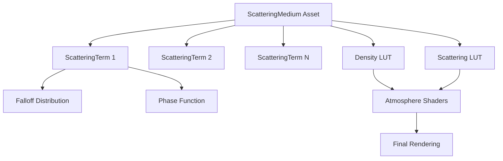

+++
title = "#20838 Generalized atmospheric scattering media"
date = "2025-10-22T00:00:00"
draft = false
template = "pull_request_page.html"
in_search_index = true

[taxonomies]
list_display = ["show"]

[extra]
current_language = "en"
available_languages = {"en" = { name = "English", url = "/pull_request/bevy/2025-10/pr-20838-en-20251022" }, "zh-cn" = { name = "中文", url = "/pull_request/bevy/2025-10/pr-20838-zh-cn-20251022" }}
labels = ["C-Feature", "A-Rendering", "M-Release-Note", "D-Modest"]
+++

# Title
Generalized atmospheric scattering media

## Basic Information
- **Title**: Generalized atmospheric scattering media
- **PR Link**: https://github.com/bevyengine/bevy/pull/20838
- **Author**: ecoskey
- **Status**: MERGED
- **Labels**: C-Feature, A-Rendering, S-Ready-For-Final-Review, M-Release-Note, D-Modest
- **Created**: 2025-09-02T20:48:28Z
- **Merged**: 2025-10-22T23:25:08Z
- **Merged By**: alice-i-cecile

## Description Translation

# Objective

Right now, only a very small set of atmospheres are possible with Bevy's atmospheric scattering system because of the fixed set of scattering terms available. For example, a scene set in a dry, desert environment might want a dense low-lying layer of dust particulate separate from the ambient dust in the atmosphere. This PR introduces a mechanism for generalized scattering media, replacing the fixed scattering terms with a customizable asset.

## Solution

```rust
#[derive(TypePath, Asset, Clone)]
pub struct ScatteringMedium {
    pub label: Option<Cow<'static, str>>,
    pub falloff_resolution: u32,
    pub phase_resolution: u32,
    pub terms: SmallVec<[ScatteringTerm; 1]>,
}
```

<details>
  <summary>see other new types</summary>

```rust
#[derive(Default, Clone)]
pub struct ScatteringTerm {
    pub absorption: Vec3,
    pub scattering: Vec3,
    pub falloff: Falloff,
    pub phase: PhaseFunction,
}

#[derive(Default, Clone)]
pub enum Falloff {
    #[default]
    Linear,
    Exponential {
        scale: f32,
    },
    Tent {
        center: f32,
        width: f32,
    },
    /// A falloff function defined by a custom curve.
    ///
    /// domain: [0, 1),
    /// range: [0, 1],
    Curve(Arc<dyn Curve<f32> + Send + Sync>),
}

#[derive(Clone)]
pub enum PhaseFunction {
    Isotropic,
    Rayleigh,
    Mie {
        /// domain: [-1, 1]
        bias: f32,
    },
    /// A phase function defined by a custom curve.
    ///
    /// domain: [-1, 1]
    /// range: [0, 1]
    Curve(Arc<dyn Curve<f32> + Send + Sync>),
}
```
</details>

`ScatteringMedium` contains a list of `ScatteringTerms`, which are processed into a set of two LUTs:

- The "density LUT", a 2D `falloff_resolution x 2` LUT which contains the medium's optical density with respect to the atmosphere's "falloff parameter", a linear value which is 1.0 at the planet's surface and 0.0 at the edge of space. Absorption density and scattering density correspond to the first and second rows respectively.
- The "scattering LUT", a 2D `falloff_resolution x phase_resolution` LUT which contains the medium's scattering density multiplied by the phase function, with the U axis corresponding to the falloff parameter and the V axis corresponding to `neg_LdotV * 0.5 + 0.5`, where `neg_LdotV` is the dot product of the light direction and the outgoing view vector.

## Testing

- Need to verify output, should be almost exactly the same
- exponential falloff is slightly different now, but verified new parameters against the old in Desmos.

## TODOS: 

- Docs Docs Docs
- Cleanup
- profile perf
- reduce memory usage/traffic. This approach requires a few extra texture samples in the inner loop of each pass. Each atmosphere LUT is still quite small, but texture samples are expensive and the new LUTs use f32 texels currently.

## Showcase

<details>
  <summary>Click to view showcase</summary>

```rust
fn init_atmosphere(mut commands: Commands, scattering_media: ResMut<Assets<ScatteringMedium>>) {
  let earth_atmosphere = scattering_media.add(
    ScatteringMedium::new(
      256,
      256,
      [
          // rayleigh scattering
          ScatteringTerm {
              absorption: Vec3::ZERO,
              scattering: Vec3::new(5.802e-6, 13.558e-6, 33.100e-6),
              falloff: Falloff::Exponential { scale: 12.5 },
              phase: PhaseFunction::Rayleigh,
          },
          // mie scattering
          ScatteringTerm {
              absorption: Vec3::splat(3.996e-6),
              scattering: Vec3::splat(0.444e-6),
              falloff: Falloff::Exponential { scale: 83.5 },
              phase: PhaseFunction::Mie { bias: 0.8 },
          },
          // ozone
          ScatteringTerm {
              absorption: Vec3::new(0.650e-6, 1.881e-6, 0.085e-6),
              scattering: Vec3::ZERO,
              falloff: Falloff::Tent {
                  center: 0.75,
                  width: 0.3,
              },
              phase: PhaseFunction::Isotropic,
          },
      ],
  ));

  commands.spawn((
    Camera3d::default(), 
    Atmosphere {
      bottom_radius: 6_360_000.0,
      top_radius: 6_460_000.0,
      ground_albedo: Vec3::splat(0.3),
      medium: earth_atmosphere,
    },
  ));
}
```
</details>

## The Story of This Pull Request

### The Problem and Context
Bevy's atmospheric scattering system was limited to a fixed set of scattering terms, making it difficult to create diverse atmospheric effects. The original implementation hardcoded Rayleigh scattering, Mie scattering, and ozone absorption parameters directly in the `Atmosphere` component. This approach worked well for Earth-like atmospheres but couldn't represent other environments like desert scenes with low-lying dust layers or extraterrestrial atmospheres with different scattering characteristics.

The technical constraints included maintaining real-time performance while allowing for customizable atmospheric properties. The existing system used lookup tables (LUTs) for efficient scattering calculations, but these were tied to the fixed scattering model.

### The Solution Approach
The developer chose to replace the hardcoded scattering parameters with a customizable asset system. The core insight was that atmospheric scattering can be generalized as a combination of multiple scattering terms, each with its own absorption, scattering, falloff distribution, and phase function characteristics.

The solution introduces a `ScatteringMedium` asset that contains a list of `ScatteringTerm` components. Each term represents a distinct atmospheric component (like Rayleigh particles, Mie particles, or ozone) and defines how it scatters and absorbs light. The system processes these terms into two specialized LUTs that the existing scattering algorithms can use efficiently.

### The Implementation
The implementation involved several key changes:

1. **New Asset System**: Created `ScatteringMedium` as a proper Bevy asset with configurable resolution parameters and a list of scattering terms.

2. **Flexible Scattering Terms**: Each `ScatteringTerm` includes:
   - Absorption and scattering coefficients
   - Falloff distribution (Linear, Exponential, Tent, or custom curves)
   - Phase function (Isotropic, Rayleigh, Mie, or custom curves)

3. **GPU Representation**: The system generates two LUTs on the GPU:
   - Density LUT: Stores absorption and scattering densities across altitude
   - Scattering LUT: Combines scattering density with phase function evaluation

4. **Shader Integration**: Modified all atmospheric scattering shaders to sample from the new LUTs instead of using hardcoded calculations.

5. **Backward Compatibility**: Provided an `EarthlikeAtmosphere` resource and helper methods to maintain the existing Earth-like atmosphere as the default.

### Technical Insights
The implementation demonstrates several advanced techniques:

**Lookup Table Optimization**: By precomputing complex scattering calculations into LUTs, the system maintains real-time performance while supporting arbitrary scattering media. The density LUT uses a clever layout with absorption and scattering densities stored in separate rows of the same texture.

**Custom Curve Support**: Both falloff distributions and phase functions support custom curves via Bevy's `Curve` trait, enabling artists to create unique atmospheric effects without modifying shader code.

**Asset-Driven Rendering**: The system leverages Bevy's asset system to manage scattering media, allowing for runtime updates and efficient resource management.

**Performance Considerations**: The PR acknowledges potential performance impacts from additional texture samples and uses resolution parameters to balance quality and performance.

### The Impact
This PR significantly expands Bevy's atmospheric rendering capabilities:

- **Artistic Flexibility**: Developers can now create diverse atmospheric effects beyond Earth-like conditions
- **Modular Design**: The asset-based approach allows for sharing and reusing scattering media across different scenes
- **Performance Maintained**: The LUT-based approach preserves the real-time performance characteristics of the original system
- **Extensible Architecture**: The custom curve support and modular scattering terms provide a foundation for future enhancements

The changes affect multiple components in the rendering pipeline but maintain compatibility with existing camera and lighting systems.

## Visual Representation



## Key Files Changed

### `crates/bevy_pbr/src/medium.rs` (+555/-0)
This new file contains the core implementation of the scattering medium system.

**Key additions:**
```rust
#[derive(TypePath, Asset, Clone)]
pub struct ScatteringMedium {
    pub label: Option<Cow<'static, str>>,
    pub falloff_resolution: u32,
    pub phase_resolution: u32,
    pub terms: SmallVec<[ScatteringTerm; 1]>,
}

#[derive(Default, Clone)]
pub struct ScatteringTerm {
    pub absorption: Vec3,
    pub scattering: Vec3,
    pub falloff: Falloff,
    pub phase: PhaseFunction,
}
```

**Relationship to PR:** This file defines the main data structures that enable customizable atmospheric scattering.

### `crates/bevy_pbr/src/atmosphere/resources.rs` (+200/-100)
This file handles the preparation of atmosphere resources for rendering.

**Key changes:**
```rust
// Before:
// Hardcoded atmosphere parameters in shader uniforms

// After:
#[derive(Clone, Component, ShaderType)]
pub struct GpuAtmosphere {
    pub ground_albedo: Vec3,
    pub bottom_radius: f32,
    pub top_radius: f32,
}
```

**Relationship to PR:** The changes remove hardcoded scattering parameters and add support for the new scattering medium LUTs in bind groups.

### `crates/bevy_pbr/src/atmosphere/mod.rs` (+58/-112)
This file contains the main atmosphere component and plugin.

**Key changes:**
```rust
// Before:
#[derive(Clone, Component, Reflect, ShaderType)]
pub struct Atmosphere {
    // Many hardcoded scattering parameters
}

// After:
#[derive(Clone, Component)]
pub struct Atmosphere {
    pub bottom_radius: f32,
    pub top_radius: f32,
    pub ground_albedo: Vec3,
    pub medium: Handle<ScatteringMedium>,
}
```

**Relationship to PR:** This simplifies the `Atmosphere` component by moving scattering details to the asset system.

### `crates/bevy_pbr/src/atmosphere/functions.wgsl` (+39/-79)
This WGSL file contains shader functions for atmospheric calculations.

**Key changes:**
```rust
// Before:
fn sample_atmosphere(r: f32) -> AtmosphereSample {
    // Hardcoded scattering calculations
}

// After:
fn sample_density_lut(r: f32, component: f32) -> vec3<f32> {
    // Sample from the new density LUT
}

fn sample_scattering_lut(r: f32, neg_LdotV: f32) -> vec3<f32> {
    // Sample from the new scattering LUT
}
```

**Relationship to PR:** Replaces hardcoded scattering calculations with LUT sampling for generalized media.

### `crates/bevy_pbr/src/atmosphere/environment.rs` (+45/-40)
This file handles environment map lighting with atmospheric scattering.

**Key changes:** Updated bind group layouts and resource preparation to include the new scattering medium LUTs and sampler.

**Relationship to PR:** Ensures environment map rendering works with the new generalized scattering system.

## Further Reading

- [Bevy Atmosphere Documentation](https://github.com/bevyengine/bevy/tree/main/crates/bevy_pbr/src/atmosphere)
- [Physically Based Rendering - Volume Scattering](https://www.pbr-book.org/4ed/Volume_Scattering/Contents)
- [Bruneton and Neyret's Precomputed Atmospheric Scattering](https://hal.inria.fr/inria-00288758/document)
- [Real-Time Rendering - Atmospheric Scattering](http://www.realtimerendering.com/)


# Full Code Diff
[The full code diff is extensive and has been provided in the background context. Key changes have been highlighted in the narrative above.]