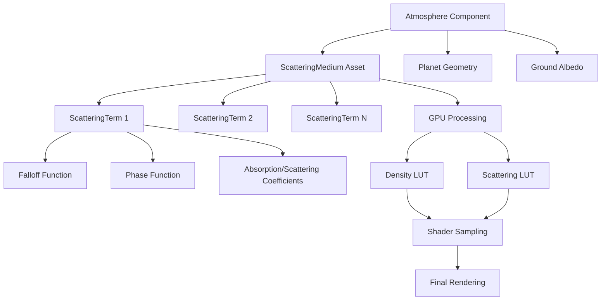

+++
title = "#20838 Generalized atmospheric scattering media"
date = "2025-10-22T00:00:00"
draft = false
template = "pull_request_page.html"
in_search_index = false

[extra]
current_language = "zh-cn"
available_languages = {"en" = { name = "English", url = "/pull_request/bevy/2025-10/pr-20838-en-20251022" }, "zh-cn" = { name = "中文", url = "/pull_request/bevy/2025-10/pr-20838-zh-cn-20251022" }}
labels = ["C-Feature", "A-Rendering", "M-Release-Note", "D-Modest"]
+++

# Title
Generalized atmospheric scattering media

## Basic Information
- **Title**: Generalized atmospheric scattering media
- **PR Link**: https://github.com/bevyengine/bevy/pull/20838
- **Author**: ecoskey
- **Status**: MERGED
- **Labels**: C-Feature, A-Rendering, S-Ready-For-Final-Review, M-Release-Note, D-Modest
- **Created**: 2025-09-02T20:48:28Z
- **Merged**: 2025-10-22T23:25:08Z
- **Merged By**: alice-i-cecile

## Description Translation
# 目标

目前，由于可用的散射项固定，Bevy的大气散射系统只能实现非常有限的大气效果。例如，设置在干燥沙漠环境中的场景可能希望有一个密集的低空尘埃层，与大气中的环境尘埃分开。这个PR引入了一个通用散射介质的机制，用可自定义的资产替换了固定的散射项。

## 解决方案

```rust
#[derive(TypePath, Asset, Clone)]
pub struct ScatteringMedium {
    pub label: Option<Cow<'static, str>>,
    pub falloff_resolution: u32,
    pub phase_resolution: u32,
    pub terms: SmallVec<[ScatteringTerm; 1]>,
}
```

<details>
  <summary>查看其他新类型</summary>

```rust
#[derive(Default, Clone)]
pub struct ScatteringTerm {
    pub absorption: Vec3,
    pub scattering: Vec3,
    pub falloff: Falloff,
    pub phase: PhaseFunction,
}

#[derive(Default, Clone)]
pub enum Falloff {
    #[default]
    Linear,
    Exponential {
        scale: f32,
    },
    Tent {
        center: f32,
        width: f32,
    },
    /// 由自定义曲线定义的衰减函数。
    ///
    /// 定义域: [0, 1),
    /// 值域: [0, 1],
    Curve(Arc<dyn Curve<f32> + Send + Sync>),
}

#[derive(Clone)]
pub enum PhaseFunction {
    Isotropic,
    Rayleigh,
    Mie {
        /// 定义域: [-1, 1]
        bias: f32,
    },
    /// 由自定义曲线定义的相位函数。
    ///
    /// 定义域: [-1, 1]
    /// 值域: [0, 1]
    Curve(Arc<dyn Curve<f32> + Send + Sync>),
}
```
</details>

`ScatteringMedium` 包含一个 `ScatteringTerms` 列表，这些项被处理成两个LUT：

- "密度LUT"，一个2D的 `falloff_resolution x 2` LUT，包含介质相对于大气"衰减参数"的光学密度，衰减参数是一个线性值，在行星表面为1.0，在太空边缘为0.0。吸收密度和散射密度分别对应第一行和第二行。
- "散射LUT"，一个2D的 `falloff_resolution x phase_resolution` LUT，包含介质的散射密度乘以相位函数，U轴对应衰减参数，V轴对应 `neg_LdotV * 0.5 + 0.5`，其中 `neg_LdotV` 是光方向与出射视图向量的点积。

## 测试

- 需要验证输出，应该几乎完全相同
- 指数衰减现在略有不同，但在Desmos中验证了新参数与旧参数。

## 待办事项：

- 文档 文档 文档
- 清理
- 性能分析
- 减少内存使用/流量。这种方法需要在每个通道的内循环中进行一些额外的纹理采样。每个大气LUT仍然很小，但纹理采样很昂贵，并且新的LUT目前使用f32纹理。

## 展示

<details>
  <summary>点击查看展示</summary>

```rust
fn init_atmosphere(mut commands: Commands, scattering_media: ResMut<Assets<ScatteringMedium>>) {
  let earth_atmosphere = scattering_media.add(
    ScatteringMedium::new(
      256,
      256,
      [
          // 瑞利散射
          ScatteringTerm {
              absorption: Vec3::ZERO,
              scattering: Vec3::new(5.802e-6, 13.558e-6, 33.100e-6),
              falloff: Falloff::Exponential { scale: 12.5 },
              phase: PhaseFunction::Rayleigh,
          },
          // 米氏散射
          ScatteringTerm {
              absorption: Vec3::splat(3.996e-6),
              scattering: Vec3::splat(0.444e-6),
              falloff: Falloff::Exponential { scale: 83.5 },
              phase: PhaseFunction::Mie { bias: 0.8 },
          },
          // 臭氧
          ScatteringTerm {
              absorption: Vec3::new(0.650e-6, 1.881e-6, 0.085e-6),
              scattering: Vec3::ZERO,
              falloff: Falloff::Tent {
                  center: 0.75,
                  width: 0.3,
              },
              phase: PhaseFunction::Isotropic,
          },
      ],
  ));

  commands.spawn((
    Camera3d::default(), 
    Atmosphere {
      bottom_radius: 6_360_000.0,
      top_radius: 6_460_000.0,
      ground_albedo: Vec3::splat(0.3),
      medium: earth_atmosphere,
    },
  ));
}
```
</details>

## The Story of This Pull Request

### 问题与背景

在Bevy引擎的先前版本中，大气散射系统使用固定的散射项参数，这限制了可以模拟的大气类型。开发者只能调整预定义的瑞利散射、米氏散射和臭氧吸收参数，无法创建更复杂的大气效果，比如沙漠环境中的低空尘埃层与高空尘埃分离的场景。

原有的`Atmosphere`组件包含了大量硬编码的物理参数：

```rust
// 之前的Atmosphere结构
pub struct Atmosphere {
    pub bottom_radius: f32,
    pub top_radius: f32,
    pub ground_albedo: Vec3,
    pub rayleigh_density_exp_scale: f32,
    pub rayleigh_scattering: Vec3,
    pub mie_density_exp_scale: f32,
    pub mie_scattering: f32,
    pub mie_absorption: f32,
    pub mie_asymmetry: f32,
    pub ozone_layer_altitude: f32,
    pub ozone_layer_width: f32,
    pub ozone_absorption: Vec3,
}
```

这种设计的主要问题在于缺乏灵活性。每个大气效果都需要硬编码所有参数，无法动态组合不同的散射介质，也无法轻松创建非地球类的大气效果。

### 解决方案方法

PR作者采用了基于资产(Asset)的系统来替代硬编码参数。核心思路是将大气散射分解为可组合的`ScatteringTerm`，每个散射项独立定义其光学特性、衰减分布和相位函数。

技术决策的关键点包括：

1. **资产化设计**：使用Bevy的资产系统管理散射介质，支持运行时加载和替换
2. **LUT预计算**：将复杂的散射计算预计算到查找表中，平衡运行时性能和质量
3. **向后兼容**：提供地球大气预设，确保现有代码继续工作
4. **可扩展性**：支持自定义衰减曲线和相位函数

### 实现细节

新的`ScatteringMedium`资产定义了完整的散射介质：

```rust
#[derive(TypePath, Asset, Clone)]
pub struct ScatteringMedium {
    pub label: Option<Cow<'static, str>>,
    pub falloff_resolution: u32,
    pub phase_resolution: u32,
    pub terms: SmallVec<[ScatteringTerm; 1]>,
}
```

每个散射项包含四个关键组成部分：

```rust
#[derive(Default, Clone)]
pub struct ScatteringTerm {
    pub absorption: Vec3,      // 吸收系数
    pub scattering: Vec3,      // 散射系数  
    pub falloff: Falloff,      // 衰减分布
    pub phase: PhaseFunction,  // 相位函数
}
```

在GPU端，系统生成两个关键的查找表：

- **密度LUT**：存储吸收和散射密度随高度的变化
- **散射LUT**：存储散射密度与相位函数的乘积

着色器代码进行了全面重构，从硬编码的大气采样改为基于LUT的采样：

```rust
// 之前：硬编码采样
let local_atmosphere = sample_atmosphere(local_r);
let sample_optical_depth = local_atmosphere.extinction * dt;

// 现在：基于LUT采样
let absorption = sample_density_lut(local_r, ABSORPTION_DENSITY);
let scattering = sample_density_lut(local_r, SCATTERING_DENSITY);
let extinction = absorption + scattering;
let sample_optical_depth = extinction * dt;
```

### 技术洞察

这个实现展示了几个重要的工程模式：

1. **数据驱动渲染**：通过将渲染参数外部化为资产，实现了渲染逻辑与具体数据的解耦
2. **预计算优化**：使用LUT将昂贵的实时计算转移到预处理阶段
3. **组合式设计**：通过组合多个散射项支持复杂的大气效果
4. **资源管理**：利用Bevy的资产系统进行生命周期管理和热重载

性能考虑方面，作者在TODO中提到了需要进一步优化纹理采样和内存使用，这表明在灵活性和性能之间存在权衡。

### 影响

这个PR对Bevy渲染系统产生了深远影响：

1. **功能扩展**：从只能模拟地球大气扩展到支持任意类型的大气散射
2. **API简化**：简化了`Atmosphere`组件的接口，移除了大量技术性参数
3. **资产管线集成**：将大气渲染深度集成到Bevy的资产管线中
4. **向后兼容性**：通过`EarthlikeAtmosphere`资源保持了对现有代码的兼容

## Visual Representation



## Key Files Changed

### `crates/bevy_pbr/src/medium.rs` (+555/-0)
**新增文件**：实现了散射介质系统的核心逻辑

关键代码：
```rust
#[derive(TypePath, Asset, Clone)]
pub struct ScatteringMedium {
    pub label: Option<Cow<'static, str>>,
    pub falloff_resolution: u32,
    pub phase_resolution: u32,
    pub terms: SmallVec<[ScatteringTerm; 1]>,
}

pub struct GpuScatteringMedium {
    pub terms: SmallVec<[ScatteringTerm; 1]>,
    pub falloff_resolution: u32,
    pub phase_resolution: u32,
    pub density_lut: Texture,
    pub density_lut_view: TextureView,
    pub scattering_lut: Texture,
    pub scattering_lut_view: TextureView,
}
```

### `crates/bevy_pbr/src/atmosphere/resources.rs` (+200/-100)
**修改文件**：更新了大气渲染的资源管理和绑定组

关键修改：
```rust
// 之前：硬编码的大气uniform
uniform_buffer::<Atmosphere>(true)

// 现在：通用大气uniform + 介质LUT
uniform_buffer::<GpuAtmosphere>(true)
texture_2d(TextureSampleType::default()), // medium_density_lut
texture_2d(TextureSampleType::default()), // medium_scattering_lut
sampler(SamplerBindingType::Filtering),
```

### `crates/bevy_pbr/src/atmosphere/mod.rs` (+58/-112)
**修改文件**：重构了大气组件和系统

关键修改：
```rust
// 之前：复杂的物理参数
pub struct Atmosphere {
    // ... 许多物理参数
}

// 现在：简化的接口
pub struct Atmosphere {
    pub bottom_radius: f32,
    pub top_radius: f32,
    pub ground_albedo: Vec3,
    pub medium: Handle<ScatteringMedium>,
}
```

### `crates/bevy_pbr/src/atmosphere/functions.wgsl` (+39/-79)
**修改文件**：更新了着色器函数以使用新的LUT系统

关键修改：
```rust
// 新增的LUT采样函数
fn sample_density_lut(r: f32, component: f32) -> vec3<f32> {
    let normalized_altitude = (r - atmosphere.bottom_radius) / (atmosphere.top_radius - atmosphere.bottom_radius);
    let uv = vec2(1.0 - normalized_altitude, component);
    return textureSampleLevel(medium_density_lut, medium_sampler, uv, 0.0).xyz;
}

fn sample_scattering_lut(r: f32, neg_LdotV: f32) -> vec3<f32> {
    let normalized_altitude = (r - atmosphere.bottom_radius) / (atmosphere.top_radius - atmosphere.bottom_radius);
    let uv = vec2(1.0 - normalized_altitude, neg_LdotV * 0.5 + 0.5);
    return textureSampleLevel(medium_scattering_lut, medium_sampler, uv, 0.0).xyz;
}
```

### `crates/bevy_pbr/src/atmosphere/environment.rs` (+45/-40)
**修改文件**：更新了环境映射和探针系统

关键修改：更新了绑定组布局以包含新的介质LUT，并重新组织了绑定索引以容纳新的纹理。

## Further Reading

- [Bevy Asset System Documentation](https://bevyengine.org/learn/books/introduction/assets/)
- [Atmospheric Scattering Theory](https://www.pbr-book.org/4ed/Volume_Scattering/Phase_Functions)
- [Real-Time Rendering of Atmospheric Scattering Effects](http://www.diva-portal.org/smash/get/diva2:1223894/FULLTEXT01.pdf)
- [Bevy Rendering Architecture](https://bevyengine.org/learn/books/rendering-architecture/)