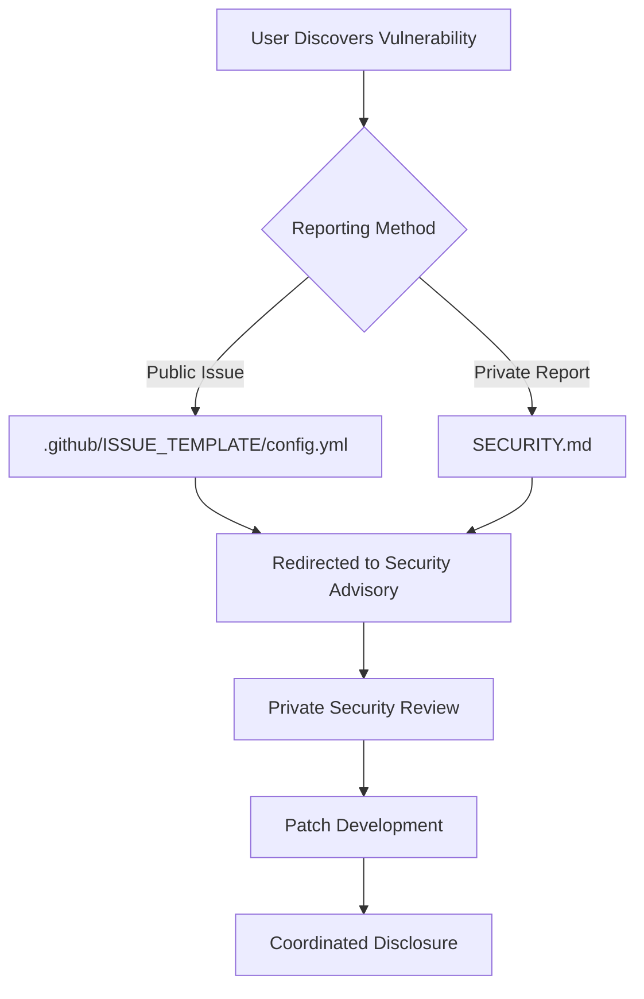

+++
title = "#20942 Bevy security policy"
date = "2025-10-16T00:00:00"
draft = false
template = "pull_request_page.html"
in_search_index = true

[taxonomies]
list_display = ["show"]

[extra]
current_language = "en"
available_languages = {"en" = { name = "English", url = "/pull_request/bevy/2025-10/pr-20942-en-20251016" }, "zh-cn" = { name = "中文", url = "/pull_request/bevy/2025-10/pr-20942-zh-cn-20251016" }}
labels = ["A-Meta", "X-Blessed"]
+++

# Title
Bevy security policy

## Basic Information
- **Title**: Bevy security policy
- **PR Link**: https://github.com/bevyengine/bevy/pull/20942
- **Author**: mockersf
- **Status**: MERGED
- **Labels**: A-Meta, S-Ready-For-Final-Review, X-Blessed
- **Created**: 2025-09-09T20:35:13Z
- **Merged**: 2025-10-16T22:29:38Z
- **Merged By**: alice-i-cecile

## Description Translation
# Objective

- Check the last unchecked point of https://github.com/bevyengine/bevy/community

## Solution

- Add a security policy

## The Story of This Pull Request

This pull request addresses a critical gap in the Bevy project's governance and security infrastructure. The project had completed most of the items in its community checklist, but lacked a formal security policy - a foundational requirement for any mature open source project, especially one used in production environments.

The problem was straightforward but important: without a security policy, users who discovered potential vulnerabilities had no clear guidance on how to report them responsibly. This created the risk that security issues might be publicly disclosed before maintainers could address them, potentially exposing Bevy users to security threats.

The solution approach was pragmatic and followed established open source best practices. The implementation consisted of two complementary changes:

First, a new `SECURITY.md` file was created to serve as the canonical security policy. This file clearly states that only the latest released minor version of Bevy is supported for security updates, which is a common and practical approach for open source projects to manage their maintenance burden. The policy provides clear instructions for private vulnerability reporting through GitHub's Security Advisories system, preventing premature public disclosure.

Second, the GitHub issue template configuration was updated to redirect security-related reports away from public issue tracking and toward the proper private reporting channel. This prevents accidental public disclosure of vulnerabilities through the normal issue reporting workflow.

The technical implementation is clean and follows GitHub's established patterns for security policies. The version support table uses the existing Bevy crate version badge, maintaining consistency with other project documentation. The reporting instructions link directly to GitHub's official documentation on private vulnerability reporting, ensuring users have access to up-to-date guidance.

These changes represent a significant step in Bevy's maturity as an open source project. By establishing clear security protocols, the project demonstrates its commitment to responsible security practices and provides users with confidence that security concerns will be handled appropriately. The implementation strikes a good balance between being comprehensive enough to cover essential security needs while remaining maintainable for the project team.

## Visual Representation



## Key Files Changed

### `SECURITY.md` (+16/-0)
This new file establishes the formal security policy for the Bevy project.

```markdown
# Security Policy

## Supported Versions

Only the latest released minor version of Bevy is supported.

| Version                                                                                 | Supported          |
| --------------------------------------------------------------------------------------- | ------------------ |
| [](https://crates.io/crates/bevy) | :white_check_mark: |
| Previous Versions                                                                       | :x:                |

## Reporting a Vulnerability

If you believe you have found a security vulnerability, please DO NOT disclose it publicly until we've had a chance to fix it.

Please don't report security vulnerabilities via GitHub issues, instead [report them privately](https://docs.github.com/en/code-security/security-advisories/guidance-on-reporting-and-writing-information-about-vulnerabilities/privately-reporting-a-security-vulnerability) via the [Security Advisories](https://github.com/bevyengine/bevy/security/advisories/new) page.
```

### `.github/ISSUE_TEMPLATE/config.yml` (+3/-0)
This update adds a security reporting channel to the GitHub issue templates.

```yaml
contact_links:
  - name: Question
    url: https://github.com/bevyengine/bevy/discussions/categories/q-a
    about: Questions about how to use or contribute to Bevy belong in Github Discussions.
      You can use the search to check if someone already answered your question!
  - name: Security Issue
    url: https://github.com/bevyengine/bevy/security/advisories/new
    about: If you believe you have found a security vulnerability, please DO NOT disclose it publicly until we've had a chance to fix it.
```

## Further Reading

- [GitHub Security Advisories Documentation](https://docs.github.com/en/code-security/security-advisories/guidance-on-reporting-and-writing-information-about-vulnerabilities/privately-reporting-a-security-vulnerability)
- [OpenSSF Security Policies Guide](https://github.com/ossf/wg-best-practices-os-developers/blob/main/docs/security-policies.md)
- [CII Best Practices Badge Program](https://bestpractices.coreinfrastructure.org/en)

# Full Code Diff
diff --git a/.github/ISSUE_TEMPLATE/config.yml b/.github/ISSUE_TEMPLATE/config.yml
index ef173eb32400e..1e4420ab5ac1e 100644
--- a/.github/ISSUE_TEMPLATE/config.yml
+++ b/.github/ISSUE_TEMPLATE/config.yml
@@ -3,3 +3,6 @@ contact_links:
     url: https://github.com/bevyengine/bevy/discussions/categories/q-a
     about: Questions about how to use or contribute to Bevy belong in Github Discussions.
       You can use the search to check if someone already answered your question!
+  - name: Security Issue
+    url: https://github.com/bevyengine/bevy/security/advisories/new
+    about: If you believe you have found a security vulnerability, please DO NOT disclose it publicly until we've had a chance to fix it.
diff --git a/SECURITY.md b/SECURITY.md
new file mode 100644
index 0000000000000..4e01dab7c9a24
--- /dev/null
+++ b/SECURITY.md
@@ -0,0 +1,16 @@
+# Security Policy
+
+## Supported Versions
+
+Only the latest released minor version of Bevy is supported.
+
+| Version                                                                                 | Supported          |
+| --------------------------------------------------------------------------------------- | ------------------ |
+| [](https://crates.io/crates/bevy) | :white_check_mark: |
+| Previous Versions                                                                       | :x:                |
+
+## Reporting a Vulnerability
+
+If you believe you have found a security vulnerability, please DO NOT disclose it publicly until we've had a chance to fix it.
+
+Please don't report security vulnerabilities via GitHub issues, instead [report them privately](https://docs.github.com/en/code-security/security-advisories/guidance-on-reporting-and-writing-information-about-vulnerabilities/privately-reporting-a-security-vulnerability) via the [Security Advisories](https://github.com/bevyengine/bevy/security/advisories/new) page.