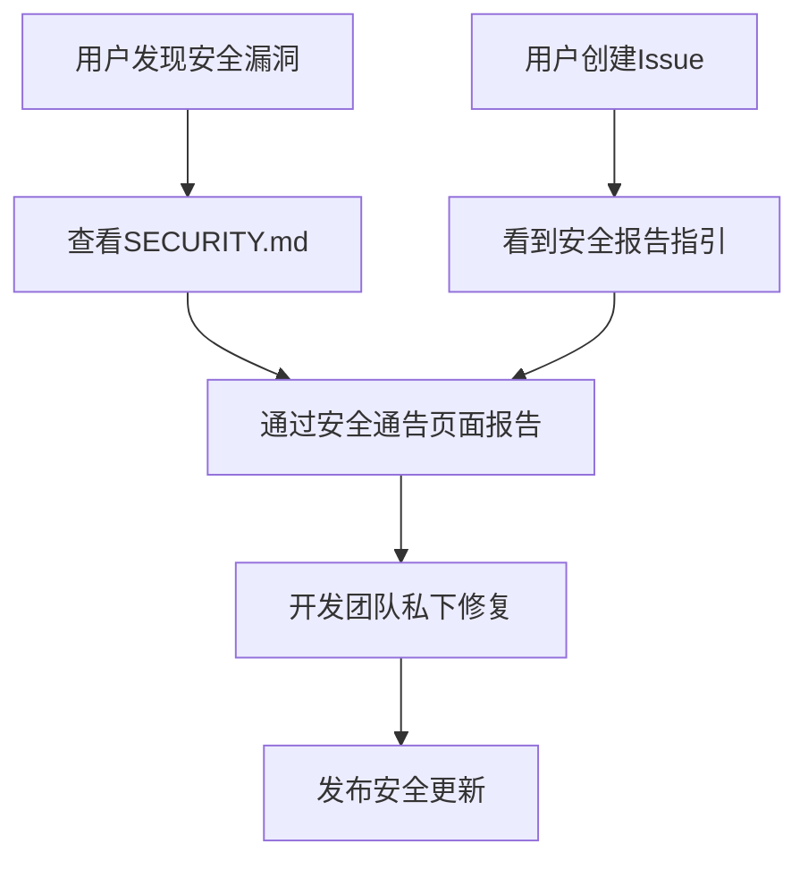

+++
title = "#20942 Bevy security policy"
date = "2025-10-16T00:00:00"
draft = false
template = "pull_request_page.html"
in_search_index = false

[extra]
current_language = "zh-cn"
available_languages = {"en" = { name = "English", url = "/pull_request/bevy/2025-10/pr-20942-en-20251016" }, "zh-cn" = { name = "中文", url = "/pull_request/bevy/2025-10/pr-20942-zh-cn-20251016" }}
labels = ["A-Meta", "X-Blessed"]
+++

# Bevy security policy

## Basic Information
- **Title**: Bevy security policy
- **PR Link**: https://github.com/bevyengine/bevy/pull/20942
- **Author**: mockersf
- **Status**: MERGED
- **Labels**: A-Meta, S-Ready-For-Final-Review, X-Blessed
- **Created**: 2025-09-09T20:35:13Z
- **Merged**: 2025-10-16T22:29:38Z
- **Merged By**: alice-i-cecile

## Description Translation
# Objective

- 检查 https://github.com/bevyengine/bevy/community 中最后一个未检查的项目

## Solution

- 添加安全策略

## The Story of This Pull Request

这个PR解决了Bevy项目在社区清单中最后一个未完成的安全策略需求。作为开源游戏引擎，Bevy需要建立正式的安全漏洞处理流程来保护用户和项目本身。

开发者面临的核心问题是：项目缺少标准化的安全漏洞报告和处理机制。这可能导致安全研究人员无法通过正确的渠道报告漏洞，或者开发团队无法及时响应安全事件。对于像Bevy这样广泛使用的开源项目，建立清晰的安全策略是成熟项目管理的必要组成部分。

解决方案采用了GitHub的标准安全策略模式。开发者创建了`SECURITY.md`文件，这是GitHub生态系统中的标准安全策略文件。同时，在issue模板配置中添加了安全问题的联系链接，确保用户在创建issue时能够看到正确的安全报告渠道。

在实现方面，安全策略文件明确规定了只支持最新发布的次要版本，这符合大多数开源项目的版本支持策略。表格中使用了Crates.io的版本徽章来动态显示当前支持的版本：

```markdown
| Version | Supported |
| --- | --- |
| [](https://crates.io/crates/bevy) | :white_check_mark: |
| Previous Versions | :x: |
```

这种设计确保了支持的版本信息能够自动更新，无需手动维护。

在issue模板配置中的修改同样重要，它为用户提供了清晰的安全报告指引：

```yaml
- name: Security Issue
  url: https://github.com/bevyengine/bevy/security/advisories/new
  about: If you believe you have found a security vulnerability, please DO NOT disclose it publicly until we’ve had a chance to fix it.
```

这个修改直接链接到GitHub的安全通告功能，这是GitHub为开源项目提供的标准安全漏洞报告机制。

从技术角度看，这个实现遵循了开源项目安全策略的最佳实践。通过使用GitHub的原生功能，确保了安全报告流程的标准化和可维护性。版本支持策略的明确表述有助于用户理解他们是否需要升级到最新版本以获得安全修复。

这些改动虽然简单，但对项目的安全成熟度有重要意义。它们建立了正式的安全响应流程，降低了漏洞被公开披露前被恶意利用的风险，同时也为安全研究人员提供了清晰的报告渠道。

## Visual Representation



## Key Files Changed

### `SECURITY.md` (+16/-0)
这是新增的安全策略文件，定义了项目的安全支持策略和漏洞报告流程。

```markdown
# Security Policy

## Supported Versions

Only the latest released minor version of Bevy is supported.

| Version | Supported |
| --- | --- |
| [](https://crates.io/crates/bevy) | :white_check_mark: |
| Previous Versions | :x: |

## Reporting a Vulnerability

If you believe you have found a security vulnerability, please DO NOT disclose it publicly until we've had a chance to fix it.

Please don't report security vulnerabilities via GitHub issues, instead [report them privately](https://docs.github.com/en/code-security/security-advisories/guidance-on-reporting-and-writing-information-about-vulnerabilities/privately-reporting-a-security-vulnerability) via the [Security Advisories](https://github.com/bevyengine/bevy/security/advisories/new) page.
```

### `.github/ISSUE_TEMPLATE/config.yml` (+3/-0)
在issue模板配置中添加了安全问题的联系链接。

```yaml
contact_links:
  - name: Security Issue
    url: https://github.com/bevyengine/bevy/security/advisories/new
    about: If you believe you have found a security vulnerability, please DO NOT disclose it publicly until we've had a chance to fix it.
```

## Further Reading

- [GitHub Security Advisories Documentation](https://docs.github.com/en/code-security/security-advisories/guidance-on-reporting-and-writing-information-about-vulnerabilities/privately-reporting-a-security-vulnerability)
- [OpenSSF Security Metrics](https://github.com/ossf/security-metrics)
- [CII Best Practices Badge Program](https://www.coreinfrastructure.org/programs/best-practices-program/)

# Full Code Diff
```diff
diff --git a/.github/ISSUE_TEMPLATE/config.yml b/.github/ISSUE_TEMPLATE/config.yml
index ef173eb32400e..1e4420ab5ac1e 100644
--- a/.github/ISSUE_TEMPLATE/config.yml
+++ b/.github/ISSUE_TEMPLATE/config.yml
@@ -3,3 +3,6 @@ contact_links:
     url: https://github.com/bevyengine/bevy/discussions/categories/q-a
     about: Questions about how to use or contribute to Bevy belong in Github Discussions.
       You can use the search to check if someone already answered your question!
+  - name: Security Issue
+    url: https://github.com/bevyengine/bevy/security/advisories/new
+    about: If you believe you have found a security vulnerability, please DO NOT disclose it publicly until we've had a chance to fix it.
diff --git a/SECURITY.md b/SECURITY.md
new file mode 100644
index 0000000000000..4e01dab7c9a24
--- /dev/null
+++ b/SECURITY.md
@@ -0,0 +1,16 @@
+# Security Policy
+
+## Supported Versions
+
+Only the latest released minor version of Bevy is supported.
+
+| Version                                                                                 | Supported          |
+| --------------------------------------------------------------------------------------- | ------------------ |
+| [](https://crates.io/crates/bevy) | :white_check_mark: |
+| Previous Versions                                                                       | :x:                |
+
+## Reporting a Vulnerability
+
+If you believe you have found a security vulnerability, please DO NOT disclose it publicly until we've had a chance to fix it.
+
+Please don't report security vulnerabilities via GitHub issues, instead [report them privately](https://docs.github.com/en/code-security/security-advisories/guidance-on-reporting-and-writing-information-about-vulnerabilities/privately-reporting-a-security-vulnerability) via the [Security Advisories](https://github.com/bevyengine/bevy/security/advisories/new) page.
```