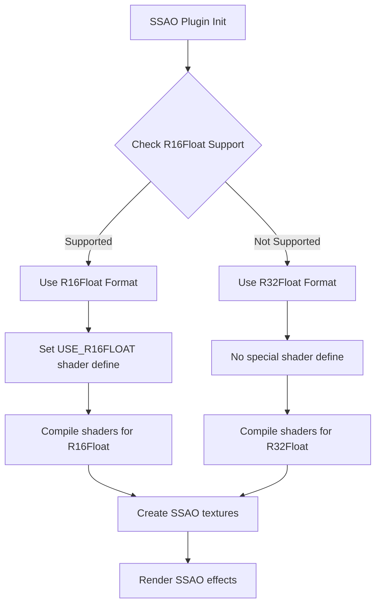

+++
title = "#20960 Added SSAO support on WebGPU, with R32Float fallback."
date = "2025-10-29T00:00:00"
draft = false
template = "pull_request_page.html"
in_search_index = true

[taxonomies]
list_display = ["show"]

[extra]
current_language = "en"
available_languages = {"en" = { name = "English", url = "/pull_request/bevy/2025-10/pr-20960-en-20251029" }, "zh-cn" = { name = "中文", url = "/pull_request/bevy/2025-10/pr-20960-zh-cn-20251029" }}
labels = ["C-Feature", "A-Rendering", "O-WebGPU"]
+++

# Title
Added SSAO support on WebGPU, with R32Float fallback.

## Basic Information
- **Title**: Added SSAO support on WebGPU, with R32Float fallback.
- **PR Link**: https://github.com/bevyengine/bevy/pull/20960
- **Author**: diyu-motif
- **Status**: MERGED
- **Labels**: C-Feature, A-Rendering, S-Ready-For-Final-Review, O-WebGPU
- **Created**: 2025-09-11T01:54:27Z
- **Merged**: 2025-10-29T18:38:57Z
- **Merged By**: alice-i-cecile

## Description Translation

# Objective

This PR is to add SSAO support on WebGPU.

## Solution
Add r16float detect and fallback to r32float if not supported. FYI the initial ssao PR [here](https://github.com/bevyengine/bevy/pull/7402). 

## Testing

- Did you test these changes? If so, how?
     Yes, here is the command to test the ssao example 
`RUSTFLAGS="--cfg getrandom_backend=\"wasm_js\"" cargo run --example ssao --target wasm32-unknown-unknown --features webgpu`
and then http://localhost:1334, make sure it supports [WebGPU](https://caniuse.com/webgpu) 

- Are there any parts that need more testing?
 N/A
- How can other people (reviewers) test your changes? Is there anything specific they need to know?
     1. For the R32Float fallback, only the 1st commit is needed. However, I ran into some strange flickering issue on Chrome (and   Chrome canary too), so I added a "detect_r16float_support" flag and a temp fix in the 2nd and 3rd commit, which are intended to be reverted when merging.
     2. with the 1st commit, Safari works fine, but Chrome has the flickering, and I fixed it by partially reverting a shader change from https://github.com/bevyengine/bevy/pull/20313, which is very strange. It is probably caused by some shader optimization issue in Chrome, and I have no clue why, as the change is just moving the calculation to a different function.   
Here is the flickering on Mac Chrome(140.0.7339.133 (Official Build) (arm64))


- If relevant, what platforms did you test these changes on, and are there any important ones you can't test?
     Tested on native(mac) and WebGPU. To test on native,  set "detect_r16float_support"  to false to force R32Float.
     I couldn't make the WebGPU ssao example running on Windows 11 Chrome or Firefox, there is some error in 'taa_pipeline' .
 
---


## The Story of This Pull Request

This PR addresses a compatibility issue with Screen Space Ambient Occlusion (SSAO) on WebGPU platforms. The core problem was that the original SSAO implementation assumed support for R16Float texture format with storage binding capabilities, which isn't universally available across all GPU platforms, particularly in WebGPU environments.

The solution implements a runtime detection mechanism for R16Float support with a fallback to R32Float. The implementation follows a systematic approach: during pipeline initialization, the code checks whether the current render adapter supports R16Float with storage binding usage. If supported, it uses the more memory-efficient R16Float format; otherwise, it falls back to R32Float.

The key architectural change involves making the texture format selection dynamic rather than hardcoded. The `SsaoPipelines` struct now stores the selected `depth_format` and propagates this information throughout the rendering pipeline. This includes:

1. **Pipeline Configuration**: The format is used when creating storage texture bindings in compute pipelines
2. **Texture Allocation**: SSAO textures are created using the detected format
3. **Shader Selection**: Conditional compilation via shader defines (`USE_R16FLOAT`) ensures the correct texture format is used in WGSL shaders

The implementation required modifications across multiple shader files to support both texture formats. Each shader that interacts with SSAO textures now includes conditional blocks that select the appropriate texture format based on the `USE_R16FLOAT` define:

```wgsl
#ifdef USE_R16FLOAT
@group(0) @binding(1) var preprocessed_depth_mip0: texture_storage_2d<r16float, write>;
#else
@group(0) @binding(1) var preprocessed_depth_mip0: texture_storage_2d<r32float, write>;
#endif
```

During testing, the author encountered a flickering issue specifically in Chrome, which was resolved by partially reverting a shader optimization from a previous PR. This suggests potential shader compiler differences between browsers that required careful testing and debugging.

The changes maintain backward compatibility while extending support to WebGPU platforms. Systems that previously supported R16Float continue to use it, while unsupported platforms automatically fall back to R32Float without requiring user intervention.

## Visual Representation



## Key Files Changed

### `crates/bevy_pbr/src/ssao/mod.rs` (+37/-22)

This is the main coordination file that handles SSAO pipeline setup and texture management. The key changes include:

1. **Removed hard requirement for R16Float support**: The plugin no longer fails to load if R16Float storage binding isn't supported
2. **Dynamic format detection**: Added runtime detection of R16Float support with fallback to R32Float
3. **Propagated format through pipeline**: The selected format is stored in `SsaoPipelines` and used throughout the rendering process

```rust
// Before: Hardcoded format check that could prevent plugin loading
if !render_adapter.get_texture_format_features(TextureFormat::R16Float)
    .allowed_usages.contains(TextureUsages::STORAGE_BINDING) {
    warn!("ScreenSpaceAmbientOcclusionPlugin not loaded...");
    return;
}

// After: Dynamic format selection
let depth_format = if render_adapter
    .get_texture_format_features(TextureFormat::R16Float)
    .allowed_usages.contains(TextureUsages::STORAGE_BINDING) {
    TextureFormat::R16Float
} else {
    TextureFormat::R32Float
};
```

### `crates/bevy_pbr/src/ssao/preprocess_depth.wgsl` (+8/-0)

This shader handles depth preprocessing for SSAO. The changes add conditional texture format declarations:

```wgsl
// Added conditional texture format support
#ifdef USE_R16FLOAT
@group(0) @binding(1) var preprocessed_depth_mip0: texture_storage_2d<r16float, write>;
#else
@group(0) @binding(1) var preprocessed_depth_mip0: texture_storage_2d<r32float, write>;
#endif
```

### `crates/bevy_pbr/src/ssao/spatial_denoise.wgsl` (+4/-0)

This shader handles spatial denoising for SSAO. Similar conditional format support was added:

```wgsl
#ifdef USE_R16FLOAT
@group(0) @binding(2) var ambient_occlusion: texture_storage_2d<r16float, write>;
#else
@group(0) @binding(2) var ambient_occlusion: texture_storage_2d<r32float, write>;
#endif
```

### `crates/bevy_pbr/src/ssao/ssao.wgsl` (+4/-0)

The main SSAO shader received the same conditional format treatment:

```wgsl
#ifdef USE_R16FLOAT
@group(0) @binding(3) var ambient_occlusion: texture_storage_2d<r16float, write>;
#else
@group(0) @binding(3) var ambient_occlusion: texture_storage_2d<r32float, write>;
#endif
```

## Further Reading

- [WebGPU Specification](https://www.w3.org/TR/webgpu/) - Official WebGPU standard
- [Bevy SSAO Initial Implementation](https://github.com/bevyengine/bevy/pull/7402) - Original SSAO PR for context
- [WGSL Texture Formats](https://gpuweb.github.io/gpuweb/wgsl/#texture-formats) - WGSL texture format specifications
- [WebGPU Feature Detection](https://developer.mozilla.org/en-US/docs/Web/API/GPU/adapter/features) - MDN documentation on WebGPU feature detection

# Full Code Diff
```diff
diff --git a/crates/bevy_pbr/src/ssao/mod.rs b/crates/bevy_pbr/src/ssao/mod.rs
index d9f24d4999aa7..9a94aa355ad3f 100644
--- a/crates/bevy_pbr/src/ssao/mod.rs
+++ b/crates/bevy_pbr/src/ssao/mod.rs
@@ -60,17 +60,6 @@ impl Plugin for ScreenSpaceAmbientOcclusionPlugin {
             return;
         };
 
-        if !render_app
-            .world()
-            .resource::<RenderAdapter>()
-            .get_texture_format_features(TextureFormat::R16Float)
-            .allowed_usages
-            .contains(TextureUsages::STORAGE_BINDING)
-        {
-            warn!("ScreenSpaceAmbientOcclusionPlugin not loaded. GPU lacks support: TextureFormat::R16Float does not support TextureUsages::STORAGE_BINDING.");
-            return;
-        }
-
         if render_app
             .world()
             .resource::<RenderDevice>()
@@ -299,6 +288,7 @@ struct SsaoPipelines {
     linear_clamp_sampler: Sampler,
 
     shader: Handle<Shader>,
+    depth_format: TextureFormat,
 }
 
 impl FromWorld for SsaoPipelines {
@@ -307,6 +297,18 @@ impl FromWorld for SsaoPipelines {
         let render_queue = world.resource::<RenderQueue>();
         let pipeline_cache = world.resource::<PipelineCache>();
 
+        // Detect the depth format support
+        let render_adapter = world.resource::<RenderAdapter>();
+        let depth_format = if render_adapter
+            .get_texture_format_features(TextureFormat::R16Float)
+            .allowed_usages
+            .contains(TextureUsages::STORAGE_BINDING)
+        {
+            TextureFormat::R16Float
+        } else {
+            TextureFormat::R32Float
+        };
+
         let hilbert_index_lut = render_device
             .create_texture_with_data(
                 render_queue,
@@ -364,11 +366,11 @@ impl FromWorld for SsaoPipelines {
                 ShaderStages::COMPUTE,
                 (
                     texture_depth_2d(),
-                    texture_storage_2d(TextureFormat::R16Float, StorageTextureAccess::WriteOnly),
-                    texture_storage_2d(TextureFormat::R16Float, StorageTextureAccess::WriteOnly),
-                    texture_storage_2d(TextureFormat::R16Float, StorageTextureAccess::WriteOnly),
-                    texture_storage_2d(TextureFormat::R16Float, StorageTextureAccess::WriteOnly),
-                    texture_storage_2d(TextureFormat::R16Float, StorageTextureAccess::WriteOnly),
+                    texture_storage_2d(depth_format, StorageTextureAccess::WriteOnly),
+                    texture_storage_2d(depth_format, StorageTextureAccess::WriteOnly),
+                    texture_storage_2d(depth_format, StorageTextureAccess::WriteOnly),
+                    texture_storage_2d(depth_format, StorageTextureAccess::WriteOnly),
+                    texture_storage_2d(depth_format, StorageTextureAccess::WriteOnly),
                 ),
             ),
         );
@@ -381,7 +383,7 @@ impl FromWorld for SsaoPipelines {
                     texture_2d(TextureSampleType::Float { filterable: true }),
                     texture_2d(TextureSampleType::Float { filterable: false }),
                     texture_2d(TextureSampleType::Uint),
-                    texture_storage_2d(TextureFormat::R16Float, StorageTextureAccess::WriteOnly),
+                    texture_storage_2d(depth_format, StorageTextureAccess::WriteOnly),
                     texture_storage_2d(TextureFormat::R32Uint, StorageTextureAccess::WriteOnly),
                     uniform_buffer::<GlobalsUniform>(false),
                     uniform_buffer::<f32>(false),
@@ -396,11 +398,16 @@ impl FromWorld for SsaoPipelines {
                 (
                     texture_2d(TextureSampleType::Float { filterable: false }),
                     texture_2d(TextureSampleType::Uint),
-                    texture_storage_2d(TextureFormat::R16Float, StorageTextureAccess::WriteOnly),
+                    texture_storage_2d(depth_format, StorageTextureAccess::WriteOnly),
                 ),
             ),
         );
 
+        let mut shader_defs = Vec::new();
+        if depth_format == TextureFormat::R16Float {
+            shader_defs.push("USE_R16FLOAT".into());
+        }
+
         let preprocess_depth_pipeline =
             pipeline_cache.queue_compute_pipeline(ComputePipelineDescriptor {
                 label: Some("ssao_preprocess_depth_pipeline".into()),
@@ -409,6 +416,7 @@ impl FromWorld for SsaoPipelines {
                     common_bind_group_layout.clone(),
                 ],
                 shader: load_embedded_asset!(world, "preprocess_depth.wgsl"),
+                shader_defs: shader_defs.clone(),
                 ..default()
             });
 
@@ -420,6 +428,7 @@ impl FromWorld for SsaoPipelines {
                     common_bind_group_layout.clone(),
                 ],
                 shader: load_embedded_asset!(world, "spatial_denoise.wgsl"),
+                shader_defs,
                 ..default()
             });
 
@@ -437,6 +446,7 @@ impl FromWorld for SsaoPipelines {
             linear_clamp_sampler,
 
             shader: load_embedded_asset!(world, "ssao.wgsl"),
+            depth_format,
         }
     }
 }
@@ -465,6 +475,10 @@ impl SpecializedComputePipeline for SsaoPipelines {
             shader_defs.push("TEMPORAL_JITTER".into());
         }
 
+        if self.depth_format == TextureFormat::R16Float {
+            shader_defs.push("USE_R16FLOAT".into());
+        }
+
         ComputePipelineDescriptor {
             label: Some("ssao_ssao_pipeline".into()),
             layout: vec![
@@ -519,6 +533,7 @@ fn prepare_ssao_textures(
     mut commands: Commands,
     mut texture_cache: ResMut<TextureCache>,
     render_device: Res<RenderDevice>,
+    pipelines: Res<SsaoPipelines>,
     views: Query<(Entity, &ExtractedCamera, &ScreenSpaceAmbientOcclusion)>,
 ) {
     for (entity, camera, ssao_settings) in &views {
@@ -535,7 +550,7 @@ fn prepare_ssao_textures(
                 mip_level_count: 5,
                 sample_count: 1,
                 dimension: TextureDimension::D2,
-                format: TextureFormat::R16Float,
+                format: pipelines.depth_format,
                 usage: TextureUsages::STORAGE_BINDING | TextureUsages::TEXTURE_BINDING,
                 view_formats: &[],
             },
@@ -549,7 +564,7 @@ fn prepare_ssao_textures(
                 mip_level_count: 1,
                 sample_count: 1,
                 dimension: TextureDimension::D2,
-                format: TextureFormat::R16Float,
+                format: pipelines.depth_format,
                 usage: TextureUsages::STORAGE_BINDING | TextureUsages::TEXTURE_BINDING,
                 view_formats: &[],
             },
@@ -563,7 +578,7 @@ fn prepare_ssao_textures(
                 mip_level_count: 1,
                 sample_count: 1,
                 dimension: TextureDimension::D2,
-                format: TextureFormat::R16Float,
+                format: pipelines.depth_format,
                 usage: TextureUsages::STORAGE_BINDING | TextureUsages::TEXTURE_BINDING,
                 view_formats: &[],
             },
@@ -670,7 +685,7 @@ fn prepare_ssao_bind_groups(
                 .create_view(&TextureViewDescriptor {
                     label: Some("ssao_preprocessed_depth_texture_mip_view"),
                     base_mip_level: mip_level,
-                    format: Some(TextureFormat::R16Float),
+                    format: Some(pipelines.depth_format),
                     dimension: Some(TextureViewDimension::D2),
                     mip_level_count: Some(1),
                     ..default()
diff --git a/crates/bevy_pbr/src/ssao/preprocess_depth.wgsl b/crates/bevy_pbr/src/ssao/preprocess_depth.wgsl
index a386b09d9c23c..bce9e56f59e06 100644
--- a/crates/bevy_pbr/src/ssao/preprocess_depth.wgsl
+++ b/crates/bevy_pbr/src/ssao/preprocess_depth.wgsl
@@ -8,11 +8,19 @@
 #import bevy_render::view::View
 
 @group(0) @binding(0) var input_depth: texture_depth_2d;
+#ifdef USE_R16FLOAT
 @group(0) @binding(1) var preprocessed_depth_mip0: texture_storage_2d<r16float, write>;
 @group(0) @binding(2) var preprocessed_depth_mip1: texture_storage_2d<r16float, write>;
 @group(0) @binding(3) var preprocessed_depth_mip2: texture_storage_2d<r16float, write>;
 @group(0) @binding(4) var preprocessed_depth_mip3: texture_storage_2d<r16float, write>;
 @group(0) @binding(5) var preprocessed_depth_mip4: texture_storage_2d<r16float, write>;
+#else
+@group(0) @binding(1) var preprocessed_depth_mip0: texture_storage_2d<r32float, write>;
+@group(0) @binding(2) var preprocessed_depth_mip1: texture_storage_2d<r32float, write>;
+@group(0) @binding(3) var preprocessed_depth_mip2: texture_storage_2d<r32float, write>;
+@group(0) @binding(4) var preprocessed_depth_mip3: texture_storage_2d<r32float, write>;
+@group(0) @binding(5) var preprocessed_depth_mip4: texture_storage_2d<r32float, write>;
+#endif
 @group(1) @binding(0) var point_clamp_sampler: sampler;
 @group(1) @binding(1) var linear_clamp_sampler: sampler;
 @group(1) @binding(2) var<uniform> view: View;
diff --git a/crates/bevy_pbr/src/ssao/spatial_denoise.wgsl b/crates/bevy_pbr/src/ssao/spatial_denoise.wgsl
index 1c04f9cfab2f7..f61934fb462d5 100644
--- a/crates/bevy_pbr/src/ssao/spatial_denoise.wgsl
+++ b/crates/bevy_pbr/src/ssao/spatial_denoise.wgsl
@@ -13,7 +13,11 @@
 
 @group(0) @binding(0) var ambient_occlusion_noisy: texture_2d<f32>;
 @group(0) @binding(1) var depth_differences: texture_2d<u32>;
+#ifdef USE_R16FLOAT
 @group(0) @binding(2) var ambient_occlusion: texture_storage_2d<r16float, write>;
+#else
+@group(0) @binding(2) var ambient_occlusion: texture_storage_2d<r32float, write>;
+#endif
 @group(1) @binding(0) var point_clamp_sampler: sampler;
 @group(1) @binding(1) var linear_clamp_sampler: sampler;
 @group(1) @binding(2) var<uniform> view: View;
diff --git a/crates/bevy_pbr/src/ssao/ssao.wgsl b/crates/bevy_pbr/src/ssao/ssao.wgsl
index ac64d5653f7a4..aa715be052152 100644
--- a/crates/bevy_pbr/src/ssao/ssao.wgsl
+++ b/crates/bevy_pbr/src/ssao/ssao.wgsl
@@ -21,7 +21,11 @@
 @group(0) @binding(0) var preprocessed_depth: texture_2d<f32>;
 @group(0) @binding(1) var normals: texture_2d<f32>;
 @group(0) @binding(2) var hilbert_index_lut: texture_2d<u32>;
+#ifdef USE_R16FLOAT
 @group(0) @binding(3) var ambient_occlusion: texture_storage_2d<r16float, write>;
+#else
+@group(0) @binding(3) var ambient_occlusion: texture_storage_2d<r32float, write>;
+#endif
 @group(0) @binding(4) var depth_differences: texture_storage_2d<r32uint, write>;
 @group(0) @binding(5) var<uniform> globals: Globals;
 @group(0) @binding(6) var<uniform> thickness: f32;
```