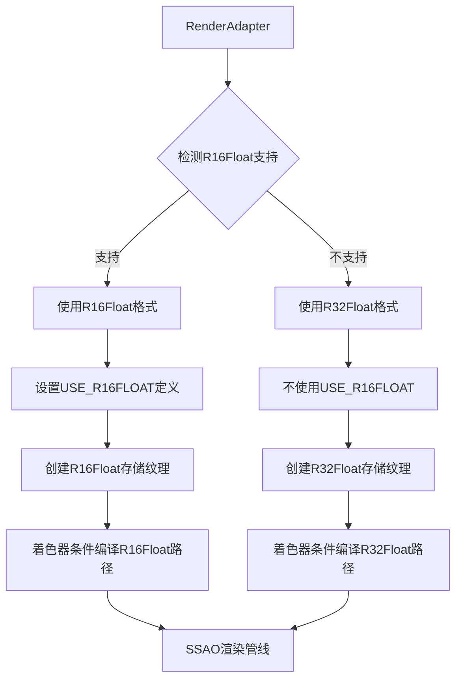

+++
title = "#20960 Added SSAO support on WebGPU, with R32Float fallback."
date = "2025-10-29T00:00:00"
draft = false
template = "pull_request_page.html"
in_search_index = false

[extra]
current_language = "zh-cn"
available_languages = {"en" = { name = "English", url = "/pull_request/bevy/2025-10/pr-20960-en-20251029" }, "zh-cn" = { name = "中文", url = "/pull_request/bevy/2025-10/pr-20960-zh-cn-20251029" }}
+++

# Added SSAO support on WebGPU, with R32Float fallback

## Basic Information
- **标题**: Added SSAO support on WebGPU, with R32Float fallback.
- **PR链接**: https://github.com/bevyengine/bevy/pull/20960
- **作者**: diyu-motif
- **状态**: 已合并
- **标签**: C-Feature, A-Rendering, S-Ready-For-Final-Review, O-WebGPU
- **创建时间**: 2025-09-11T01:54:27Z
- **合并时间**: 2025-10-29T18:38:57Z
- **合并者**: alice-i-cecile

## 描述翻译

# 目标

此PR旨在为WebGPU添加SSAO支持。

## 解决方案
添加r16float检测，如果不支持则回退到r32float。参考初始的ssao PR[这里](https://github.com/bevyengine/bevy/pull/7402)。

## 测试

- 你是否测试了这些更改？如果是，如何测试的？
     是的，以下是测试ssao示例的命令
`RUSTFLAGS="--cfg getrandom_backend=\"wasm_js\"" cargo run --example ssao --target wasm32-unknown-unknown --features webgpu`
然后访问 http://localhost:1334，确保支持[WebGPU](https://caniuse.com/webgpu)

- 是否有任何部分需要更多测试？
 不适用
- 其他人（审阅者）如何测试你的更改？他们需要了解什么具体信息吗？
     1. 对于R32Float回退，只需要第一个提交。但是，我在Chrome（和Chrome Canary）上遇到了一些奇怪的闪烁问题，所以我添加了一个"detect_r16float_support"标志和在第二个和第三个提交中的临时修复，这些在合并时打算被还原。
     2. 使用第一个提交，Safari工作正常，但Chrome有闪烁，我通过部分还原来自https://github.com/bevyengine/bevy/pull/20313的着色器更改来修复了它，这很奇怪。这可能是由Chrome中的一些着色器优化问题引起的，我不知道为什么，因为更改只是将计算移动到不同的函数。   
这里是Mac Chrome(140.0.7339.133 (Official Build) (arm64))上的闪烁


- 如果相关，你在哪些平台上测试了这些更改，有哪些重要的平台你无法测试？
     在原生(mac)和WebGPU上测试。要在原生上测试，将"detect_r16float_support"设置为false以强制使用R32Float。
     我无法在Windows 11 Chrome或Firefox上运行WebGPU ssao示例，'taa_pipeline'中有一些错误。
 
---

## 此拉取请求的故事

### 问题和背景

在WebGPU平台上实现SSAO（Screen Space Ambient Occlusion）功能时，开发团队面临一个关键的技术挑战：原有的SSAO实现依赖于R16Float纹理格式的存储绑定（storage binding）支持，但并非所有WebGPU实现都支持这一功能。

具体来说，在PR修改之前，代码在初始化阶段会进行严格的硬件能力检查：

```rust
// 修改前的检查逻辑
if !render_app
    .world()
    .resource::<RenderAdapter>()
    .get_texture_format_features(TextureFormat::R16Float)
    .allowed_usages
    .contains(TextureUsages::STORAGE_BINDING)
{
    warn!("ScreenSpaceAmbientOcclusionPlugin not loaded. GPU lacks support...");
    return;
}
```

这种硬性检查导致在不支持R16Float存储绑定的WebGPU平台上，SSAO功能完全无法使用。这是一个典型的跨平台兼容性问题，需要在保持功能可用性的同时处理不同平台的硬件能力差异。

### 解决方案方法

开发者采取了渐进式功能降级的策略，核心思路是：

1. **运行时能力检测**：在初始化时检测R16Float存储绑定的支持情况
2. **动态格式选择**：根据检测结果选择使用R16Float或降级到R32Float
3. **条件编译支持**：通过shader_defs在着色器中实现格式特定的代码路径

这种方法的优势在于：
- 保持了对高性能R16Float格式的向后兼容
- 为不支持该格式的平台提供了可用的替代方案
- 避免了硬性功能检查导致的完全不可用

### 具体实现

实现的核心在于`SsaoPipelines`结构体的重构，添加了动态格式检测和选择逻辑：

```rust
// 在FromWorld实现中添加格式检测
let depth_format = if render_adapter
    .get_texture_format_features(TextureFormat::R16Float)
    .allowed_usages
    .contains(TextureUsages::STORAGE_BINDING)
{
    TextureFormat::R16Float
} else {
    TextureFormat::R32Float
};
```

这个检测结果被存储在新的`depth_format`字段中，并在整个渲染管线的多个环节中使用：

1. **管线创建**：根据选择的格式配置存储纹理绑定
```rust
texture_storage_2d(depth_format, StorageTextureAccess::WriteOnly),
```

2. **着色器定义**：通过shader_defs传递格式信息
```rust
let mut shader_defs = Vec::new();
if depth_format == TextureFormat::R16Float {
    shader_defs.push("USE_R16FLOAT".into());
}
```

3. **纹理准备**：在运行时根据选择的格式创建纹理
```rust
format: pipelines.depth_format,
```

### 着色器层面的适配

在WGSL着色器代码中，通过条件编译实现了格式特定的绑定：

```rust
// preprocess_depth.wgsl中的修改
#ifdef USE_R16FLOAT
@group(0) @binding(1) var preprocessed_depth_mip0: texture_storage_2d<r16float, write>;
// ... 其他mip级别
#else
@group(0) @binding(1) var preprocessed_depth_mip0: texture_storage_2d<r32float, write>;
// ... 其他mip级别
#endif
```

同样的模式也应用在`spatial_denoise.wgsl`和`ssao.wgsl`中，确保所有使用深度数据的着色器阶段都能正确处理不同的格式。

### 技术挑战和临时解决方案

开发过程中遇到了一个有趣的跨浏览器兼容性问题：在Chrome浏览器中出现了SSAO输出的闪烁现象。经过调试，开发者发现这与之前的一个着色器优化（PR #20313）有关。

临时解决方案是部分还原了该优化，通过调整计算在不同函数间的分布来避免Chrome的着色器编译器可能存在的优化问题。这凸显了WebGPU生态中不同实现之间行为差异的挑战。

### 影响和意义

这个PR的合并带来了几个重要的改进：

1. **平台兼容性扩展**：SSAO功能现在可以在所有支持WebGPU的平台上运行，无论其R16Float存储绑定支持情况
2. **渐进增强**：支持R16Float的平台继续获得最佳性能，其他平台则获得可用的降级体验
3. **架构改进**：建立了可扩展的格式检测和回退机制，为未来处理类似平台差异提供了模板

从工程角度看，这个实现展示了如何处理图形API中的硬件能力差异，以及如何通过条件编译和运行时检测来构建健壮的跨平台渲染功能。

## 视觉表示



## 关键文件变更

### `crates/bevy_pbr/src/ssao/mod.rs` (+37/-22)

这是主要的逻辑变更文件，实现了格式检测和动态管线配置：

**关键修改：**
```rust
// 移除原有的硬性检查
- if !render_app
-     .world()
-     .resource::<RenderAdapter>()
-     .get_texture_format_features(TextureFormat::R16Float)
-     .allowed_usages
-     .contains(TextureUsages::STORAGE_BINDING)
- {
-     warn!("ScreenSpaceAmbientOcclusionPlugin not loaded. GPU lacks support...");
-     return;
- }

// 添加动态格式检测
+ let depth_format = if render_adapter
+     .get_texture_format_features(TextureFormat::R16Float)
+     .allowed_usages
+     .contains(TextureUsages::STORAGE_BINDING)
+ {
+     TextureFormat::R16Float
+ } else {
+     TextureFormat::R32Float
+ };
```

### `crates/bevy_pbr/src/ssao/preprocess_depth.wgsl` (+8/-0)

深度预处理着色器添加了格式条件编译：

```rust
// 添加条件绑定的支持
+#ifdef USE_R16FLOAT
 @group(0) @binding(1) var preprocessed_depth_mip0: texture_storage_2d<r16float, write>;
// ...
+#else
+@group(0) @binding(1) var preprocessed_depth_mip0: texture_storage_2d<r32float, write>;
// ...
+#endif
```

### `crates/bevy_pbr/src/ssao/spatial_denoise.wgsl` (+4/-0) 和 `crates/bevy_pbr/src/ssao/ssao.wgsl` (+4/-0)

这两个着色器文件采用了相同的模式，为主SSAO计算和空间去噪添加了格式条件支持。

## 进一步阅读

- [WebGPU规范 - 纹理格式](https://www.w3.org/TR/webgpu/#texture-format-caps)
- [Bevy SSAO初始实现PR #7402](https://github.com/bevyengine/bevy/pull/7402)
- [WGSL存储纹理文档](https://www.w3.org/TR/WGSL/#storage-texture)
- [图形API功能检测最佳实践](https://github.com/gpuweb/gpuweb/wiki/Implementation-Status)

# Full Code Diff
diff --git a/crates/bevy_pbr/src/ssao/mod.rs b/crates/bevy_pbr/src/ssao/mod.rs
index d9f24d4999aa7..9a94aa355ad3f 100644
--- a/crates/bevy_pbr/src/ssao/mod.rs
+++ b/crates/bevy_pbr/src/ssao/mod.rs
@@ -60,17 +60,6 @@ impl Plugin for ScreenSpaceAmbientOcclusionPlugin {
             return;
         };
 
-        if !render_app
-            .world()
-            .resource::<RenderAdapter>()
-            .get_texture_format_features(TextureFormat::R16Float)
-            .allowed_usages
-            .contains(TextureUsages::STORAGE_BINDING)
-        {
-            warn!("ScreenSpaceAmbientOcclusionPlugin not loaded. GPU lacks support: TextureFormat::R16Float does not support TextureUsages::STORAGE_BINDING.");
-            return;
-        }
-
         if render_app
             .world()
             .resource::<RenderDevice>()
@@ -299,6 +288,7 @@ struct SsaoPipelines {
     linear_clamp_sampler: Sampler,
 
     shader: Handle<Shader>,
+    depth_format: TextureFormat,
 }
 
 impl FromWorld for SsaoPipelines {
@@ -307,6 +297,18 @@ impl FromWorld for SsaoPipelines {
         let render_queue = world.resource::<RenderQueue>();
         let pipeline_cache = world.resource::<PipelineCache>();
 
+        // Detect the depth format support
+        let render_adapter = world.resource::<RenderAdapter>();
+        let depth_format = if render_adapter
+            .get_texture_format_features(TextureFormat::R16Float)
+            .allowed_usages
+            .contains(TextureUsages::STORAGE_BINDING)
+        {
+            TextureFormat::R16Float
+        } else {
+            TextureFormat::R32Float
+        };
+
         let hilbert_index_lut = render_device
             .create_texture_with_data(
                 render_queue,
@@ -364,11 +366,11 @@ impl FromWorld for SsaoPipelines {
                 ShaderStages::COMPUTE,
                 (
                     texture_depth_2d(),
-                    texture_storage_2d(TextureFormat::R16Float, StorageTextureAccess::WriteOnly),
-                    texture_storage_2d(TextureFormat::R16Float, StorageTextureAccess::WriteOnly),
-                    texture_storage_2d(TextureFormat::R16Float, StorageTextureAccess::WriteOnly),
-                    texture_storage_2d(TextureFormat::R16Float, StorageTextureAccess::WriteOnly),
-                    texture_storage_2d(TextureFormat::R16Float, StorageTextureAccess::WriteOnly),
+                    texture_storage_2d(depth_format, StorageTextureAccess::WriteOnly),
+                    texture_storage_2d(depth_format, StorageTextureAccess::WriteOnly),
+                    texture_storage_2d(depth_format, StorageTextureAccess::WriteOnly),
+                    texture_storage_2d(depth_format, StorageTextureAccess::WriteOnly),
+                    texture_storage_2d(depth_format, StorageTextureAccess::WriteOnly),
                 ),
             ),
         );
@@ -381,7 +383,7 @@ impl FromWorld for SsaoPipelines {
                     texture_2d(TextureSampleType::Float { filterable: true }),
                     texture_2d(TextureSampleType::Float { filterable: false }),
                     texture_2d(TextureSampleType::Uint),
-                    texture_storage_2d(TextureFormat::R16Float, StorageTextureAccess::WriteOnly),
+                    texture_storage_2d(depth_format, StorageTextureAccess::WriteOnly),
                     texture_storage_2d(TextureFormat::R32Uint, StorageTextureAccess::WriteOnly),
                     uniform_buffer::<GlobalsUniform>(false),
                     uniform_buffer::<f32>(false),
@@ -396,11 +398,16 @@ impl FromWorld for SsaoPipelines {
                 (
                     texture_2d(TextureSampleType::Float { filterable: false }),
                     texture_2d(TextureSampleType::Uint),
-                    texture_storage_2d(TextureFormat::R16Float, StorageTextureAccess::WriteOnly),
+                    texture_storage_2d(depth_format, StorageTextureAccess::WriteOnly),
                 ),
             ),
         );
 
+        let mut shader_defs = Vec::new();
+        if depth_format == TextureFormat::R16Float {
+            shader_defs.push("USE_R16FLOAT".into());
+        }
+
         let preprocess_depth_pipeline =
             pipeline_cache.queue_compute_pipeline(ComputePipelineDescriptor {
                 label: Some("ssao_preprocess_depth_pipeline".into()),
@@ -409,6 +416,7 @@ impl FromWorld for SsaoPipelines {
                     common_bind_group_layout.clone(),
                 ],
                 shader: load_embedded_asset!(world, "preprocess_depth.wgsl"),
+                shader_defs: shader_defs.clone(),
                 ..default()
             });
 
@@ -420,6 +428,7 @@ impl FromWorld for SsaoPipelines {
                     common_bind_group_layout.clone(),
                 ],
                 shader: load_embedded_asset!(world, "spatial_denoise.wgsl"),
+                shader_defs,
                 ..default()
             });
 
@@ -437,6 +446,7 @@ impl FromWorld for SsaoPipelines {
             linear_clamp_sampler,
 
             shader: load_embedded_asset!(world, "ssao.wgsl"),
+            depth_format,
         }
     }
 }
@@ -465,6 +475,10 @@ impl SpecializedComputePipeline for SsaoPipelines {
             shader_defs.push("TEMPORAL_JITTER".into());
         }
 
+        if self.depth_format == TextureFormat::R16Float {
+            shader_defs.push("USE_R16FLOAT".into());
+        }
+
         ComputePipelineDescriptor {
             label: Some("ssao_ssao_pipeline".into()),
             layout: vec![
@@ -519,6 +533,7 @@ fn prepare_ssao_textures(
     mut commands: Commands,
     mut texture_cache: ResMut<TextureCache>,
     render_device: Res<RenderDevice>,
+    pipelines: Res<SsaoPipelines>,
     views: Query<(Entity, &ExtractedCamera, &ScreenSpaceAmbientOcclusion)>,
 ) {
     for (entity, camera, ssao_settings) in &views {
@@ -535,7 +550,7 @@ fn prepare_ssao_textures(
                 mip_level_count: 5,
                 sample_count: 1,
                 dimension: TextureDimension::D2,
-                format: TextureFormat::R16Float,
+                format: pipelines.depth_format,
                 usage: TextureUsages::STORAGE_BINDING | TextureUsages::TEXTURE_BINDING,
                 view_formats: &[],
             },
@@ -549,7 +564,7 @@ fn prepare_ssao_textures(
                 mip_level_count: 1,
                 sample_count: 1,
                 dimension: TextureDimension::D2,
-                format: TextureFormat::R16Float,
+                format: pipelines.depth_format,
                 usage: TextureUsages::STORAGE_BINDING | TextureUsages::TEXTURE_BINDING,
                 view_formats: &[],
             },
@@ -563,7 +578,7 @@ fn prepare_ssao_textures(
                 mip_level_count: 1,
                 sample_count: 1,
                 dimension: TextureDimension::D2,
-                format: TextureFormat::R16Float,
+                format: pipelines.depth_format,
                 usage: TextureUsages::STORAGE_BINDING | TextureUsages::TEXTURE_BINDING,
                 view_formats: &[],
             },
@@ -670,7 +685,7 @@ fn prepare_ssao_bind_groups(
                 .create_view(&TextureViewDescriptor {
                     label: Some("ssao_preprocessed_depth_texture_mip_view"),
                     base_mip_level: mip_level,
-                    format: Some(TextureFormat::R16Float),
+                    format: Some(pipelines.depth_format),
                     dimension: Some(TextureViewDimension::D2),
                     mip_level_count: Some(1),
                     ..default()
diff --git a/crates/bevy_pbr/src/ssao/preprocess_depth.wgsl b/crates/bevy_pbr/src/ssao/preprocess_depth.wgsl
index a386b09d9c23c..bce9e56f59e06 100644
--- a/crates/bevy_pbr/src/ssao/preprocess_depth.wgsl
+++ b/crates/bevy_pbr/src/ssao/preprocess_depth.wgsl
@@ -8,11 +8,19 @@
 #import bevy_render::view::View
 
 @group(0) @binding(0) var input_depth: texture_depth_2d;
+#ifdef USE_R16FLOAT
 @group(0) @binding(1) var preprocessed_depth_mip0: texture_storage_2d<r16float, write>;
 @group(0) @binding(2) var preprocessed_depth_mip1: texture_storage_2d<r16float, write>;
 @group(0) @binding(3) var preprocessed_depth_mip2: texture_storage_2d<r16float, write>;
 @group(0) @binding(4) var preprocessed_depth_mip3: texture_storage_2d<r16float, write>;
 @group(0) @binding(5) var preprocessed_depth_mip4: texture_storage_2d<r16float, write>;
+#else
+@group(0) @binding(1) var preprocessed_depth_mip0: texture_storage_2d<r32float, write>;
+@group(0) @binding(2) var preprocessed_depth_mip1: texture_storage_2d<r32float, write>;
+@group(0) @binding(3) var preprocessed_depth_mip2: texture_storage_2d<r32float, write>;
+@group(0) @binding(4) var preprocessed_depth_mip3: texture_storage_2d<r32float, write>;
+@group(0) @binding(5) var preprocessed_depth_mip4: texture_storage_2d<r32float, write>;
+#endif
 @group(1) @binding(0) var point_clamp_sampler: sampler;
 @group(1) @binding(1) var linear_clamp_sampler: sampler;
 @group(1) @binding(2) var<uniform> view: View;
diff --git a/crates/bevy_pbr/src/ssao/spatial_denoise.wgsl b/crates/bevy_pbr/src/ssao/spatial_denoise.wgsl
index 1c04f9cfab2f7..f61934fb462d5 100644
--- a/crates/bevy_pbr/src/ssao/spatial_denoise.wgsl
+++ b/crates/bevy_pbr/src/ssao/spatial_denoise.wgsl
@@ -13,7 +13,11 @@
 
 @group(0) @binding(0) var ambient_occlusion_noisy: texture_2d<f32>;
 @group(0) @binding(1) var depth_differences: texture_2d<u32>;
+#ifdef USE_R16FLOAT
 @group(0) @binding(2) var ambient_occlusion: texture_storage_2d<r16float, write>;
+#else
+@group(0) @binding(2) var ambient_occlusion: texture_storage_2d<r32float, write>;
+#endif
 @group(1) @binding(0) var point_clamp_sampler: sampler;
 @group(1) @binding(1) var linear_clamp_sampler: sampler;
 @group(1) @binding(2) var<uniform> view: View;
diff --git a/crates/bevy_pbr/src/ssao/ssao.wgsl b/crates/bevy_pbr/src/ssao/ssao.wgsl
index ac64d5653f7a4..aa715be052152 100644
--- a/crates/bevy_pbr/src/ssao/ssao.wgsl
+++ b/crates/bevy_pbr/src/ssao/ssao.wgsl
@@ -21,7 +21,11 @@
 @group(0) @binding(0) var preprocessed_depth: texture_2d<f32>;
 @group(0) @binding(1) var normals: texture_2d<f32>;
 @group(0) @binding(2) var hilbert_index_lut: texture_2d<u32>;
+#ifdef USE_R16FLOAT
 @group(0) @binding(3) var ambient_occlusion: texture_storage_2d<r16float, write>;
+#else
+@group(0) @binding(3) var ambient_occlusion: texture_storage_2d<r32float, write>;
+#endif
 @group(0) @binding(4) var depth_differences: texture_storage_2d<r32uint, write>;
 @group(0) @binding(5) var<uniform> globals: Globals;
 @group(0) @binding(6) var<uniform> thickness: f32;