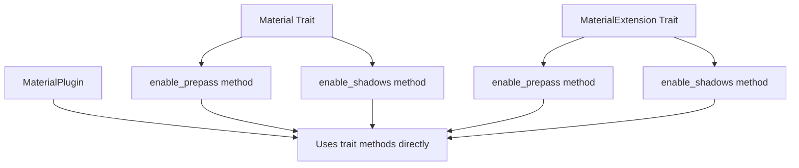

+++
title = "#20999 make Prepass/ShadowsEnabled methods on Material"
date = "2025-10-01T00:00:00"
draft = false
template = "pull_request_page.html"
in_search_index = true

[taxonomies]
list_display = ["show"]

[extra]
current_language = "en"
available_languages = {"en" = { name = "English", url = "/pull_request/bevy/2025-10/pr-20999-en-20251001" }, "zh-cn" = { name = "中文", url = "/pull_request/bevy/2025-10/pr-20999-zh-cn-20251001" }}
labels = ["A-Rendering", "C-Usability"]
+++

# Title

make Prepass/ShadowsEnabled methods on Material

## Basic Information
- **Title**: make Prepass/ShadowsEnabled methods on Material
- **PR Link**: https://github.com/bevyengine/bevy/pull/20999
- **Author**: ecoskey
- **Status**: MERGED
- **Labels**: A-Rendering, C-Usability, S-Ready-For-Final-Review, M-Needs-Migration-Guide
- **Created**: 2025-09-13T05:23:58Z
- **Merged**: 2025-10-01T19:46:45Z
- **Merged By**: alice-i-cecile

## Description Translation

# Objective

- enabling prepass/shadows should be done like the rest of a material's properties

## Solution

- remove `Prepass/ShadowsEnabled` resources and associated fields on `MaterialPlugin`
- add `Material::enable_prepass` and `Material::enable_shadows`

## The Story of This Pull Request

This PR addresses a consistency issue in Bevy's material system where enabling prepass and shadows was handled differently from other material properties. Previously, these features were controlled through plugin configuration and global resources, which created an inconsistent API compared to how other material behaviors are defined.

The core problem was architectural: prepass and shadow enabling used a plugin-centric approach rather than following the established material trait pattern. This meant developers had to configure these features in two different places - some properties on the material trait itself, and others through plugin configuration. This inconsistency made the API harder to learn and use correctly.

The solution refactors this to use a material-centric approach. Instead of configuring prepass and shadows through `MaterialPlugin` fields and checking for the existence of marker resources, the system now uses trait methods on the `Material` and `MaterialExtension` traits. This aligns with how other material properties are defined and makes the configuration more discoverable.

Looking at the implementation, the key change was adding default trait methods to the `Material` trait:

```rust
/// Controls if the prepass is enabled for the Material.
/// For more information about what a prepass is, see the [`bevy_core_pipeline::prepass`] docs.
#[inline]
fn enable_prepass() -> bool {
    true
}

/// Controls if shadows are enabled for the Material.
#[inline]
fn enable_shadows() -> bool {
    true
}
```

These methods provide sensible defaults (both enabled) while allowing materials to override the behavior. The corresponding changes were made to `MaterialExtension` to maintain consistency across the extension system.

The plugin system was then updated to use these trait methods instead of checking for marker resources. In `MaterialPlugin`, the conditional system additions now directly call the trait methods:

```rust
if M::enable_shadows() {
    app.add_systems(
        PostUpdate,
        check_light_entities_needing_specialization::<M>
            .in_set(RenderSet::CheckLightEntitiesNeedingSpecialization),
    );
}
```

This approach eliminates the need for the `PrepassEnabled` and `ShadowsEnabled` marker resources entirely. The material preparation system also switched from checking resource existence to calling the trait methods:

```rust
let shadows_enabled = M::enable_shadows();
let prepass_enabled = M::enable_prepass();
```

One important technical consideration is that these methods are static - they don't have access to material instance data. This was a deliberate design choice since prepass and shadow enabling are typically material-type-level decisions rather than per-instance configurations. This keeps the API simple and avoids runtime overhead.

The migration required updating existing code that used the old plugin configuration approach. For example, the `PrepassOutputMaterial` in the shader prepass example was updated to override the trait method instead of using plugin configuration:

```rust
impl Material for PrepassOutputMaterial {
    // ... other methods ...
    
    fn enable_prepass() -> bool {
        false
    }
}
```

This change improves API consistency and makes material configuration more intuitive. Developers now have a single, unified pattern for configuring material behavior through the trait system.

## Visual Representation



## Key Files Changed

### `crates/bevy_pbr/src/material.rs` (+18/-36)
This file saw the most significant changes, adding the new trait methods and removing the old resource-based approach.

**Key additions:**
```rust
/// Controls if the prepass is enabled for the Material.
/// For more information about what a prepass is, see the [`bevy_core_pipeline::prepass`] docs.
#[inline]
fn enable_prepass() -> bool {
    true
}

/// Controls if shadows are enabled for the Material.
#[inline]
fn enable_shadows() -> bool {
    true
}
```

**Key removals:**
```rust
// Removed from MaterialPlugin struct:
pub prepass_enabled: bool,
pub shadows_enabled: bool,

// Removed resource:
#[derive(Resource, Debug)]
pub struct ShadowsEnabled<M: Material>(PhantomData<M>);
```

### `crates/bevy_pbr/src/extended_material.rs` (+21/-0)
Added the same trait methods to `MaterialExtension` to maintain consistency.

```rust
/// Controls if the prepass is enabled for the Material.
/// For more information about what a prepass is, see the [`bevy_core_pipeline::prepass`] docs.
#[inline]
fn enable_prepass() -> bool {
    true
}

/// Controls if shadows are enabled for the Material.
#[inline]
fn enable_shadows() -> bool {
    true
}
```

### `crates/bevy_pbr/src/prepass/mod.rs` (+1/-12)
Removed the `PrepassEnabled` resource that was no longer needed.

### `examples/shader/shader_prepass.rs` (+5/-6)
Updated the example to use the new trait method approach:

```rust
// Before:
MaterialPlugin::<PrepassOutputMaterial> {
    prepass_enabled: false,
    ..default()
},

// After:
impl Material for PrepassOutputMaterial {
    fn enable_prepass() -> bool {
        false
    }
}
```

### `release-content/migration-guides/enable_prepass.md` (+25/-0)
Added comprehensive migration guide showing how to update code from the old plugin-based approach to the new trait-based approach.

## Further Reading

- [Bevy Material System Documentation](https://docs.rs/bevy_pbr/latest/bevy_pbr/trait.Material.html)
- [Bevy Prepass Documentation](https://docs.rs/bevy_core_pipeline/latest/bevy_core_pipeline/prepass/index.html)
- [Rust Trait System](https://doc.rust-lang.org/book/ch10-02-traits.html)