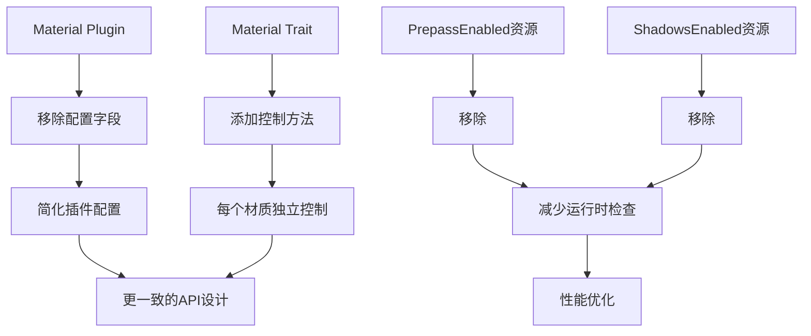

+++
title = "#20999 make Prepass/ShadowsEnabled methods on Material"
date = "2025-10-01T00:00:00"
draft = false
template = "pull_request_page.html"
in_search_index = false

[extra]
current_language = "zh-cn"
available_languages = {"en" = { name = "English", url = "/pull_request/bevy/2025-10/pr-20999-en-20251001" }, "zh-cn" = { name = "中文", url = "/pull_request/bevy/2025-10/pr-20999-zh-cn-20251001" }}
labels = ["A-Rendering", "C-Usability"]
+++

# Title

## Basic Information
- **Title**: make Prepass/ShadowsEnabled methods on Material
- **PR Link**: https://github.com/bevyengine/bevy/pull/20999
- **Author**: ecoskey
- **Status**: MERGED
- **Labels**: A-Rendering, C-Usability, S-Ready-For-Final-Review, M-Needs-Migration-Guide
- **Created**: 2025-09-13T05:23:58Z
- **Merged**: 2025-10-01T19:46:45Z
- **Merged By**: alice-i-cecile

## Description Translation
这个PR的目标是让启用prepass/shadows的方式与材质的其他属性保持一致。

解决方案：
- 移除 `Prepass/ShadowsEnabled` 资源和 `MaterialPlugin` 上的相关字段
- 添加 `Material::enable_prepass` 和 `Material::enable_shadows` 方法

## The Story of This Pull Request

这个PR解决了一个架构一致性问题。在之前的实现中，prepass和shadows的启用是通过全局资源控制的，这与Bevy材质系统的设计模式不一致。

**问题背景**

在Bevy的渲染系统中，材质属性通常通过实现`Material` trait来定义。然而，prepass和shadows的启用却是通过`MaterialPlugin`的配置字段来控制的：

```rust
// 之前的实现
MaterialPlugin::<StandardMaterial> {
    prepass_enabled: true,      // 全局控制
    shadows_enabled: true,      // 全局控制
    ..Default::default()
}
```

这种方式存在几个问题：
1. **架构不一致**：其他材质属性都在`Material` trait中定义，而这两个属性在插件级别配置
2. **灵活性受限**：无法让不同的材质类型有不同的prepass/shadow设置
3. **配置复杂**：需要在插件初始化时设置，而不是在材质定义时

**解决方案**

PR作者采用了直接的方法：将控制权从插件转移到材质本身。具体来说：

1. 从`MaterialPlugin`中移除`prepass_enabled`和`shadows_enabled`字段
2. 在`Material` trait中添加默认实现的方法：
   ```rust
   fn enable_prepass() -> bool { true }
   fn enable_shadows() -> bool { true }
   ```
3. 相应地更新所有使用这些配置的代码路径

**实现细节**

核心变化发生在材质准备阶段。之前系统通过检查是否存在`ShadowsEnabled`和`PrepassEnabled`资源来决定是否启用相关功能：

```rust
// 之前的实现
let shadows_enabled = shadows_enabled.is_some();
let prepass_enabled = prepass_enabled.is_some();
```

现在改为直接调用材质的方法：

```rust
// 新的实现
let shadows_enabled = M::enable_shadows();
let prepass_enabled = M::enable_prepass();
```

这种改变使得每个材质类型可以独立控制自己的prepass和shadow行为。例如，在示例代码中，`PrepassOutputMaterial`现在可以通过重写方法来禁用prepass：

```rust
impl Material for PrepassOutputMaterial {
    fn enable_prepass() -> bool {
        false
    }
}
```

**技术洞察**

这个重构体现了几个重要的软件设计原则：

1. **单一职责原则**：材质相关的配置现在完全在材质内部管理
2. **开闭原则**：可以通过实现trait方法来扩展行为，而不需要修改核心系统
3. **一致性**：所有材质属性现在都通过相同的方式配置

性能方面，这个改变实际上是优化的，因为现在系统在编译时就知道哪些材质需要prepass/shadows，而不是在运行时检查资源存在性。

**影响**

这个改变是向后不兼容的，因此需要迁移指南。主要影响包括：

- 简化了材质插件的配置
- 提供了更细粒度的控制能力
- 使材质系统更加一致和可预测

## Visual Representation



## Key Files Changed

### `crates/bevy_pbr/src/material.rs` (+18/-36)

这是最重要的改动文件，定义了核心的`Material` trait和`MaterialPlugin`。

**主要改动：**

```rust
// 在Material trait中添加新方法
pub trait Material: Asset + AsBindGroup + Clone + Sized {
    // ... 其他方法 ...
    
    /// Controls if the prepass is enabled for the Material.
    /// For more information about what a prepass is, see the [`bevy_core_pipeline::prepass`] docs.
    #[inline]
    fn enable_prepass() -> bool {
        true
    }

    /// Controls if shadows are enabled for the Material.
    #[inline]
    fn enable_shadows() -> bool {
        true
    }
}

// 从MaterialPlugin中移除配置字段
pub struct MaterialPlugin<M: Material> {
    // 移除: prepass_enabled: bool,
    // 移除: shadows_enabled: bool,
    pub debug_flags: RenderDebugFlags,
    pub _marker: PhantomData<M>,
}
```

### `crates/bevy_pbr/src/extended_material.rs` (+21/-0)

为扩展材质添加了相应的方法实现。

```rust
pub trait MaterialExtension: Asset + AsBindGroup + Clone + Sized {
    // ... 其他方法 ...
    
    /// Controls if the prepass is enabled for the Material.
    #[inline]
    fn enable_prepass() -> bool {
        true
    }

    /// Controls if shadows are enabled for the Material.
    #[inline]
    fn enable_shadows() -> bool {
        true
    }
}
```

### `crates/bevy_pbr/src/prepass/mod.rs` (+1/-12)

移除了不再需要的`PrepassEnabled`资源定义。

```rust
// 移除的资源定义
// #[derive(Resource, Debug)]
// pub struct PrepassEnabled<M: Material>(PhantomData<M>);
```

### `examples/shader/shader_prepass.rs` (+5/-6)

更新示例代码以使用新的API。

```rust
// 之前：通过插件配置禁用prepass
MaterialPlugin::<PrepassOutputMaterial> {
    prepass_enabled: false,
    ..default()
}

// 现在：通过材质方法禁用prepass
impl Material for PrepassOutputMaterial {
    fn enable_prepass() -> bool {
        false
    }
}
```

### `release-content/migration-guides/enable_prepass.md` (+25/-0)

新增迁移指南，指导用户如何从旧API迁移到新API。

## Further Reading

- [Bevy Material System Documentation](https://bevyengine.org/learn/book/getting-started/materials/)
- [Prepass Rendering in Bevy](https://bevyengine.org/learn/book/getting-started/prepass/)
- [Trait Design Patterns in Rust](https://rust-unofficial.github.io/patterns/patterns/behavioural/)