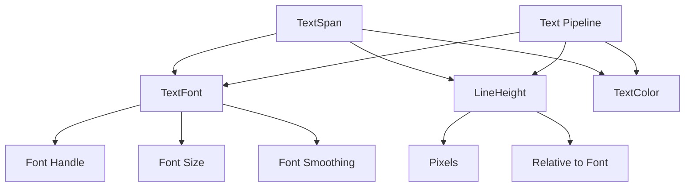

+++
title = "#21180 Remove `line_height` from `TextFont`"
date = "2025-10-29T00:00:00"
draft = false
template = "pull_request_page.html"
in_search_index = true

[taxonomies]
list_display = ["show"]

[extra]
current_language = "en"
available_languages = {"en" = { name = "English", url = "/pull_request/bevy/2025-10/pr-21180-en-20251029" }, "zh-cn" = { name = "中文", url = "/pull_request/bevy/2025-10/pr-21180-zh-cn-20251029" }}
labels = ["C-Code-Quality", "A-Text", "D-Straightforward"]
+++

# Title

## Basic Information
- **Title**: Remove `line_height` from `TextFont`
- **PR Link**: https://github.com/bevyengine/bevy/pull/21180
- **Author**: ickshonpe
- **Status**: MERGED
- **Labels**: C-Code-Quality, S-Ready-For-Final-Review, A-Text, X-Uncontroversial, D-Straightforward
- **Created**: 2025-09-23T10:39:38Z
- **Merged**: 2025-10-29T19:05:00Z
- **Merged By**: alice-i-cecile

## Description Translation
# Objective

Remove the `line_height` field from `TextFont`.
Line height is a property of the text layout, not the font.

Part of the changes for #21175 

## Solution

Remove the `line_height` field from `TextFont`.
Make `LineHeight` into a component.
Update the text access API and text pipeline.

## The Story of This Pull Request

This PR addresses a fundamental architectural issue in Bevy's text system by separating line height from font properties. The core problem was that `line_height` was incorrectly stored as a field in the `TextFont` component, despite being a layout property rather than a font property.

The implementation follows a clear architectural principle: fonts define visual characteristics like glyph shapes and sizes, while layout components control how text flows and positions. This separation allows for more flexible text rendering where the same font can be used with different line heights in different contexts.

The changes begin with removing the `line_height` field from `TextFont` entirely:

```rust
// Before:
pub struct TextFont {
    pub font: Handle<Font>,
    pub font_size: f32,
    pub line_height: LineHeight,  // This field is removed
    pub font_smoothing: FontSmoothing,
}

// After:
pub struct TextFont {
    pub font: Handle<Font>,
    pub font_size: f32,
    pub font_smoothing: FontSmoothing,
}
```

To maintain the same functionality, `LineHeight` is promoted to a standalone component:

```rust
// Before just an enum, now also a component:
#[derive(Component, Debug, Clone, Copy, PartialEq, Reflect)]
#[reflect(Component, Debug, Clone, PartialEq)]
pub enum LineHeight {
    Px(f32),
    RelativeToFont(f32),
}
```

This architectural change required updates throughout the text pipeline. The most significant modifications occur in the text access system (`text_access.rs`) where `TextReader` and `TextWriter` now handle line height as a separate component:

```rust
// Updated query in TextReader to include LineHeight:
roots: Query<
    'w, 's,
    (
        &'static R,
        &'static TextFont,
        &'static TextColor,
        &'static LineHeight,  // Added
        Option<&'static Children>,
    ),
>
```

The text pipeline (`pipeline.rs`) required the most extensive changes to accommodate the new data flow. The `update_buffer` method now accepts line height as a separate parameter in its iterator:

```rust
// Before:
text_spans: impl Iterator<Item = (Entity, usize, &'a str, &'a TextFont, Color)>

// After:
text_spans: impl Iterator<Item = (Entity, usize, &'a str, &'a TextFont, Color, LineHeight)>
```

Similarly, the internal buffer structure was updated to store line height separately:

```rust
// Before:
spans_buffer: Vec<(usize, &'static str, &'static TextFont, FontFaceInfo)>

// After:
spans_buffer: Vec<(
    usize,
    &'static str,
    &'static TextFont,
    FontFaceInfo,
    LineHeight,  // Added
)>
```

The `get_attrs` function, which builds cosmic-text attributes, now takes line height as a separate parameter rather than extracting it from the font:

```rust
fn get_attrs<'a>(
    span_index: usize,
    text_font: &TextFont,
    line_height: LineHeight,  // Now separate parameter
    color: Color,
    face_info: &'a FontFaceInfo,
    scale_factor: f64,
) -> Attrs<'a>
```

Throughout the codebase, components that work with text now require the `LineHeight` component. For example, `TextSpan` was updated:

```rust
// Before:
#[require(TextFont, TextColor)]
pub struct TextSpan(pub String);

// After:
#[require(TextFont, TextColor, LineHeight)]  // Added LineHeight requirement
pub struct TextSpan(pub String);
```

The impact of these changes is significant for both performance and code organization. By separating concerns, the text system becomes more maintainable and follows ECS principles more closely. Font properties are now truly about the visual representation of characters, while layout properties control text flow and positioning.

For users, this change means they now need to add `LineHeight` as a separate component when working with text, but the migration is straightforward as demonstrated in the updated examples and migration guide.

## Visual Representation



## Key Files Changed

### `crates/bevy_text/src/text_access.rs` (+107/-23)
This file contains the text access API that was extensively modified to handle line height as a separate component.

**Key Changes:**
- Updated `TextReader` and `TextWriter` queries to include `LineHeight`
- Added new methods for accessing line height
- Modified iteration to handle the additional component

```rust
// Example of updated method signature:
pub fn get(
    &mut self,
    root_entity: Entity,
    index: usize,
) -> Option<(Entity, usize, &str, &TextFont, Color, LineHeight)> {
    // Implementation now includes line height
}
```

### `crates/bevy_text/src/pipeline.rs` (+54/-22)
The text pipeline was updated to process line height separately from font properties.

**Key Changes:**
- Modified buffer structures to store line height separately
- Updated method signatures to accept line height parameter
- Modified cosmic-text attribute generation

```rust
// Updated spans_buffer type:
spans_buffer: Vec<(
    usize,
    &'static str,
    &'static TextFont,
    FontFaceInfo,
    LineHeight,  // Added
)>
```

### `crates/bevy_text/src/text.rs` (+3/-24)
Core text component definitions were modified to separate line height from font.

**Key Changes:**
- Removed `line_height` field from `TextFont`
- Made `LineHeight` a component
- Updated component requirements

```rust
// TextFont after changes:
pub struct TextFont {
    pub font: Handle<Font>,
    pub font_size: f32,
    pub font_smoothing: FontSmoothing,
    // line_height field removed
}
```

### `crates/bevy_ui/src/widget/text.rs` (+13/-5)
UI text widgets were updated to require the new `LineHeight` component.

**Key Changes:**
- Added `LineHeight` to component requirements
- Updated text measurement functions

```rust
// Updated require attribute:
#[require(
    Node,
    TextLayout,
    TextFont,
    TextColor,
    LineHeight,  // Added
    TextNodeFlags,
    ContentSize
)]
```

### `crates/bevy_sprite/src/text2d.rs` (+4/-3)
2D text rendering was updated to include line height as a separate component.

**Key Changes:**
- Added `LineHeight` to the text bundle
- Updated component dependencies

```rust
// In the component bundle:
(
    Text2d,
    TextLayout,
    TextFont,
    TextColor,
    LineHeight,  // Added
    TextBounds,
    // ... other components
)
```

## Further Reading

- [Bevy Text System Documentation](https://docs.rs/bevy_text/latest/bevy_text/)
- [ECS Component Best Practices](https://bevy-cheatbook.github.io/programming/component-bundle.html)
- [Cosmic-text Library](https://github.com/pop-os/cosmic-text) - The underlying text layout engine used by Bevy