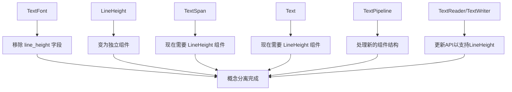

+++
title = "#21180 Remove `line_height` from `TextFont`"
date = "2025-10-29T00:00:00"
draft = false
template = "pull_request_page.html"
in_search_index = false

[extra]
current_language = "zh-cn"
available_languages = {"en" = { name = "English", url = "/pull_request/bevy/2025-10/pr-21180-en-20251029" }, "zh-cn" = { name = "中文", url = "/pull_request/bevy/2025-10/pr-21180-zh-cn-20251029" }}
labels = ["C-Code-Quality", "A-Text", "D-Straightforward"]
+++

# Remove `line_height` from `TextFont`

## Basic Information
- **Title**: Remove `line_height` from `TextFont`
- **PR Link**: https://github.com/bevyengine/bevy/pull/21180
- **Author**: ickshonpe
- **Status**: MERGED
- **Labels**: C-Code-Quality, S-Ready-For-Final-Review, A-Text, X-Uncontroversial, D-Straightforward
- **Created**: 2025-09-23T10:39:38Z
- **Merged**: 2025-10-29T19:05:00Z
- **Merged By**: alice-i-cecile

## Description Translation
# Objective

移除 `TextFont` 中的 `line_height` 字段。
行高是文本布局的属性，而不是字体的属性。

这是 #21175 变更的一部分。

## Solution

移除 `TextFont` 中的 `line_height` 字段。
将 `LineHeight` 变成一个组件。
更新文本访问 API 和文本管道。

## The Story of This Pull Request

这个PR的核心目标是解决一个设计上的概念混淆问题。在Bevy的文本系统中，`TextFont`组件原本同时包含了字体相关的属性（如字体大小、字体平滑）和布局相关的属性（如行高）。这种设计在概念上是不正确的，因为行高实际上是文本布局的属性，而不是字体本身的属性。

**问题根源**：在之前的实现中，`TextFont`结构体包含了`line_height`字段，这导致了概念上的混淆。字体应该只关心如何渲染字符，而行间距应该是布局系统关心的问题。这种设计也限制了灵活性，因为无法为同一个文本块中的不同部分设置不同的行高。

**解决方案**：开发者选择了最直接的方法 - 将`LineHeight`从`TextFont`中完全移除，并将其提升为一个独立的组件。这种方法的优势在于：

1. 概念清晰：字体属性和布局属性完全分离
2. 灵活性增强：可以为文本块中的不同部分设置不同的行高
3. 一致性：与现有的`TextColor`、`TextFont`等组件保持一致的设计模式

**实现过程**：这个变更影响了整个文本系统的多个层面：

首先，在`TextFont`结构体中移除了`line_height`字段和相关的方法：
```rust
// Before:
pub struct TextFont {
    pub font: Handle<Font>,
    pub font_size: f32,
    pub line_height: LineHeight,  // 被移除的字段
    pub font_smoothing: FontSmoothing,
}

// After: 
pub struct TextFont {
    pub font: Handle<Font>,
    pub font_size: f32,
    pub font_smoothing: FontSmoothing,
}
```

同时，`LineHeight`枚举现在变成了一个组件：
```rust
// Before: 只是一个普通枚举
#[derive(Debug, Clone, Copy, PartialEq, Reflect)]
pub enum LineHeight {
    Px(f32),
    RelativeToFont(f32),
}

// After: 现在是一个组件
#[derive(Component, Debug, Clone, Copy, PartialEq, Reflect)]
#[reflect(Component, Debug, Clone, PartialEq)]
pub enum LineHeight {
    Px(f32),
    RelativeToFont(f32),
}
```

这个变更要求所有使用文本的地方都需要添加`LineHeight`组件。在`TextSpan`和`Text`组件上，现在都要求必须包含`LineHeight`组件：
```rust
// TextSpan 现在需要 LineHeight 组件
#[require(TextFont, TextColor, LineHeight)]  // 新增了 LineHeight
pub struct TextSpan(pub String);

// Text 节点也需要 LineHeight 组件  
#[require(
    Node,
    TextLayout,
    TextFont,
    TextColor,
    LineHeight,  // 新增
    TextNodeFlags,
    ContentSize
)]
pub struct Text(pub String);
```

**文本管道的适配**：文本处理管道(`TextPipeline`)需要处理新的组件结构。主要的改动是在所有处理文本跨度(span)的地方，现在都需要额外传递`LineHeight`参数：

```rust
// 在 pipeline.rs 中，spans_buffer 现在包含 LineHeight
spans_buffer: Vec<(
    usize,
    &'static str,
    &'static TextFont,
    FontFaceInfo,
    LineHeight,  // 新增
)>;

// update_buffer 方法现在接收包含 LineHeight 的迭代器
pub fn update_buffer<'a>(
    &mut self,
    fonts: &Assets<Font>,
    text_spans: impl Iterator<Item = (Entity, usize, &'a str, &'a TextFont, Color, LineHeight)>, // 新增 LineHeight
    // ...
)
```

**API变更**：文本访问API(`TextReader`和`TextWriter`)也需要更新以支持新的组件结构。这些系统参数现在需要查询和操作`LineHeight`组件：

```rust
// TextReader 现在会查询 LineHeight 组件
roots: Query<
    'static,
    'static,
    (
        &'static R,
        &'static TextFont,
        &'static TextColor,
        &'static LineHeight,  // 新增
        Option<&'static Children>,
    ),
>;

// 迭代器返回的元组现在包含 LineHeight
type Item = (Entity, usize, &'a str, &'a TextFont, Color, LineHeight);
```

**技术洞察**：这个重构展示了组件化设计的一个重要原则 - 单一职责。通过将行高从字体概念中分离出来，代码变得更加模块化和可维护。这种分离也使得未来可能的优化（比如为不同文本段落设置不同行高）变得更加容易实现。

**迁移影响**：对于现有的代码，这个变更需要开发者手动添加`LineHeight`组件到所有使用文本的地方。PR中包含了一个迁移指南，说明了如何更新代码以适应这个变化。

这个PR虽然看起来是一个简单的字段移动，但实际上涉及到了文本系统的核心架构改进，为未来的文本功能扩展奠定了更好的基础。

## Visual Representation



## Key Files Changed

### `crates/bevy_text/src/text.rs` (+3/-24)
**目的**：从`TextFont`中移除`line_height`字段，将`LineHeight`变为组件

关键修改：
```rust
// 从 TextFont 中移除 line_height 字段
pub struct TextFont {
    pub font: Handle<Font>,
    pub font_size: f32,
    // 移除了: pub line_height: LineHeight,
    pub font_smoothing: FontSmoothing,
}

// LineHeight 现在是一个组件
#[derive(Component, Debug, Clone, Copy, PartialEq, Reflect)]
#[reflect(Component, Debug, Clone, PartialEq)]
pub enum LineHeight {
    Px(f32),
    RelativeToFont(f32),
}

// TextSpan 现在需要 LineHeight 组件
#[require(TextFont, TextColor, LineHeight)]  // 新增 LineHeight
pub struct TextSpan(pub String);
```

### `crates/bevy_text/src/pipeline.rs` (+54/-22)
**目的**：更新文本管道以处理新的组件结构

关键修改：
```rust
// spans_buffer 现在包含 LineHeight
spans_buffer: Vec<(
    usize,
    &'static str,
    &'static TextFont,
    FontFaceInfo,
    LineHeight,  // 新增
)>;

// 所有处理文本跨度的方法现在都接收 LineHeight
pub fn update_buffer<'a>(
    &mut self,
    fonts: &Assets<Font>,
    text_spans: impl Iterator<Item = (Entity, usize, &'a str, &'a TextFont, Color, LineHeight)>, // 新增 LineHeight
    // ...
)

// 在属性生成函数中现在使用独立的 line_height 参数
fn get_attrs<'a>(
    span_index: usize,
    text_font: &TextFont,
    line_height: LineHeight,  // 新增参数
    color: Color,
    face_info: &'a FontFaceInfo,
    scale_factor: f64,
) -> Attrs<'a>
```

### `crates/bevy_text/src/text_access.rs` (+107/-23)
**目的**：更新文本访问API以支持`LineHeight`组件

关键修改：
```rust
// TextReader 现在查询 LineHeight 组件
roots: Query<
    'static,
    'static,
    (
        &'static R,
        &'static TextFont,
        &'static TextColor,
        &'static LineHeight,  // 新增
        Option<&'static Children>,
    ),
>;

// 迭代器返回类型现在包含 LineHeight
type Item = (Entity, usize, &'a str, &'a TextFont, Color, LineHeight);

// 新增获取行高的方法
pub fn get_line_height(&mut self, root_entity: Entity, index: usize) -> Option<LineHeight> {
    self.get(root_entity, index)
        .map(|(_, _, _, _, _, line_height)| line_height)
}
```

### `crates/bevy_ui/src/widget/text.rs` (+13/-5)
**目的**：更新UI文本组件以要求`LineHeight`组件

关键修改：
```rust
// Text 组件现在需要 LineHeight
#[require(
    Node,
    TextLayout,
    TextFont,
    TextColor,
    LineHeight,  // 新增
    TextNodeFlags,
    ContentSize
)]
pub struct Text(pub String);
```

### `crates/bevy_sprite/src/text2d.rs` (+4/-3)
**目的**：为2D文本添加`LineHeight`组件依赖

关键修改：
```rust
// 在 text2d 的 bundle 中添加 LineHeight 组件
use bevy_text::{
    // ...
    LineHeight,  // 新增导入
    // ...
};

// 在 Text2dBundle 的组件列表中包含 LineHeight
(
    Text2d,
    TextLayout,
    TextFont,
    TextColor,
    LineHeight,  // 新增
    TextBounds,
    // ...
)
```

## Further Reading

- [Bevy Text System Documentation](https://docs.rs/bevy_text/latest/bevy_text/)
- [Entity Component System (ECS) Pattern](https://en.wikipedia.org/wiki/Entity_component_system)
- [Single Responsibility Principle](https://en.wikipedia.org/wiki/Single-responsibility_principle)
- [Cosmic-text Library](https://github.com/pop-os/cosmic-text) - Bevy文本系统底层使用的文本布局引擎

# Full Code Diff
*(完整代码差异已在上述分析中引用关键部分，此处不再重复)*